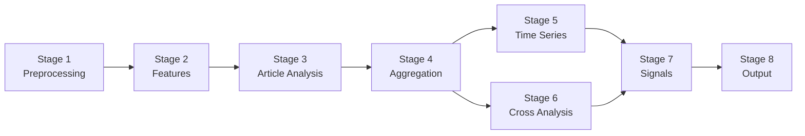
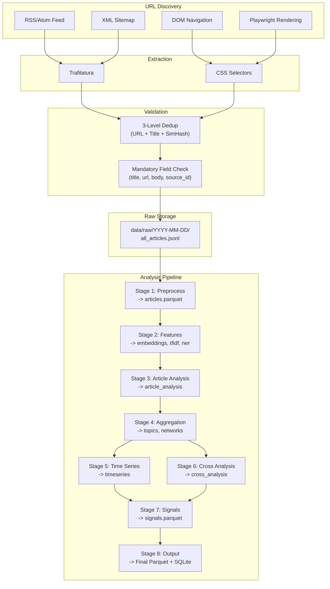
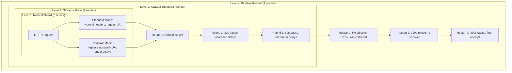
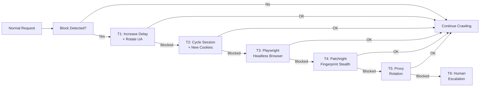

# 아키텍처 가이드 -- GlobalNews 크롤링 및 분석 시스템

이 문서는 GlobalNews 시스템의 내부 아키텍처를 설계를 이해하거나, 시스템을 확장하거나, 모듈 수준에서 문제를 디버깅해야 하는 기여자를 위해 설명한다.

---

## 목차

1. [시스템 아키텍처 개요](#1-시스템-아키텍처-개요)
2. [모듈 인터페이스](#2-모듈-인터페이스)
3. [데이터 흐름](#3-데이터-흐름)
4. [재시도 아키텍처](#4-재시도-아키텍처)
5. [봇 차단 방지 시스템](#5-봇-차단-방지-시스템)
6. [확장 포인트](#6-확장-포인트)
7. [설계 결정](#7-설계-결정)
8. [의존성 맵](#8-의존성-맵)

---

## 1. 시스템 아키텍처 개요

이 시스템은 **단계별 모놀리스(Staged Monolith)** 구조를 따른다. 즉, 계층 간 명확한 계약을 갖춘 계층형 모듈로 구성된 단일 프로세스 Python 애플리케이션이다.

### 1.1 시스템 아키텍처 다이어그램

```mermaid
graph TB
    subgraph CLI["CLI Layer"]
        MAIN["main.py<br/>--mode crawl|analyze|full|status"]
    end

    subgraph CRAWL["Crawling Layer"]
        CP["pipeline.py<br/>Crawl Orchestrator"]
        UD["url_discovery.py<br/>3-Tier Discovery"]
        AE["article_extractor.py<br/>Multi-Library Extraction"]
        NG["network_guard.py<br/>Resilient HTTP Client"]
        AB["anti_block.py<br/>6-Tier Escalation"]
        BD["block_detector.py<br/>7-Type Diagnosis"]
        CB["circuit_breaker.py<br/>Per-Site Circuit Breaker"]
        UA["ua_manager.py<br/>4-Tier UA Pool"]
        SM["session_manager.py<br/>Cookie/Header Mgmt"]
        SB["stealth_browser.py<br/>Playwright/Patchright"]
        DD["dedup.py<br/>3-Level Dedup"]
        RM["retry_manager.py<br/>4-Level Retry"]
        CR["crawl_report.py<br/>Statistics Report"]
        AD["adapters/<br/>44 Site Adapters"]
    end

    subgraph ANALYSIS["Analysis Layer (8 Stages)"]
        S1["Stage 1: Preprocessing<br/>Kiwi + spaCy"]
        S2["Stage 2: Features<br/>SBERT + TF-IDF + NER"]
        S3["Stage 3: Article<br/>Sentiment + STEEPS"]
        S4["Stage 4: Aggregation<br/>BERTopic + HDBSCAN"]
        S5["Stage 5: Time Series<br/>STL + Prophet + PELT"]
        S6["Stage 6: Cross Analysis<br/>Granger + PCMCI"]
        S7["Stage 7: Signals<br/>5-Layer L1-L5"]
        S8["Stage 8: Output<br/>Parquet + SQLite"]
        AP["pipeline.py<br/>Analysis Orchestrator"]
    end

    subgraph STORAGE["Storage Layer"]
        PW["parquet_writer.py<br/>ZSTD Schema-Validated"]
        SQ["sqlite_builder.py<br/>FTS5 + sqlite-vec"]
    end

    subgraph UTIL["Utilities"]
        CL["config_loader.py<br/>YAML Config"]
        EH["error_handler.py<br/>Exception Hierarchy"]
        LC["logging_config.py<br/>Structured JSON Logs"]
        SR["self_recovery.py<br/>Lock + Health + Checkpoint"]
    end

    subgraph CONFIG["Configuration"]
        SY["sources.yaml<br/>44 Sites"]
        PY["pipeline.yaml<br/>8 Stages"]
        CT["constants.py<br/>All Constants"]
    end

    subgraph DATA["Data"]
        RAW["data/raw/<br/>JSONL Articles"]
        PROC["data/processed/<br/>articles.parquet"]
        FEAT["data/features/<br/>embeddings + tfidf + ner"]
        ANAL["data/analysis/<br/>topics + timeseries + ..."]
        OUT["data/output/<br/>Parquet + SQLite"]
    end

    MAIN --> CP
    MAIN --> AP

    CP --> UD --> NG
    CP --> AE --> NG
    CP --> DD
    CP --> RM
    CP --> AD
    CP --> CR

    NG --> AB --> BD
    AB --> CB
    AB --> UA
    AB --> SM
    AB --> SB

    CP --> RAW

    AP --> S1 --> PROC
    AP --> S2 --> FEAT
    AP --> S3 --> ANAL
    AP --> S4 --> ANAL
    AP --> S5 --> ANAL
    AP --> S6 --> ANAL
    AP --> S7 --> OUT
    AP --> S8 --> OUT

    S8 --> PW
    S8 --> SQ

    CL --> SY
    CL --> PY
    CT --> CONFIG
```



### 1.2 계층별 역할

| 계층 | 역할 | 핵심 계약 |
|------|------|----------|
| CLI | 인수 파싱, 모드 디스패치, 종료 코드 | `int` 종료 코드 반환 (0=성공) |
| 크롤링 | URL 탐색, 기사 추출, 중복 제거, 재시도 | `RawArticle` 객체를 JSONL로 출력 |
| 분석 | 메모리 관리를 포함한 8단계 NLP 파이프라인 | JSONL/Parquet 읽기, Parquet 출력 |
| 스토리지 | 스키마 검증된 Parquet I/O, SQLite 인덱싱 | 임시 파일+이름 변경 방식의 원자적 쓰기 |
| 유틸리티 | 설정 로딩, 오류 처리, 로깅, 복구 | 모든 계층의 공유 서비스 |

---

## 2. 모듈 인터페이스

### 2.1 크롤링 계층

#### `network_guard.py` -- NetworkGuard

모든 크롤링 요청을 처리하는 통합 HTTP 클라이언트.

```python
from src.crawling.network_guard import NetworkGuard, FetchResponse

guard = NetworkGuard()
response: FetchResponse = guard.fetch(
    url="https://www.chosun.com/article/123",
    headers={"User-Agent": "..."},
    timeout=30,
)
# FetchResponse fields: status_code, body, headers, elapsed_seconds, url
```

기능:
- 5회 지수 백오프 재시도 (기본값=2초, 최대=30초, 지터 적용)
- `sources.yaml`의 `rate_limit_seconds` 기반 사이트별 요청 제한(Rate limit)
- Circuit Breaker 통합 (사이트별)
- 에러 분류: 재시도 가능(5xx, 타임아웃) vs 재시도 불가(4xx)

#### `url_discovery.py` -- URLDiscovery

3단계 대체 방식(Fallback) 전략으로 기사 URL을 탐색.

```python
from src.crawling.url_discovery import URLDiscovery

discovery = URLDiscovery(network_guard=guard, adapter=adapter)
urls: list[DiscoveredURL] = discovery.discover(
    site_config=site_config,
    date="2026-02-25",
)
```

단계:
1. **RSS/사이트맵** (가장 빠름): XML 피드 파싱. 커버리지 약 60-70%.
2. **DOM 탐색**: 목록 페이지에서 CSS 셀렉터 사용. 섹션별 기사도 포착.
3. **Playwright/Patchright**: 동적 사이트의 JS 렌더링(Rendering) 처리.

#### `article_extractor.py` -- ArticleExtractor

연쇄 추출 체인을 사용하여 기사 본문을 추출.

```python
from src.crawling.article_extractor import ArticleExtractor

extractor = ArticleExtractor(network_guard=guard)
result: ExtractionResult = extractor.extract(url=url, adapter=adapter)
article: RawArticle = result.to_raw_article()
```

추출 체인:
1. **trafilatura** (범용, 고속, 불필요 요소 제거 우수)
2. **커스텀 CSS 셀렉터** (어댑터(Adapter)에 정의된 사이트별 셀렉터)
3. **대체 CSS 셀렉터** (최후의 수단으로 더 넓은 범위의 셀렉터 적용)

#### `dedup.py` -- DedupEngine

3단계 중복 제거(Deduplication) 연쇄.

```python
from src.crawling.dedup import DedupEngine

dedup = DedupEngine()
is_duplicate: bool = dedup.check_and_add(article)
```

단계:
1. **URL 정규화**: 정규화된 URL에 대한 O(1) 해시 조회
2. **제목 유사도**: 단어 토큰 기반 Jaccard (>0.8) + Levenshtein (<0.2)
3. **SimHash 콘텐츠 핑거프린트(Fingerprint)**: 64비트 핑거프린트, 해밍 거리 <= 8

영속성: `data/dedup.sqlite`의 SQLite에 `seen_urls`와 `content_hashes` 테이블로 저장.

#### `anti_block.py` -- AntiBlockEngine

6단계 에스컬레이션(Escalation) 엔진.

```python
from src.crawling.anti_block import AntiBlockEngine, EscalationTier

engine = AntiBlockEngine()
action = engine.handle_block(site_id="chosun", diagnosis=diagnosis)
# action contains the escalation tier and countermeasures to apply
```

단계:
| 단계 | 전략 |
|------|------|
| T1 | 딜레이 조정 (5초 → 10초 → 15초) + User-Agent 로테이션 |
| T2 | 세션 순환 (새 쿠키, Referer 체인, 헤더 다양화) |
| T3 | 헤드리스 브라우저 (JS 렌더링에 Playwright 활용) |
| T4 | 핑거프린트 스텔스(Stealth) (Patchright + canvas/WebGL/폰트 무작위화) |
| T5 | 프록시 로테이션 (풀의 다음 프록시로 전환) |
| T6 | 수동 에스컬레이션 (실패 기록, 도메인 일시 중단, 수동 검토 알림) |

#### `block_detector.py` -- BlockDetector

7가지 유형의 봇 차단(Bot-blocking) 진단 엔진.

```python
from src.crawling.block_detector import BlockDetector, BlockDiagnosis

detector = BlockDetector()
diagnosis: BlockDiagnosis = detector.diagnose(response)
# BlockDiagnosis fields: block_type, confidence, evidence, recommended_tier
```

차단 유형: IP 차단, User-Agent 필터, 요청 제한(Rate Limit), CAPTCHA, JS 챌린지, 핑거프린트(Fingerprint), 지역 차단.

#### `retry_manager.py` -- RetryManager

4단계 계층적 재시도 시스템.

```python
from src.crawling.retry_manager import RetryManager, StrategyMode

manager = RetryManager(site_id="chosun")
# Level 1 (NetworkGuard): 5 retries per request -- handled internally
# Level 2 (Strategy): Standard -> TotalWar mode
# Level 3 (Round): 3 rounds with increasing delays
# Level 4 (Restart): 3 full pipeline restarts
```

최대 총 시도 횟수: 5 × 2 × 3 × 3 = 90회 (URL당).

#### `adapters/base_adapter.py` -- BaseSiteAdapter

44개 사이트 어댑터 전체의 추상 기반 클래스.

```python
from src.crawling.adapters import get_adapter

adapter = get_adapter("chosun")
# adapter.SITE_ID, adapter.RSS_URL, adapter.TITLE_CSS, etc.

# Required abstract methods:
# adapter.extract_article(html, url) -> ExtractionResult
# adapter.get_section_urls() -> list[str]
```

각 어댑터는 다음을 정의한다: 사이트 식별 정보, URL 탐색 설정(RSS/사이트맵 URL), 추출용 CSS 셀렉터, 요청 제한 설정, 봇 차단 방지 설정, 유료화(Paywall) 유형, 인코딩.

### 2.2 분석 계층

#### `pipeline.py` -- AnalysisPipeline

메모리 관리(Memory management)를 포함한 8단계 순차 Orchestrator.

```python
from src.analysis.pipeline import run_analysis_pipeline

result = run_analysis_pipeline(
    date="2026-02-25",
    stages=[1, 2, 3, 4, 5, 6, 7, 8],
)
# result.success, result.stages_completed, result.peak_memory_gb
```

스테이지 의존성 그래프:



각 스테이지:
- 이전 스테이지의 Parquet 입력 파일을 읽음
- Parquet 출력을 원자적으로 기록 (임시 파일 생성 후 이름 변경)
- 완료 후 `gc.collect()` 호출
- 메모리가 10 GB를 초과하면 중단

#### 개별 스테이지

| 스테이지 | 모듈 | 분석 기법 | 입력 | 출력 |
|---------|------|---------|------|------|
| 1 | `stage1_preprocessing.py` | T01-T06: Kiwi 형태소 분석(Morpheme analysis), spaCy 표제어 추출(Lemmatization), langdetect, 텍스트 정규화(Text normalization) | JSONL | `articles.parquet` (12개 컬럼) |
| 2 | `stage2_features.py` | T07-T12: SBERT 임베딩(Embedding), TF-IDF, NER, KeyBERT | `articles.parquet` | `embeddings.parquet`, `tfidf.parquet`, `ner.parquet` |
| 3 | `stage3_article_analysis.py` | T13-T19, T49: 감성 분석(Sentiment analysis), 감정, STEEPS, 논조 탐지(Stance detection) | articles + features | `article_analysis.parquet` |
| 4 | `stage4_aggregation.py` | T21-T28: BERTopic, HDBSCAN, NMF/LDA, 커뮤니티 탐지(Community detection) | articles + features + analysis | `topics.parquet`, `networks.parquet` |
| 5 | `stage5_timeseries.py` | T29-T36: STL 분해(STL decomposition), 버스트 탐지(Burst detection)(Kleinberg), 변화점 탐지(Changepoint detection)(PELT), Prophet, 웨이블릿 분석(Wavelet analysis) | articles + topics | `timeseries.parquet` |
| 6 | `stage6_cross_analysis.py` | T37-T46, T20, T50: Granger 인과성(Granger causality), PCMCI, 동시 출현 네트워크(Co-occurrence network), 교차 언어 토픽 정렬(Cross-lingual topic alignment) | timeseries + topics + embeddings | `cross_analysis.parquet` |
| 7 | `stage7_signals.py` | T47-T48, T51-T55, BERTrend, 특이점 복합 점수(Singularity composite score) | 모든 업스트림 Parquet | `signals.parquet` (12개 컬럼) |
| 8 | `stage8_output.py` | Parquet 병합, SQLite FTS5+벡터 인덱싱 | 모든 Parquet | 최종 Parquet + `index.sqlite` |

### 2.3 스토리지 계층

#### `parquet_writer.py` -- ParquetWriter

스키마(Schema) 검증 및 ZSTD 압축이 적용된 Parquet 입출력.

공식 스키마:
- `ARTICLES_PA_SCHEMA` (12개 컬럼): article_id, url, title, body, published_at, ...
- `ANALYSIS_PA_SCHEMA` (21개 컬럼): article_id, sentiment, emotion, steeps_category, ...
- `SIGNALS_PA_SCHEMA` (12개 컬럼): signal_id, article_id, signal_layer, signal_type, ...
- `TOPICS_PA_SCHEMA` (7개 컬럼): topic_id, label, keywords, ...

모든 쓰기 작업은 원자적 임시 파일 + 이름 변경 방식으로 데이터 손상을 방지한다.

#### `sqlite_builder.py` -- SQLiteBuilder

FTS5 Full-Text Search + sqlite-vec 벡터 인덱스.

테이블:
- `articles_fts`: unicode61 토크나이저를 사용하는 FTS5 가상 테이블
- `article_embeddings`: sqlite-vec 가상 테이블 (384차원 벡터)
- `signals_index`: 신호 계층/날짜 필터링
- `topics_index`: 트렌드 방향이 포함된 토픽 요약
- `crawl_status`: 소스별 크롤링 메타데이터

### 2.4 유틸리티 계층

#### `error_handler.py` -- 예외 계층 구조

```
GlobalNewsError (base)
  +-- CrawlError
  |     +-- NetworkError (HTTP failures)
  |     +-- RateLimitError (429, Crawl-delay violation)
  |     +-- BlockDetectedError (bot detection)
  |     +-- ParseError (HTML/XML parsing failures)
  +-- AnalysisError
  |     +-- PipelineStageError
  |     +-- MemoryLimitError
  |     +-- ModelLoadError
  +-- StorageError
        +-- ParquetIOError
        +-- SchemaValidationError
        +-- SQLiteError
```

추가 제공 항목:
- 지수 백오프 및 지터가 적용된 재시도 데코레이터
- `CircuitBreaker` 클래스 (Closed → Open → Half-Open 상태 머신)

#### `self_recovery.py` -- 자가 복구 인프라

```python
from src.utils.self_recovery import (
    LockFileManager,
    HealthChecker,
    CheckpointManager,
    CleanupManager,
    RecoveryOrchestrator,
)

# CLI usage:
# python3 -m src.utils.self_recovery --health-check
# python3 -m src.utils.self_recovery --acquire-lock daily
# python3 -m src.utils.self_recovery --cleanup
# python3 -m src.utils.self_recovery --status
```

---

## 3. 데이터 흐름(Data Flow)

### 3.1 기사 생명주기



### 3.2 데이터 형식

| 단계 | 형식 | 저장 위치 | 크기 (기사 1,000건) |
|------|------|----------|---------------------|
| 원시 기사 | JSONL (줄당 JSON 오브젝트 1개) | `data/raw/YYYY-MM-DD/all_articles.jsonl` | ~50-100 MB |
| 전처리 완료 | Parquet (ZSTD, 12개 컬럼) | `data/processed/articles.parquet` | ~20 MB |
| 임베딩 | Parquet (ZSTD, 384차원 벡터) | `data/features/embeddings.parquet` | ~30 MB |
| TF-IDF | Parquet (ZSTD, 희소 행렬) | `data/features/tfidf.parquet` | ~5 MB |
| NER | Parquet (ZSTD, 엔터티 목록) | `data/features/ner.parquet` | ~3 MB |
| 기사 분석 | Parquet (ZSTD, 21개 컬럼) | `data/analysis/article_analysis.parquet` | ~15 MB |
| 토픽 | Parquet (ZSTD, 7개 컬럼) | `data/analysis/topics.parquet` | ~2 MB |
| 네트워크 | Parquet (ZSTD) | `data/analysis/networks.parquet` | ~5 MB |
| 시계열 | Parquet (ZSTD) | `data/analysis/timeseries.parquet` | ~3 MB |
| 교차 분석 | Parquet (ZSTD) | `data/analysis/cross_analysis.parquet` | ~5 MB |
| 신호 | Parquet (ZSTD, 12개 컬럼) | `data/output/signals.parquet` | ~2 MB |
| SQLite 인덱스 | SQLite (FTS5 + vec, WAL 모드) | `data/output/index.sqlite` | ~50 MB |

### 3.3 크롤링 파이프라인 흐름

각 크롤링 실행 시 파이프라인은 다음과 같이 사이트를 처리한다.

```
1. Load sources.yaml -> filter enabled sites
2. For each site (with retry at multiple levels):
   a. Select adapter via get_adapter(site_id)
   b. Check circuit breaker state (skip if OPEN)
   c. URL Discovery: RSS -> Sitemap -> DOM (fallback chain)
   d. For each discovered URL:
      i.   Dedup check (skip if duplicate)
      ii.  Fetch via NetworkGuard (5 retries with backoff)
      iii. Extract article fields (Trafilatura -> CSS fallback)
      iv.  Validate mandatory fields (title, url, body, source_id)
      v.   Write to JSONL
   e. Record success/failure in circuit breaker
3. Generate crawl report (JSON)
```

---

## 4. 재시도 아키텍처

시스템은 수집 성공률을 극대화하기 위해 4단계 중첩 재시도 아키텍처를 사용한다.

### 4.1 재시도 단계 다이어그램



### 4.2 재시도 횟수

| 단계 | 컴포넌트 | 최대 시도 횟수 | 지연 전략 |
|------|----------|--------------|----------------|
| L1 | NetworkGuard | 5 | 지수 백오프 (기본=2초, 최대=30초) + 지터 |
| L2 | 전략 모드 | 2 | Standard 이후 TotalWar |
| L3 | 크롤러 라운드 | 3 | 라운드 사이 30초, 60초, 120초 |
| L4 | 파이프라인 재시작 | 3 | 재시작 사이 60초, 120초, 300초 |
| **합계** | | **5 x 2 x 3 x 3 = 90** | |

90회 시도를 모두 소진한 후에는 Tier 6 에스컬레이션 리포트가 `logs/tier6-escalation/{site_id}-{date}.json`에 기록된다.

---

## 5. 봇 차단 방어 시스템

### 5.1 차단 탐지

`BlockDetector`는 7가지 차단 유형 시그니처에 대해 HTTP 응답을 분석한다. 각 탐지기는 다음 항목을 검사한다.
- HTTP 상태 코드
- 응답 헤더 (Retry-After, CF-Ray, Server)
- 응답 본문 패턴 (CAPTCHA 마커, JS 챌린지 스크립트, 접근 거부 텍스트)

각 진단 결과에는 신뢰도 점수(0.0-1.0)와 권장 에스컬레이션 단계가 포함된다.

### 5.2 에스컬레이션 흐름



### 5.3 사이트별 전략 영속성

`AntiBlockEngine`은 도메인별로 `SiteProfile`을 유지하며, 다음 정보를 추적한다.
- 현재 에스컬레이션 단계
- 연속 실패/성공 횟수
- 차단 유형 이력 (최근 50개 이벤트)
- 가장 낮은 성공 단계 (단계 하향 조정 목표)
- 사용자 정의 지연 설정

프로파일은 JSON 직렬화를 통해 `data/config/`에 저장되어 재시작 이후에도 유지된다.

---

## 6. 확장 포인트

### 6.1 새로운 분석 단계 추가

Stage 9(예: "토픽 생명주기 추적")를 추가하려면:

1. `run_stage9()` 함수를 포함한 `src/analysis/stage9_lifecycle.py`를 생성한다.

```python
"""Stage 9: Topic Lifecycle Tracking."""

def run_stage9(date: str | None = None) -> dict:
    """Run lifecycle tracking on BERTopic output.

    Args:
        date: Target date in YYYY-MM-DD format. None for latest.

    Returns:
        Dict with 'output_path' and 'article_count' keys.
    """
    # Read upstream Parquet files
    # Process
    # Write output Parquet atomically
    pass
```

2. `src/analysis/pipeline.py`에 등록한다.
   - `STAGE_NAMES`에 추가
   - `STAGE_DEPENDENCIES`에 추가
   - `AnalysisPipeline`에 `_run_stage9` 메서드 추가

3. `data/config/pipeline.yaml`의 `stages:` 항목 아래 설정을 추가한다.

4. `src/config/constants.py`에 출력 경로와 타임아웃을 추가한다.

### 6.2 새로운 크롤링 전략 추가

새로운 URL 탐색 방식(예: API 기반 탐색)을 추가하려면:

1. `src/crawling/url_discovery.py`에 해당 메서드를 추가한다.

```python
def _discover_via_api(self, adapter, site_config, date) -> list[DiscoveredURL]:
    """Discover URLs via site-specific REST API."""
    pass
```

2. `discover()` 메서드의 탐색 캐스케이드에 통합한다.

3. `src/config/constants.py`의 `VALID_CRAWL_METHODS`에 해당 방식을 추가한다.

### 6.3 새로운 출력 형식 추가

새로운 출력 형식(예: CSV 내보내기)을 추가하려면:

1. `src/storage/csv_writer.py`를 생성한다.

2. 기존 Parquet 및 SQLite 작성기와 함께 `src/analysis/stage8_output.py`에서 호출한다.

3. `src/config/constants.py`에 출력 경로를 추가한다.

### 6.4 새로운 사이트 어댑터 추가

전체 단계별 절차는 운영 가이드 섹션 3을 참조한다.

---

## 7. 설계 결정

### 7.1 단계별 모놀리스를 선택한 이유 (마이크로서비스 대신)

**결정**: 계층적 모듈로 구성된 단일 Python 프로세스.

**근거**: 이 시스템은 MacBook M2 Pro 16GB 단일 기기에서 실행된다. 수평 확장, 서비스 디스커버리, 프로세스 간 통신이 불필요하다. 단계별 모놀리스(Staged Monolith)는 다음을 제공한다.
- 간단한 배포 (clone + pip install)
- HTTP/gRPC 대신 직접 함수 호출
- NLP 모델 재사용을 위한 공유 메모리 (SBERT를 한 번만 로드)
- 쉬운 디버깅 (단일 프로세스, 단일 로그 스트림)

### 7.2 크롤링과 분석 사이에 JSONL을 사용하는 이유

**결정**: 크롤링은 JSONL로 출력하고, 분석 Stage 1에서 Parquet으로 변환한다.

**근거**:
- JSONL은 추가 쓰기에 적합하다 (크롤링 중 스트리밍 쓰기 가능)
- Parquet은 전체 데이터셋 크기를 미리 알아야 한다 (행 그룹 구성)
- JSONL은 크롤링 문제 디버깅 시 사람이 직접 읽을 수 있다
- Stage 1의 JSONL-to-Parquet 변환은 유효성 검사 및 정규화도 함께 수행한다

### 7.3 4단계 재시도를 선택한 이유 (단순 재시도 대신)

**결정**: 4단계 중첩 재시도, URL당 최대 90회 시도.

**근거**:
- 레벨 1 (NetworkGuard): 일시적인 네트워크 오류를 처리
- 레벨 2 (전략): 다양한 봇 차단 방어 방식을 시도
- 레벨 3 (라운드): 배치 사이에 사이트가 "냉각"될 시간을 제공
- 레벨 4 (재시작): 신선한 URL 탐색으로 깨끗한 시작 상태를 제공
- "절대 포기하지 않는다(Never Give Up)" 철학으로 최대한의 데이터 수집을 보장

### 7.4 분석 파이프라인을 순차 실행하는 이유 (병렬 처리 대신)

**결정**: Stage 1-8을 병렬이 아닌 순차적으로 실행.

**근거**:
- 메모리가 제약 요인이다 (16GB 기기에서 10GB 예산)
- Stage 2 단독으로 ~2.4 GB를 사용한다 (SBERT 임베딩)
- 병렬 실행 시 메모리 한도 초과
- 단계 사이에 `gc.collect()`를 호출하는 순차 실행으로 최대 메모리 사용량을 관리 가능한 수준으로 유지
- Stage 5와 Stage 6은 독립적인 입력을 갖지만, 단순성을 위해 순차적으로 실행

### 7.5 Parquet에 ZSTD 압축을 사용하는 이유

**결정**: 모든 Parquet 파일에 ZSTD 레벨 3 적용.

**근거**:
- ZSTD는 분석 워크로드에서 처리량 대비 압축률이 가장 우수하다
- 레벨 3은 최적의 균형점이다: CPU 오버헤드가 최소화된 상태에서 약 3배 압축
- Snappy(압축률 낮음)와 Gzip(압축 해제 속도 느림)보다 우수
- PyArrow와 DuckDB에서 기본 지원

### 7.6 SQLite에 FTS5 + sqlite-vec를 사용하는 이유

**결정**: 키워드 검색에 FTS5, 벡터 유사도에 sqlite-vec 사용.

**근거**:
- unicode61 토크나이저가 포함된 FTS5는 한국어/일본어/다국어 텍스트를 올바르게 처리
- sqlite-vec는 외부 벡터 데이터베이스 없이 벡터 유사도 검색을 제공
- 두 기능 모두 SQLite 확장으로, 별도의 서버 프로세스가 불필요
- sqlite-vec는 선택 사항으로, 설치되지 않은 경우에도 시스템이 우아하게 동작한다

### 7.7 3단계 중복 제거를 사용하는 이유 (URL만으로 처리하지 않는 이유)

**결정**: URL 정규화 + 제목 유사도 + SimHash 콘텐츠 핑거프린트.

**근거**:
- URL만으로 중복 제거하면 다른 URL로 재게시된 기사를 놓친다
- 제목 유사도 검사는 "내용은 같지만 URL이 다른 기사" 패턴을 잡아낸다
- SimHash는 신디케이션 네트워크에서 퍼진 유사 중복 콘텐츠를 탐지한다
- 각 단계는 매칭 즉시 단락(short-circuit)된다 (비용이 낮은 검사 먼저 수행)

---

## 8. 의존성 맵

### 8.1 모듈 의존성

```
main.py
  -> src.config.constants
  -> src.utils.logging_config
  -> src.crawling.pipeline        (lazy import on --mode crawl)
  -> src.analysis.pipeline        (lazy import on --mode analyze)
  -> src.utils.config_loader      (lazy import on --mode status)

src.crawling.pipeline
  -> src.config.constants
  -> src.crawling.contracts
  -> src.crawling.network_guard
  -> src.crawling.url_discovery
  -> src.crawling.article_extractor
  -> src.crawling.crawler
  -> src.crawling.dedup
  -> src.crawling.ua_manager
  -> src.crawling.circuit_breaker
  -> src.crawling.anti_block
  -> src.crawling.retry_manager
  -> src.crawling.crawl_report
  -> src.utils.config_loader
  -> src.utils.error_handler

src.analysis.pipeline
  -> src.config.constants
  -> src.analysis.stage1_preprocessing
  -> src.analysis.stage2_features
  -> src.analysis.stage3_article_analysis
  -> src.analysis.stage4_aggregation
  -> src.analysis.stage5_timeseries
  -> src.analysis.stage6_cross_analysis
  -> src.analysis.stage7_signals
  -> src.analysis.stage8_output
  -> src.utils.error_handler
  -> src.utils.logging_config
```

### 8.2 초기화 순서

전체 파이프라인 실행(`--mode full`) 시 초기화 순서는 다음과 같다:

1. `src.config.constants` -- 경로 해석 (의존성 없음)
2. `src.utils.logging_config` -- 로그 핸들러 설정
3. `src.utils.config_loader` -- YAML 파싱 및 검증
4. `src.utils.error_handler` -- 예외 클래스
5. `src.crawling.ua_manager` -- UA 풀 초기화
6. `src.crawling.network_guard` -- HTTP 클라이언트 설정
7. `src.crawling.dedup` -- SQLite 연결
8. `src.crawling.circuit_breaker` -- 사이트별 상태 초기화
9. `src.crawling.anti_block` -- 에스컬레이션 엔진
10. `src.crawling.adapters` -- 어댑터 레지스트리 로딩
11. `src.crawling.pipeline` -- 크롤링 오케스트레이션
12. `src.analysis.pipeline` -- 분석 오케스트레이션 (단계별 지연 모델 로딩)

### 8.3 외부 의존성

| 카테고리 | 패키지 | 목적 |
|----------|--------|------|
| HTTP | httpx, requests, aiohttp | 네트워크 요청 |
| 파싱 | beautifulsoup4, lxml, feedparser, trafilatura | HTML/XML/RSS 파싱 |
| 브라우저 | playwright, patchright | JS 렌더링, 스텔스 |
| 한국어 NLP | kiwipiepy | 형태소 분석 |
| 영어 NLP | spacy | 토크나이징, NER, 표제어 추출 |
| 임베딩 | sentence-transformers, torch | SBERT 다국어 임베딩 |
| 토픽 모델링 | bertopic, hdbscan | 토픽 탐색 |
| 분류 | scikit-learn, setfit | ML 분류 |
| 시계열 | statsmodels, prophet, ruptures, PyWavelets, lifelines | 시간적 분석 |
| 네트워크 | networkx, python-louvain, tigramite, igraph | 그래프 분석 |
| 저장소 | pyarrow, pandas, duckdb, sqlite-vec | 데이터 I/O |
| 설정 | pyyaml, pydantic | 설정 관리 |
| 로깅 | structlog | 구조적 로그 |

### 8.4 NLP 모델

| 모델 | 크기 | 목적 | 로딩 단계 |
|------|------|------|----------|
| paraphrase-multilingual-MiniLM-L12-v2 | ~134 MB | SBERT 임베딩 (384차원) | Stage 2 |
| en_core_web_sm | ~12 MB | 영어 토크나이징, NER | Stage 1 |
| kiwipiepy | ~760 MB | 한국어 형태소 분석 | Stage 1 (싱글턴) |
| monologg/kobert | ~400 MB | 한국어 BERT 임베딩 | Stage 3 |
| facebook/bart-large-mnli | ~407 MB | 제로샷 분류 | Stage 3 |
| Davlan/xlm-roberta-base-ner-hrl | ~278 MB | 다국어 NER | Stage 2 |
