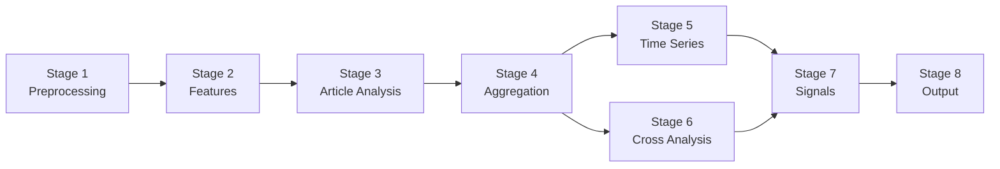
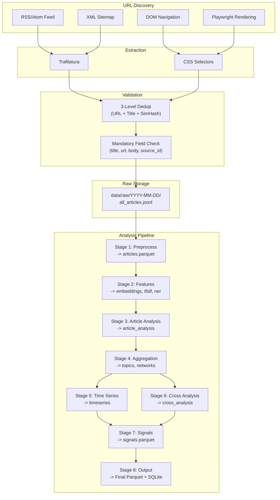
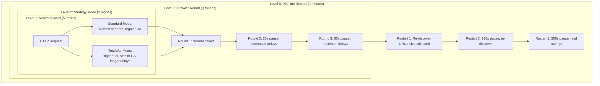
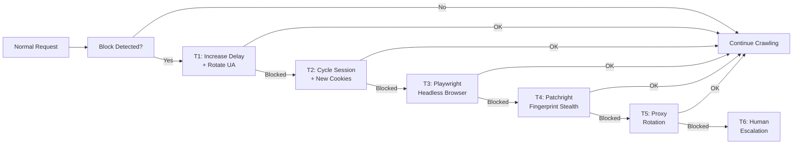

# Architecture Guide -- GlobalNews Crawling & Analysis System

This document describes the internal architecture of the GlobalNews system for contributors who need to understand the design, extend it, or debug issues at the module level.

---

## Table of Contents

1. [System Architecture Overview](#1-system-architecture-overview)
2. [Module Interfaces](#2-module-interfaces)
3. [Data Flow](#3-data-flow)
4. [Retry Architecture](#4-retry-architecture)
5. [Anti-Block System](#5-anti-block-system)
6. [Extension Points](#6-extension-points)
7. [Design Decisions](#7-design-decisions)
8. [Dependency Map](#8-dependency-map)

---

## 1. System Architecture Overview

The system is a **staged monolith** -- a single-process Python application organized into layered modules with clean contracts between layers.

### 1.1 System Architecture Diagram

```mermaid
graph TB
    subgraph CLI["CLI Layer"]
        MAIN["main.py<br/>--mode crawl|analyze|full|status"]
    end

    subgraph CRAWL["Crawling Layer"]
        CP["pipeline.py<br/>Crawl Orchestrator"]
        UD["url_discovery.py<br/>3-Tier Discovery"]
        AE["article_extractor.py<br/>Multi-Library Extraction"]
        NG["network_guard.py<br/>Resilient HTTP Client"]
        AB["anti_block.py<br/>6-Tier Escalation"]
        BD["block_detector.py<br/>7-Type Diagnosis"]
        CB["circuit_breaker.py<br/>Per-Site Circuit Breaker"]
        UA["ua_manager.py<br/>4-Tier UA Pool"]
        SM["session_manager.py<br/>Cookie/Header Mgmt"]
        SB["stealth_browser.py<br/>Playwright/Patchright"]
        DD["dedup.py<br/>3-Level Dedup"]
        RM["retry_manager.py<br/>4-Level Retry"]
        CR["crawl_report.py<br/>Statistics Report"]
        AD["adapters/<br/>44 Site Adapters"]
    end

    subgraph ANALYSIS["Analysis Layer (8 Stages)"]
        S1["Stage 1: Preprocessing<br/>Kiwi + spaCy"]
        S2["Stage 2: Features<br/>SBERT + TF-IDF + NER"]
        S3["Stage 3: Article<br/>Sentiment + STEEPS"]
        S4["Stage 4: Aggregation<br/>BERTopic + HDBSCAN"]
        S5["Stage 5: Time Series<br/>STL + Prophet + PELT"]
        S6["Stage 6: Cross Analysis<br/>Granger + PCMCI"]
        S7["Stage 7: Signals<br/>5-Layer L1-L5"]
        S8["Stage 8: Output<br/>Parquet + SQLite"]
        AP["pipeline.py<br/>Analysis Orchestrator"]
    end

    subgraph STORAGE["Storage Layer"]
        PW["parquet_writer.py<br/>ZSTD Schema-Validated"]
        SQ["sqlite_builder.py<br/>FTS5 + sqlite-vec"]
    end

    subgraph UTIL["Utilities"]
        CL["config_loader.py<br/>YAML Config"]
        EH["error_handler.py<br/>Exception Hierarchy"]
        LC["logging_config.py<br/>Structured JSON Logs"]
        SR["self_recovery.py<br/>Lock + Health + Checkpoint"]
    end

    subgraph CONFIG["Configuration"]
        SY["sources.yaml<br/>44 Sites"]
        PY["pipeline.yaml<br/>8 Stages"]
        CT["constants.py<br/>All Constants"]
    end

    subgraph DATA["Data"]
        RAW["data/raw/<br/>JSONL Articles"]
        PROC["data/processed/<br/>articles.parquet"]
        FEAT["data/features/<br/>embeddings + tfidf + ner"]
        ANAL["data/analysis/<br/>topics + timeseries + ..."]
        OUT["data/output/<br/>Parquet + SQLite"]
    end

    MAIN --> CP
    MAIN --> AP

    CP --> UD --> NG
    CP --> AE --> NG
    CP --> DD
    CP --> RM
    CP --> AD
    CP --> CR

    NG --> AB --> BD
    AB --> CB
    AB --> UA
    AB --> SM
    AB --> SB

    CP --> RAW

    AP --> S1 --> PROC
    AP --> S2 --> FEAT
    AP --> S3 --> ANAL
    AP --> S4 --> ANAL
    AP --> S5 --> ANAL
    AP --> S6 --> ANAL
    AP --> S7 --> OUT
    AP --> S8 --> OUT

    S8 --> PW
    S8 --> SQ

    CL --> SY
    CL --> PY
    CT --> CONFIG
```



### 1.2 Layer Responsibilities

| Layer | Responsibility | Key Contract |
|-------|---------------|-------------|
| CLI | Argument parsing, mode dispatch, exit codes | Returns `int` exit code (0=success) |
| Crawling | URL discovery, article extraction, dedup, retry | Produces `RawArticle` objects as JSONL |
| Analysis | 8-stage NLP pipeline with memory management | Reads JSONL/Parquet, produces Parquet |
| Storage | Schema-validated Parquet I/O, SQLite indexing | Atomic writes with temp-file+rename |
| Utilities | Config loading, error handling, logging, recovery | Shared services for all layers |

---

## 2. Module Interfaces

### 2.1 Crawling Layer

#### `network_guard.py` -- NetworkGuard

The unified HTTP client for all crawling requests.

```python
from src.crawling.network_guard import NetworkGuard, FetchResponse

guard = NetworkGuard()
response: FetchResponse = guard.fetch(
    url="https://www.chosun.com/article/123",
    headers={"User-Agent": "..."},
    timeout=30,
)
# FetchResponse fields: status_code, body, headers, elapsed_seconds, url
```

Features:
- 5-retry exponential backoff (base=2s, max=30s, jitter)
- Per-site rate limiting via `rate_limit_seconds` from `sources.yaml`
- Circuit Breaker integration (per-site)
- Error classification: retriable (5xx, timeout) vs non-retriable (4xx)

#### `url_discovery.py` -- URLDiscovery

Discovers article URLs using a 3-tier fallback strategy.

```python
from src.crawling.url_discovery import URLDiscovery

discovery = URLDiscovery(network_guard=guard, adapter=adapter)
urls: list[DiscoveredURL] = discovery.discover(
    site_config=site_config,
    date="2026-02-25",
)
```

Tiers:
1. **RSS/Sitemap** (fastest): Parse XML feeds. ~60-70% coverage.
2. **DOM navigation**: CSS selectors on listing pages. Catches section-specific articles.
3. **Playwright/Patchright**: JS rendering for dynamic sites.

#### `article_extractor.py` -- ArticleExtractor

Extracts article content using a cascading extraction chain.

```python
from src.crawling.article_extractor import ArticleExtractor

extractor = ArticleExtractor(network_guard=guard)
result: ExtractionResult = extractor.extract(url=url, adapter=adapter)
article: RawArticle = result.to_raw_article()
```

Extraction chain:
1. **Trafilatura** (general-purpose, fast, good boilerplate removal)
2. **Custom CSS selectors** (per-site selectors from the adapter)
3. **Fallback CSS selectors** (broader selectors as last resort)

#### `dedup.py` -- DedupEngine

3-level deduplication cascade.

```python
from src.crawling.dedup import DedupEngine

dedup = DedupEngine()
is_duplicate: bool = dedup.check_and_add(article)
```

Levels:
1. **URL normalization**: O(1) hash lookup on normalized URL
2. **Title similarity**: Jaccard (>0.8) + Levenshtein (<0.2) on word tokens
3. **SimHash content fingerprint**: 64-bit fingerprint, Hamming distance <= 8

Persistence: SQLite at `data/dedup.sqlite` with tables `seen_urls` and `content_hashes`.

#### `anti_block.py` -- AntiBlockEngine

6-tier escalation engine.

```python
from src.crawling.anti_block import AntiBlockEngine, EscalationTier

engine = AntiBlockEngine()
action = engine.handle_block(site_id="chosun", diagnosis=diagnosis)
# action contains the escalation tier and countermeasures to apply
```

Tiers:
| Tier | Strategy |
|------|----------|
| T1 | Delay adjustment (5s -> 10s -> 15s) + UA rotation |
| T2 | Session cycling (new cookies, Referer chain, header diversification) |
| T3 | Headless browser (Playwright for JS rendering) |
| T4 | Fingerprint stealth (Patchright + randomized canvas/WebGL/fonts) |
| T5 | Proxy rotation (switch to next proxy in pool) |
| T6 | Human escalation (log failure, pause domain, alert for manual review) |

#### `block_detector.py` -- BlockDetector

7-type block diagnosis engine.

```python
from src.crawling.block_detector import BlockDetector, BlockDiagnosis

detector = BlockDetector()
diagnosis: BlockDiagnosis = detector.diagnose(response)
# BlockDiagnosis fields: block_type, confidence, evidence, recommended_tier
```

Block types: IP Block, UA Filter, Rate Limit, CAPTCHA, JS Challenge, Fingerprint, Geo-Block.

#### `retry_manager.py` -- RetryManager

4-level hierarchical retry system.

```python
from src.crawling.retry_manager import RetryManager, StrategyMode

manager = RetryManager(site_id="chosun")
# Level 1 (NetworkGuard): 5 retries per request -- handled internally
# Level 2 (Strategy): Standard -> TotalWar mode
# Level 3 (Round): 3 rounds with increasing delays
# Level 4 (Restart): 3 full pipeline restarts
```

Grand total: 5 x 2 x 3 x 3 = 90 maximum attempts per URL.

#### `adapters/base_adapter.py` -- BaseSiteAdapter

Abstract base class for all 44 site adapters.

```python
from src.crawling.adapters import get_adapter

adapter = get_adapter("chosun")
# adapter.SITE_ID, adapter.RSS_URL, adapter.TITLE_CSS, etc.

# Required abstract methods:
# adapter.extract_article(html, url) -> ExtractionResult
# adapter.get_section_urls() -> list[str]
```

Each adapter defines: site identity, URL discovery configuration (RSS/Sitemap URLs), CSS selectors for extraction, rate limiting, anti-block settings, paywall type, and encoding.

### 2.2 Analysis Layer

#### `pipeline.py` -- AnalysisPipeline

8-stage sequential orchestrator with memory management.

```python
from src.analysis.pipeline import run_analysis_pipeline

result = run_analysis_pipeline(
    date="2026-02-25",
    stages=[1, 2, 3, 4, 5, 6, 7, 8],
)
# result.success, result.stages_completed, result.peak_memory_gb
```

Stage dependency graph:



Each stage:
- Reads Parquet inputs from prior stages
- Writes Parquet output atomically (temp file + rename)
- Calls `gc.collect()` after completion
- Aborts if memory exceeds 10 GB

#### Individual Stages

| Stage | Module | Techniques | Input | Output |
|-------|--------|-----------|-------|--------|
| 1 | `stage1_preprocessing.py` | T01-T06: Kiwi morpheme, spaCy lemma, langdetect, normalization | JSONL | `articles.parquet` (12 cols) |
| 2 | `stage2_features.py` | T07-T12: SBERT embeddings, TF-IDF, NER, KeyBERT | `articles.parquet` | `embeddings.parquet`, `tfidf.parquet`, `ner.parquet` |
| 3 | `stage3_article_analysis.py` | T13-T19, T49: Sentiment, emotion, STEEPS, stance | articles + features | `article_analysis.parquet` |
| 4 | `stage4_aggregation.py` | T21-T28: BERTopic, HDBSCAN, NMF/LDA, community detection | articles + features + analysis | `topics.parquet`, `networks.parquet` |
| 5 | `stage5_timeseries.py` | T29-T36: STL, burst (Kleinberg), changepoint (PELT), Prophet, wavelet | articles + topics | `timeseries.parquet` |
| 6 | `stage6_cross_analysis.py` | T37-T46, T20, T50: Granger causality, PCMCI, co-occurrence, cross-lingual | timeseries + topics + embeddings | `cross_analysis.parquet` |
| 7 | `stage7_signals.py` | T47-T48, T51-T55, BERTrend, Singularity | All upstream Parquet | `signals.parquet` (12 cols) |
| 8 | `stage8_output.py` | Parquet merge, SQLite FTS5+vec indexing | All Parquet | Final Parquet + `index.sqlite` |

### 2.3 Storage Layer

#### `parquet_writer.py` -- ParquetWriter

Schema-validated, ZSTD-compressed Parquet I/O.

Authoritative schemas:
- `ARTICLES_PA_SCHEMA` (12 columns): article_id, url, title, body, published_at, ...
- `ANALYSIS_PA_SCHEMA` (21 columns): article_id, sentiment, emotion, steeps_category, ...
- `SIGNALS_PA_SCHEMA` (12 columns): signal_id, article_id, signal_layer, signal_type, ...
- `TOPICS_PA_SCHEMA` (7 columns): topic_id, label, keywords, ...

All writes use atomic temp-file + rename to prevent corruption.

#### `sqlite_builder.py` -- SQLiteBuilder

FTS5 full-text search + sqlite-vec vector index.

Tables:
- `articles_fts`: FTS5 virtual table with unicode61 tokenizer
- `article_embeddings`: sqlite-vec virtual table (384-dim vectors)
- `signals_index`: Signal layer/date filtering
- `topics_index`: Topic summaries with trend direction
- `crawl_status`: Per-source crawl metadata

### 2.4 Utility Layer

#### `error_handler.py` -- Exception Hierarchy

```
GlobalNewsError (base)
  +-- CrawlError
  |     +-- NetworkError (HTTP failures)
  |     +-- RateLimitError (429, Crawl-delay violation)
  |     +-- BlockDetectedError (bot detection)
  |     +-- ParseError (HTML/XML parsing failures)
  +-- AnalysisError
  |     +-- PipelineStageError
  |     +-- MemoryLimitError
  |     +-- ModelLoadError
  +-- StorageError
        +-- ParquetIOError
        +-- SchemaValidationError
        +-- SQLiteError
```

Also provides:
- Retry decorator with exponential backoff and jitter
- `CircuitBreaker` class (Closed -> Open -> Half-Open state machine)

#### `self_recovery.py` -- Self-Recovery Infrastructure

```python
from src.utils.self_recovery import (
    LockFileManager,
    HealthChecker,
    CheckpointManager,
    CleanupManager,
    RecoveryOrchestrator,
)

# CLI usage:
# python3 -m src.utils.self_recovery --health-check
# python3 -m src.utils.self_recovery --acquire-lock daily
# python3 -m src.utils.self_recovery --cleanup
# python3 -m src.utils.self_recovery --status
```

---

## 3. Data Flow

### 3.1 Article Lifecycle



### 3.2 Data Formats

| Stage | Format | Location | Size (1000 articles) |
|-------|--------|----------|---------------------|
| Raw articles | JSONL (one JSON object per line) | `data/raw/YYYY-MM-DD/all_articles.jsonl` | ~50-100 MB |
| Preprocessed | Parquet (ZSTD, 12 cols) | `data/processed/articles.parquet` | ~20 MB |
| Embeddings | Parquet (ZSTD, 384-dim vectors) | `data/features/embeddings.parquet` | ~30 MB |
| TF-IDF | Parquet (ZSTD, sparse matrix) | `data/features/tfidf.parquet` | ~5 MB |
| NER | Parquet (ZSTD, entity lists) | `data/features/ner.parquet` | ~3 MB |
| Article analysis | Parquet (ZSTD, 21 cols) | `data/analysis/article_analysis.parquet` | ~15 MB |
| Topics | Parquet (ZSTD, 7 cols) | `data/analysis/topics.parquet` | ~2 MB |
| Networks | Parquet (ZSTD) | `data/analysis/networks.parquet` | ~5 MB |
| Time series | Parquet (ZSTD) | `data/analysis/timeseries.parquet` | ~3 MB |
| Cross analysis | Parquet (ZSTD) | `data/analysis/cross_analysis.parquet` | ~5 MB |
| Signals | Parquet (ZSTD, 12 cols) | `data/output/signals.parquet` | ~2 MB |
| SQLite index | SQLite (FTS5 + vec, WAL mode) | `data/output/index.sqlite` | ~50 MB |

### 3.3 Crawling Pipeline Flow

For each crawl run, the pipeline processes sites as follows:

```
1. Load sources.yaml -> filter enabled sites
2. For each site (with retry at multiple levels):
   a. Select adapter via get_adapter(site_id)
   b. Check circuit breaker state (skip if OPEN)
   c. URL Discovery: RSS -> Sitemap -> DOM (fallback chain)
   d. For each discovered URL:
      i.   Dedup check (skip if duplicate)
      ii.  Fetch via NetworkGuard (5 retries with backoff)
      iii. Extract article fields (Trafilatura -> CSS fallback)
      iv.  Validate mandatory fields (title, url, body, source_id)
      v.   Write to JSONL
   e. Record success/failure in circuit breaker
3. Generate crawl report (JSON)
```

---

## 4. Retry Architecture

The system uses a 4-level nested retry architecture to maximize collection success.

### 4.1 Retry Level Diagram



### 4.2 Retry Counts

| Level | Component | Max Attempts | Delay Strategy |
|-------|-----------|--------------|----------------|
| L1 | NetworkGuard | 5 | Exponential backoff (base=2s, max=30s) + jitter |
| L2 | Strategy Mode | 2 | Standard, then TotalWar |
| L3 | Crawler Round | 3 | 30s, 60s, 120s between rounds |
| L4 | Pipeline Restart | 3 | 60s, 120s, 300s between restarts |
| **Total** | | **5 x 2 x 3 x 3 = 90** | |

After all 90 attempts are exhausted, a Tier 6 escalation report is written to `logs/tier6-escalation/{site_id}-{date}.json`.

---

## 5. Anti-Block System

### 5.1 Block Detection

The `BlockDetector` analyzes HTTP responses against 7 block type signatures. Each detector examines:
- HTTP status codes
- Response headers (Retry-After, CF-Ray, Server)
- Response body patterns (CAPTCHA markers, JS challenge scripts, access denied text)

Each diagnosis includes a confidence score (0.0-1.0) and a recommended escalation tier.

### 5.2 Escalation Flow



### 5.3 Per-Site Strategy Persistence

The `AntiBlockEngine` maintains a `SiteProfile` per domain that tracks:
- Current escalation tier
- Consecutive failure/success counts
- Block type history (last 50 events)
- Lowest successful tier (de-escalation target)
- Custom delay settings

Profiles persist across restarts via JSON serialization to `data/config/`.

---

## 6. Extension Points

### 6.1 Adding a New Analysis Stage

To add a Stage 9 (e.g., "topic lifecycle tracking"):

1. Create `src/analysis/stage9_lifecycle.py` with a `run_stage9()` function:

```python
"""Stage 9: Topic Lifecycle Tracking."""

def run_stage9(date: str | None = None) -> dict:
    """Run lifecycle tracking on BERTopic output.

    Args:
        date: Target date in YYYY-MM-DD format. None for latest.

    Returns:
        Dict with 'output_path' and 'article_count' keys.
    """
    # Read upstream Parquet files
    # Process
    # Write output Parquet atomically
    pass
```

2. Register in `src/analysis/pipeline.py`:
   - Add to `STAGE_NAMES`
   - Add to `STAGE_DEPENDENCIES`
   - Add `_run_stage9` method to `AnalysisPipeline`

3. Add configuration in `data/config/pipeline.yaml` under `stages:`.

4. Update `src/config/constants.py` with output path and timeout.

### 6.2 Adding a New Crawling Strategy

To add a new URL discovery method (e.g., API-based discovery):

1. Add the method to `src/crawling/url_discovery.py`:

```python
def _discover_via_api(self, adapter, site_config, date) -> list[DiscoveredURL]:
    """Discover URLs via site-specific REST API."""
    pass
```

2. Integrate into the discovery cascade in the `discover()` method.

3. Add the method to `VALID_CRAWL_METHODS` in `src/config/constants.py`.

### 6.3 Adding a New Output Format

To add a new output format (e.g., CSV export):

1. Create `src/storage/csv_writer.py`.

2. Call it from `src/analysis/stage8_output.py` alongside the existing Parquet and SQLite writers.

3. Add the output path to `src/config/constants.py`.

### 6.4 Adding a New Site Adapter

See the Operations Guide, Section 3 for the complete step-by-step procedure.

---

## 7. Design Decisions

### 7.1 Why Staged Monolith (Not Microservices)

**Decision**: Single Python process with layered modules.

**Rationale**: The system runs on a single MacBook M2 Pro 16GB. There is no need for horizontal scaling, service discovery, or inter-process communication. A staged monolith gives:
- Simpler deployment (clone + pip install)
- Direct function calls instead of HTTP/gRPC
- Shared memory for NLP model reuse (SBERT loaded once)
- Easier debugging (single process, single log stream)

### 7.2 Why JSONL Between Crawling and Analysis

**Decision**: Crawling outputs JSONL; Analysis Stage 1 converts to Parquet.

**Rationale**:
- JSONL is append-friendly (streaming writes during crawling)
- Parquet requires knowing the full dataset size upfront (row groups)
- JSONL is human-readable for debugging crawl issues
- The JSONL-to-Parquet conversion in Stage 1 also performs validation and normalization

### 7.3 Why 4-Level Retry (Not Simple Retry)

**Decision**: 4 nested retry levels with 90 maximum attempts per URL.

**Rationale**:
- Level 1 (NetworkGuard) handles transient network issues
- Level 2 (Strategy) tries different anti-block approaches
- Level 3 (Round) gives sites time to "cool down" between batches
- Level 4 (Restart) provides a clean slate with fresh URL discovery
- The "Never Give Up" philosophy ensures maximum data collection

### 7.4 Why Sequential Analysis Pipeline (Not Parallel)

**Decision**: Stages 1-8 execute sequentially, not in parallel.

**Rationale**:
- Memory is the binding constraint (10 GB budget on 16 GB machine)
- Stage 2 alone uses ~2.4 GB (SBERT embeddings)
- Parallel stages would exceed memory limits
- Sequential execution with `gc.collect()` between stages keeps peak memory manageable
- Stages 5 and 6 have independent inputs but are still run sequentially for simplicity

### 7.5 Why ZSTD Compression for Parquet

**Decision**: ZSTD level 3 for all Parquet files.

**Rationale**:
- ZSTD offers the best throughput-to-compression-ratio for analytical workloads
- Level 3 is the sweet spot: ~3x compression with minimal CPU overhead
- Better than Snappy (less compression) and Gzip (slower decompression)
- Native support in PyArrow and DuckDB

### 7.6 Why FTS5 + sqlite-vec for SQLite

**Decision**: FTS5 for keyword search, sqlite-vec for vector similarity.

**Rationale**:
- FTS5 with unicode61 tokenizer handles Korean/Japanese/multilingual text correctly
- sqlite-vec provides vector similarity search without an external vector database
- Both are SQLite extensions -- no separate server process
- sqlite-vec is optional: the system degrades gracefully if not installed

### 7.7 Why 3-Level Dedup (Not URL-Only)

**Decision**: URL normalization + title similarity + SimHash content fingerprint.

**Rationale**:
- URL-only dedup misses republished articles under different URLs
- Title similarity catches "same story, different URL" patterns
- SimHash catches near-duplicate content from syndication networks
- Each level short-circuits on match (cheaper checks first)

---

## 8. Dependency Map

### 8.1 Module Dependencies

```
main.py
  -> src.config.constants
  -> src.utils.logging_config
  -> src.crawling.pipeline        (lazy import on --mode crawl)
  -> src.analysis.pipeline        (lazy import on --mode analyze)
  -> src.utils.config_loader      (lazy import on --mode status)

src.crawling.pipeline
  -> src.config.constants
  -> src.crawling.contracts
  -> src.crawling.network_guard
  -> src.crawling.url_discovery
  -> src.crawling.article_extractor
  -> src.crawling.crawler
  -> src.crawling.dedup
  -> src.crawling.ua_manager
  -> src.crawling.circuit_breaker
  -> src.crawling.anti_block
  -> src.crawling.retry_manager
  -> src.crawling.crawl_report
  -> src.utils.config_loader
  -> src.utils.error_handler

src.analysis.pipeline
  -> src.config.constants
  -> src.analysis.stage1_preprocessing
  -> src.analysis.stage2_features
  -> src.analysis.stage3_article_analysis
  -> src.analysis.stage4_aggregation
  -> src.analysis.stage5_timeseries
  -> src.analysis.stage6_cross_analysis
  -> src.analysis.stage7_signals
  -> src.analysis.stage8_output
  -> src.utils.error_handler
  -> src.utils.logging_config
```

### 8.2 Initialization Order

For a full pipeline run (`--mode full`):

1. `src.config.constants` -- Path resolution (no dependencies)
2. `src.utils.logging_config` -- Log handler setup
3. `src.utils.config_loader` -- YAML parsing and validation
4. `src.utils.error_handler` -- Exception classes
5. `src.crawling.ua_manager` -- UA pool initialization
6. `src.crawling.network_guard` -- HTTP client setup
7. `src.crawling.dedup` -- SQLite connection
8. `src.crawling.circuit_breaker` -- Per-site state initialization
9. `src.crawling.anti_block` -- Escalation engine
10. `src.crawling.adapters` -- Adapter registry loading
11. `src.crawling.pipeline` -- Crawl orchestration
12. `src.analysis.pipeline` -- Analysis orchestration (lazy model loading per stage)

### 8.3 External Dependencies

| Category | Packages | Purpose |
|----------|----------|---------|
| HTTP | httpx, requests, aiohttp | Network requests |
| Parsing | beautifulsoup4, lxml, feedparser, trafilatura | HTML/XML/RSS parsing |
| Browser | playwright, patchright | JS rendering, stealth |
| Korean NLP | kiwipiepy | Morphological analysis |
| English NLP | spacy | Tokenization, NER, lemmatization |
| Embeddings | sentence-transformers, torch | SBERT multilingual embeddings |
| Topic Modeling | bertopic, hdbscan | Topic discovery |
| Classification | scikit-learn, setfit | ML classification |
| Time Series | statsmodels, prophet, ruptures, PyWavelets, lifelines | Temporal analysis |
| Network | networkx, python-louvain, tigramite, igraph | Graph analysis |
| Storage | pyarrow, pandas, duckdb, sqlite-vec | Data I/O |
| Config | pyyaml, pydantic | Configuration |
| Logging | structlog | Structured logs |

### 8.4 NLP Models

| Model | Size | Purpose | Loaded In |
|-------|------|---------|-----------|
| paraphrase-multilingual-MiniLM-L12-v2 | ~134 MB | SBERT embeddings (384-dim) | Stage 2 |
| en_core_web_sm | ~12 MB | English tokenization, NER | Stage 1 |
| kiwipiepy | ~760 MB | Korean morpheme analysis | Stage 1 (singleton) |
| monologg/kobert | ~400 MB | Korean BERT embeddings | Stage 3 |
| facebook/bart-large-mnli | ~407 MB | Zero-shot classification | Stage 3 |
| Davlan/xlm-roberta-base-ner-hrl | ~278 MB | Multilingual NER | Stage 2 |
