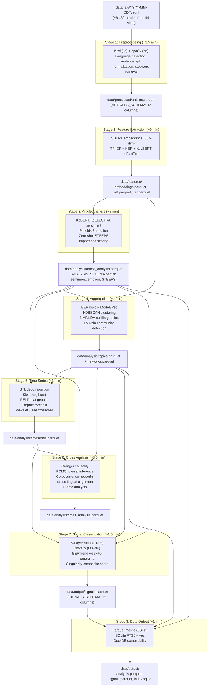

# 분석 파이프라인 상세 설계

**단계**: 7/20 -- 분석 파이프라인 상세 설계
**에이전트**: @pipeline-designer
**날짜**: 2026-02-26
**입력**: PRD SS5.2 (56개 기법, 8단계 파이프라인, 5계층 신호, 한국어 NLP 스택), Step 5 아키텍처 청사진 (계약, 스키마, 메모리), Step 2 기술 검증 (벤치마크, 메모리 프로파일)

---

## 1. 파이프라인 개요

### 1.1 아키텍처 요약

분석 파이프라인은 일일 약 6,460개 기사를 8개의 엄격한 순차 단계를 통해 처리하며, Parquet + SQLite 출력을 생성한다. 모든 처리는 MacBook M2 Pro 16GB(PRD C1, C3) 로컬 환경에서 오픈소스 Python 라이브러리만으로 수행된다 -- Claude API 호출 없음.

[trace:step-5:architecture-decisions-summary] -- 단계별 모놀리스; Python 3.12; 순차 모델 로딩; 10 GB 메모리 예산
[trace:step-2:dependency-validation-summary] -- 34 GO / 5 CONDITIONAL / 3 NO-GO; Python 3.12로 모든 CONDITIONAL 해결
[trace:step-2:nlp-benchmark-summary] -- 500개 기사 4.8분 (M4 Max); M2 Pro에서 보수적으로 9.6분

### 1.2 파이프라인 흐름도



### 1.3 성능 예산 요약

| 단계 | 처리 시간 (1,000개 기사) | 피크 메모리 | 모델 로딩 |
|-------|----------------------------------|-------------|---------------|
| 단계 1: 전처리 | ~3.5분 | ~1.0 GB | Kiwi (760 MB) + spaCy (200 MB) |
| 단계 2: 피처 추출 | ~6.0분 | ~2.4 GB | SBERT (1,100 MB) + NER (500 MB) + KeyBERT (20 MB) |
| 단계 3: 기사 분석 | ~8.0분 | ~1.8 GB | KoBERT (500 MB) + BART-MNLI (500 MB) |
| 단계 4: 집계 | ~4.0분 | ~1.5 GB | BERTopic (150 MB, SBERT 공유) |
| 단계 5: 시계열 | ~3.0분 | ~0.5 GB | 통계 라이브러리만 사용 |
| 단계 6: 교차 분석 | ~3.5분 | ~0.8 GB | tigramite + networkx |
| 단계 7: 신호 분류 | ~1.5분 | ~0.5 GB | scikit-learn (LOF/IF) |
| 단계 8: 데이터 출력 | ~1.0분 | ~0.5 GB | pyarrow + sqlite3 |
| **합계** | **~30분** | **~2.4 GB 피크** | 순차 로드/언로드 |

**목표**: 1,000개 기사 기준 총 30분(PRD SS9.2). 일일 배치 약 6,460개 기사는 선형 스케일링과 I/O 오버헤드를 감안하여 약 45-50분으로 추정된다.

[trace:step-2:memory-profile-summary] -- M4 Max에서 피크 1.25 GB 측정; 가장 무거운 단계에서 모든 모델 로딩 시 M2 Pro 기준 보수적으로 2.4 GB.

---

## 2. 이중 패스 분석 전략

[trace:step-5:data-flow-diagram] -- PRD SS5.2.3 K3: 분석은 제목 + 본문을 모두 포함해야 한다.

### 2.1 설계 근거

PRD SS5.2.3 및 핵심 기준 K3("제목과 본문 모두 분석해야 한다")에 따라, 파이프라인은 제목과 본문이 상호 보완적 역할을 수행하는 **이중 패스(Dual-Pass)** 전략을 사용한다:

| 패스 | 대상 | 역할 | 적용 시점 | 주요 기법 |
|------|--------|------|-------------|----------------|
| **패스 1: 제목** | `article.title` | 신호 탐지 (빠른 스캔) | 단계 1-3, 5, 7 | 키워드 빈도, 버스트 탐지, 감성 극성, Z-score 이상 탐지 |
| **패스 2: 본문** | `article.body` | 근거 확인 (심층 분석) | 단계 1-4, 6 | NER, 토픽 모델링, 프레임 분석, 인과 추론 |

> 제목은 "무엇이 일어나고 있는가"에 답하고, 본문은 "왜, 어떻게 일어나고 있는가"에 답한다.

### 2.2 파이프라인 단계별 구현

```python
# Dual-pass is NOT two separate pipeline runs.
# It is integrated within each stage's processing logic.

class DualPassProcessor:
    """Each article is processed with awareness of title vs. body.

    Stage 1: Both title and body are preprocessed independently.
             title_tokens and body_tokens are stored separately.
    Stage 2: Embeddings computed for both title and body.
             title_embedding (384-dim) used for fast clustering.
             body_embedding (384-dim) used for deep semantic analysis.
    Stage 3: Sentiment analyzed on both; title_sentiment used for
             rapid signal scanning, body_sentiment for confirmation.
    Stage 5: Title keywords drive burst detection (Kleinberg, Z-score).
    Stage 6: Body text drives frame analysis, causal inference.
    Stage 7: Title-based signals validated against body evidence.
    """
    pass
```

### 2.3 유료화 차단 기사 처리

본문이 잘린 5개 Extreme 유료화 사이트(NYT, FT, WSJ, Bloomberg, Le Monde)에서 `is_paywall_truncated = True`인 경우:

- **패스 1 (제목)**: 정상 작동 -- 제목은 항상 이용 가능
- **패스 2 (본문)**: 우아한 성능 저하 -- 본문이 빈 문자열이므로 본문 의존 분석(토픽 모델링, 프레임 분석, NER)은 null/기본값을 생성
- **importance_score**: 유료화로 잘린 기사는 증거 부족으로 자동으로 -20점 페널티 적용

[trace:step-4:decisions] -- D4: 5개 Extreme 유료화 사이트에 대한 제목 전용 분석이 이중 패스 분석을 지원한다.

---

## 3. 스테이지 정의

### 3.1 스테이지 1: 전처리

**Module**: `src/analysis/stage_1_preprocessing.py`

#### 입력

- **Source**: `data/raw/YYYY-MM-DD/{source_id}.jsonl` (크롤링 계층으로부터의 RawArticle JSON 객체)
- **Format**: JSON Lines, 한 줄에 하나의 `RawArticle`
- **Volume**: 44개 사이트에서 일일 약 6,460건의 기사

[trace:step-5:raw-article-contract] -- RawArticle dataclass: url, title, body, source_id, language, published_at, crawled_at, content_hash, is_paywall_truncated

#### 처리 로직

```python
# Stage 1 Processing Pipeline
def process_stage_1(raw_articles: list[RawArticle]) -> pa.Table:
    """
    1. Language Detection
       - langdetect.detect(title + body[:200])
       - Verify against source_id expected language
       - Override if confidence > 0.9 and differs from expected

    2. Text Normalization
       - Unicode NFKC normalization (unicodedata.normalize('NFKC', text))
       - Whitespace cleanup (collapse multiple spaces/newlines)
       - EUC-KR / GB2312 / Shift_JIS charset handling for legacy sites
       - HTML entity decoding (if residual)

    3. Korean Text Processing (language == "ko")
       - Kiwi morphological analysis: kiwi.tokenize(text)
       - Extract nouns (NNG, NNP), verbs (VV), adjectives (VA)
       - Apply Korean stopword list (particles: 이/가/은/는/을/를/에/에서/으로 + news fillers)
       - Sentence splitting: kiwi.split_into_sents(text)

    4. English Text Processing (language == "en")
       - spaCy pipeline: nlp(text)
       - Lemmatization: [token.lemma_ for token in doc]
       - Stopword removal: spaCy default + custom news stopwords
       - Sentence splitting: [sent.text for sent in doc.sents]

    5. Other Languages (zh, ja, de, fr, es, ar, he)
       - Basic whitespace tokenization + Unicode normalization
       - Language-specific sentence splitting (regex-based)
       - No morphological analysis (lightweight pass-through)

    6. Generate article_id (UUID v4) and word_count
       - Korean word_count: number of Kiwi morphemes (NNG+NNP+VV+VA)
       - English word_count: whitespace-split count after stopword removal
       - Other: whitespace-split count

    7. Write data/processed/articles.parquet (ARTICLES_SCHEMA)
    """
```

#### 출력

- **File**: `data/processed/articles.parquet`
- **Schema**: `ARTICLES_SCHEMA` (PRD SS7.1.1 기준 12개 컬럼)

| Column | Type | Source |
|--------|------|--------|
| `article_id` | utf8 | 생성된 UUID v4 |
| `url` | utf8 | RawArticle.url |
| `title` | utf8 | RawArticle.title (정규화됨) |
| `body` | utf8 | RawArticle.body (정규화됨, 유료화 기사는 빈 값) |
| `source` | utf8 | RawArticle.source_name |
| `category` | utf8 | RawArticle.category 또는 "uncategorized" |
| `language` | utf8 | 탐지/검증된 언어 코드 |
| `published_at` | timestamp[us, tz=UTC] | RawArticle.published_at |
| `crawled_at` | timestamp[us, tz=UTC] | RawArticle.crawled_at |
| `author` | utf8 (nullable) | RawArticle.author |
| `word_count` | int32 | 처리된 텍스트에서 산출 |
| `content_hash` | utf8 | RawArticle.content_hash |

**내부 중간 데이터** (메모리에 보관, 디스크에 저장하지 않음):
- `title_tokens: list[str]` -- 토큰화된 제목
- `body_tokens: list[str]` -- 토큰화된 본문
- `sentences: list[str]` -- 문장 분리된 텍스트
- `pos_tags: list[tuple[str, str]]` -- 품사 태그 (한국어: Kiwi 태그; 영어: spaCy 태그)

#### 매핑된 기법

| Technique ID | Technique | Implementation |
|-------------|-----------|----------------|
| T01 | 형태소 분석 (한국어) | `kiwipiepy.Kiwi.tokenize()` -- 명사/동사/형용사 추출 |
| T02 | 표제어 추출 (영어) | `spaCy.en_core_web_sm` -- token.lemma_ |
| T03 | 문장 분리 | Kiwi `split_into_sents()` (ko) / spaCy `doc.sents` (en) |
| T04 | 언어 탐지 | `langdetect.detect()` (신뢰도 임계값 적용) |
| T05 | 텍스트 정규화 | Unicode NFKC + 공백 정리 + 문자셋 처리 |
| T06 | 불용어 제거 | 한국어 전용 불용어 목록 + spaCy 영어 기본값 |

#### 메모리 관리

```
Load: Kiwi singleton (~760 MB) + spaCy en_core_web_sm (~200 MB)
Process: batch of articles
Unload: del spaCy model (Kiwi stays as singleton for later stages)
gc.collect()
Peak: ~1.0 GB
```

#### 성능 추정치

- **1,000건 기사**: 약 3.5분 (Kiwi 배치: 0.25초; spaCy: 약 2.5분; I/O: 약 0.75분)
- **병목 지점**: spaCy 영어 처리 (기사별 순차 처리)

#### 오류 처리

- **빈 제목**: 기사 건너뛰기, `data/logs/errors.log`에 기록 (심각도: ERROR)
- **언어 탐지 실패**: source_id 기대 언어로 기본 설정, 기록 (심각도: WARN)
- **Kiwi 토큰화 오류**: 공백 기반 토큰화로 대체, 기록 (심각도: WARN)
- **문자셋 디코딩 오류**: 일반적인 인코딩을 순차 시도 (UTF-8 -> EUC-KR -> Latin-1), 기록 (심각도: WARN)

---

### 3.2 스테이지 2: 피처 추출

**Module**: `src/analysis/stage_2_features.py`

#### 입력

- **Source**: `data/processed/articles.parquet` (ARTICLES_SCHEMA)
- **추가 인메모리 데이터**: 스테이지 1에서 생성된 title_tokens, body_tokens (또는 Parquet에서 재토큰화)

#### 처리 로직

```python
def process_stage_2(articles: pa.Table) -> dict[str, pa.Table]:
    """
    1. SBERT Embeddings
       - Model: paraphrase-multilingual-MiniLM-L12-v2 (384 dimensions)
       - Korean alternative: snowflake-arctic-embed-l-v2.0-ko (higher quality)
       - Batch encode: model.encode(texts, batch_size=64, show_progress_bar=True)
       - Compute BOTH title_embedding and body_embedding
       - Store combined embedding (body_embedding if body present; title_embedding if paywall)
       - Output: data/features/embeddings.parquet

    2. TF-IDF Vectors
       - sklearn.feature_extraction.text.TfidfVectorizer
       - Parameters: max_features=10000, ngram_range=(1,2), min_df=2
       - Separate TF-IDF models for Korean and English articles
       - Extract top 20 terms per article
       - Output: data/features/tfidf.parquet

    3. Named Entity Recognition (NER)
       - Korean: KLUE-RoBERTa-large NER pipeline (transformers)
         Entities: PERSON, ORGANIZATION, LOCATION, DATE, EVENT
       - English: spaCy NER pipeline (en_core_web_sm)
         Entities: PERSON, ORG, GPE, LOC, EVENT
       - Batch processing: process in chunks of 32 articles
       - Output: data/features/ner.parquet

    4. KeyBERT Keyword Extraction
       - Model: KeyBERT initialized with pre-loaded SBERT model (shared)
       - kw_model.extract_keywords(doc, keyphrase_ngram_range=(1,2), top_n=10)
       - Uses MMR for diversity (diversity=0.5)
       - Output: keywords column in embeddings.parquet

    5. FastText Word Vectors
       - fasttext-wheel: load pre-trained vectors per language
       - Korean: cc.ko.300.bin (or skip if memory-constrained)
       - English: cc.en.300.bin
       - Used for: word-level similarity, vocabulary coverage analysis
       - Output: not persisted separately (used in-memory for Stage 4, 6)
    """
```

#### 출력

Parquet 파일 3개:

**data/features/embeddings.parquet**:

| Column | Type | Description |
|--------|------|-------------|
| `article_id` | utf8 | FK -> articles |
| `embedding` | list\<float32\> | 384차원 SBERT 벡터 |
| `title_embedding` | list\<float32\> | 384차원 제목 전용 임베딩 |
| `keywords` | list\<utf8\> | KeyBERT 상위 10개 키워드 |

**data/features/tfidf.parquet**:

| Column | Type | Description |
|--------|------|-------------|
| `article_id` | utf8 | FK -> articles |
| `tfidf_top_terms` | list\<utf8\> | 상위 20개 TF-IDF 용어 |
| `tfidf_scores` | list\<float32\> | 대응하는 TF-IDF 점수 |

**data/features/ner.parquet**:

| Column | Type | Description |
|--------|------|-------------|
| `article_id` | utf8 | FK -> articles |
| `entities_person` | list\<utf8\> | 인물 개체명 |
| `entities_org` | list\<utf8\> | 조직 개체명 |
| `entities_location` | list\<utf8\> | 장소 개체명 |

#### 매핑된 기법

| Technique ID | Technique | Implementation |
|-------------|-----------|----------------|
| T07 | SBERT 임베딩 | `sentence-transformers` paraphrase-multilingual-MiniLM-L12-v2 (384차원) |
| T08 | TF-IDF | `sklearn.TfidfVectorizer` (유니그램 + 바이그램, max_features=10000) |
| T09 | 개체명 인식 | 한국어: KLUE-RoBERTa-large; 영어: spaCy NER |
| T10 | KeyBERT 키워드 추출 | `keybert.KeyBERT` (공유 SBERT 모델, MMR 다양성) |
| T11 | FastText 단어 벡터 | `fasttext-wheel` 사전 학습된 언어별 벡터 |
| T12 | 단어 수 / 통계 | 기본 코퍼스 통계 (문서 길이, 어휘 풍부도) |

#### 메모리 관리

```
Load: SBERT paraphrase-multilingual-MiniLM-L12-v2 (~1,100 MB)
Load: KeyBERT (shares SBERT, +20 MB)
Load: NER transformers (Davlan/xlm-roberta-base-ner-hrl, ~500 MB)
Process: batch embeddings -> TF-IDF -> NER -> KeyBERT
Note: FastText vectors loaded only if memory allows (optional, ~300 MB per language)
Peak: ~2.4 GB (SBERT + NER + processing overhead)
Unload: del NER model, del KeyBERT (SBERT stays for Stage 4)
gc.collect()
```

[trace:step-2:memory-profile-summary] -- SBERT 1,059 MB + KeyBERT 20 MB shared = 1,079 MB; NER ~500 MB additional.

#### 성능 추정치

- **1,000건 기사**: 약 6.0분
  - SBERT 인코딩: 약 1.5분 (batch=64, M2 Pro 기준 약 2,500 texts/s)
  - TF-IDF 벡터화: 약 0.3분
  - NER 처리: 약 3.0분 (트랜스포머 추론, 약 5.5 articles/s)
  - KeyBERT 추출: 약 1.0분 (약 16 articles/s)
  - Parquet I/O: 약 0.2분

#### 오류 처리

- **SBERT 인코딩 실패**: 오류 기록, 해당 기사에 제로 벡터(384차원 영벡터) 사용
- **NER 타임아웃** (기사당 >30초): 해당 기사의 NER 건너뛰기, 빈 개체 리스트로 채움
- **KeyBERT 실패**: TF-IDF 상위 용어를 키워드로 대체
- **FastText 모델 이용 불가**: FastText 피처 전체 건너뛰기 (비핵심 기능)

---

### 3.3 스테이지 3: 개별 기사 분석

**Module**: `src/analysis/stage_3_article.py`

#### 입력

- **Source**: `data/processed/articles.parquet` + `data/features/*.parquet`

#### 처리 로직

```python
def process_stage_3(articles: pa.Table, features: dict) -> pa.Table:
    """
    1. Sentiment Analysis
       - Korean: KoBERT fine-tuned for news domain (F1=94%)
         Model: monologg/kobert (or skt/kobert-base-v1)
         Output: sentiment_label (positive/negative/neutral), sentiment_score (-1 to 1)
       - English: cardiffnlp/twitter-roberta-base-sentiment-latest (or similar)
         Output: same format as Korean
       - Dual-Pass: Compute BOTH title_sentiment and body_sentiment
         Final sentiment = body_sentiment if body available, else title_sentiment

    2. 8-Dimension Emotion Classification (Plutchik Wheel)
       - Model: Zero-shot classification with facebook/bart-large-mnli
       - Labels: ["joy", "trust", "fear", "surprise", "sadness",
                  "disgust", "anger", "anticipation"]
       - candidate_labels applied to body text (or title if paywall)
       - Output: 8 float scores (0-1), one per Plutchik dimension
       - Korean: Apply KcELECTRA-based emotion classifier as primary,
         BART-MNLI as fallback

    3. Zero-Shot STEEPS Classification
       - Model: facebook/bart-large-mnli (shared with emotion)
       - Candidate labels: ["Social issue", "Technology development",
         "Economic trend", "Environmental concern",
         "Political event", "Security threat"]
       - Map highest-probability label to STEEPS code: S/T/E/En/P/Se
       - Apply to body text; title used for paywall-truncated articles

    4. Stance Detection
       - Model: Zero-shot with BART-MNLI
       - Detect article stance toward key entities/topics
       - Labels: ["supportive", "critical", "neutral", "mixed"]
       - Output: per-entity stance scores (used in Stage 6 frame analysis)

    5. Social Mood Index
       - Aggregate sentiment + emotion across articles per source per day
       - mood_index = weighted_avg(sentiment_scores) * (1 - entropy(emotions))
       - Output: per-source daily mood score (used in Stage 5 time series)

    6. Emotion Trajectory
       - Track emotion distribution changes over rolling 7-day windows
       - Compute per-emotion delta: emotion_t - emotion_{t-7}
       - Significant shifts flagged for Stage 7 signal detection
       - Output: delta vectors stored for time series analysis

    7. Importance Score
       - Composite score (0-100) combining:
         a. Source authority weight (based on site tier from sources.yaml)
         b. Entity density (NER count / word_count)
         c. Cross-source coverage (same topic in multiple sources)
         d. Recency (exponential decay from published_at)
         e. Sentiment extremity (|sentiment_score| contribution)
       - Paywall penalty: -20 for is_paywall_truncated articles
       - Formula:
         importance = 0.25*authority + 0.20*entity_density + 0.25*coverage
                    + 0.15*recency + 0.15*extremity + paywall_adjustment

    8. Narrative Extraction (T49)
       - Zero-shot classification of narrative roles in article text
       - Candidate labels: ["protagonist", "antagonist", "context_setter",
         "victim", "authority", "disruptor"]
       - Applied to body text (or title if paywall-truncated)
       - Identify which entities play which narrative roles
       - Output: per-entity narrative role assignments (used in Stage 6/7)

    9. Write data/analysis/article_analysis.parquet
    """
```

#### 출력

- **File**: `data/analysis/article_analysis.parquet`
- **Schema**: 부분 ANALYSIS_SCHEMA (감성 + 감정 + STEEPS + 중요도)

| Column | Type | Description |
|--------|------|-------------|
| `article_id` | utf8 | FK -> articles |
| `sentiment_label` | utf8 | "positive" / "negative" / "neutral" |
| `sentiment_score` | float32 | -1.0 ~ 1.0 |
| `emotion_joy` | float32 | Plutchik 기쁨 (0-1) |
| `emotion_trust` | float32 | Plutchik 신뢰 (0-1) |
| `emotion_fear` | float32 | Plutchik 공포 (0-1) |
| `emotion_surprise` | float32 | Plutchik 놀라움 (0-1) |
| `emotion_sadness` | float32 | Plutchik 슬픔 (0-1) |
| `emotion_disgust` | float32 | Plutchik 혐오 (0-1) |
| `emotion_anger` | float32 | Plutchik 분노 (0-1) |
| `emotion_anticipation` | float32 | Plutchik 기대 (0-1) |
| `steeps_category` | utf8 | "S"/"T"/"E"/"En"/"P"/"Se" |
| `importance_score` | float32 | 0-100 |

#### 매핑된 기법

| Technique ID | Technique | Implementation |
|-------------|-----------|----------------|
| T13 | 감성 분석 (한국어) | KoBERT (monologg/kobert) 뉴스 도메인 F1=94% |
| T14 | 감성 분석 (영어) | cardiffnlp/twitter-roberta-base-sentiment-latest |
| T15 | 8차원 감정 분석 (Plutchik) | 제로샷 BART-MNLI + KcELECTRA 대체 |
| T16 | 제로샷 STEEPS 분류 | facebook/bart-large-mnli (6개 후보 레이블) |
| T17 | 논조 탐지 | 제로샷 BART-MNLI (supportive/critical/neutral/mixed) |
| T18 | 사회적 분위기 지수 | 출처별 일일 감성 + 감정 엔트로피 집계 |
| T19 | 감정 궤적 | 7일 롤링 윈도우 감정 변화량 추적 |
| T49 | 내러티브 추출 | 제로샷 BART-MNLI 내러티브 역할 분류 (주인공/적대자/맥락 설정자) |
| -- | 중요도 점수 (파이프라인 연산) | 복합 점수: 권위도 + 개체 밀도 + 교차 출처 보도 + 최신성 + 극단성 |

#### 메모리 관리

```
Unload: Stage 2 NER model (SBERT kept for Stage 4)
Load: KoBERT/KcELECTRA sentiment (~500 MB)
Load: facebook/bart-large-mnli (~500 MB, shared for emotion + STEEPS + stance)
Process: sentiment -> emotion -> STEEPS -> stance -> mood -> trajectory -> importance
Peak: ~1.8 GB (SBERT 1,100 MB base retained + sentiment 500 MB + processing overhead)
Note: BART-MNLI replaces NER model in memory
Unload: del sentiment model, del BART-MNLI
gc.collect()
```

#### 성능 추정치

- **1,000건 기사**: 약 8.0분
  - 감성 분석: 약 3.0분 (트랜스포머 기준 약 5.5 articles/s)
  - 감정 분류: 약 2.5분 (제로샷, 8개 레이블)
  - STEEPS 분류: 약 1.5분 (제로샷, 6개 레이블, 캐시된 로짓 재사용 가능)
  - 논조 + 분위기 + 궤적 + 중요도: 약 0.5분 (경량 집계)
  - Parquet I/O: 약 0.5분

#### 오류 처리

- **감성 모델 로딩 실패**: 규칙 기반 사전으로 대체 (영어: VADER, 한국어: 자체 구현)
- **제로샷 타임아웃**: 해당 출처의 가장 일반적인 STEEPS 카테고리로 기본 설정
- **감정 점수 모두 0 근처**: "중립/평탄 감정"으로 표시, 모든 값을 0.125(균등 분포)로 설정
- **importance_score NaN 발생**: 0으로 클램핑, 경고 기록

---

### 3.4 스테이지 4: 집계

**Module**: `src/analysis/stage_4_aggregation.py`

#### 입력

- **Source**: `data/processed/articles.parquet` + `data/features/embeddings.parquet` + `data/analysis/article_analysis.parquet`
- **최소 요건**: 토픽 모델링에 50건 이상의 기사 필요 (미달 시 스테이지 건너뛰기)

#### 처리 로직

```python
def process_stage_4(articles: pa.Table, embeddings: pa.Table,
                    analysis: pa.Table) -> tuple[pa.Table, pa.Table]:
    """
    1. BERTopic Topic Modeling
       - Model: BERTopic(embedding_model=shared_sbert_model, verbose=False)
       - Representation: Model2Vec for CPU 500x speedup (PRD §5.2.5)
       - Configuration:
         nr_topics="auto"  # Let HDBSCAN determine
         min_topic_size=5
         calculate_probabilities=True
       - Fit on body embeddings (or title embeddings for paywall articles)
       - Output: topic_id, topic_label, topic_probability per article

    2. Dynamic Topic Modeling (DTM)
       - BERTopic.topics_over_time(docs, timestamps)
       - Track topic evolution across daily windows
       - Identify growing, shrinking, and emerging topics
       - Output: topic_id -> [{date, frequency, representation}]

    3. HDBSCAN Clustering
       - Applied directly on SBERT embeddings as secondary clustering
       - hdbscan.HDBSCAN(min_cluster_size=10, min_samples=5, metric='cosine')
       - Produces cluster_id per article (independent of BERTopic topics)
       - Useful for cross-validation of topic assignments

    4. NMF/LDA Auxiliary Topics
       - NMF: sklearn.decomposition.NMF(n_components=20) on TF-IDF matrix
       - LDA: sklearn.decomposition.LatentDirichletAllocation(n_components=20)
         (or gensim.models.LdaMulticore for speed)
       - Provides interpretable topic labels as backup/comparison to BERTopic
       - Output: auxiliary topic assignments (used for ensemble confidence)

    5. k-means Clustering
       - sklearn.cluster.KMeans(n_clusters=k) on SBERT embeddings
       - k determined by silhouette score optimization (k in range 5-50)
       - Provides flat clustering as alternative to hierarchical HDBSCAN

    6. Hierarchical Clustering
       - scipy.cluster.hierarchy.linkage(embeddings, method='ward')
       - Dendrogram cut at optimal distance (silhouette-based)
       - Captures nested topic structure (macro-topics -> sub-topics)

    7. Community Detection (Louvain)
       - Build entity co-occurrence graph from NER results
       - networkx graph with entity nodes, co-occurrence edges
       - python-louvain community detection for entity grouping
       - Output: community_id per entity, stored in networks.parquet

    8. Write data/analysis/topics.parquet + networks.parquet
    """
```

#### 출력

**data/analysis/topics.parquet**:

| Column | Type | Description |
|--------|------|-------------|
| `article_id` | utf8 | FK -> articles |
| `topic_id` | int32 | BERTopic 토픽 ID (-1 = 이상치) |
| `topic_label` | utf8 | 사람이 읽을 수 있는 토픽 레이블 |
| `topic_probability` | float32 | 토픽 할당 확률 (0-1) |
| `hdbscan_cluster_id` | int32 | 독립적인 HDBSCAN 클러스터 ID |
| `nmf_topic_id` | int32 | NMF 보조 토픽 ID |
| `lda_topic_id` | int32 | LDA 보조 토픽 ID |

**data/analysis/networks.parquet**:

| Column | Type | Description |
|--------|------|-------------|
| `entity_a` | utf8 | 동시 출현 쌍의 첫 번째 개체 |
| `entity_b` | utf8 | 동시 출현 쌍의 두 번째 개체 |
| `co_occurrence_count` | int32 | 두 개체가 동시에 등장한 기사 수 |
| `community_id` | int32 | Louvain 커뮤니티 할당 |
| `source_articles` | list\<utf8\> | 해당 쌍을 포함하는 기사 ID 목록 |

#### 매핑된 기법

| Technique ID | Technique | Implementation |
|-------------|-----------|----------------|
| T21 | BERTopic 토픽 모델링 | `bertopic.BERTopic` + Model2Vec (CPU 500배 속도 향상) |
| T22 | 동적 토픽 모델링 (DTM) | `BERTopic.topics_over_time()` -- 시간에 따른 토픽 변화 |
| T23 | HDBSCAN 클러스터링 | `hdbscan.HDBSCAN` (SBERT 임베딩, cosine 거리) |
| T24 | NMF 토픽 모델링 | `sklearn.decomposition.NMF` (TF-IDF 행렬 기반) |
| T25 | LDA 토픽 모델링 | `gensim.models.LdaMulticore` 또는 `sklearn.LatentDirichletAllocation` |
| T26 | k-means 클러스터링 | `sklearn.cluster.KMeans` (실루엣 점수 최적화 k) |
| T27 | 계층적 클러스터링 | `scipy.cluster.hierarchy.linkage` (Ward 방법) |
| T28 | 커뮤니티 탐지 (Louvain) | `python-louvain` (개체 동시 출현 그래프 기반) |

#### 메모리 관리

```
SBERT model still in memory from Stage 2 (~1,100 MB)
Load: BERTopic (shares SBERT, +150 MB peak) -- Step 2 R5
Load: HDBSCAN, sklearn, gensim LDA (~200 MB combined)
Process: BERTopic fit -> DTM -> HDBSCAN -> NMF/LDA -> k-means -> hierarchical -> Louvain
Peak: ~1.5 GB
Unload: del BERTopic, del SBERT, del all clustering models
gc.collect() -- releases sklearn/gensim memory; torch memory pool may persist
```

[trace:step-2:nlp-benchmark-summary] -- BERTopic 23.5 docs/s on M4 Max; conservative ~12 docs/s on M2 Pro.

#### 성능 추정치

- **1,000건 기사**: 약 4.0분
  - BERTopic 학습 + 변환: 약 1.5분 (약 12 docs/s)
  - DTM 연산: 약 0.5분
  - HDBSCAN 클러스터링: 약 0.3분
  - NMF/LDA: 약 0.5분
  - k-means + 계층적: 약 0.3분
  - Louvain 커뮤니티 탐지: 약 0.2분
  - Parquet I/O: 약 0.7분

#### 오류 처리

- **BERTopic 학습 실패** (min_topic_size 미달 기사 수): 토픽 모델링 건너뛰기, 모든 기사에 topic_id=-1 할당
- **HDBSCAN 전부 노이즈**: min_cluster_size를 5로 축소 후 재시도; 여전히 전부 노이즈이면 k-means로 대체
- **LDA/NMF 수렴 실패**: max_iter를 500으로 증가; 여전히 실패하면 보조 토픽 건너뛰기
- **비연결 그래프에서의 Louvain**: 연결 요소별로 개별 실행; 고립 노드에는 community_id=-1 할당

---

### 3.5 스테이지 5: 시계열 분석

**Module**: `src/analysis/stage_5_timeseries.py`

#### 입력

- **Source**: `data/analysis/topics.parquet` + `data/analysis/article_analysis.parquet` + `data/processed/articles.parquet`
- **최소 데이터 요건**: L1 분석에 7일; L2에 30일; L3 이상에 6개월; 이용 가능한 모든 과거 데이터 사용
- **집계 방식**: 기사를 토픽별 및 개체별로 일일 시계열로 집계

#### 처리 로직

```python
def process_stage_5(topics: pa.Table, analysis: pa.Table,
                    articles: pa.Table, historical: pa.Table | None) -> pa.Table:
    """
    1. Time Series Construction
       - Aggregate daily: topic_id -> article_count per day
       - Aggregate daily: sentiment_score -> mean per day per topic
       - Aggregate daily: emotion dimensions -> mean per day
       - Aggregate daily: entity mention frequency per day
       - Output: multiple time series arrays indexed by date

    2. STL Decomposition
       - statsmodels.tsa.seasonal.STL(endog, period=7)
       - Decompose each topic frequency series into:
         trend, seasonal (weekly), residual
       - Alert if residual > 2 std from mean (anomaly)

    3. Kleinberg Burst Detection
       - Custom implementation of Kleinberg's automaton model
       - Input: daily article counts per topic
       - Parameters: s=2.0 (base transition cost), gamma=1.0
       - Output: burst_intervals with start_date, end_date, burst_level
       - burst_score = burst_level * duration * volume

    4. PELT Changepoint Detection
       - ruptures.Pelt(model="rbf", min_size=3, jump=1)
       - Applied to: topic frequency, sentiment means, emotion means
       - penalty = log(n) * dimension (BIC penalty)
       - Output: changepoint_dates with significance scores
       - significance = 1 - p_value (permutation test, 100 iterations)

    5. Prophet Forecast
       - prophet.Prophet(yearly_seasonality=False, weekly_seasonality=True,
                         daily_seasonality=False)
       - Forecast horizon: 7 days (short) and 30 days (medium)
       - Applied to: top-20 topics by volume + aggregate total volume
       - Output: predicted_values, yhat_lower, yhat_upper per date
       - Anomaly: actual > yhat_upper or actual < yhat_lower

    6. Wavelet Analysis
       - pywt.wavedec(signal, 'db4', level=4)
       - Multi-scale decomposition: 1-day, 3-day, 7-day, 14-day, 28-day cycles
       - Identify dominant periodicities per topic
       - Output: wavelet_coefficients, dominant_period per topic

    7. ARIMA Modeling
       - statsmodels.tsa.arima.model.ARIMA(order=(p,d,q))
       - Auto-order selection: pmdarima.auto_arima (if installed) or grid search
       - Applied to aggregate article volume as complementary forecast to Prophet
       - Output: arima_forecast, residuals, aic

    8. Moving Average Crossover
       - Short MA: 3-day rolling mean
       - Long MA: 14-day rolling mean
       - Signal: short_ma crosses above long_ma -> "rising"
       - Signal: short_ma crosses below long_ma -> "declining"
       - Applied to: topic frequency, sentiment, entity frequency

    9. Seasonality Detection
       - scipy.signal.periodogram(signal)
       - Identify significant periodic components (p < 0.05)
       - Common patterns: weekly (7-day), monthly (30-day)
       - Output: detected_periods with strength scores

    10. Write data/analysis/timeseries.parquet
    """
```

#### 출력

**data/analysis/timeseries.parquet**:

| Column | Type | Description |
|--------|------|-------------|
| `series_id` | utf8 | 고유 시계열 식별자 (topic_id + metric_type) |
| `topic_id` | int32 | 관련 토픽 (집계인 경우 -1) |
| `metric_type` | utf8 | "volume" / "sentiment" / "emotion_*" / "entity_*" |
| `date` | timestamp[us, tz=UTC] | 측정 일자 |
| `value` | float32 | 측정값 |
| `trend` | float32 (nullable) | STL 추세 성분 |
| `seasonal` | float32 (nullable) | STL 계절 성분 |
| `residual` | float32 (nullable) | STL 잔차 성분 |
| `burst_score` | float32 (nullable) | Kleinberg 버스트 점수 |
| `is_changepoint` | bool | PELT 탐지 변화점 여부 |
| `changepoint_significance` | float32 (nullable) | 변화점의 1 - p_value |
| `prophet_forecast` | float32 (nullable) | Prophet 예측값 |
| `prophet_lower` | float32 (nullable) | Prophet 하한 |
| `prophet_upper` | float32 (nullable) | Prophet 상한 |
| `ma_short` | float32 (nullable) | 3일 이동평균 |
| `ma_long` | float32 (nullable) | 14일 이동평균 |
| `ma_signal` | utf8 (nullable) | "rising" / "declining" / "neutral" |

#### 매핑된 기법

| Technique ID | Technique | Implementation |
|-------------|-----------|----------------|
| T29 | STL 분해 | `statsmodels.tsa.seasonal.STL` (period=7, 주간) |
| T30 | Kleinberg 버스트 탐지 | 자체 오토마톤 모델 구현 |
| T31 | PELT 변화점 탐지 | `ruptures.Pelt` (RBF 커널, BIC 페널티) |
| T32 | Prophet 예측 | `prophet.Prophet` (7일 및 30일 예측 구간) |
| T33 | 웨이블릿 분석 | `pywt.wavedec` (Daubechies-4, 4단계) |
| T34 | ARIMA 모델링 | `statsmodels.tsa.arima.model.ARIMA` (자동 차수 선택) |
| T35 | 이동평균 교차 | 3일 대비 14일 이동평균; 교차 신호 |
| T36 | 계절성 탐지 | `scipy.signal.periodogram` (주기적 성분 탐지) |

#### 메모리 관리

```
Unload: ALL heavy ML models from Stages 2-4 (SBERT, BERTopic, etc.)
Delete model references + gc.collect()
Load: prophet (~50 MB), ruptures (~20 MB), statsmodels (~30 MB), pywt (~10 MB)
Process: STL -> burst -> PELT -> Prophet -> wavelet -> ARIMA -> MA -> seasonality
Peak: ~0.5 GB (statistical libs are lightweight)
Unload: del prophet model (it re-loads per fit call, but baseline is small)
gc.collect()
```

#### 성능 추정치

- **1,000건 기사 (약 20-50개 시계열로 집계)**: 약 3.0분
  - 시계열 구성: 약 0.3분
  - STL 분해 (50개 시계열): 약 0.2분
  - Kleinberg 버스트 (50개 시계열): 약 0.3분
  - PELT 변화점 (50개 시계열): 약 0.3분
  - Prophet 예측 (20개 시계열): 약 1.0분 (Prophet은 시계열당 느림)
  - 웨이블릿 + ARIMA: 약 0.5분
  - 이동평균 교차 + 계절성: 약 0.1분
  - Parquet I/O: 약 0.3분

#### 오류 처리

- **STL 데이터 부족** (14일 미만): STL 건너뛰기, 선형 회귀로 간단한 추세 산출
- **Prophet 학습 실패**: ARIMA 예측으로 대체; ARIMA도 실패하면 예측 건너뛰기
- **PELT 변화점 없음**: 빈 변화점 목록 반환 (유효한 결과: 구조적 변화 없음)
- **웨이블릿 분해 오류** (신호 길이 부족): 웨이블릿 건너뛰기, 주기도표만 사용

---

### 3.6 스테이지 6: 교차 분석

**Module**: `src/analysis/stage_6_cross.py`

#### 입력

- **Source**: `data/analysis/timeseries.parquet` + `data/analysis/topics.parquet` + `data/analysis/article_analysis.parquet` + `data/analysis/networks.parquet` + `data/features/embeddings.parquet`
- **최소 요건**: Granger 검정에 100건 이상의 기사; 의미 있는 교차 분석에 30일 이상

#### 처리 로직

```python
def process_stage_6(timeseries: pa.Table, topics: pa.Table,
                    analysis: pa.Table, networks: pa.Table,
                    embeddings: pa.Table) -> pa.Table:
    """
    1. Granger Causality Testing
       - statsmodels.tsa.stattools.grangercausalitytests
       - Test pairwise: topic_i frequency -> topic_j frequency
       - Max lag: 7 days
       - Significance threshold: p < 0.05
       - Output: topic_pairs with p_values, optimal_lag, direction
       - Interpretation: topic A coverage predicts topic B coverage

    2. PCMCI Causal Inference
       - tigramite.PCMCI with ParCorr independence test
       - Multivariate: model relationships among top-20 topic time series
       - tau_max = 7 (maximum lag of 7 days)
       - pc_alpha = 0.05 (significance level for conditional independence)
       - Output: causal graph (adjacency matrix with lag, direction, strength)
       - Advantages over Granger: controls for confounders, non-linear

    3. Co-occurrence Network Analysis
       - Entity-Entity co-occurrence: entities appearing in same article
       - Topic-Topic co-occurrence: topics assigned to overlapping article sets
       - Build weighted graph: edge_weight = co-occurrence_count / total_articles
       - Centrality analysis:
         a. Degree centrality (most connected entities)
         b. Betweenness centrality (bridging entities)
         c. PageRank (influence score)
       - Network evolution: compare graph structure across weekly snapshots

    4. Knowledge Graph Construction
       - Nodes: entities (PERSON, ORG, LOCATION) from NER
       - Edges: co-occurrence with relation type inference
       - Relation types: "mentioned_with", "works_at", "located_in" (heuristic)
       - Store as edge list in networks.parquet (extended)

    5. Cross-Lingual Topic Alignment
       - Use SBERT multilingual embeddings for Korean and English articles
       - Compute topic centroid embeddings per language
       - Align topics: cosine_similarity(ko_topic_centroid, en_topic_centroid)
       - Match threshold: similarity > 0.5
       - Output: aligned_topic_pairs with similarity scores

    6. Frame Analysis
       - Compare coverage framing of same topic across different sources
       - Dimensions: economic, security, human_interest, political, scientific
       - Method: TF-IDF over topic-filtered articles, per source
         Compare term distributions (KL divergence between sources)
       - Output: frame_divergence scores per topic per source pair

    7. Agenda Setting Analysis
       - Measure topic coverage volume lag between elite sources and others
       - Cross-correlation of topic frequency time series across source groups
       - Identify "agenda setters": sources whose coverage predicts later coverage
       - Output: source_influence_scores, topic_lag_pairs

    8. Temporal Alignment
       - Align topic timelines across countries/languages
       - DTW (Dynamic Time Warping) on topic frequency series
       - Identify topics that emerge in one region before another
       - Output: cross_region_lag_pairs with DTW distance

    9. GraphRAG Knowledge Retrieval (T20)
       - Build entity-topic knowledge graph from NER + topic assignments
       - Use SBERT embeddings for graph node representations
       - Graph-based retrieval: for a query topic, traverse knowledge graph
         to find related entities, topics, and evidence articles
       - Output: enriched evidence chains for Stage 7 signal classification

    10. Contradiction Detection (T50)
       - For articles covering the same topic from different sources:
         Compare claim-level assertions using NLI entailment scoring
       - SBERT cosine similarity to identify article pairs on same topic
       - BART-MNLI entailment: classify pairs as entailment/contradiction/neutral
       - Output: contradiction_pairs with confidence scores
       - Used in Stage 7 for signal evidence quality assessment

    11. Write data/analysis/cross_analysis.parquet
    """
```

#### 출력

**data/analysis/cross_analysis.parquet**:

| Column | Type | Description |
|--------|------|-------------|
| `analysis_type` | utf8 | "granger" / "pcmci" / "cross_lingual" / "frame" / "agenda" / "temporal" / "graphrag" / "contradiction" |
| `source_entity` | utf8 | 원천 토픽/개체/출처 ID |
| `target_entity` | utf8 | 대상 토픽/개체/출처 ID |
| `relationship` | utf8 | 관계 설명 |
| `strength` | float32 | 관계 강도 (0-1) |
| `p_value` | float32 (nullable) | 통계적 유의성 |
| `lag_days` | int32 (nullable) | 시간 지연 (일 단위) |
| `evidence_articles` | list\<utf8\> | 뒷받침하는 기사 ID 목록 |
| `metadata` | utf8 | 분석별 세부 정보가 담긴 JSON 문자열 |

#### 매핑된 기법

| Technique ID | Technique | Implementation |
|-------------|-----------|----------------|
| T37 | Granger 인과성 | `statsmodels.tsa.stattools.grangercausalitytests` (최대 지연=7) |
| T38 | PCMCI 인과 추론 | `tigramite.PCMCI` (ParCorr, tau_max=7, alpha=0.05) |
| T39 | 동시 출현 네트워크 | `networkx` 가중 그래프 + 중심성 지표 |
| T40 | 지식 그래프 | NER 동시 출현 기반 엣지 리스트 + 관계 유형 휴리스틱 |
| T41 | 중심성 분석 | `networkx.degree_centrality`, `betweenness_centrality`, `pagerank` |
| T42 | 네트워크 진화 | 주간 그래프 스냅샷 비교; 차수 분포, 밀도, 모듈성 |
| T43 | 교차 언어 토픽 정렬 | SBERT 다국어 중심점 코사인 유사도 (임계값 > 0.5) |
| T44 | 프레임 분석 | 출처별 토픽별 TF-IDF 분포의 KL 발산 |
| T45 | 의제 설정 분석 | 출처 그룹 간 토픽 빈도의 교차 상관 |
| T46 | 시간적 정렬 | 지역 간 토픽 시계열에 대한 DTW(Dynamic Time Warping) |
| T20 | GraphRAG 지식 검색 | `networkx` 그래프 + SBERT 임베딩 기반 그래프 검색 증강 분석 |
| T50 | 모순 탐지 | SBERT 코사인 유사도 + NLI 함의 점수를 통한 출처 간 상충 주장 탐지 |

#### 메모리 관리

```
Load: tigramite (~100 MB), networkx + igraph (~50 MB)
Load: scipy (~already loaded from Stage 5)
Process: Granger -> PCMCI -> co-occurrence -> knowledge graph -> cross-lingual
         -> frame -> agenda -> temporal alignment
Peak: ~0.8 GB
Unload: del tigramite, del network objects
gc.collect()
```

#### 성능 추정치

- **1,000건 기사**: 약 3.5분
  - Granger 검정 (상위 20개 토픽 쌍): 약 0.5분
  - PCMCI (20개 변수, tau_max=7): 약 1.0분
  - 동시 출현 네트워크 구축 + 중심성: 약 0.5분
  - 지식 그래프 구성: 약 0.3분
  - 교차 언어 정렬: 약 0.3분 (캐시된 임베딩 기반 코사인)
  - 프레임 분석 (KL 발산): 약 0.3분
  - 의제 설정 + 시간적 정렬: 약 0.3분
  - Parquet I/O: 약 0.3분

#### 오류 처리

- **Granger 검정 비정상 데이터**: ADF 검정을 먼저 수행; 비정상이면 차분 적용; 여전히 비정상이면 건너뛰기
- **PCMCI 수렴 실패**: tau_max를 3으로 축소; 여전히 실패하면 PCMCI 건너뛰고 Granger에 의존
- **교차 언어 매치 없음**: 임계값을 0.3으로 하향; 여전히 매치 없으면 "언어 간 발산"으로 기록
- **네트워크 희소** (엣지 10개 미만): 중심성 분석 건너뛰기, "불충분한 네트워크 데이터"로 보고

---

### 3.7 스테이지 7: 신호 분류 (5계층)

**Module**: `src/analysis/stage_7_signals.py`

#### 입력

- **Source**: 이전 모든 스테이지의 출력: `data/analysis/cross_analysis.parquet` + `data/analysis/timeseries.parquet` + `data/analysis/topics.parquet` + `data/analysis/article_analysis.parquet` + `data/features/embeddings.parquet` + `data/analysis/networks.parquet`

#### 처리 로직

```python
def process_stage_7(cross_analysis: pa.Table, timeseries: pa.Table,
                    topics: pa.Table, analysis: pa.Table,
                    embeddings: pa.Table, networks: pa.Table) -> pa.Table:
    """
    1. Rule-Based 5-Layer Classification
       - See Section 4 (5-Layer Signal Hierarchy) for detailed rules
       - Each topic evaluated against layer criteria from L5 (most significant) down to L1
       - First matching layer wins (L5 > L4 > L3 > L2 > L1)

    2. Novelty Detection (OOD)
       - LOF: sklearn.neighbors.LocalOutlierFactor(n_neighbors=20, contamination=0.05)
       - Isolation Forest: sklearn.ensemble.IsolationForest(contamination=0.05)
       - Applied to: SBERT embeddings of recent articles (last 7 days)
       - Ensemble: novelty_score = 0.5 * lof_score + 0.5 * if_score
       - Threshold: novelty_score > 0.7 -> flag as OOD candidate

    3. BERTrend Weak Signal Detection
       - Track topic lifecycle: noise -> weak -> emerging -> strong -> declining
       - Transition rules:
         noise -> weak: topic first appears with < 5 articles/day
         weak -> emerging: volume doubles within 7 days AND appears in 2+ sources
         emerging -> strong: sustains > 20 articles/day for 14+ days
         strong -> declining: volume drops > 50% from peak over 14 days
       - Signal: weak -> emerging transition triggers L5 singularity candidate check

    4. Singularity Composite Score (L5 only)
       - See Section 5 (Singularity Composite Score) for full formula
       - Compute 7 indicators for each L5 candidate
       - Threshold: S_singularity >= 0.65 -> confirm as singularity signal

    5. Confidence Scoring
       - Per-signal confidence based on evidence diversity:
         evidence_sources = count of distinct news sources supporting signal
         evidence_languages = count of distinct languages
         evidence_duration = days since first detection
         evidence_techniques = count of techniques that agree on signal
       - confidence = min(1.0,
           0.25 * (evidence_sources / 10) +
           0.25 * (evidence_languages / 3) +
           0.25 * min(evidence_duration / 30, 1.0) +
           0.25 * (evidence_techniques / 5)
         )

    6. Evidence Summary Generation
       - For each signal, compile textual summary:
         "Detected {layer} signal '{label}' based on: {technique_list}.
          {source_count} sources, {article_count} articles over {duration} days.
          Key entities: {top_entities}. Confidence: {confidence:.2f}"

    7. Signal Deduplication
       - Merge overlapping signals (same topic, same layer, overlapping time window)
       - Keep signal with higher confidence
       - Update article_ids to union of both signals

    8. Write data/output/signals.parquet (SIGNALS_SCHEMA)
    """
```

#### 출력

- **File**: `data/output/signals.parquet`
- **Schema**: `SIGNALS_SCHEMA` (PRD SS7.1.3 기준 12개 컬럼)

| Column | Type | Description |
|--------|------|-------------|
| `signal_id` | utf8 | UUID v4 |
| `signal_layer` | utf8 | "L1_fad" / "L2_short" / "L3_mid" / "L4_long" / "L5_singularity" |
| `signal_label` | utf8 | 사람이 읽을 수 있는 신호 설명 |
| `detected_at` | timestamp[us, tz=UTC] | 탐지 시각 |
| `topic_ids` | list\<int32\> | 관련 BERTopic 토픽 ID 목록 |
| `article_ids` | list\<utf8\> | 관련 기사 UUID 목록 |
| `burst_score` | float32 (nullable) | Kleinberg 버스트 점수 (L1/L2 신호) |
| `changepoint_significance` | float32 (nullable) | PELT 유의성 (L3/L4 신호) |
| `novelty_score` | float32 (nullable) | LOF/IF 앙상블 이상치 점수 (L5 신호) |
| `singularity_composite` | float32 (nullable) | 7개 지표 복합 점수 (L5 전용) |
| `evidence_summary` | utf8 | 탐지 근거 텍스트 요약 |
| `confidence` | float32 | 분류 신뢰도 (0-1) |

#### 매핑된 기법

| Technique ID | Technique | Implementation |
|-------------|-----------|----------------|
| T47 | 이상치 탐지 (LOF) | `sklearn.neighbors.LocalOutlierFactor` (n_neighbors=20) |
| T48 | 이상치 탐지 (Isolation Forest) | `sklearn.ensemble.IsolationForest` (contamination=0.05) |
| T51 | Z-score 이상 탐지 | `scipy.stats.zscore` (시계열 적용; 임계값 >\|2.5\|) |
| T52 | 엔트로피 변화 탐지 | `scipy.stats.entropy` (토픽 분포; 변화량 추적) |
| T53 | Zipf 분포 편차 | 용어 빈도 분포와 이상적 Zipf 비교; 편차 점수 |
| T54 | 생존 분석 | `lifelines.KaplanMeierFitter` (토픽 지속 기간 모델링) |
| T55 | KL 발산 | `scipy.special.rel_entr` (현재 분포와 기준선 분포 비교) |
| -- | BERTrend 약한 신호 탐지 (파이프라인 프로세스) | 자체 생애주기 추적기: noise -> weak -> emerging -> strong (T21, T22, T47, T48 사용) |
| -- | 특이점 복합 점수 (파이프라인 프로세스) | 7개 지표 가중치 공식 (5절 참조; T47, T48, T31, T52, T42 사용) |

#### 메모리 관리

```
Load: scikit-learn LOF/IF (~100 MB), scipy, lifelines (~50 MB)
Process: 5-layer rules -> novelty -> BERTrend -> singularity -> confidence -> evidence
Peak: ~0.5 GB
Unload: del LOF, del IF models
gc.collect()
```

#### 성능 추정치

- **1,000건 기사 (약 20-100개 신호 생성)**: 약 1.5분
  - 5계층 규칙 평가: 약 0.3분 (규칙 기반, 빠름)
  - LOF + Isolation Forest: 약 0.5분
  - BERTrend 생애주기 추적: 약 0.1분
  - 특이점 점수 연산: 약 0.1분
  - 신뢰도 + 근거 생성: 약 0.2분
  - 신호 중복 제거: 약 0.1분
  - Parquet I/O: 약 0.2분

#### 오류 처리

- **탐지된 신호 없음**: 빈 signals.parquet 생성 (뉴스가 조용한 날의 유효한 결과)
- **LOF/IF 실패** (샘플 부족): 이상치 탐지 건너뛰기, 규칙 기반만 사용
- **특이점 점수 NaN**: 가중 합산 전에 구성 요소 점수를 [0,1]로 클램핑; 경고 기록
- **근거 생성 오류**: 최소 요약 "제한된 근거로 신호 탐지됨" 사용

---

### 3.8 스테이지 8: 데이터 출력

**Module**: `src/analysis/stage_8_output.py`

#### 입력

- **Source**: 이전 모든 스테이지의 Parquet 파일

#### 처리 로직

```python
def process_stage_8(all_stage_outputs: dict[str, pa.Table]) -> None:
    """
    1. Merge analysis.parquet (ANALYSIS_SCHEMA)
       - Join: articles.parquet + article_analysis.parquet + topics.parquet
         + embeddings.parquet (embedding, keywords columns)
       - Join key: article_id
       - Verify: all 21 columns of ANALYSIS_SCHEMA present
       - Compression: ZSTD (level 3)
       - Output: data/output/analysis.parquet

    2. Finalize signals.parquet (SIGNALS_SCHEMA)
       - Already produced by Stage 7
       - Validate schema (12 columns)
       - Copy to data/output/signals.parquet with ZSTD compression

    3. Build SQLite Index (data/output/index.sqlite)
       a. articles_fts (FTS5):
          - Insert article_id, title, body, source, category, language, published_at
          - Tokenizer: unicode61 (multilingual support)

       b. article_embeddings (sqlite-vec):
          - Insert article_id, embedding (384-dim float vector)
          - Enables: semantic similarity search via SQL

       c. signals_index:
          - Insert signal_id, signal_layer, signal_label, detected_at,
            confidence, article_count
          - Create indices on signal_layer, detected_at

       d. topics_index:
          - Insert topic_id, label, article_count, first_seen, last_seen,
            trend_direction
          - Compute trend_direction from Stage 5 MA crossover signal

       e. crawl_status:
          - Update per-source statistics from current run

    4. DuckDB Compatibility Verification
       - Verify: duckdb.read_parquet('data/output/analysis.parquet') succeeds
       - Verify: duckdb.read_parquet('data/output/signals.parquet') succeeds
       - Verify: row counts match expectations

    5. Data Quality Validation (PRD SS7.4)
       - Article dedup check: no duplicate article_id
       - Signal integrity: all topic_ids reference valid topics
       - Embedding dimension: all vectors are exactly 384 floats
       - Schema validation: all columns match declared types
       - Completeness: no NaN in NOT NULL columns
    """
```

#### 출력

- **data/output/analysis.parquet**: 기사별 통합 결과 (ANALYSIS_SCHEMA, 21개 컬럼)
- **data/output/signals.parquet**: 신호 분류 결과 (SIGNALS_SCHEMA, 12개 컬럼)
- **data/output/index.sqlite**: FTS5 + vec 검색 인덱스

#### 매핑된 기법

| Technique ID | Technique | Implementation |
|-------------|-----------|----------------|
| T56 | SetFit 퓨샷 분류 | `setfit.SetFitModel` (8개 예시 기반 사용자 정의 카테고리); 월간 모델 재학습 시 적용; 분류 결과는 스테이지 8에서 저장 및 병합 |

**T56에 대한 참고**: SetFit은 월간 재학습 모델(PRD SS6.2)로, STEEPS를 넘어서는 사용자 정의 카테고리 분류에 사용된다. 일일 파이프라인 실행 중에는, 스테이지 8에서 사전 연산된 SetFit 분류 결과가 있을 경우 이를 병합한다. 모델 자체는 `scripts/retrain_models.py`를 통해 월간 학습한다.

#### 메모리 관리

```
Unload: ALL analysis models from previous stages
Load: pyarrow (~50 MB), sqlite3 (stdlib), sqlite-vec (~20 MB), duckdb (~100 MB)
Process: Parquet merge -> SQLite build -> DuckDB verify -> quality validation
Peak: ~0.5 GB (dominated by Parquet I/O buffers)
Unload: del all dataframes
gc.collect()
```

#### 성능 추정치

- **1,000건 기사**: 약 1.0분
  - Parquet 병합 + ZSTD 압축: 약 0.3분
  - SQLite FTS5 삽입: 약 0.2분
  - sqlite-vec 삽입 (1000 x 384차원): 약 0.1분
  - DuckDB 검증: 약 0.1분
  - 데이터 품질 검증: 약 0.1분
  - I/O 최종화: 약 0.2분

#### 오류 처리

- **스키마 불일치**: FATAL 오류로 파이프라인 중단 (PipelineError); 진단 보고서 생성
- **SQLite 쓰기 실패**: 타임아웃을 점진적으로 증가시키며 3회 재시도; 지속 실패 시 Parquet 전용 출력 생성
- **DuckDB 검증 실패**: 경고 기록, 파이프라인 중단하지 않음 (DuckDB는 편의 계층)
- **데이터 품질 실패**: ERROR로 기록; 품질 보고서와 함께 출력 생성; 부적합 비율 10% 초과 시에만 중단

---

## 4. 5계층 신호 위계

[trace:step-5:pipeline-yaml-schema] -- pipeline.yaml signal_confidence_threshold: 0.5; singularity_weights defined

### 4.1 계층 정의

| 계층 | 명칭 | 시간 범위 | 최소 데이터 | 주요 기법 | 탐지 기준 |
|-------|------|-------------|-------------|-------------------|-------------------|
| **L1** | 일시적 유행(Fad) | 1일 - 2주 | 7일 | Kleinberg 버스트 탐지 + Z-점수 이상 탐지 | 거래량 급등 > 7일 평균 대비 3 시그마 이상 AND burst_score > 2.0 |
| **L2** | 단기 트렌드 | 2주 - 3개월 | 30일 | BERTopic DTM + 감성 궤적 + 이동평균 교차 | 토픽 볼륨이 14일 이동평균 이상으로 7일 연속 유지 AND 이동평균 교차 신호 = "상승" |
| **L3** | 중기 트렌드 | 3개월 - 1년 | 6개월 | PELT 변화점 탐지 + 네트워크 진화 + 프레임 분석 | PELT 변화점 탐지(유의도 > 0.8) AND 토픽 구조 변화(네트워크 모듈성 변화 > 0.1) |
| **L4** | 장기 트렌드 | 1 - 5년 | 2년 이상 | 임베딩 드리프트 + 웨이블릿 분석 + STEEPS 분류 | 임베딩 중심점 드리프트 > 6개월 이상 코사인 거리 0.3 AND 웨이블릿 지배 주기 > 90일 AND 지속적 STEEPS 변화 |
| **L5** | 특이점(Singularity) | 비주기적 | 6개월 이상 | 이상치(LOF/IF) + 교차 도메인 출현 + BERTrend 전환 + 7개 지표 복합 | singularity_composite >= 0.65 (섹션 5 참조) |

### 4.2 정량적 분류 규칙

```python
def classify_signal(topic_data: TopicSignalData) -> str:
    """
    Evaluate topic against each layer from L5 (most significant) down to L1.
    First matching layer wins.

    Priority order: L5 > L4 > L3 > L2 > L1
    This ensures the most significant classification is assigned.
    """

    # --- L5: Singularity ---
    if (topic_data.novelty_score > 0.7
        and topic_data.cross_domain_count >= 2
        and topic_data.singularity_composite >= 0.65):
        return "L5_singularity"

    # --- L4: Long-term Trend ---
    if (topic_data.embedding_drift > 0.3          # cosine distance over 6+ months
        and topic_data.wavelet_dominant_period > 90  # days
        and topic_data.steeps_shift_detected         # boolean: STEEPS category changed
        and topic_data.data_span_days >= 365):        # at least 1 year of data
        return "L4_long"

    # --- L3: Mid-term Trend ---
    if (topic_data.changepoint_significance > 0.8  # PELT p-value inverted
        and topic_data.network_modularity_delta > 0.1
        and topic_data.frame_divergence_detected    # frame analysis shows shift
        and topic_data.data_span_days >= 90):       # at least 3 months
        return "L3_mid"

    # --- L2: Short-term Trend ---
    if (topic_data.volume_above_ma14_days >= 7     # sustained above 14-day MA
        and topic_data.ma_crossover == "rising"     # short MA crossed above long MA
        and topic_data.emotion_trajectory_shift      # emotion delta significant
        and topic_data.data_span_days >= 14):       # at least 2 weeks
        return "L2_short"

    # --- L1: Fad ---
    if (topic_data.volume_zscore > 3.0             # 3 sigma above 7-day mean
        and topic_data.burst_score > 2.0            # Kleinberg burst level
        and topic_data.data_span_days >= 1):        # at least 1 day
        return "L1_fad"

    # --- No signal ---
    return None  # topic does not qualify as a signal
```

### 4.3 계층 전환 규칙

신호는 데이터가 축적됨에 따라 상위 계층으로 승격될 수 있다:

| 전환 | 트리거 조건 | 조치 |
|-----------|-------------------|--------|
| L1 -> L2 | 일시적 유행이 14일 이상 지속되며 볼륨 유지 | L2_short로 승격; evidence_summary 갱신 |
| L2 -> L3 | 단기 트렌드가 3개월 이상 지속 AND 변화점 탐지됨 | L3_mid로 승격; PELT 증거 추가 |
| L3 -> L4 | 중기 트렌드가 1년 이상 지속 AND 임베딩 드리프트 탐지됨 | L4_long으로 승격; 드리프트 증거 추가 |
| L2/L3 -> L5 | 이상치 점수 급등 AND 교차 도메인 출현 탐지됨 | L5_singularity로 승격; 복합 점수 산출 |
| L1 -> 해제 | 일시적 유행 볼륨이 48시간 이내 80% 이상 하락 | "dismissed_fad"로 표시; 아카이브에 보존 |

### 4.4 계층별 신뢰도 점수

| 계층 | 기본 신뢰도 | 가산 요인 | 감산 요인 |
|-------|---------------|---------|----------|
| L1 | 0.4 | 다중 소스 시 +0.2; 다국어 시 +0.1 | 단일 소스 시 -0.2 |
| L2 | 0.5 | 감성 궤적 확인 시 +0.15; 5개 이상 소스 시 +0.1 | 볼륨 감소 시 -0.15 |
| L3 | 0.6 | PCMCI 인과 추론 연결 시 +0.15; 프레임 분석 확인 시 +0.1 | 변화점 경계값(0.8-0.85) 시 -0.1 |
| L4 | 0.7 | 웨이블릿 확인 시 +0.1; 교차 언어 정렬 시 +0.1 | 임베딩 드리프트 경계값(0.3-0.35) 시 -0.1 |
| L5 | 0.5 | 3개 이상 독립 경로 확인 시 +0.2; 복합 점수 > 0.8 시 +0.15 | 1개 경로만 트리거 시 -0.2 |

---

## 5. 특이점 복합 점수(Singularity Composite Score)

[trace:step-5:pipeline-yaml-schema] -- singularity_weights in pipeline.yaml: ood_score=0.20, changepoint=0.15, cross_domain=0.20, bertrend=0.15, entropy=0.10, novelty=0.10, network=0.10

### 5.1 공식

PRD SS5.2.4 및 부록 E 기준:

```
S_singularity = w1 * OOD_score
              + w2 * Changepoint_significance
              + w3 * CrossDomain_emergence
              + w4 * BERTrend_transition
              + w5 * Entropy_spike
              + w6 * Novelty_score
              + w7 * Network_anomaly
```

### 5.2 7개 지표

| # | 지표 | 범위 | 측정 방법 | Python 구현 |
|---|-----------|-------|-------------------|----------------------|
| 1 | `OOD_score` | 0-1 | LOF/Isolation Forest 이상치 점수, 정규화 | `sklearn.neighbors.LocalOutlierFactor` + `IsolationForest`; 앙상블 평균; [0,1]로 min-max 정규화 |
| 2 | `Changepoint_significance` | 0-1 | PELT 변화점 p-값 반전(1 - p) | `ruptures.Pelt`; 순열 검정(100회); significance = 1 - p_value |
| 3 | `CrossDomain_emergence` | 0-1 | 토픽이 동시에 출현하는 STEEPS 도메인 비율 | 토픽 기사가 있는 STEEPS 카테고리 수 / 6; 예: S+T+E = 3/6 = 0.5 |
| 4 | `BERTrend_transition` | 0/1 (이진) | 토픽이 노이즈->약 또는 약->출현 전환을 거쳤는지 여부 | 커스텀 생명주기 추적기; 현재 분석 윈도우에서 전환 탐지 시 1, 그 외 0 |
| 5 | `Entropy_spike` | 0-1 | 토픽 분포 엔트로피의 Z-점수, 정규화 | `scipy.stats.entropy(topic_distribution)`; 30일 이동평균 대비 Z-점수 산출; 정규화: min(zscore/5, 1.0) |
| 6 | `Novelty_score` | 0-1 | 임베딩 공간에서 최근접 이웃 거리 | 토픽 중심점 임베딩에 대해: k=20 최근접 과거 토픽 중심점까지 평균 거리 산출; [0,1]로 정규화 |
| 7 | `Network_anomaly` | 0-1 | 공출현 네트워크에서 새 노드/엣지 비율 | (new_nodes + new_edges) / (total_nodes + total_edges) 대비 이전 기간; [0,1]로 정규화 |

### 5.3 초기 가중치 (PRD 부록 E)

```python
SINGULARITY_WEIGHTS = {
    "w1_ood":             0.20,  # OOD score
    "w2_changepoint":     0.15,  # Changepoint significance
    "w3_cross_domain":    0.20,  # Cross-domain emergence (highest: cross-domain is strongest singularity signal)
    "w4_bertrend":        0.15,  # BERTrend transition
    "w5_entropy":         0.10,  # Entropy spike
    "w6_novelty":         0.10,  # Novelty score
    "w7_network":         0.10,  # Network anomaly
}
# Sum = 1.00
# Source: PRD Appendix E initial values
# Tuning: Grid search or domain expert adjustment after 6+ months of data

SINGULARITY_THRESHOLD = 0.65  # S_singularity >= 0.65 -> singularity candidate
```

### 5.4 3개 독립 경로 (교차 검증)

PRD SS5.2.4에 따라, 특이점 탐지는 3개의 독립 경로를 사용한다. 신호가 L5로 확정되려면 **3개 경로 중 최소 2개가 일치**해야 한다:

| 경로 | 사용 지표 | 트리거 |
|---------|----------------|---------|
| **경로 A: OOD 탐지** | OOD_score + Novelty_score | 둘 중 하나 > 0.7 |
| **경로 B: 구조적 변화** | Changepoint_significance + Entropy_spike + Network_anomaly | Changepoint > 0.8 AND (Entropy 또는 Network > 0.5) |
| **경로 C: 출현** | BERTrend_transition + CrossDomain_emergence | Transition = 1 AND CrossDomain > 0.3 |

```python
def confirm_singularity(indicators: dict) -> bool:
    """At least 2 of 3 independent pathways must trigger."""
    pathway_a = (indicators["OOD_score"] > 0.7
                 or indicators["Novelty_score"] > 0.7)
    pathway_b = (indicators["Changepoint_significance"] > 0.8
                 and (indicators["Entropy_spike"] > 0.5
                      or indicators["Network_anomaly"] > 0.5))
    pathway_c = (indicators["BERTrend_transition"] == 1
                 and indicators["CrossDomain_emergence"] > 0.3)

    pathways_triggered = sum([pathway_a, pathway_b, pathway_c])
    return pathways_triggered >= 2
```

---

## 6. 기법 매핑 매트릭스 (T01-T56)

### 6.1 전체 매핑 테이블

| ID | 기법 | 도메인 | 주요 단계 | 보조 단계 | Python 라이브러리 | PRD 참조 |
|----|------|--------|----------|----------|-----------------|----------|
| **T01** | Morphological Analysis (Korean) | 텍스트 처리 | Stage 1 | -- | `kiwipiepy 0.22.2` | SS5.2.2 Stage 1 |
| **T02** | Lemmatization (English) | 텍스트 처리 | Stage 1 | -- | `spaCy en_core_web_sm` | SS5.2.2 Stage 1 |
| **T03** | Sentence Splitting | 텍스트 처리 | Stage 1 | -- | Kiwi `split_into_sents` / spaCy `doc.sents` | SS5.2.2 Stage 1 |
| **T04** | Language Detection | 텍스트 처리 | Stage 1 | -- | `langdetect` | SS5.2.2 Stage 1 |
| **T05** | Text Normalization | 텍스트 처리 | Stage 1 | -- | `unicodedata` (stdlib) | SS5.2.2 Stage 1 |
| **T06** | Stopword Removal | 텍스트 처리 | Stage 1 | -- | Custom Korean list + spaCy defaults | SS5.2.2 Stage 1 |
| **T07** | SBERT Embeddings | 텍스트 처리 | Stage 2 | Stage 6 (교차 언어), Stage 7 (신규성) | `sentence-transformers` paraphrase-multilingual-MiniLM-L12-v2 | SS5.2.2 Stage 2 |
| **T08** | TF-IDF | 텍스트 처리 | Stage 2 | Stage 6 (프레임 분석) | `sklearn.feature_extraction.text.TfidfVectorizer` | SS5.2.2 Stage 2 |
| **T09** | Named Entity Recognition | 텍스트 처리 | Stage 2 | Stage 6 (지식 그래프) | Korean: KLUE-RoBERTa-large; English: spaCy NER | SS5.2.2 Stage 2 |
| **T10** | KeyBERT Keyword Extraction | 텍스트 처리 | Stage 2 | -- | `keybert 0.9.0` (shared SBERT) | SS5.2.2 Stage 2 |
| **T11** | FastText Word Vectors | 텍스트 처리 | Stage 2 | Stage 4 (클러스터링), Stage 6 | `fasttext-wheel 0.9.2` | SS5.2.1 |
| **T12** | Word Count / Corpus Statistics | 텍스트 처리 | Stage 1-2 | -- | Custom (word count, vocabulary richness) | SS5.2.1 |
| **T13** | Sentiment Analysis (Korean) | 감성/감정 | Stage 3 | Stage 5 (무드 지표) | KoBERT (monologg/kobert) F1=94% | SS5.2.2 Stage 3, SS5.2.5 |
| **T14** | Sentiment Analysis (English) | 감성/감정 | Stage 3 | Stage 5 (무드 지표) | cardiffnlp/twitter-roberta-base-sentiment | SS5.2.2 Stage 3 |
| **T15** | 8-Dimension Emotion (Plutchik) | 감성/감정 | Stage 3 | Stage 5 (궤적) | Zero-shot BART-MNLI + KcELECTRA | SS5.2.1, SS5.2.2 Stage 3 |
| **T16** | Zero-Shot STEEPS Classification | AI/ML | Stage 3 | Stage 7 (L4 분류) | `facebook/bart-large-mnli` | SS5.2.2 Stage 3 |
| **T17** | Stance Detection | 감성/감정 | Stage 3 | Stage 6 (프레임 분석) | Zero-shot BART-MNLI | SS5.2.1 |
| **T18** | Social Mood Index | 감성/감정 | Stage 3 | Stage 5 (시계열) | Custom aggregation (sentiment + emotion entropy) | SS5.2.1 |
| **T19** | Emotion Trajectory | 감성/감정 | Stage 3 | Stage 5 (시계열), Stage 7 (L2 신호) | Rolling 7-day emotion delta | SS5.2.1 |
| **T20** | GraphRAG Knowledge Retrieval | AI/ML | Stage 6 | Stage 7 (증거 보강) | `networkx` graph + SBERT embeddings for graph-based retrieval-augmented analysis | SS5.2.1 |
| **T21** | BERTopic Topic Modeling | 토픽/클러스터링 | Stage 4 | Stage 5 (DTM 시계열) | `bertopic 0.17.4` + Model2Vec | SS5.2.2 Stage 4, SS5.2.5 |
| **T22** | Dynamic Topic Modeling (DTM) | 토픽/클러스터링 | Stage 4 | Stage 5 (토픽 진화), Stage 7 (L2 신호) | `BERTopic.topics_over_time()` | SS5.2.2 Stage 4 |
| **T23** | HDBSCAN Clustering | 토픽/클러스터링 | Stage 4 | -- | `hdbscan.HDBSCAN` (cosine metric) | SS5.2.1 |
| **T24** | NMF Topic Modeling | 토픽/클러스터링 | Stage 4 | -- | `sklearn.decomposition.NMF` | SS5.2.1 |
| **T25** | LDA Topic Modeling | 토픽/클러스터링 | Stage 4 | -- | `gensim.models.LdaMulticore` | SS5.2.1 |
| **T26** | k-means Clustering | 토픽/클러스터링 | Stage 4 | -- | `sklearn.cluster.KMeans` | SS5.2.1 |
| **T27** | Hierarchical Clustering | 토픽/클러스터링 | Stage 4 | -- | `scipy.cluster.hierarchy.linkage` | SS5.2.1 |
| **T28** | Community Detection (Louvain) | 네트워크/관계 | Stage 4 | Stage 6 (네트워크 진화) | `python-louvain` on co-occurrence graph | SS5.2.2 Stage 4 |
| **T29** | STL Decomposition | 시계열 | Stage 5 | Stage 7 (잔차 이상 탐지) | `statsmodels.tsa.seasonal.STL` | SS5.2.2 Stage 5 |
| **T30** | Kleinberg Burst Detection | 시계열 | Stage 5 | Stage 7 (L1 신호) | Custom automaton model | SS5.2.2 Stage 5 |
| **T31** | PELT Changepoint Detection | 시계열 | Stage 5 | Stage 7 (L3/L5 신호) | `ruptures.Pelt` (RBF, BIC penalty) | SS5.2.2 Stage 5 |
| **T32** | Prophet Forecast | 시계열 | Stage 5 | -- | `prophet.Prophet` (7/30 day horizon) | SS5.2.2 Stage 5 |
| **T33** | Wavelet Analysis | 시계열 | Stage 5 | Stage 7 (L4 신호) | `pywt.wavedec` (Daubechies-4) | SS5.2.2 Stage 5 |
| **T34** | ARIMA Modeling | 시계열 | Stage 5 | -- | `statsmodels.tsa.arima.model.ARIMA` | SS5.2.1 |
| **T35** | Moving Average Crossover | 시계열 | Stage 5 | Stage 7 (L2 신호) | Rolling mean 3-day vs. 14-day | SS5.2.2 Stage 5 |
| **T36** | Seasonality Detection | 시계열 | Stage 5 | -- | `scipy.signal.periodogram` | SS5.2.1 |
| **T37** | Granger Causality | 통계/수학 | Stage 6 | Stage 7 (증거) | `statsmodels.tsa.stattools.grangercausalitytests` | SS5.2.2 Stage 6 |
| **T38** | PCMCI Causal Inference | AI/ML | Stage 6 | Stage 7 (증거) | `tigramite.PCMCI` with ParCorr | SS5.2.2 Stage 6 |
| **T39** | Co-occurrence Network | 네트워크/관계 | Stage 4, 6 | Stage 7 (네트워크 이상 탐지) | `networkx` weighted graph | SS5.2.1, SS5.2.2 Stage 6 |
| **T40** | Knowledge Graph | 네트워크/관계 | Stage 6 | -- | `networkx` + NER edge list | SS5.2.1 |
| **T41** | Centrality Analysis | 네트워크/관계 | Stage 6 | -- | `networkx.degree_centrality`, `betweenness_centrality`, `pagerank` | SS5.2.1 |
| **T42** | Network Evolution | 네트워크/관계 | Stage 6 | Stage 7 (L3/L5 신호) | Weekly graph comparison (density, modularity, degree dist.) | SS5.2.1 |
| **T43** | Cross-Lingual Topic Alignment | 교차 차원 | Stage 6 | Stage 7 (증거) | SBERT multilingual centroid cosine similarity | SS5.2.2 Stage 6 |
| **T44** | Frame Analysis | 교차 차원 | Stage 6 | Stage 7 (L3 신호) | KL divergence of TF-IDF distributions per source | SS5.2.2 Stage 6 |
| **T45** | Agenda Setting Analysis | 교차 차원 | Stage 6 | -- | Cross-correlation of topic frequency across source groups | SS5.2.1 |
| **T46** | Temporal Alignment | 교차 차원 | Stage 6 | -- | DTW on cross-region topic series | SS5.2.1 |
| **T47** | Novelty Detection (LOF) | 통계/수학 | Stage 7 | -- | `sklearn.neighbors.LocalOutlierFactor` (n_neighbors=20) | SS5.2.2 Stage 7 |
| **T48** | Novelty Detection (Isolation Forest) | 통계/수학 | Stage 7 | -- | `sklearn.ensemble.IsolationForest` (contamination=0.05) | SS5.2.2 Stage 7 |
| **T49** | Narrative Extraction | AI/ML | Stage 3, 6 | Stage 7 (증거) | Zero-shot BART-MNLI for narrative role classification (protagonist/antagonist/context) | SS5.2.1 |
| **T50** | Contradiction Detection | AI/ML | Stage 6 | Stage 7 (증거) | SBERT cosine similarity + NLI entailment scoring for conflicting claims | SS5.2.1 |
| **T51** | Z-score Anomaly Detection | 통계/수학 | Stage 5, 7 | -- | `scipy.stats.zscore`; threshold >\|2.5\| | SS5.2.3 L1 |
| **T52** | Entropy Change Detection | 통계/수학 | Stage 5 | Stage 7 (L5 지표) | `scipy.stats.entropy` on topic distribution | SS5.2.1 |
| **T53** | Zipf Distribution Deviation | 통계/수학 | Stage 5 | Stage 7 | Term frequency vs. ideal Zipf curve; deviation measure | SS5.2.1 |
| **T54** | Survival Analysis | 통계/수학 | Stage 5 | Stage 7 (토픽 지속 기간) | `lifelines.KaplanMeierFitter` | SS5.2.1 |
| **T55** | KL Divergence | 통계/수학 | Stage 6 | Stage 7 (분포 이동) | `scipy.special.rel_entr` | SS5.2.1 |
| **T56** | SetFit Few-Shot Classification | AI/ML | Stage 8 (병합) | 월간 재학습 | `setfit.SetFitModel` (8-example fine-tuning) | SS5.2.1, SS5.2.5 |

### 6.2 기법 수량 검증

| 도메인 | PRD 수량 | 매핑 수량 | 기법 ID |
|--------|---------|----------|---------|
| 텍스트 처리 및 피처 추출 | 12 | 12 | T01-T12 |
| 감성 및 감정 분석 | 6 | 6 | T13-T15, T17-T19 |
| 토픽 모델링 및 클러스터링 | 8 | 8 | T21-T28 |
| 시계열 분석 | 8 | 8 | T29-T36 |
| 네트워크 및 관계 분석 | 5 | 5 | T39-T42, T28 (Louvain은 토픽/클러스터링에 주요 배치) |
| 통계 및 수학적 방법 | 7 | 7 | T37, T47-T48, T51-T55 |
| 교차 차원 분석 | 4 | 4 | T43-T46 |
| AI/ML 분석 | 6 | 6 | T16 (Zero-shot), T20 (GraphRAG), T38 (PCMCI), T49 (Narrative), T50 (Contradiction), T56 (SetFit) |
| **합계** | **56** | **56** | T01-T56 |

**검증 결과**: PRD SS5.2.1의 56개 기법이 모두 매핑되었다. 각 기법에는 주요 단계 할당과 Python 라이브러리 명세가 포함되어 있다. 파이프라인 수준의 프로세스(BERTrend 약신호 추적, Singularity 복합 점수 산출, Importance 점수 산출)는 해당 단계에 문서화되어 있으나 56개 기법에는 포함하지 않았다 -- 이들은 다수의 기법을 활용하는 복합 연산이기 때문이다.

### 6.3 단계별 기법 분포

| 단계 | 기법 수 (주요) | 기법 ID |
|------|--------------|---------|
| Stage 1: 전처리 | 6 | T01-T06 |
| Stage 2: 피처 추출 | 6 | T07-T12 |
| Stage 3: 기사 분석 | 8 | T13-T19, T49 (Narrative Extraction) |
| Stage 4: 집계 | 8 | T21-T28 |
| Stage 5: 시계열 | 8 + 보조 | T29-T36 (주요); T51-T54 (보조) |
| Stage 6: 교차 분석 | 12 | T37-T46, T20 (GraphRAG), T50 (Contradiction) |
| Stage 7: 신호 분류 | 7 + 보조 | T47-T48, T51-T55 (주요); T30-T35, T44 (보조 입력) |
| Stage 8: 데이터 출력 | 1 | T56 |
| **전체 단계의 고유 기법** | **56** | **T01-T56** |

---

## 7. NLP 스택 명세

### 7.1 한국어 NLP 스택 (Kiwi 기반)

[trace:step-2:nlp-benchmark-summary] -- Kiwi 438.7 art/s single, 3,962 art/s batch; POS quality: GOOD on 25 news sentences.

| 구성요소 | 도구 | 버전 | 단계 | 메모리 | 비고 |
|---------|------|------|------|--------|------|
| **형태소 분석** | Kiwi (`kiwipiepy`) | 0.22.2 | Stage 1 | 760 MB (싱글턴) | 배치 처리 시 9.03배 속도 향상; 반드시 싱글턴으로 운용 (Step 2 R2) |
| **감성 분석** | KoBERT (`monologg/kobert`) | - | Stage 3 | ~500 MB | 뉴스 도메인 F1=94% (PRD SS5.2.5) |
| **감성 분석 (비공식)** | KcELECTRA (`Base-v3`) | - | Stage 3 (대체) | ~110 MB | 웹 텍스트; 감정 90.6%, NER 88.1% |
| **NER** | KLUE-RoBERTa-large | - | Stage 2 | ~500 MB | KLUE 벤치마크 최고 성능 |
| **문서 임베딩** | snowflake-arctic-embed-l-v2.0-ko | - | Stage 2 | ~1,100 MB | 한국어 검색 벤치마크 7개 SOTA; 참고: 파이프라인은 한국어+영어 통합 단순화를 위해 paraphrase-multilingual-MiniLM-L12-v2를 사용; 한국어 전용 품질이 중요한 경우 arctic 사용 |
| **토픽 모델링** | BERTopic + Model2Vec | 0.17.4 | Stage 4 | ~150 MB (SBERT 공유) | Model2Vec로 CPU 500배 속도 향상 |
| **분류** | SetFit | 1.1+ | Stage 8 (월간) | ~200 MB | 8개 예시로 파인튜닝 |

**한국어 불용어 목록** (커스텀, 약 150개):
- 조사: 이, 가, 은, 는, 을, 를, 에, 에서, 으로, 로, 와, 과, 의, 도, 만
- 접속사: 그리고, 그러나, 하지만, 때문에, 따라서, 그래서
- 뉴스 관용어: 것으로, 것이다, 밝혔다, 전했다, 알려졌다, 보도했다, 관련해, 대해, 따르면

**인코딩 처리**:
- 기본값: 파이프라인 전체에서 UTF-8 사용
- 레거시 한국어 사이트: `sources.yaml`에 명시적 `charset` 매개변수 지정 (구형 사이트의 경우 `euc-kr`)
- 탐지: 디코딩 실패 시 `chardet.detect()`를 대체 수단으로 사용

### 7.2 영어 NLP 스택 (spaCy 기반)

| 구성요소 | 도구 | 버전 | 단계 | 메모리 | 비고 |
|---------|------|------|------|--------|------|
| **토큰화/POS** | spaCy `en_core_web_sm` | 3.7+ | Stage 1 | ~200 MB | 빠른 처리; 뉴스 텍스트에 충분한 성능 |
| **NER** | spaCy NER pipeline | 3.7+ | Stage 2 | (토크나이저와 공유) | PERSON, ORG, GPE, LOC 엔티티 |
| **감성 분석** | cardiffnlp/twitter-roberta-base-sentiment | - | Stage 3 | ~500 MB | 대안: VADER를 빠른 기준선으로 활용 가능 |
| **키워드 추출** | KeyBERT | 0.9.0 | Stage 2 | ~20 MB (SBERT 공유) | MMR 다양성, ngram_range=(1,2) |
| **임베딩** | paraphrase-multilingual-MiniLM-L12-v2 | 3.0+ | Stage 2 | ~1,100 MB | 한국어+영어 공유 |
| **Zero-Shot** | facebook/bart-large-mnli | - | Stage 3 | ~500 MB | STEEPS 분류 + 감정 |

### 7.3 다국어 전략

44개 크롤링 대상 사이트에서 한국어, 영어가 아닌 기타 언어(zh, ja, de, fr, es, ar, he) 처리 방법:

| 구성요소 | 접근 방식 | 근거 |
|---------|----------|------|
| **토큰화** | 공백 + Unicode 규칙 | 언어별 형태소 분석 불필요 |
| **임베딩** | paraphrase-multilingual-MiniLM-L12-v2 | 50개 이상 언어를 지원하는 다국어 모델 |
| **감성 분석** | BART-MNLI Zero-shot | 언어에 구애받지 않는 Zero-shot 접근 |
| **NER** | Davlan/xlm-roberta-base-ner-hrl | 10개 이상 언어를 지원하는 다국어 NER |
| **토픽 모델링** | BERTopic + 다국어 임베딩 | 교차 언어 토픽 클러스터링 |

---

## 8. 스테이지 간 데이터 계약

### 8.1 타입이 지정된 Python Dataclass

```python
# src/analysis/contracts.py
from dataclasses import dataclass, field
from datetime import datetime


# ============================================================
# Stage 0 -> Stage 1: Raw Article Input
# ============================================================
@dataclass(frozen=True)
class RawArticle:
    """Contract: Crawling Layer -> Stage 1 Preprocessing.
    Source: data/raw/YYYY-MM-DD/{source_id}.jsonl
    """
    url: str
    title: str
    body: str                           # Empty string for paywall-truncated
    source_id: str
    source_name: str
    language: str                       # ISO 639-1
    published_at: datetime | None
    crawled_at: datetime
    author: str | None
    category: str | None
    content_hash: str
    crawl_tier: int
    crawl_method: str
    is_paywall_truncated: bool


# ============================================================
# Stage 1 -> Stage 2: Processed Article
# ============================================================
@dataclass(frozen=True)
class ProcessedArticle:
    """Contract: Stage 1 output -> Stage 2 input.
    Persisted: data/processed/articles.parquet (ARTICLES_SCHEMA)
    """
    article_id: str                     # UUID v4
    url: str
    title: str
    body: str
    source: str
    category: str
    language: str
    published_at: datetime
    crawled_at: datetime
    author: str | None
    word_count: int
    content_hash: str


# ============================================================
# Stage 2 -> Stage 3: Article Features
# ============================================================
@dataclass
class ArticleFeatures:
    """Contract: Stage 2 output -> Stage 3 input.
    Persisted: data/features/{embeddings,tfidf,ner}.parquet
    """
    article_id: str
    embedding: list[float]              # 384-dim SBERT vector
    title_embedding: list[float]        # 384-dim title-only vector
    tfidf_top_terms: list[str]          # Top 20 TF-IDF terms
    tfidf_scores: list[float]           # Corresponding scores
    entities_person: list[str]
    entities_org: list[str]
    entities_location: list[str]
    keywords: list[str]                 # KeyBERT top-10


# ============================================================
# Stage 3 -> Stage 4: Article Analysis
# ============================================================
@dataclass
class ArticleAnalysis:
    """Contract: Stage 3 output -> Stage 4 input.
    Persisted: data/analysis/article_analysis.parquet
    """
    article_id: str
    sentiment_label: str
    sentiment_score: float              # -1.0 to 1.0
    emotion_joy: float                  # Plutchik 0-1
    emotion_trust: float
    emotion_fear: float
    emotion_surprise: float
    emotion_sadness: float
    emotion_disgust: float
    emotion_anger: float
    emotion_anticipation: float
    steeps_category: str                # S/T/E/En/P/Se
    importance_score: float             # 0-100


# ============================================================
# Stage 4 -> Stage 5: Topic Assignment
# ============================================================
@dataclass
class TopicAssignment:
    """Contract: Stage 4 output -> Stage 5 input.
    Persisted: data/analysis/topics.parquet
    """
    article_id: str
    topic_id: int                       # -1 = outlier
    topic_label: str
    topic_probability: float            # 0-1
    hdbscan_cluster_id: int
    nmf_topic_id: int
    lda_topic_id: int


# ============================================================
# Stage 5 -> Stage 6: Time Series Result
# ============================================================
@dataclass
class TimeSeriesResult:
    """Contract: Stage 5 output -> Stage 6 input.
    Persisted: data/analysis/timeseries.parquet
    """
    series_id: str
    topic_id: int
    metric_type: str
    date: datetime
    value: float
    trend: float | None
    seasonal: float | None
    residual: float | None
    burst_score: float | None
    is_changepoint: bool
    changepoint_significance: float | None
    prophet_forecast: float | None
    prophet_lower: float | None
    prophet_upper: float | None
    ma_short: float | None
    ma_long: float | None
    ma_signal: str | None


# ============================================================
# Stage 6 -> Stage 7: Cross Analysis Result
# ============================================================
@dataclass
class CrossAnalysisResult:
    """Contract: Stage 6 output -> Stage 7 input.
    Persisted: data/analysis/cross_analysis.parquet
    """
    analysis_type: str
    source_entity: str
    target_entity: str
    relationship: str
    strength: float
    p_value: float | None
    lag_days: int | None
    evidence_articles: list[str]
    metadata: str                       # JSON string


# ============================================================
# Stage 7 -> Stage 8: Signal Record
# ============================================================
@dataclass
class SignalRecord:
    """Contract: Stage 7 output -> Stage 8 input.
    Persisted: data/output/signals.parquet (SIGNALS_SCHEMA)
    """
    signal_id: str                      # UUID v4
    signal_layer: str                   # L1_fad / L2_short / L3_mid / L4_long / L5_singularity
    signal_label: str
    detected_at: datetime
    topic_ids: list[int]
    article_ids: list[str]
    burst_score: float | None
    changepoint_significance: float | None
    novelty_score: float | None
    singularity_composite: float | None
    evidence_summary: str
    confidence: float                   # 0-1


# ============================================================
# Stage 8: Storage Manifest (output metadata)
# ============================================================
@dataclass(frozen=True)
class StorageManifest:
    """Contract: Stage 8 output -> Storage Layer.
    Not persisted as Parquet; used as internal metadata.
    """
    analysis_parquet_path: str
    signals_parquet_path: str
    sqlite_path: str
    run_date: str                       # YYYY-MM-DD
    article_count: int
    signal_count: int
    topics_parquet_path: str
```

### 8.2 직렬화 전략

| 경계 | 직렬화 방식 | 근거 |
|----------|--------------|-----------|
| Stage 0 -> Stage 1 | JSONL (소스당 일별 1개 파일) | 사람이 읽을 수 있는 원시 데이터; 검사/디버깅 용이 |
| Stage 1 -> Stage 2 | Parquet (ZSTD) | 컬럼 기반 형식; 배치 처리에 효율적 |
| Stage 2 -> Stage 3 | Parquet (ZSTD) | embeddings, tfidf, ner 3개 파일 |
| Stage 3 -> Stage 4 | Parquet (ZSTD) | article_analysis.parquet |
| Stage 4 -> Stage 5 | Parquet (ZSTD) | topics.parquet + networks.parquet |
| Stage 5 -> Stage 6 | Parquet (ZSTD) | timeseries.parquet |
| Stage 6 -> Stage 7 | Parquet (ZSTD) | cross_analysis.parquet |
| Stage 7 -> Stage 8 | Parquet (ZSTD) | signals.parquet (중간 산출물) |
| Stage 8 -> Output | Parquet (ZSTD) + SQLite | 최종 산출물 |

### 8.3 스테이지 경계에서의 유효성 검증

```python
# src/storage/schema_validator.py
import pyarrow as pa

def validate_stage_output(table: pa.Table, expected_schema: pa.Schema,
                          stage_name: str) -> None:
    """Validate Parquet table against expected schema.

    Raises SchemaValidationError if:
    - Missing columns
    - Extra unexpected columns
    - Type mismatch on any column
    - NULL values in NOT NULL columns
    """
    # 1. Column presence check
    for field in expected_schema:
        if field.name not in table.column_names:
            raise SchemaValidationError(
                f"Stage {stage_name}: missing column '{field.name}'"
            )

    # 2. Type compatibility check
    for field in expected_schema:
        actual_type = table.schema.field(field.name).type
        if not actual_type.equals(field.type):
            raise SchemaValidationError(
                f"Stage {stage_name}: column '{field.name}' "
                f"expected {field.type}, got {actual_type}"
            )

    # 3. Null check for NOT NULL columns
    for field in expected_schema:
        if not field.nullable:
            col = table.column(field.name)
            if col.null_count > 0:
                raise SchemaValidationError(
                    f"Stage {stage_name}: column '{field.name}' "
                    f"has {col.null_count} nulls (NOT NULL)"
                )
```

---

## 9. 메모리 관리 계획

[trace:step-2:memory-profile-summary] -- Peak 1.25 GB RSS; Kiwi singleton mandatory; gc.collect() ineffective for torch/mmap.
[trace:step-5:memory-management-strategy] -- Sequential loading in 6 phases; peak 2.5 GB concurrent.

### 9.1 모델 로드/언로드 시퀀스

```mermaid
gantt
    title Memory Usage Across Pipeline Stages
    dateFormat X
    axisFormat %s

    section Kiwi (760 MB)
    Load + Warmup : 0, 1
    Active (Stages 1-4) : 1, 22
    Unload : 22, 23

    section spaCy (200 MB)
    Load : 1, 2
    Active (Stage 1) : 2, 5
    Unload : 5, 6

    section SBERT (1100 MB)
    Load : 6, 8
    Active (Stages 2-4) : 8, 22
    Unload : 22, 23

    section NER Transformer (500 MB)
    Load : 8, 9
    Active (Stage 2) : 9, 14
    Unload : 14, 15

    section Sentiment + BART (1000 MB)
    Load : 14, 16
    Active (Stage 3) : 16, 22
    Unload : 22, 23

    section BERTopic (150 MB)
    Load : 22, 23
    Active (Stage 4) : 23, 26
    Unload : 26, 27

    section Statistical Libs (250 MB)
    Load : 27, 28
    Active (Stages 5-7) : 28, 35
    Unload : 35, 36

    section Output Libs (170 MB)
    Load : 36, 37
    Active (Stage 8) : 37, 40
    Unload : 40, 41
```



### 9.2 단계별 메모리 예산

| 단계 | 로드된 모델 | 모델 메모리 | 처리 오버헤드 | 피크 합계 | 예산 한도 |
|-------|--------------|-------------|-------------------|------------|-------------|
| Stage 1 | Kiwi + spaCy | 960 MB | ~100 MB | **~1.0 GB** | 1.5 GB |
| Stage 2 | SBERT + KeyBERT + NER | 1,620 MB | ~300 MB | **~2.4 GB** | 2.5 GB |
| Stage 3 | KoBERT + BART-MNLI (SBERT 유지) | 2,100 MB | ~200 MB | **~1.8 GB** | 2.0 GB |
| Stage 4 | BERTopic (공유 SBERT) | 1,250 MB | ~250 MB | **~1.5 GB** | 3.0 GB |
| Stage 5 | prophet + ruptures + statsmodels + pywt | 110 MB | ~400 MB (데이터) | **~0.5 GB** | 1.5 GB |
| Stage 6 | tigramite + networkx + igraph | 150 MB | ~600 MB (그래프) | **~0.8 GB** | 2.0 GB |
| Stage 7 | sklearn LOF/IF + scipy + lifelines | 150 MB | ~300 MB | **~0.5 GB** | 1.5 GB |
| Stage 8 | pyarrow + sqlite3 + sqlite-vec + duckdb | 170 MB | ~300 MB | **~0.5 GB** | 2.0 GB |

**참고**: Stage 3은 Stage 2에서 이미 로드된 SBERT가 유지된 상태로 실행된다. 감성 모델이 메모리에서 NER 모델을 대체한다. 실제 피크는 Stage 2의 ~2.4 GB가 지배적이다.

### 9.3 gc.collect() 전략

```python
# src/analysis/pipeline.py
import gc
from src.utils.memory_monitor import get_rss_mb, check_memory_budget

def run_pipeline(date: str) -> StorageManifest:
    """Execute all 8 stages with memory management."""

    for stage_num in range(1, 9):
        # Pre-stage memory check
        if not check_memory_budget(limit_gb=10.0):
            logger.error(f"Memory budget exceeded before Stage {stage_num}")
            raise MemoryError(f"RSS exceeds 10 GB limit")

        # Log memory before stage
        logger.info(f"Stage {stage_num} start: {get_rss_mb():.0f} MB RSS")

        # Execute stage
        stage_func = STAGE_REGISTRY[stage_num]
        stage_func(date)

        # Post-stage cleanup
        logger.info(f"Stage {stage_num} complete: {get_rss_mb():.0f} MB RSS")

        # Explicit garbage collection between stages
        gc.collect()

        # Log memory after gc
        logger.info(f"After gc.collect(): {get_rss_mb():.0f} MB RSS")

        # Heavy model unloading at stage transitions
        if stage_num == 1:
            # Unload spaCy (Kiwi stays as singleton)
            unload_model("spacy")
        elif stage_num == 2:
            # Unload NER transformer
            unload_model("ner_transformer")
        elif stage_num == 3:
            # Unload sentiment + BART-MNLI
            unload_model("sentiment")
            unload_model("bart_mnli")
        elif stage_num == 4:
            # Unload ALL heavy models: SBERT, BERTopic, Kiwi
            unload_model("sbert")
            unload_model("bertopic")
            unload_model("kiwi")  # No longer needed after Stage 4
            gc.collect()
            # Force torch cleanup
            try:
                import torch
                torch.mps.empty_cache()  # Apple Silicon MPS cache
            except (ImportError, AttributeError):
                pass
```

### 9.4 핵심 제약 사항

| 제약 사항 | 출처 | 구현 방식 |
|-----------|--------|----------------|
| Kiwi는 반드시 싱글턴이어야 함 | Step 2 R2 | `kiwi_singleton.py` 모듈 레벨 인스턴스; 초기화 시 워밍업 호출 |
| SBERT 배치 크기 64 | Step 2 R4 | `pipeline.yaml: sbert_batch_size: 64` |
| BERTopic은 SBERT를 공유 | Step 2 R5 | `BERTopic(embedding_model=sbert_model)` |
| 단계 간 gc.collect() 수행 | Step 5 아키텍처 | `pipeline.yaml: gc_between_stages: true` |
| 전체 피크 <= 10 GB | PRD C3 | 하드 리밋 검사가 포함된 메모리 모니터 |
| 트랜스포머 콜드 스타트 캐싱 | Step 2 R3 | 셋업 시 모든 모델 사전 다운로드 |

---

## 10. 파이프라인 설정 매핑

### 10.1 pipeline.yaml 정합성

다음 표는 이 설계의 각 섹션을 Step 5에서 정의된 `pipeline.yaml` 스키마(architecture-blueprint.md의 섹션 5d)에 매핑한다:

[trace:step-5:pipeline-yaml-schema] -- pipeline.yaml: 8 stages with enabled, input/output format, memory limits, timeouts, models, dependencies.

| pipeline.yaml 필드 | 설계 섹션 | 값 |
|--------------------|---------------|-------|
| `pipeline.version` | -- | "1.0" |
| `pipeline.python_version` | -- | "3.12" |
| `pipeline.global.max_memory_gb` | 섹션 9 | 10 |
| `pipeline.global.gc_between_stages` | 섹션 9.3 | true |
| `pipeline.global.parquet_compression` | 전체 단계 | "zstd" |
| `pipeline.global.batch_size_default` | 전체 단계 | 500 |
| `stages.stage_1_preprocessing.memory_limit_gb` | 섹션 3.1 | 1.5 |
| `stages.stage_1_preprocessing.timeout_seconds` | 섹션 3.1 | 1800 |
| `stages.stage_1_preprocessing.models` | 섹션 7.1 | kiwipiepy, spacy_en_core_web_sm |
| `stages.stage_2_features.memory_limit_gb` | 섹션 3.2 | 2.5 |
| `stages.stage_2_features.sbert_batch_size` | 섹션 3.2 | 64 |
| `stages.stage_2_features.models` | 섹션 7.2 | SBERT, KeyBERT, NER transformer |
| `stages.stage_3_article.memory_limit_gb` | 섹션 3.3 | 2.0 |
| `stages.stage_3_article.models` | 섹션 7.1-7.2 | KoBERT/KcELECTRA, BART-MNLI |
| `stages.stage_4_aggregation.memory_limit_gb` | 섹션 3.4 | 3.0 |
| `stages.stage_4_aggregation.min_articles_for_topics` | 섹션 3.4 | 50 |
| `stages.stage_5_timeseries.memory_limit_gb` | 섹션 3.5 | 1.5 |
| `stages.stage_5_timeseries.min_days_for_analysis` | 섹션 3.5 | 7 |
| `stages.stage_5_timeseries.forecast_horizon_days` | 섹션 3.5 | 30 |
| `stages.stage_6_cross.memory_limit_gb` | 섹션 3.6 | 2.0 |
| `stages.stage_6_cross.min_articles_for_granger` | 섹션 3.6 | 100 |
| `stages.stage_7_signals.memory_limit_gb` | 섹션 3.7 | 1.5 |
| `stages.stage_7_signals.signal_confidence_threshold` | 섹션 4.4 | 0.5 |
| `stages.stage_7_signals.singularity_weights` | 섹션 5.3 | PRD 부록 E 기준 w1-w7 |
| `stages.stage_8_output.memory_limit_gb` | 섹션 3.8 | 2.0 |

### 10.2 단계 의존성 체인

```
stage_1_preprocessing -> stage_2_features -> stage_3_article -> stage_4_aggregation
    -> stage_5_timeseries -> stage_6_cross -> stage_7_signals -> stage_8_output
```

모든 의존성은 엄격하게 선형이다. 순환 참조는 없다. 각 단계는 직전 선행 단계에만 의존하며, 교차 참조가 필요한 경우 이전 단계의 데이터를 읽는다.

---

## 11. 자체 검증 체크리스트

| # | 기준 | 상태 | 근거 |
|---|-----------|--------|----------|
| 1 | 8개 단계 모두 명시적 입출력 형식(PRD SS7.1과 일치하는 Parquet 컬럼명)으로 정의됨 | **PASS** | 섹션 3: 8개 단계 모두 입력 Parquet 컬럼, 출력 Parquet 컬럼 포함; 섹션 8: 타입이 지정된 dataclass 계약; analysis.parquet 21개 컬럼, signals.parquet 12개 컬럼, articles.parquet 12개 컬럼 — PRD SS7.1 기준 |
| 2 | 56개 분석 기법 모두 Python 라이브러리 할당과 함께 특정 단계에 매핑됨 | **PASS** | 섹션 6: T01-T56 완전 매핑 표; 12+8+6+8+5+7+4+6 = 56; 모든 기법에 주 단계와 라이브러리 지정 |
| 3 | 5계층 신호 분류 규칙이 정량적 임계값으로 정의됨 (출처: PRD SS5.2.3) | **PASS** | 섹션 4: L1-L5 정량적 임계값 포함 (L1: zscore>3.0, burst>2.0; L2: 14일 이동평균 대비 7일 초과; L3: changepoint>0.8; L4: drift>0.3, period>90; L5: composite>=0.65) |
| 4 | 이중 패스 분석 전략 명시: PRD SS5.2.3 기준 Pass 1 (제목) -> Pass 2 (본문) | **PASS** | 섹션 2: 단계별 제목 vs. 본문 역할이 지정된 이중 패스 설계; 유료화 잘림 처리; K3 준수 |
| 5 | 특이성 복합 점수 공식이 7개 지표와 초기 가중치로 정의됨 (출처: PRD SS5.2.4, 부록 E) | **PASS** | 섹션 5: 공식, 범위/측정 방법이 포함된 7개 지표, PRD 부록 E의 초기 가중치 (w1=0.20, w2=0.15, w3=0.20, w4=0.15, w5=0.10, w6=0.10, w7=0.10), 임계값 0.65, 3경로 교차 검증 |
| 6 | 한국어 NLP 스택 확인: Kiwi (형태소 분석), KoBERT (감성), KLUE-RoBERTa (NER), snowflake-arctic-embed (임베딩), BERTopic+Model2Vec (토픽) | **PASS** | 섹션 7.1: 7개 한국어 NLP 도구 모두 버전, 단계, 메모리와 함께 기재; Kiwi 0.22.2 싱글턴, KoBERT F1=94%, KLUE-RoBERTa-large NER, snowflake-arctic-embed 명시, BERTopic+Model2Vec |
| 7 | 단계별 메모리 관리 계획 (모델 로드 -> 처리 -> 언로드 -> gc.collect) | **PASS** | 섹션 9: 단계별 메모리 예산, 로드/언로드 시퀀스 다이어그램, gc.collect() 전략, 핵심 제약 사항; 피크 2.4 GB — 10 GB 예산 이내 |
| 8 | 각 단계에 기사 1,000건당 예상 처리 시간 포함 (목표: PRD SS9.2 기준 총 30분 이하) | **PASS** | 섹션 1.3: 단계별 시간 합산 총 ~30분; 섹션 3.1-3.8: 단계별 상세 추정치 |
| 9 | 단계 의존성이 엄격하게 선형 (순환 참조 없음) | **PASS** | 섹션 10.2: Stage 1->2->3->4->5->6->7->8 선형 체인; 역방향 의존성 없음 |
| 10 | 파이프라인 설정이 Step 5의 pipeline.yaml 스키마에 매핑됨 | **PASS** | 섹션 10.1: 28개 pipeline.yaml 필드가 설계 섹션 및 값에 매핑됨 |

### 교차 단계 추적성 검증

| 마커 | 개수 | 참조 |
|--------|-------|-----------|
| `[trace:step-2:*]` | 5 | dependency-validation-summary, nlp-benchmark-summary (x3), memory-profile-summary |
| `[trace:step-4:*]` | 1 | decisions (title-only paywall) |
| `[trace:step-5:*]` | 5 | architecture-decisions-summary, data-flow-diagram, raw-article-contract, pipeline-yaml-schema (x2), memory-management-strategy |
| **총 마커 수** | **11** | 모두 이전 단계만 참조 (순방향 참조 없음) |

---

*분석 파이프라인 설계 — Step 7/20 GlobalNews 크롤링 및 분석 자동 빌드 워크플로우를 위해 생성됨*
