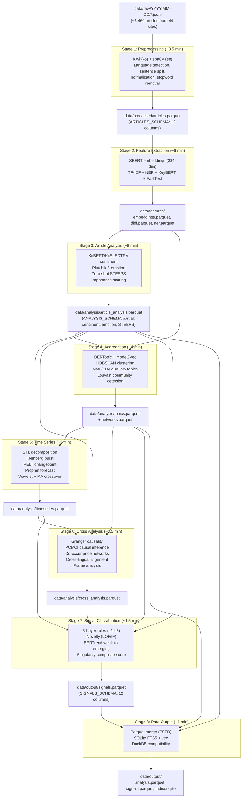

# Analysis Pipeline Detailed Design

**Step**: 7/20 -- Analysis Pipeline Detailed Design
**Agent**: @pipeline-designer
**Date**: 2026-02-26
**Inputs**: PRD SS5.2 (56 techniques, 8-Stage Pipeline, 5-Layer Signal, Korean NLP Stack), Step 5 Architecture Blueprint (contracts, schemas, memory), Step 2 Tech Validation (benchmarks, memory profiles)

---

## 1. Pipeline Overview

### 1.1 Architecture Summary

The analysis pipeline processes ~6,460 articles/day through 8 strictly sequential stages, producing Parquet + SQLite output. All processing runs locally on MacBook M2 Pro 16GB (PRD C1, C3) using only open-source Python libraries -- no Claude API calls.

[trace:step-5:architecture-decisions-summary] -- Staged Monolith; Python 3.12; sequential model loading; 10 GB memory budget
[trace:step-2:dependency-validation-summary] -- 34 GO / 5 CONDITIONAL / 3 NO-GO; Python 3.12 resolves all CONDITIONAL
[trace:step-2:nlp-benchmark-summary] -- 500 articles in 4.8 min (M4 Max); 9.6 min conservative on M2 Pro

### 1.2 Pipeline Flow Diagram



### 1.3 Performance Budget Summary

| Stage | Processing Time (1,000 articles) | Peak Memory | Model Loading |
|-------|----------------------------------|-------------|---------------|
| Stage 1: Preprocessing | ~3.5 min | ~1.0 GB | Kiwi (760 MB) + spaCy (200 MB) |
| Stage 2: Feature Extraction | ~6.0 min | ~2.4 GB | SBERT (1,100 MB) + NER (500 MB) + KeyBERT (20 MB) |
| Stage 3: Article Analysis | ~8.0 min | ~1.8 GB | KoBERT (500 MB) + BART-MNLI (500 MB) |
| Stage 4: Aggregation | ~4.0 min | ~1.5 GB | BERTopic (150 MB, shared SBERT) |
| Stage 5: Time Series | ~3.0 min | ~0.5 GB | Statistical libs only |
| Stage 6: Cross Analysis | ~3.5 min | ~0.8 GB | tigramite + networkx |
| Stage 7: Signal Classification | ~1.5 min | ~0.5 GB | scikit-learn (LOF/IF) |
| Stage 8: Data Output | ~1.0 min | ~0.5 GB | pyarrow + sqlite3 |
| **Total** | **~30 min** | **~2.4 GB peak** | Sequential load/unload |

**Target**: 30 min total for 1,000 articles (PRD SS9.2). Daily batch of ~6,460 articles estimated at ~45-50 min with linear scaling and I/O overhead.

[trace:step-2:memory-profile-summary] -- Peak 1.25 GB measured on M4 Max; 2.4 GB conservative for M2 Pro with all models loaded in heaviest stage.

---

## 2. Dual-Pass Analysis Strategy

[trace:step-5:data-flow-diagram] -- PRD SS5.2.3 K3: analysis must cover title + body.

### 2.1 Design Rationale

Per PRD SS5.2.3 and Key Criterion K3 ("title + body must both be analyzed"), the pipeline uses a **Dual-Pass** strategy where the title and body serve complementary roles:

| Pass | Target | Role | When Applied | Key Techniques |
|------|--------|------|-------------|----------------|
| **Pass 1: Title** | `article.title` | Signal detection (fast scan) | Stages 1-3, 5, 7 | Keyword frequency, burst detection, sentiment polarity, Z-score anomaly |
| **Pass 2: Body** | `article.body` | Evidence confirmation (deep analysis) | Stages 1-4, 6 | NER, topic modeling, frame analysis, causal inference |

> Title answers "WHAT is happening"; Body answers "WHY and HOW it is happening."

### 2.2 Implementation in Pipeline Stages

```python
# Dual-pass is NOT two separate pipeline runs.
# It is integrated within each stage's processing logic.

class DualPassProcessor:
    """Each article is processed with awareness of title vs. body.

    Stage 1: Both title and body are preprocessed independently.
             title_tokens and body_tokens are stored separately.
    Stage 2: Embeddings computed for both title and body.
             title_embedding (384-dim) used for fast clustering.
             body_embedding (384-dim) used for deep semantic analysis.
    Stage 3: Sentiment analyzed on both; title_sentiment used for
             rapid signal scanning, body_sentiment for confirmation.
    Stage 5: Title keywords drive burst detection (Kleinberg, Z-score).
    Stage 6: Body text drives frame analysis, causal inference.
    Stage 7: Title-based signals validated against body evidence.
    """
    pass
```

### 2.3 Paywall-Truncated Articles

For the 5 Extreme paywall sites (NYT, FT, WSJ, Bloomberg, Le Monde) where `is_paywall_truncated = True`:

- **Pass 1 (Title)**: Fully operational -- title always available
- **Pass 2 (Body)**: Gracefully degraded -- body is empty string; body-dependent analyses (topic modeling, frame analysis, NER) produce null/default values
- **importance_score**: Automatically penalized by -20 points for paywall-truncated articles (reduced evidence)

[trace:step-4:decisions] -- D4: Title-only for 5 Extreme paywall sites supports dual-pass analysis.

---

## 3. Stage Definitions

### 3.1 Stage 1: Preprocessing

**Module**: `src/analysis/stage_1_preprocessing.py`

#### Input

- **Source**: `data/raw/YYYY-MM-DD/{source_id}.jsonl` (RawArticle JSON objects from Crawling Layer)
- **Format**: JSON Lines, one `RawArticle` per line
- **Volume**: ~6,460 articles/day across 44 sites

[trace:step-5:raw-article-contract] -- RawArticle dataclass: url, title, body, source_id, language, published_at, crawled_at, content_hash, is_paywall_truncated

#### Processing Logic

```python
# Stage 1 Processing Pipeline
def process_stage_1(raw_articles: list[RawArticle]) -> pa.Table:
    """
    1. Language Detection
       - langdetect.detect(title + body[:200])
       - Verify against source_id expected language
       - Override if confidence > 0.9 and differs from expected

    2. Text Normalization
       - Unicode NFKC normalization (unicodedata.normalize('NFKC', text))
       - Whitespace cleanup (collapse multiple spaces/newlines)
       - EUC-KR / GB2312 / Shift_JIS charset handling for legacy sites
       - HTML entity decoding (if residual)

    3. Korean Text Processing (language == "ko")
       - Kiwi morphological analysis: kiwi.tokenize(text)
       - Extract nouns (NNG, NNP), verbs (VV), adjectives (VA)
       - Apply Korean stopword list (particles: 이/가/은/는/을/를/에/에서/으로 + news fillers)
       - Sentence splitting: kiwi.split_into_sents(text)

    4. English Text Processing (language == "en")
       - spaCy pipeline: nlp(text)
       - Lemmatization: [token.lemma_ for token in doc]
       - Stopword removal: spaCy default + custom news stopwords
       - Sentence splitting: [sent.text for sent in doc.sents]

    5. Other Languages (zh, ja, de, fr, es, ar, he)
       - Basic whitespace tokenization + Unicode normalization
       - Language-specific sentence splitting (regex-based)
       - No morphological analysis (lightweight pass-through)

    6. Generate article_id (UUID v4) and word_count
       - Korean word_count: number of Kiwi morphemes (NNG+NNP+VV+VA)
       - English word_count: whitespace-split count after stopword removal
       - Other: whitespace-split count

    7. Write data/processed/articles.parquet (ARTICLES_SCHEMA)
    """
```

#### Output

- **File**: `data/processed/articles.parquet`
- **Schema**: `ARTICLES_SCHEMA` (12 columns per PRD SS7.1.1)

| Column | Type | Source |
|--------|------|--------|
| `article_id` | utf8 | Generated UUID v4 |
| `url` | utf8 | RawArticle.url |
| `title` | utf8 | RawArticle.title (normalized) |
| `body` | utf8 | RawArticle.body (normalized, empty for paywall) |
| `source` | utf8 | RawArticle.source_name |
| `category` | utf8 | RawArticle.category or "uncategorized" |
| `language` | utf8 | Detected/verified language code |
| `published_at` | timestamp[us, tz=UTC] | RawArticle.published_at |
| `crawled_at` | timestamp[us, tz=UTC] | RawArticle.crawled_at |
| `author` | utf8 (nullable) | RawArticle.author |
| `word_count` | int32 | Computed from processed text |
| `content_hash` | utf8 | RawArticle.content_hash |

**Internal intermediate data** (kept in memory, not persisted):
- `title_tokens: list[str]` -- tokenized title
- `body_tokens: list[str]` -- tokenized body
- `sentences: list[str]` -- sentence-split text
- `pos_tags: list[tuple[str, str]]` -- POS tags (Korean: Kiwi tags; English: spaCy tags)

#### Techniques Mapped

| Technique ID | Technique | Implementation |
|-------------|-----------|----------------|
| T01 | Morphological Analysis (Korean) | `kiwipiepy.Kiwi.tokenize()` -- noun/verb/adjective extraction |
| T02 | Lemmatization (English) | `spaCy.en_core_web_sm` -- token.lemma_ |
| T03 | Sentence Splitting | Kiwi `split_into_sents()` (ko) / spaCy `doc.sents` (en) |
| T04 | Language Detection | `langdetect.detect()` with confidence threshold |
| T05 | Text Normalization | Unicode NFKC + whitespace cleanup + charset handling |
| T06 | Stopword Removal | Custom Korean stopword list + spaCy English defaults |

#### Memory Management

```
Load: Kiwi singleton (~760 MB) + spaCy en_core_web_sm (~200 MB)
Process: batch of articles
Unload: del spaCy model (Kiwi stays as singleton for later stages)
gc.collect()
Peak: ~1.0 GB
```

#### Performance Estimate

- **1,000 articles**: ~3.5 min (Kiwi batch: 0.25s; spaCy: ~2.5 min; I/O: ~0.75 min)
- **Bottleneck**: spaCy English processing (sequential per article)

#### Error Handling

- **Empty title**: Skip article, log to `data/logs/errors.log` (severity: ERROR)
- **Language detection failure**: Default to source_id expected language, log (severity: WARN)
- **Kiwi tokenization error**: Fall back to whitespace tokenization, log (severity: WARN)
- **Charset decoding error**: Attempt common encodings (UTF-8 -> EUC-KR -> Latin-1), log (severity: WARN)

---

### 3.2 Stage 2: Feature Extraction

**Module**: `src/analysis/stage_2_features.py`

#### Input

- **Source**: `data/processed/articles.parquet` (ARTICLES_SCHEMA)
- **Additional in-memory**: title_tokens, body_tokens from Stage 1 (or re-tokenize from Parquet)

#### Processing Logic

```python
def process_stage_2(articles: pa.Table) -> dict[str, pa.Table]:
    """
    1. SBERT Embeddings
       - Model: paraphrase-multilingual-MiniLM-L12-v2 (384 dimensions)
       - Korean alternative: snowflake-arctic-embed-l-v2.0-ko (higher quality)
       - Batch encode: model.encode(texts, batch_size=64, show_progress_bar=True)
       - Compute BOTH title_embedding and body_embedding
       - Store combined embedding (body_embedding if body present; title_embedding if paywall)
       - Output: data/features/embeddings.parquet

    2. TF-IDF Vectors
       - sklearn.feature_extraction.text.TfidfVectorizer
       - Parameters: max_features=10000, ngram_range=(1,2), min_df=2
       - Separate TF-IDF models for Korean and English articles
       - Extract top 20 terms per article
       - Output: data/features/tfidf.parquet

    3. Named Entity Recognition (NER)
       - Korean: KLUE-RoBERTa-large NER pipeline (transformers)
         Entities: PERSON, ORGANIZATION, LOCATION, DATE, EVENT
       - English: spaCy NER pipeline (en_core_web_sm)
         Entities: PERSON, ORG, GPE, LOC, EVENT
       - Batch processing: process in chunks of 32 articles
       - Output: data/features/ner.parquet

    4. KeyBERT Keyword Extraction
       - Model: KeyBERT initialized with pre-loaded SBERT model (shared)
       - kw_model.extract_keywords(doc, keyphrase_ngram_range=(1,2), top_n=10)
       - Uses MMR for diversity (diversity=0.5)
       - Output: keywords column in embeddings.parquet

    5. FastText Word Vectors
       - fasttext-wheel: load pre-trained vectors per language
       - Korean: cc.ko.300.bin (or skip if memory-constrained)
       - English: cc.en.300.bin
       - Used for: word-level similarity, vocabulary coverage analysis
       - Output: not persisted separately (used in-memory for Stage 4, 6)
    """
```

#### Output

Three Parquet files:

**data/features/embeddings.parquet**:

| Column | Type | Description |
|--------|------|-------------|
| `article_id` | utf8 | FK -> articles |
| `embedding` | list\<float32\> | 384-dim SBERT vector |
| `title_embedding` | list\<float32\> | 384-dim title-only embedding |
| `keywords` | list\<utf8\> | KeyBERT top-10 keywords |

**data/features/tfidf.parquet**:

| Column | Type | Description |
|--------|------|-------------|
| `article_id` | utf8 | FK -> articles |
| `tfidf_top_terms` | list\<utf8\> | Top 20 TF-IDF terms |
| `tfidf_scores` | list\<float32\> | Corresponding TF-IDF scores |

**data/features/ner.parquet**:

| Column | Type | Description |
|--------|------|-------------|
| `article_id` | utf8 | FK -> articles |
| `entities_person` | list\<utf8\> | Person entity names |
| `entities_org` | list\<utf8\> | Organization entity names |
| `entities_location` | list\<utf8\> | Location entity names |

#### Techniques Mapped

| Technique ID | Technique | Implementation |
|-------------|-----------|----------------|
| T07 | SBERT Embeddings | `sentence-transformers` paraphrase-multilingual-MiniLM-L12-v2 (384-dim) |
| T08 | TF-IDF | `sklearn.TfidfVectorizer` (unigrams + bigrams, max_features=10000) |
| T09 | Named Entity Recognition | Korean: KLUE-RoBERTa-large; English: spaCy NER |
| T10 | KeyBERT Keyword Extraction | `keybert.KeyBERT` with shared SBERT model, MMR diversity |
| T11 | FastText Word Vectors | `fasttext-wheel` pre-trained language-specific vectors |
| T12 | Word Count / Statistics | Basic corpus statistics (document length, vocabulary richness) |

#### Memory Management

```
Load: SBERT paraphrase-multilingual-MiniLM-L12-v2 (~1,100 MB)
Load: KeyBERT (shares SBERT, +20 MB)
Load: NER transformers (Davlan/xlm-roberta-base-ner-hrl, ~500 MB)
Process: batch embeddings -> TF-IDF -> NER -> KeyBERT
Note: FastText vectors loaded only if memory allows (optional, ~300 MB per language)
Peak: ~2.4 GB (SBERT + NER + processing overhead)
Unload: del NER model, del KeyBERT (SBERT stays for Stage 4)
gc.collect()
```

[trace:step-2:memory-profile-summary] -- SBERT 1,059 MB + KeyBERT 20 MB shared = 1,079 MB; NER ~500 MB additional.

#### Performance Estimate

- **1,000 articles**: ~6.0 min
  - SBERT encoding: ~1.5 min (batch=64, ~2,500 texts/s on M2 Pro)
  - TF-IDF vectorization: ~0.3 min
  - NER processing: ~3.0 min (transformer inference, ~5.5 articles/s)
  - KeyBERT extraction: ~1.0 min (~16 articles/s)
  - Parquet I/O: ~0.2 min

#### Error Handling

- **SBERT encoding failure**: Log error, use zero-vector (384-dim zeros) for article
- **NER timeout** (>30s per article): Skip NER for that article, populate empty entity lists
- **KeyBERT failure**: Fall back to TF-IDF top terms as keywords
- **FastText model unavailable**: Skip FastText features entirely (non-critical)

---

### 3.3 Stage 3: Per-Article Analysis

**Module**: `src/analysis/stage_3_article.py`

#### Input

- **Source**: `data/processed/articles.parquet` + `data/features/*.parquet`

#### Processing Logic

```python
def process_stage_3(articles: pa.Table, features: dict) -> pa.Table:
    """
    1. Sentiment Analysis
       - Korean: KoBERT fine-tuned for news domain (F1=94%)
         Model: monologg/kobert (or skt/kobert-base-v1)
         Output: sentiment_label (positive/negative/neutral), sentiment_score (-1 to 1)
       - English: cardiffnlp/twitter-roberta-base-sentiment-latest (or similar)
         Output: same format as Korean
       - Dual-Pass: Compute BOTH title_sentiment and body_sentiment
         Final sentiment = body_sentiment if body available, else title_sentiment

    2. 8-Dimension Emotion Classification (Plutchik Wheel)
       - Model: Zero-shot classification with facebook/bart-large-mnli
       - Labels: ["joy", "trust", "fear", "surprise", "sadness",
                  "disgust", "anger", "anticipation"]
       - candidate_labels applied to body text (or title if paywall)
       - Output: 8 float scores (0-1), one per Plutchik dimension
       - Korean: Apply KcELECTRA-based emotion classifier as primary,
         BART-MNLI as fallback

    3. Zero-Shot STEEPS Classification
       - Model: facebook/bart-large-mnli (shared with emotion)
       - Candidate labels: ["Social issue", "Technology development",
         "Economic trend", "Environmental concern",
         "Political event", "Security threat"]
       - Map highest-probability label to STEEPS code: S/T/E/En/P/Se
       - Apply to body text; title used for paywall-truncated articles

    4. Stance Detection
       - Model: Zero-shot with BART-MNLI
       - Detect article stance toward key entities/topics
       - Labels: ["supportive", "critical", "neutral", "mixed"]
       - Output: per-entity stance scores (used in Stage 6 frame analysis)

    5. Social Mood Index
       - Aggregate sentiment + emotion across articles per source per day
       - mood_index = weighted_avg(sentiment_scores) * (1 - entropy(emotions))
       - Output: per-source daily mood score (used in Stage 5 time series)

    6. Emotion Trajectory
       - Track emotion distribution changes over rolling 7-day windows
       - Compute per-emotion delta: emotion_t - emotion_{t-7}
       - Significant shifts flagged for Stage 7 signal detection
       - Output: delta vectors stored for time series analysis

    7. Importance Score
       - Composite score (0-100) combining:
         a. Source authority weight (based on site tier from sources.yaml)
         b. Entity density (NER count / word_count)
         c. Cross-source coverage (same topic in multiple sources)
         d. Recency (exponential decay from published_at)
         e. Sentiment extremity (|sentiment_score| contribution)
       - Paywall penalty: -20 for is_paywall_truncated articles
       - Formula:
         importance = 0.25*authority + 0.20*entity_density + 0.25*coverage
                    + 0.15*recency + 0.15*extremity + paywall_adjustment

    8. Narrative Extraction (T49)
       - Zero-shot classification of narrative roles in article text
       - Candidate labels: ["protagonist", "antagonist", "context_setter",
         "victim", "authority", "disruptor"]
       - Applied to body text (or title if paywall-truncated)
       - Identify which entities play which narrative roles
       - Output: per-entity narrative role assignments (used in Stage 6/7)

    9. Write data/analysis/article_analysis.parquet
    """
```

#### Output

- **File**: `data/analysis/article_analysis.parquet`
- **Schema**: Partial ANALYSIS_SCHEMA (sentiment + emotion + STEEPS + importance)

| Column | Type | Description |
|--------|------|-------------|
| `article_id` | utf8 | FK -> articles |
| `sentiment_label` | utf8 | "positive" / "negative" / "neutral" |
| `sentiment_score` | float32 | -1.0 to 1.0 |
| `emotion_joy` | float32 | Plutchik joy (0-1) |
| `emotion_trust` | float32 | Plutchik trust (0-1) |
| `emotion_fear` | float32 | Plutchik fear (0-1) |
| `emotion_surprise` | float32 | Plutchik surprise (0-1) |
| `emotion_sadness` | float32 | Plutchik sadness (0-1) |
| `emotion_disgust` | float32 | Plutchik disgust (0-1) |
| `emotion_anger` | float32 | Plutchik anger (0-1) |
| `emotion_anticipation` | float32 | Plutchik anticipation (0-1) |
| `steeps_category` | utf8 | "S"/"T"/"E"/"En"/"P"/"Se" |
| `importance_score` | float32 | 0-100 |

#### Techniques Mapped

| Technique ID | Technique | Implementation |
|-------------|-----------|----------------|
| T13 | Sentiment Analysis (Korean) | KoBERT (monologg/kobert) news domain F1=94% |
| T14 | Sentiment Analysis (English) | cardiffnlp/twitter-roberta-base-sentiment-latest |
| T15 | 8-Dimension Emotion (Plutchik) | Zero-shot BART-MNLI + KcELECTRA fallback |
| T16 | Zero-Shot STEEPS Classification | facebook/bart-large-mnli with 6 candidate labels |
| T17 | Stance Detection | Zero-shot BART-MNLI (supportive/critical/neutral/mixed) |
| T18 | Social Mood Index | Aggregated sentiment + emotion entropy per source per day |
| T19 | Emotion Trajectory | Rolling 7-day emotion delta tracking |
| T49 | Narrative Extraction | Zero-shot BART-MNLI for narrative role classification (protagonist/antagonist/context) |
| -- | Importance Scoring (pipeline computation) | Composite: authority + entity density + coverage + recency + extremity |

#### Memory Management

```
Unload: Stage 2 NER model (SBERT kept for Stage 4)
Load: KoBERT/KcELECTRA sentiment (~500 MB)
Load: facebook/bart-large-mnli (~500 MB, shared for emotion + STEEPS + stance)
Process: sentiment -> emotion -> STEEPS -> stance -> mood -> trajectory -> importance
Peak: ~1.8 GB (SBERT 1,100 MB base retained + sentiment 500 MB + processing overhead)
Note: BART-MNLI replaces NER model in memory
Unload: del sentiment model, del BART-MNLI
gc.collect()
```

#### Performance Estimate

- **1,000 articles**: ~8.0 min
  - Sentiment analysis: ~3.0 min (~5.5 articles/s with transformer)
  - Emotion classification: ~2.5 min (zero-shot, 8 labels)
  - STEEPS classification: ~1.5 min (zero-shot, 6 labels, can reuse cached logits)
  - Stance + mood + trajectory + importance: ~0.5 min (lightweight aggregation)
  - Parquet I/O: ~0.5 min

#### Error Handling

- **Sentiment model loading failure**: Fall back to rule-based lexicon (VADER for English, custom for Korean)
- **Zero-shot timeout**: Default to most common STEEPS category for that source
- **Emotion scores all near zero**: Flag as "neutral/flat emotion", set all to 0.125 (uniform)
- **NaN in importance_score**: Clamp to 0, log warning

---

### 3.4 Stage 4: Aggregation

**Module**: `src/analysis/stage_4_aggregation.py`

#### Input

- **Source**: `data/processed/articles.parquet` + `data/features/embeddings.parquet` + `data/analysis/article_analysis.parquet`
- **Minimum**: 50 articles required for topic modeling (skip stage if fewer)

#### Processing Logic

```python
def process_stage_4(articles: pa.Table, embeddings: pa.Table,
                    analysis: pa.Table) -> tuple[pa.Table, pa.Table]:
    """
    1. BERTopic Topic Modeling
       - Model: BERTopic(embedding_model=shared_sbert_model, verbose=False)
       - Representation: Model2Vec for CPU 500x speedup (PRD §5.2.5)
       - Configuration:
         nr_topics="auto"  # Let HDBSCAN determine
         min_topic_size=5
         calculate_probabilities=True
       - Fit on body embeddings (or title embeddings for paywall articles)
       - Output: topic_id, topic_label, topic_probability per article

    2. Dynamic Topic Modeling (DTM)
       - BERTopic.topics_over_time(docs, timestamps)
       - Track topic evolution across daily windows
       - Identify growing, shrinking, and emerging topics
       - Output: topic_id -> [{date, frequency, representation}]

    3. HDBSCAN Clustering
       - Applied directly on SBERT embeddings as secondary clustering
       - hdbscan.HDBSCAN(min_cluster_size=10, min_samples=5, metric='cosine')
       - Produces cluster_id per article (independent of BERTopic topics)
       - Useful for cross-validation of topic assignments

    4. NMF/LDA Auxiliary Topics
       - NMF: sklearn.decomposition.NMF(n_components=20) on TF-IDF matrix
       - LDA: sklearn.decomposition.LatentDirichletAllocation(n_components=20)
         (or gensim.models.LdaMulticore for speed)
       - Provides interpretable topic labels as backup/comparison to BERTopic
       - Output: auxiliary topic assignments (used for ensemble confidence)

    5. k-means Clustering
       - sklearn.cluster.KMeans(n_clusters=k) on SBERT embeddings
       - k determined by silhouette score optimization (k in range 5-50)
       - Provides flat clustering as alternative to hierarchical HDBSCAN

    6. Hierarchical Clustering
       - scipy.cluster.hierarchy.linkage(embeddings, method='ward')
       - Dendrogram cut at optimal distance (silhouette-based)
       - Captures nested topic structure (macro-topics -> sub-topics)

    7. Community Detection (Louvain)
       - Build entity co-occurrence graph from NER results
       - networkx graph with entity nodes, co-occurrence edges
       - python-louvain community detection for entity grouping
       - Output: community_id per entity, stored in networks.parquet

    8. Write data/analysis/topics.parquet + networks.parquet
    """
```

#### Output

**data/analysis/topics.parquet**:

| Column | Type | Description |
|--------|------|-------------|
| `article_id` | utf8 | FK -> articles |
| `topic_id` | int32 | BERTopic topic ID (-1 = outlier) |
| `topic_label` | utf8 | Human-readable topic label |
| `topic_probability` | float32 | Topic assignment probability (0-1) |
| `hdbscan_cluster_id` | int32 | Independent HDBSCAN cluster ID |
| `nmf_topic_id` | int32 | NMF auxiliary topic ID |
| `lda_topic_id` | int32 | LDA auxiliary topic ID |

**data/analysis/networks.parquet**:

| Column | Type | Description |
|--------|------|-------------|
| `entity_a` | utf8 | First entity in co-occurrence pair |
| `entity_b` | utf8 | Second entity in co-occurrence pair |
| `co_occurrence_count` | int32 | Number of articles where both appear |
| `community_id` | int32 | Louvain community assignment |
| `source_articles` | list\<utf8\> | Article IDs containing this pair |

#### Techniques Mapped

| Technique ID | Technique | Implementation |
|-------------|-----------|----------------|
| T21 | BERTopic Topic Modeling | `bertopic.BERTopic` + Model2Vec (CPU 500x speedup) |
| T22 | Dynamic Topic Modeling (DTM) | `BERTopic.topics_over_time()` -- temporal topic evolution |
| T23 | HDBSCAN Clustering | `hdbscan.HDBSCAN` on SBERT embeddings (cosine metric) |
| T24 | NMF Topic Modeling | `sklearn.decomposition.NMF` on TF-IDF matrix |
| T25 | LDA Topic Modeling | `gensim.models.LdaMulticore` or `sklearn.LatentDirichletAllocation` |
| T26 | k-means Clustering | `sklearn.cluster.KMeans` with silhouette-optimized k |
| T27 | Hierarchical Clustering | `scipy.cluster.hierarchy.linkage` (Ward method) |
| T28 | Community Detection (Louvain) | `python-louvain` on entity co-occurrence graph |

#### Memory Management

```
SBERT model still in memory from Stage 2 (~1,100 MB)
Load: BERTopic (shares SBERT, +150 MB peak) -- Step 2 R5
Load: HDBSCAN, sklearn, gensim LDA (~200 MB combined)
Process: BERTopic fit -> DTM -> HDBSCAN -> NMF/LDA -> k-means -> hierarchical -> Louvain
Peak: ~1.5 GB
Unload: del BERTopic, del SBERT, del all clustering models
gc.collect() -- releases sklearn/gensim memory; torch memory pool may persist
```

[trace:step-2:nlp-benchmark-summary] -- BERTopic 23.5 docs/s on M4 Max; conservative ~12 docs/s on M2 Pro.

#### Performance Estimate

- **1,000 articles**: ~4.0 min
  - BERTopic fit + transform: ~1.5 min (~12 docs/s)
  - DTM computation: ~0.5 min
  - HDBSCAN clustering: ~0.3 min
  - NMF/LDA: ~0.5 min
  - k-means + hierarchical: ~0.3 min
  - Louvain community detection: ~0.2 min
  - Parquet I/O: ~0.7 min

#### Error Handling

- **BERTopic fit failure** (< min_topic_size articles): Skip topic modeling, assign all to topic_id=-1
- **HDBSCAN all noise**: Reduce min_cluster_size to 5, retry; if still all noise, fall back to k-means
- **LDA/NMF convergence failure**: Increase max_iter to 500; if still fails, skip auxiliary topics
- **Louvain on disconnected graph**: Run per connected component; isolated nodes get community_id=-1

---

### 3.5 Stage 5: Time Series Analysis

**Module**: `src/analysis/stage_5_timeseries.py`

#### Input

- **Source**: `data/analysis/topics.parquet` + `data/analysis/article_analysis.parquet` + `data/processed/articles.parquet`
- **Minimum data**: 7 days for L1 analysis; 30 days for L2; 6 months for L3+; uses all available historical data
- **Aggregation**: Articles aggregated into daily time series per topic and per entity

#### Processing Logic

```python
def process_stage_5(topics: pa.Table, analysis: pa.Table,
                    articles: pa.Table, historical: pa.Table | None) -> pa.Table:
    """
    1. Time Series Construction
       - Aggregate daily: topic_id -> article_count per day
       - Aggregate daily: sentiment_score -> mean per day per topic
       - Aggregate daily: emotion dimensions -> mean per day
       - Aggregate daily: entity mention frequency per day
       - Output: multiple time series arrays indexed by date

    2. STL Decomposition
       - statsmodels.tsa.seasonal.STL(endog, period=7)
       - Decompose each topic frequency series into:
         trend, seasonal (weekly), residual
       - Alert if residual > 2 std from mean (anomaly)

    3. Kleinberg Burst Detection
       - Custom implementation of Kleinberg's automaton model
       - Input: daily article counts per topic
       - Parameters: s=2.0 (base transition cost), gamma=1.0
       - Output: burst_intervals with start_date, end_date, burst_level
       - burst_score = burst_level * duration * volume

    4. PELT Changepoint Detection
       - ruptures.Pelt(model="rbf", min_size=3, jump=1)
       - Applied to: topic frequency, sentiment means, emotion means
       - penalty = log(n) * dimension (BIC penalty)
       - Output: changepoint_dates with significance scores
       - significance = 1 - p_value (permutation test, 100 iterations)

    5. Prophet Forecast
       - prophet.Prophet(yearly_seasonality=False, weekly_seasonality=True,
                         daily_seasonality=False)
       - Forecast horizon: 7 days (short) and 30 days (medium)
       - Applied to: top-20 topics by volume + aggregate total volume
       - Output: predicted_values, yhat_lower, yhat_upper per date
       - Anomaly: actual > yhat_upper or actual < yhat_lower

    6. Wavelet Analysis
       - pywt.wavedec(signal, 'db4', level=4)
       - Multi-scale decomposition: 1-day, 3-day, 7-day, 14-day, 28-day cycles
       - Identify dominant periodicities per topic
       - Output: wavelet_coefficients, dominant_period per topic

    7. ARIMA Modeling
       - statsmodels.tsa.arima.model.ARIMA(order=(p,d,q))
       - Auto-order selection: pmdarima.auto_arima (if installed) or grid search
       - Applied to aggregate article volume as complementary forecast to Prophet
       - Output: arima_forecast, residuals, aic

    8. Moving Average Crossover
       - Short MA: 3-day rolling mean
       - Long MA: 14-day rolling mean
       - Signal: short_ma crosses above long_ma -> "rising"
       - Signal: short_ma crosses below long_ma -> "declining"
       - Applied to: topic frequency, sentiment, entity frequency

    9. Seasonality Detection
       - scipy.signal.periodogram(signal)
       - Identify significant periodic components (p < 0.05)
       - Common patterns: weekly (7-day), monthly (30-day)
       - Output: detected_periods with strength scores

    10. Write data/analysis/timeseries.parquet
    """
```

#### Output

**data/analysis/timeseries.parquet**:

| Column | Type | Description |
|--------|------|-------------|
| `series_id` | utf8 | Unique time series identifier (topic_id + metric_type) |
| `topic_id` | int32 | Related topic (-1 for aggregate) |
| `metric_type` | utf8 | "volume" / "sentiment" / "emotion_*" / "entity_*" |
| `date` | timestamp[us, tz=UTC] | Date of measurement |
| `value` | float32 | Measured value |
| `trend` | float32 (nullable) | STL trend component |
| `seasonal` | float32 (nullable) | STL seasonal component |
| `residual` | float32 (nullable) | STL residual component |
| `burst_score` | float32 (nullable) | Kleinberg burst score |
| `is_changepoint` | bool | PELT detected changepoint |
| `changepoint_significance` | float32 (nullable) | 1 - p_value of changepoint |
| `prophet_forecast` | float32 (nullable) | Prophet predicted value |
| `prophet_lower` | float32 (nullable) | Prophet lower bound |
| `prophet_upper` | float32 (nullable) | Prophet upper bound |
| `ma_short` | float32 (nullable) | 3-day moving average |
| `ma_long` | float32 (nullable) | 14-day moving average |
| `ma_signal` | utf8 (nullable) | "rising" / "declining" / "neutral" |

#### Techniques Mapped

| Technique ID | Technique | Implementation |
|-------------|-----------|----------------|
| T29 | STL Decomposition | `statsmodels.tsa.seasonal.STL` (period=7, weekly) |
| T30 | Kleinberg Burst Detection | Custom automaton model implementation |
| T31 | PELT Changepoint Detection | `ruptures.Pelt` (RBF kernel, BIC penalty) |
| T32 | Prophet Forecast | `prophet.Prophet` (7-day and 30-day horizons) |
| T33 | Wavelet Analysis | `pywt.wavedec` (Daubechies-4, 4 levels) |
| T34 | ARIMA Modeling | `statsmodels.tsa.arima.model.ARIMA` with auto-order |
| T35 | Moving Average Crossover | Rolling mean 3-day vs. 14-day; crossover signals |
| T36 | Seasonality Detection | `scipy.signal.periodogram` for periodic components |

#### Memory Management

```
Unload: ALL heavy ML models from Stages 2-4 (SBERT, BERTopic, etc.)
Delete model references + gc.collect()
Load: prophet (~50 MB), ruptures (~20 MB), statsmodels (~30 MB), pywt (~10 MB)
Process: STL -> burst -> PELT -> Prophet -> wavelet -> ARIMA -> MA -> seasonality
Peak: ~0.5 GB (statistical libs are lightweight)
Unload: del prophet model (it re-loads per fit call, but baseline is small)
gc.collect()
```

#### Performance Estimate

- **1,000 articles (aggregated to ~20-50 time series)**: ~3.0 min
  - Time series construction: ~0.3 min
  - STL decomposition (50 series): ~0.2 min
  - Kleinberg burst (50 series): ~0.3 min
  - PELT changepoint (50 series): ~0.3 min
  - Prophet forecast (20 series): ~1.0 min (Prophet is slow per series)
  - Wavelet + ARIMA: ~0.5 min
  - MA crossover + seasonality: ~0.1 min
  - Parquet I/O: ~0.3 min

#### Error Handling

- **Insufficient data for STL** (< 14 days): Skip STL, compute simple trend via linear regression
- **Prophet fit failure**: Fall back to ARIMA forecast; if ARIMA also fails, skip forecast
- **PELT no changepoints**: Return empty changepoint list (valid result: no structural changes)
- **Wavelet decomposition error** (signal too short): Skip wavelet, use periodogram only

---

### 3.6 Stage 6: Cross Analysis

**Module**: `src/analysis/stage_6_cross.py`

#### Input

- **Source**: `data/analysis/timeseries.parquet` + `data/analysis/topics.parquet` + `data/analysis/article_analysis.parquet` + `data/analysis/networks.parquet` + `data/features/embeddings.parquet`
- **Minimum**: 100 articles for Granger test; 30 days for meaningful cross-analysis

#### Processing Logic

```python
def process_stage_6(timeseries: pa.Table, topics: pa.Table,
                    analysis: pa.Table, networks: pa.Table,
                    embeddings: pa.Table) -> pa.Table:
    """
    1. Granger Causality Testing
       - statsmodels.tsa.stattools.grangercausalitytests
       - Test pairwise: topic_i frequency -> topic_j frequency
       - Max lag: 7 days
       - Significance threshold: p < 0.05
       - Output: topic_pairs with p_values, optimal_lag, direction
       - Interpretation: topic A coverage predicts topic B coverage

    2. PCMCI Causal Inference
       - tigramite.PCMCI with ParCorr independence test
       - Multivariate: model relationships among top-20 topic time series
       - tau_max = 7 (maximum lag of 7 days)
       - pc_alpha = 0.05 (significance level for conditional independence)
       - Output: causal graph (adjacency matrix with lag, direction, strength)
       - Advantages over Granger: controls for confounders, non-linear

    3. Co-occurrence Network Analysis
       - Entity-Entity co-occurrence: entities appearing in same article
       - Topic-Topic co-occurrence: topics assigned to overlapping article sets
       - Build weighted graph: edge_weight = co-occurrence_count / total_articles
       - Centrality analysis:
         a. Degree centrality (most connected entities)
         b. Betweenness centrality (bridging entities)
         c. PageRank (influence score)
       - Network evolution: compare graph structure across weekly snapshots

    4. Knowledge Graph Construction
       - Nodes: entities (PERSON, ORG, LOCATION) from NER
       - Edges: co-occurrence with relation type inference
       - Relation types: "mentioned_with", "works_at", "located_in" (heuristic)
       - Store as edge list in networks.parquet (extended)

    5. Cross-Lingual Topic Alignment
       - Use SBERT multilingual embeddings for Korean and English articles
       - Compute topic centroid embeddings per language
       - Align topics: cosine_similarity(ko_topic_centroid, en_topic_centroid)
       - Match threshold: similarity > 0.5
       - Output: aligned_topic_pairs with similarity scores

    6. Frame Analysis
       - Compare coverage framing of same topic across different sources
       - Dimensions: economic, security, human_interest, political, scientific
       - Method: TF-IDF over topic-filtered articles, per source
         Compare term distributions (KL divergence between sources)
       - Output: frame_divergence scores per topic per source pair

    7. Agenda Setting Analysis
       - Measure topic coverage volume lag between elite sources and others
       - Cross-correlation of topic frequency time series across source groups
       - Identify "agenda setters": sources whose coverage predicts later coverage
       - Output: source_influence_scores, topic_lag_pairs

    8. Temporal Alignment
       - Align topic timelines across countries/languages
       - DTW (Dynamic Time Warping) on topic frequency series
       - Identify topics that emerge in one region before another
       - Output: cross_region_lag_pairs with DTW distance

    9. GraphRAG Knowledge Retrieval (T20)
       - Build entity-topic knowledge graph from NER + topic assignments
       - Use SBERT embeddings for graph node representations
       - Graph-based retrieval: for a query topic, traverse knowledge graph
         to find related entities, topics, and evidence articles
       - Output: enriched evidence chains for Stage 7 signal classification

    10. Contradiction Detection (T50)
       - For articles covering the same topic from different sources:
         Compare claim-level assertions using NLI entailment scoring
       - SBERT cosine similarity to identify article pairs on same topic
       - BART-MNLI entailment: classify pairs as entailment/contradiction/neutral
       - Output: contradiction_pairs with confidence scores
       - Used in Stage 7 for signal evidence quality assessment

    11. Write data/analysis/cross_analysis.parquet
    """
```

#### Output

**data/analysis/cross_analysis.parquet**:

| Column | Type | Description |
|--------|------|-------------|
| `analysis_type` | utf8 | "granger" / "pcmci" / "cross_lingual" / "frame" / "agenda" / "temporal" / "graphrag" / "contradiction" |
| `source_entity` | utf8 | Source topic/entity/source ID |
| `target_entity` | utf8 | Target topic/entity/source ID |
| `relationship` | utf8 | Relationship description |
| `strength` | float32 | Relationship strength (0-1) |
| `p_value` | float32 (nullable) | Statistical significance |
| `lag_days` | int32 (nullable) | Temporal lag in days |
| `evidence_articles` | list\<utf8\> | Supporting article IDs |
| `metadata` | utf8 | JSON string with analysis-specific details |

#### Techniques Mapped

| Technique ID | Technique | Implementation |
|-------------|-----------|----------------|
| T37 | Granger Causality | `statsmodels.tsa.stattools.grangercausalitytests` (max lag=7) |
| T38 | PCMCI Causal Inference | `tigramite.PCMCI` with ParCorr (tau_max=7, alpha=0.05) |
| T39 | Co-occurrence Network | `networkx` weighted graph + centrality metrics |
| T40 | Knowledge Graph | Edge list from NER co-occurrence + relation type heuristics |
| T41 | Centrality Analysis | `networkx.degree_centrality`, `betweenness_centrality`, `pagerank` |
| T42 | Network Evolution | Weekly graph snapshots; compare degree distribution, density, modularity |
| T43 | Cross-Lingual Topic Alignment | SBERT multilingual centroid cosine similarity (threshold > 0.5) |
| T44 | Frame Analysis | KL divergence of TF-IDF distributions per source per topic |
| T45 | Agenda Setting Analysis | Cross-correlation of topic frequency across source groups |
| T46 | Temporal Alignment | DTW (Dynamic Time Warping) on cross-region topic series |
| T20 | GraphRAG Knowledge Retrieval | `networkx` graph + SBERT embeddings for graph-based retrieval-augmented analysis |
| T50 | Contradiction Detection | SBERT cosine similarity + NLI entailment scoring for conflicting claims across sources |

#### Memory Management

```
Load: tigramite (~100 MB), networkx + igraph (~50 MB)
Load: scipy (~already loaded from Stage 5)
Process: Granger -> PCMCI -> co-occurrence -> knowledge graph -> cross-lingual
         -> frame -> agenda -> temporal alignment
Peak: ~0.8 GB
Unload: del tigramite, del network objects
gc.collect()
```

#### Performance Estimate

- **1,000 articles**: ~3.5 min
  - Granger tests (top-20 topic pairs): ~0.5 min
  - PCMCI (20 variables, tau_max=7): ~1.0 min
  - Co-occurrence network build + centrality: ~0.5 min
  - Knowledge graph construction: ~0.3 min
  - Cross-lingual alignment: ~0.3 min (cosine on cached embeddings)
  - Frame analysis (KL divergence): ~0.3 min
  - Agenda setting + temporal alignment: ~0.3 min
  - Parquet I/O: ~0.3 min

#### Error Handling

- **Granger test non-stationary data**: Apply ADF test first; difference if non-stationary; skip if still non-stationary
- **PCMCI convergence failure**: Reduce tau_max to 3; if still fails, skip PCMCI, rely on Granger
- **Cross-lingual no matches**: Lower threshold to 0.3; if still no matches, log "languages divergent"
- **Network too sparse** (< 10 edges): Skip centrality analysis, report as "insufficient network data"

---

### 3.7 Stage 7: Signal Classification (5-Layer)

**Module**: `src/analysis/stage_7_signals.py`

#### Input

- **Source**: All prior stage outputs: `data/analysis/cross_analysis.parquet` + `data/analysis/timeseries.parquet` + `data/analysis/topics.parquet` + `data/analysis/article_analysis.parquet` + `data/features/embeddings.parquet` + `data/analysis/networks.parquet`

#### Processing Logic

```python
def process_stage_7(cross_analysis: pa.Table, timeseries: pa.Table,
                    topics: pa.Table, analysis: pa.Table,
                    embeddings: pa.Table, networks: pa.Table) -> pa.Table:
    """
    1. Rule-Based 5-Layer Classification
       - See Section 4 (5-Layer Signal Hierarchy) for detailed rules
       - Each topic evaluated against layer criteria from L5 (most significant) down to L1
       - First matching layer wins (L5 > L4 > L3 > L2 > L1)

    2. Novelty Detection (OOD)
       - LOF: sklearn.neighbors.LocalOutlierFactor(n_neighbors=20, contamination=0.05)
       - Isolation Forest: sklearn.ensemble.IsolationForest(contamination=0.05)
       - Applied to: SBERT embeddings of recent articles (last 7 days)
       - Ensemble: novelty_score = 0.5 * lof_score + 0.5 * if_score
       - Threshold: novelty_score > 0.7 -> flag as OOD candidate

    3. BERTrend Weak Signal Detection
       - Track topic lifecycle: noise -> weak -> emerging -> strong -> declining
       - Transition rules:
         noise -> weak: topic first appears with < 5 articles/day
         weak -> emerging: volume doubles within 7 days AND appears in 2+ sources
         emerging -> strong: sustains > 20 articles/day for 14+ days
         strong -> declining: volume drops > 50% from peak over 14 days
       - Signal: weak -> emerging transition triggers L5 singularity candidate check

    4. Singularity Composite Score (L5 only)
       - See Section 5 (Singularity Composite Score) for full formula
       - Compute 7 indicators for each L5 candidate
       - Threshold: S_singularity >= 0.65 -> confirm as singularity signal

    5. Confidence Scoring
       - Per-signal confidence based on evidence diversity:
         evidence_sources = count of distinct news sources supporting signal
         evidence_languages = count of distinct languages
         evidence_duration = days since first detection
         evidence_techniques = count of techniques that agree on signal
       - confidence = min(1.0,
           0.25 * (evidence_sources / 10) +
           0.25 * (evidence_languages / 3) +
           0.25 * min(evidence_duration / 30, 1.0) +
           0.25 * (evidence_techniques / 5)
         )

    6. Evidence Summary Generation
       - For each signal, compile textual summary:
         "Detected {layer} signal '{label}' based on: {technique_list}.
          {source_count} sources, {article_count} articles over {duration} days.
          Key entities: {top_entities}. Confidence: {confidence:.2f}"

    7. Signal Deduplication
       - Merge overlapping signals (same topic, same layer, overlapping time window)
       - Keep signal with higher confidence
       - Update article_ids to union of both signals

    8. Write data/output/signals.parquet (SIGNALS_SCHEMA)
    """
```

#### Output

- **File**: `data/output/signals.parquet`
- **Schema**: `SIGNALS_SCHEMA` (12 columns per PRD SS7.1.3)

| Column | Type | Description |
|--------|------|-------------|
| `signal_id` | utf8 | UUID v4 |
| `signal_layer` | utf8 | "L1_fad" / "L2_short" / "L3_mid" / "L4_long" / "L5_singularity" |
| `signal_label` | utf8 | Human-readable signal description |
| `detected_at` | timestamp[us, tz=UTC] | Detection timestamp |
| `topic_ids` | list\<int32\> | Related BERTopic topic IDs |
| `article_ids` | list\<utf8\> | Related article UUIDs |
| `burst_score` | float32 (nullable) | Kleinberg burst score (L1/L2 signals) |
| `changepoint_significance` | float32 (nullable) | PELT significance (L3/L4 signals) |
| `novelty_score` | float32 (nullable) | LOF/IF ensemble anomaly score (L5 signals) |
| `singularity_composite` | float32 (nullable) | 7-indicator composite score (L5 only) |
| `evidence_summary` | utf8 | Textual summary of detection evidence |
| `confidence` | float32 | Classification confidence (0-1) |

#### Techniques Mapped

| Technique ID | Technique | Implementation |
|-------------|-----------|----------------|
| T47 | Novelty Detection (LOF) | `sklearn.neighbors.LocalOutlierFactor` (n_neighbors=20) |
| T48 | Novelty Detection (Isolation Forest) | `sklearn.ensemble.IsolationForest` (contamination=0.05) |
| T51 | Z-score Anomaly Detection | `scipy.stats.zscore` on time series; threshold >\|2.5\| |
| T52 | Entropy Change Detection | `scipy.stats.entropy` on topic distribution; delta tracking |
| T53 | Zipf Distribution Deviation | Compare term frequency distribution vs. ideal Zipf; deviation score |
| T54 | Survival Analysis | `lifelines.KaplanMeierFitter` for topic duration modeling |
| T55 | KL Divergence | `scipy.special.rel_entr` between current and baseline distributions |
| -- | BERTrend Weak Signal Detection (pipeline process) | Custom lifecycle tracker: noise -> weak -> emerging -> strong (uses T21, T22, T47, T48) |
| -- | Singularity Composite Score (pipeline process) | 7-indicator weighted formula (see Section 5; uses T47, T48, T31, T52, T42) |

#### Memory Management

```
Load: scikit-learn LOF/IF (~100 MB), scipy, lifelines (~50 MB)
Process: 5-layer rules -> novelty -> BERTrend -> singularity -> confidence -> evidence
Peak: ~0.5 GB
Unload: del LOF, del IF models
gc.collect()
```

#### Performance Estimate

- **1,000 articles (producing ~20-100 signals)**: ~1.5 min
  - 5-Layer rule evaluation: ~0.3 min (rule-based, fast)
  - LOF + Isolation Forest: ~0.5 min
  - BERTrend lifecycle tracking: ~0.1 min
  - Singularity score computation: ~0.1 min
  - Confidence + evidence generation: ~0.2 min
  - Signal deduplication: ~0.1 min
  - Parquet I/O: ~0.2 min

#### Error Handling

- **No signals detected**: Produce empty signals.parquet (valid result for quiet news days)
- **LOF/IF failure** (too few samples): Skip novelty detection, rely on rule-based only
- **Singularity score NaN**: Clamp component scores to [0,1] before weighted sum; log warning
- **Evidence generation error**: Use minimal summary "Signal detected with limited evidence"

---

### 3.8 Stage 8: Data Output

**Module**: `src/analysis/stage_8_output.py`

#### Input

- **Source**: All prior stage Parquet files

#### Processing Logic

```python
def process_stage_8(all_stage_outputs: dict[str, pa.Table]) -> None:
    """
    1. Merge analysis.parquet (ANALYSIS_SCHEMA)
       - Join: articles.parquet + article_analysis.parquet + topics.parquet
         + embeddings.parquet (embedding, keywords columns)
       - Join key: article_id
       - Verify: all 21 columns of ANALYSIS_SCHEMA present
       - Compression: ZSTD (level 3)
       - Output: data/output/analysis.parquet

    2. Finalize signals.parquet (SIGNALS_SCHEMA)
       - Already produced by Stage 7
       - Validate schema (12 columns)
       - Copy to data/output/signals.parquet with ZSTD compression

    3. Build SQLite Index (data/output/index.sqlite)
       a. articles_fts (FTS5):
          - Insert article_id, title, body, source, category, language, published_at
          - Tokenizer: unicode61 (multilingual support)

       b. article_embeddings (sqlite-vec):
          - Insert article_id, embedding (384-dim float vector)
          - Enables: semantic similarity search via SQL

       c. signals_index:
          - Insert signal_id, signal_layer, signal_label, detected_at,
            confidence, article_count
          - Create indices on signal_layer, detected_at

       d. topics_index:
          - Insert topic_id, label, article_count, first_seen, last_seen,
            trend_direction
          - Compute trend_direction from Stage 5 MA crossover signal

       e. crawl_status:
          - Update per-source statistics from current run

    4. DuckDB Compatibility Verification
       - Verify: duckdb.read_parquet('data/output/analysis.parquet') succeeds
       - Verify: duckdb.read_parquet('data/output/signals.parquet') succeeds
       - Verify: row counts match expectations

    5. Data Quality Validation (PRD SS7.4)
       - Article dedup check: no duplicate article_id
       - Signal integrity: all topic_ids reference valid topics
       - Embedding dimension: all vectors are exactly 384 floats
       - Schema validation: all columns match declared types
       - Completeness: no NaN in NOT NULL columns
    """
```

#### Output

- **data/output/analysis.parquet**: Merged per-article results (ANALYSIS_SCHEMA, 21 columns)
- **data/output/signals.parquet**: Signal classifications (SIGNALS_SCHEMA, 12 columns)
- **data/output/index.sqlite**: FTS5 + vec search index

#### Techniques Mapped

| Technique ID | Technique | Implementation |
|-------------|-----------|----------------|
| T56 | SetFit Few-Shot Classification | `setfit.SetFitModel` (8 examples for custom categories); applied during monthly model retrain; classifications stored and merged in Stage 8 |

**Note on T56**: SetFit is a monthly-retrained model (PRD SS6.2) used for custom category classification beyond STEEPS. During daily pipeline runs, Stage 8 merges pre-computed SetFit classifications if available. The model itself is trained monthly via `scripts/retrain_models.py`.

#### Memory Management

```
Unload: ALL analysis models from previous stages
Load: pyarrow (~50 MB), sqlite3 (stdlib), sqlite-vec (~20 MB), duckdb (~100 MB)
Process: Parquet merge -> SQLite build -> DuckDB verify -> quality validation
Peak: ~0.5 GB (dominated by Parquet I/O buffers)
Unload: del all dataframes
gc.collect()
```

#### Performance Estimate

- **1,000 articles**: ~1.0 min
  - Parquet merge + ZSTD compression: ~0.3 min
  - SQLite FTS5 insert: ~0.2 min
  - sqlite-vec insert (1000 x 384-dim): ~0.1 min
  - DuckDB verification: ~0.1 min
  - Data quality validation: ~0.1 min
  - I/O finalization: ~0.2 min

#### Error Handling

- **Schema mismatch**: Halt pipeline with FATAL error (PipelineError); produce diagnostic report
- **SQLite write failure**: Retry 3 times with increasing timeout; if persistent, produce Parquet-only output
- **DuckDB verification failure**: Log warning but do NOT halt (DuckDB is convenience layer)
- **Data quality failure**: Log as ERROR; produce output with quality report; do NOT halt unless > 10% invalid

---

## 4. 5-Layer Signal Hierarchy

[trace:step-5:pipeline-yaml-schema] -- pipeline.yaml signal_confidence_threshold: 0.5; singularity_weights defined

### 4.1 Layer Definitions

| Layer | Name | Time Horizon | Minimum Data | Primary Techniques | Detection Criteria |
|-------|------|-------------|-------------|-------------------|-------------------|
| **L1** | Fad | 1 day - 2 weeks | 7 days | Kleinberg burst + Z-score anomaly | Volume spike > 3 sigma above 7-day mean AND burst_score > 2.0 |
| **L2** | Short-term Trend | 2 weeks - 3 months | 30 days | BERTopic DTM + emotion trajectory + MA crossover | Topic volume sustained above 14-day MA for > 7 consecutive days AND MA crossover signal = "rising" |
| **L3** | Mid-term Trend | 3 months - 1 year | 6 months | PELT changepoint + network evolution + frame analysis | PELT changepoint detected (significance > 0.8) AND topic structure change (network modularity shift > 0.1) |
| **L4** | Long-term Trend | 1 - 5 years | 2+ years | Embedding drift + wavelet + STEEPS classification | Embedding centroid drift > 0.3 cosine distance over 6+ months AND wavelet dominant period > 90 days AND persistent STEEPS shift |
| **L5** | Singularity | Aperiodic | 6+ months | Novelty (LOF/IF) + cross-domain emergence + BERTrend transition + 7-indicator composite | singularity_composite >= 0.65 (see Section 5) |

### 4.2 Quantitative Classification Rules

```python
def classify_signal(topic_data: TopicSignalData) -> str:
    """
    Evaluate topic against each layer from L5 (most significant) down to L1.
    First matching layer wins.

    Priority order: L5 > L4 > L3 > L2 > L1
    This ensures the most significant classification is assigned.
    """

    # --- L5: Singularity ---
    if (topic_data.novelty_score > 0.7
        and topic_data.cross_domain_count >= 2
        and topic_data.singularity_composite >= 0.65):
        return "L5_singularity"

    # --- L4: Long-term Trend ---
    if (topic_data.embedding_drift > 0.3          # cosine distance over 6+ months
        and topic_data.wavelet_dominant_period > 90  # days
        and topic_data.steeps_shift_detected         # boolean: STEEPS category changed
        and topic_data.data_span_days >= 365):        # at least 1 year of data
        return "L4_long"

    # --- L3: Mid-term Trend ---
    if (topic_data.changepoint_significance > 0.8  # PELT p-value inverted
        and topic_data.network_modularity_delta > 0.1
        and topic_data.frame_divergence_detected    # frame analysis shows shift
        and topic_data.data_span_days >= 90):       # at least 3 months
        return "L3_mid"

    # --- L2: Short-term Trend ---
    if (topic_data.volume_above_ma14_days >= 7     # sustained above 14-day MA
        and topic_data.ma_crossover == "rising"     # short MA crossed above long MA
        and topic_data.emotion_trajectory_shift      # emotion delta significant
        and topic_data.data_span_days >= 14):       # at least 2 weeks
        return "L2_short"

    # --- L1: Fad ---
    if (topic_data.volume_zscore > 3.0             # 3 sigma above 7-day mean
        and topic_data.burst_score > 2.0            # Kleinberg burst level
        and topic_data.data_span_days >= 1):        # at least 1 day
        return "L1_fad"

    # --- No signal ---
    return None  # topic does not qualify as a signal
```

### 4.3 Layer Transition Rules

Signals can be promoted to higher layers as more data accumulates:

| Transition | Trigger Condition | Action |
|-----------|-------------------|--------|
| L1 -> L2 | Fad persists > 14 days with sustained volume | Upgrade to L2_short; update evidence_summary |
| L2 -> L3 | Short-term trend persists > 3 months AND changepoint detected | Upgrade to L3_mid; add PELT evidence |
| L3 -> L4 | Mid-term trend persists > 1 year AND embedding drift detected | Upgrade to L4_long; add drift evidence |
| L2/L3 -> L5 | Novelty score spikes AND cross-domain emergence detected | Upgrade to L5_singularity; compute composite score |
| L1 -> dismissed | Fad volume drops > 80% within 48 hours | Mark as "dismissed_fad"; retain in archive |

### 4.4 Confidence Scoring by Layer

| Layer | Base Confidence | Boosters | Penalties |
|-------|---------------|---------|----------|
| L1 | 0.4 | +0.2 if multi-source; +0.1 if multi-language | -0.2 if single-source |
| L2 | 0.5 | +0.15 if emotion trajectory confirms; +0.1 if 5+ sources | -0.15 if volume declining |
| L3 | 0.6 | +0.15 if PCMCI causal link; +0.1 if frame analysis confirms | -0.1 if changepoint marginal (0.8-0.85) |
| L4 | 0.7 | +0.1 if wavelet confirms; +0.1 if cross-lingual aligned | -0.1 if embedding drift marginal (0.3-0.35) |
| L5 | 0.5 | +0.2 if 3+ independent pathways confirm; +0.15 if composite > 0.8 | -0.2 if only 1 pathway triggers |

---

## 5. Singularity Composite Score

[trace:step-5:pipeline-yaml-schema] -- singularity_weights in pipeline.yaml: ood_score=0.20, changepoint=0.15, cross_domain=0.20, bertrend=0.15, entropy=0.10, novelty=0.10, network=0.10

### 5.1 Formula

Per PRD SS5.2.4 and Appendix E:

```
S_singularity = w1 * OOD_score
              + w2 * Changepoint_significance
              + w3 * CrossDomain_emergence
              + w4 * BERTrend_transition
              + w5 * Entropy_spike
              + w6 * Novelty_score
              + w7 * Network_anomaly
```

### 5.2 Seven Indicators

| # | Indicator | Range | Measurement Method | Python Implementation |
|---|-----------|-------|-------------------|----------------------|
| 1 | `OOD_score` | 0-1 | LOF/Isolation Forest anomaly score, normalized | `sklearn.neighbors.LocalOutlierFactor` + `IsolationForest`; ensemble mean; min-max normalize to [0,1] |
| 2 | `Changepoint_significance` | 0-1 | PELT changepoint p-value inverted (1 - p) | `ruptures.Pelt`; permutation test (100 iter); significance = 1 - p_value |
| 3 | `CrossDomain_emergence` | 0-1 | Fraction of STEEPS domains where topic appears simultaneously | Count STEEPS categories with topic articles / 6; e.g., topic in S+T+E = 3/6 = 0.5 |
| 4 | `BERTrend_transition` | 0/1 (binary) | Whether topic underwent noise->weak or weak->emerging transition | Custom lifecycle tracker; 1 if transition detected in current analysis window, 0 otherwise |
| 5 | `Entropy_spike` | 0-1 | Z-score of topic distribution entropy, normalized | `scipy.stats.entropy(topic_distribution)`; compute Z-score vs. 30-day rolling mean; normalize: min(zscore/5, 1.0) |
| 6 | `Novelty_score` | 0-1 | Nearest-neighbor distance in embedding space | For topic centroid embedding: compute mean distance to k=20 nearest historical topic centroids; normalize to [0,1] |
| 7 | `Network_anomaly` | 0-1 | Rate of new nodes/edges in co-occurrence network | (new_nodes + new_edges) / (total_nodes + total_edges) vs. previous period; normalize to [0,1] |

### 5.3 Initial Weights (PRD Appendix E)

```python
SINGULARITY_WEIGHTS = {
    "w1_ood":             0.20,  # OOD score
    "w2_changepoint":     0.15,  # Changepoint significance
    "w3_cross_domain":    0.20,  # Cross-domain emergence (highest: cross-domain is strongest singularity signal)
    "w4_bertrend":        0.15,  # BERTrend transition
    "w5_entropy":         0.10,  # Entropy spike
    "w6_novelty":         0.10,  # Novelty score
    "w7_network":         0.10,  # Network anomaly
}
# Sum = 1.00
# Source: PRD Appendix E initial values
# Tuning: Grid search or domain expert adjustment after 6+ months of data

SINGULARITY_THRESHOLD = 0.65  # S_singularity >= 0.65 -> singularity candidate
```

### 5.4 Three Independent Pathways (Cross-Validation)

Per PRD SS5.2.4, singularity detection uses 3 independent pathways. A signal is confirmed as L5 only if **at least 2 of 3 pathways agree**:

| Pathway | Indicators Used | Trigger |
|---------|----------------|---------|
| **Pathway A: OOD Detection** | OOD_score + Novelty_score | Either > 0.7 |
| **Pathway B: Structural Change** | Changepoint_significance + Entropy_spike + Network_anomaly | Changepoint > 0.8 AND (Entropy or Network > 0.5) |
| **Pathway C: Emergence** | BERTrend_transition + CrossDomain_emergence | Transition = 1 AND CrossDomain > 0.3 |

```python
def confirm_singularity(indicators: dict) -> bool:
    """At least 2 of 3 independent pathways must trigger."""
    pathway_a = (indicators["OOD_score"] > 0.7
                 or indicators["Novelty_score"] > 0.7)
    pathway_b = (indicators["Changepoint_significance"] > 0.8
                 and (indicators["Entropy_spike"] > 0.5
                      or indicators["Network_anomaly"] > 0.5))
    pathway_c = (indicators["BERTrend_transition"] == 1
                 and indicators["CrossDomain_emergence"] > 0.3)

    pathways_triggered = sum([pathway_a, pathway_b, pathway_c])
    return pathways_triggered >= 2
```

---

## 6. Technique Mapping Matrix (T01-T56)

### 6.1 Complete Mapping Table

| ID | Technique | Domain | Primary Stage | Secondary Stage | Python Library | PRD Reference |
|----|-----------|--------|---------------|----------------|---------------|---------------|
| **T01** | Morphological Analysis (Korean) | Text Processing | Stage 1 | -- | `kiwipiepy 0.22.2` | SS5.2.2 Stage 1 |
| **T02** | Lemmatization (English) | Text Processing | Stage 1 | -- | `spaCy en_core_web_sm` | SS5.2.2 Stage 1 |
| **T03** | Sentence Splitting | Text Processing | Stage 1 | -- | Kiwi `split_into_sents` / spaCy `doc.sents` | SS5.2.2 Stage 1 |
| **T04** | Language Detection | Text Processing | Stage 1 | -- | `langdetect` | SS5.2.2 Stage 1 |
| **T05** | Text Normalization | Text Processing | Stage 1 | -- | `unicodedata` (stdlib) | SS5.2.2 Stage 1 |
| **T06** | Stopword Removal | Text Processing | Stage 1 | -- | Custom Korean list + spaCy defaults | SS5.2.2 Stage 1 |
| **T07** | SBERT Embeddings | Text Processing | Stage 2 | Stage 6 (cross-lingual), Stage 7 (novelty) | `sentence-transformers` paraphrase-multilingual-MiniLM-L12-v2 | SS5.2.2 Stage 2 |
| **T08** | TF-IDF | Text Processing | Stage 2 | Stage 6 (frame analysis) | `sklearn.feature_extraction.text.TfidfVectorizer` | SS5.2.2 Stage 2 |
| **T09** | Named Entity Recognition | Text Processing | Stage 2 | Stage 6 (knowledge graph) | Korean: KLUE-RoBERTa-large; English: spaCy NER | SS5.2.2 Stage 2 |
| **T10** | KeyBERT Keyword Extraction | Text Processing | Stage 2 | -- | `keybert 0.9.0` (shared SBERT) | SS5.2.2 Stage 2 |
| **T11** | FastText Word Vectors | Text Processing | Stage 2 | Stage 4 (clustering), Stage 6 | `fasttext-wheel 0.9.2` | SS5.2.1 |
| **T12** | Word Count / Corpus Statistics | Text Processing | Stage 1-2 | -- | Custom (word count, vocabulary richness) | SS5.2.1 |
| **T13** | Sentiment Analysis (Korean) | Sentiment/Emotion | Stage 3 | Stage 5 (mood index) | KoBERT (monologg/kobert) F1=94% | SS5.2.2 Stage 3, SS5.2.5 |
| **T14** | Sentiment Analysis (English) | Sentiment/Emotion | Stage 3 | Stage 5 (mood index) | cardiffnlp/twitter-roberta-base-sentiment | SS5.2.2 Stage 3 |
| **T15** | 8-Dimension Emotion (Plutchik) | Sentiment/Emotion | Stage 3 | Stage 5 (trajectory) | Zero-shot BART-MNLI + KcELECTRA | SS5.2.1, SS5.2.2 Stage 3 |
| **T16** | Zero-Shot STEEPS Classification | AI/ML | Stage 3 | Stage 7 (L4 classification) | `facebook/bart-large-mnli` | SS5.2.2 Stage 3 |
| **T17** | Stance Detection | Sentiment/Emotion | Stage 3 | Stage 6 (frame analysis) | Zero-shot BART-MNLI | SS5.2.1 |
| **T18** | Social Mood Index | Sentiment/Emotion | Stage 3 | Stage 5 (time series) | Custom aggregation (sentiment + emotion entropy) | SS5.2.1 |
| **T19** | Emotion Trajectory | Sentiment/Emotion | Stage 3 | Stage 5 (time series), Stage 7 (L2 signal) | Rolling 7-day emotion delta | SS5.2.1 |
| **T20** | GraphRAG Knowledge Retrieval | AI/ML | Stage 6 | Stage 7 (evidence enrichment) | `networkx` graph + SBERT embeddings for graph-based retrieval-augmented analysis | SS5.2.1 |
| **T21** | BERTopic Topic Modeling | Topic/Clustering | Stage 4 | Stage 5 (DTM time series) | `bertopic 0.17.4` + Model2Vec | SS5.2.2 Stage 4, SS5.2.5 |
| **T22** | Dynamic Topic Modeling (DTM) | Topic/Clustering | Stage 4 | Stage 5 (topic evolution), Stage 7 (L2 signal) | `BERTopic.topics_over_time()` | SS5.2.2 Stage 4 |
| **T23** | HDBSCAN Clustering | Topic/Clustering | Stage 4 | -- | `hdbscan.HDBSCAN` (cosine metric) | SS5.2.1 |
| **T24** | NMF Topic Modeling | Topic/Clustering | Stage 4 | -- | `sklearn.decomposition.NMF` | SS5.2.1 |
| **T25** | LDA Topic Modeling | Topic/Clustering | Stage 4 | -- | `gensim.models.LdaMulticore` | SS5.2.1 |
| **T26** | k-means Clustering | Topic/Clustering | Stage 4 | -- | `sklearn.cluster.KMeans` | SS5.2.1 |
| **T27** | Hierarchical Clustering | Topic/Clustering | Stage 4 | -- | `scipy.cluster.hierarchy.linkage` | SS5.2.1 |
| **T28** | Community Detection (Louvain) | Network/Relationship | Stage 4 | Stage 6 (network evolution) | `python-louvain` on co-occurrence graph | SS5.2.2 Stage 4 |
| **T29** | STL Decomposition | Time Series | Stage 5 | Stage 7 (residual anomaly) | `statsmodels.tsa.seasonal.STL` | SS5.2.2 Stage 5 |
| **T30** | Kleinberg Burst Detection | Time Series | Stage 5 | Stage 7 (L1 signal) | Custom automaton model | SS5.2.2 Stage 5 |
| **T31** | PELT Changepoint Detection | Time Series | Stage 5 | Stage 7 (L3/L5 signal) | `ruptures.Pelt` (RBF, BIC penalty) | SS5.2.2 Stage 5 |
| **T32** | Prophet Forecast | Time Series | Stage 5 | -- | `prophet.Prophet` (7/30 day horizon) | SS5.2.2 Stage 5 |
| **T33** | Wavelet Analysis | Time Series | Stage 5 | Stage 7 (L4 signal) | `pywt.wavedec` (Daubechies-4) | SS5.2.2 Stage 5 |
| **T34** | ARIMA Modeling | Time Series | Stage 5 | -- | `statsmodels.tsa.arima.model.ARIMA` | SS5.2.1 |
| **T35** | Moving Average Crossover | Time Series | Stage 5 | Stage 7 (L2 signal) | Rolling mean 3-day vs. 14-day | SS5.2.2 Stage 5 |
| **T36** | Seasonality Detection | Time Series | Stage 5 | -- | `scipy.signal.periodogram` | SS5.2.1 |
| **T37** | Granger Causality | Statistical/Mathematical | Stage 6 | Stage 7 (evidence) | `statsmodels.tsa.stattools.grangercausalitytests` | SS5.2.2 Stage 6 |
| **T38** | PCMCI Causal Inference | AI/ML | Stage 6 | Stage 7 (evidence) | `tigramite.PCMCI` with ParCorr | SS5.2.2 Stage 6 |
| **T39** | Co-occurrence Network | Network/Relationship | Stage 4, 6 | Stage 7 (network anomaly) | `networkx` weighted graph | SS5.2.1, SS5.2.2 Stage 6 |
| **T40** | Knowledge Graph | Network/Relationship | Stage 6 | -- | `networkx` + NER edge list | SS5.2.1 |
| **T41** | Centrality Analysis | Network/Relationship | Stage 6 | -- | `networkx.degree_centrality`, `betweenness_centrality`, `pagerank` | SS5.2.1 |
| **T42** | Network Evolution | Network/Relationship | Stage 6 | Stage 7 (L3/L5 signal) | Weekly graph comparison (density, modularity, degree dist.) | SS5.2.1 |
| **T43** | Cross-Lingual Topic Alignment | Cross-Dimensional | Stage 6 | Stage 7 (evidence) | SBERT multilingual centroid cosine similarity | SS5.2.2 Stage 6 |
| **T44** | Frame Analysis | Cross-Dimensional | Stage 6 | Stage 7 (L3 signal) | KL divergence of TF-IDF distributions per source | SS5.2.2 Stage 6 |
| **T45** | Agenda Setting Analysis | Cross-Dimensional | Stage 6 | -- | Cross-correlation of topic frequency across source groups | SS5.2.1 |
| **T46** | Temporal Alignment | Cross-Dimensional | Stage 6 | -- | DTW on cross-region topic series | SS5.2.1 |
| **T47** | Novelty Detection (LOF) | Statistical/Mathematical | Stage 7 | -- | `sklearn.neighbors.LocalOutlierFactor` (n_neighbors=20) | SS5.2.2 Stage 7 |
| **T48** | Novelty Detection (Isolation Forest) | Statistical/Mathematical | Stage 7 | -- | `sklearn.ensemble.IsolationForest` (contamination=0.05) | SS5.2.2 Stage 7 |
| **T49** | Narrative Extraction | AI/ML | Stage 3, 6 | Stage 7 (evidence) | Zero-shot BART-MNLI for narrative role classification (protagonist/antagonist/context) | SS5.2.1 |
| **T50** | Contradiction Detection | AI/ML | Stage 6 | Stage 7 (evidence) | SBERT cosine similarity + NLI entailment scoring for conflicting claims | SS5.2.1 |
| **T51** | Z-score Anomaly Detection | Statistical/Mathematical | Stage 5, 7 | -- | `scipy.stats.zscore`; threshold >\|2.5\| | SS5.2.3 L1 |
| **T52** | Entropy Change Detection | Statistical/Mathematical | Stage 5 | Stage 7 (L5 indicator) | `scipy.stats.entropy` on topic distribution | SS5.2.1 |
| **T53** | Zipf Distribution Deviation | Statistical/Mathematical | Stage 5 | Stage 7 | Term frequency vs. ideal Zipf curve; deviation measure | SS5.2.1 |
| **T54** | Survival Analysis | Statistical/Mathematical | Stage 5 | Stage 7 (topic duration) | `lifelines.KaplanMeierFitter` | SS5.2.1 |
| **T55** | KL Divergence | Statistical/Mathematical | Stage 6 | Stage 7 (distribution shift) | `scipy.special.rel_entr` | SS5.2.1 |
| **T56** | SetFit Few-Shot Classification | AI/ML | Stage 8 (merge) | Monthly retrain | `setfit.SetFitModel` (8-example fine-tuning) | SS5.2.1, SS5.2.5 |

### 6.2 Technique Count Verification

| Domain | PRD Count | Mapped Count | Technique IDs |
|--------|----------|-------------|--------------|
| Text Processing & Feature Extraction | 12 | 12 | T01-T12 |
| Sentiment & Emotion Analysis | 6 | 6 | T13-T15, T17-T19 |
| Topic Modeling & Clustering | 8 | 8 | T21-T28 |
| Time Series Analysis | 8 | 8 | T29-T36 |
| Network & Relationship Analysis | 5 | 5 | T39-T42, T28 (Louvain primary in Topic/Clustering) |
| Statistical & Mathematical Methods | 7 | 7 | T37, T47-T48, T51-T55 |
| Cross-Dimensional Analysis | 4 | 4 | T43-T46 |
| AI/ML Analysis | 6 | 6 | T16 (Zero-shot), T20 (GraphRAG), T38 (PCMCI), T49 (Narrative), T50 (Contradiction), T56 (SetFit) |
| **Total** | **56** | **56** | T01-T56 |

**Verification**: All 56 techniques from PRD SS5.2.1 are mapped. Each technique has a primary stage assignment and Python library specification. Pipeline-level processes (BERTrend weak signal tracking, Singularity composite scoring, Importance scoring) are documented in their respective stages but are not counted among the 56 -- they are composite computations that USE multiple techniques.

### 6.3 Stage-to-Technique Distribution

| Stage | Technique Count (primary) | Technique IDs |
|-------|--------------------------|--------------|
| Stage 1: Preprocessing | 6 | T01-T06 |
| Stage 2: Feature Extraction | 6 | T07-T12 |
| Stage 3: Article Analysis | 8 | T13-T19, T49 (Narrative Extraction) |
| Stage 4: Aggregation | 8 | T21-T28 |
| Stage 5: Time Series | 8 + secondary | T29-T36 (primary); T51-T54 (secondary) |
| Stage 6: Cross Analysis | 12 | T37-T46, T20 (GraphRAG), T50 (Contradiction) |
| Stage 7: Signal Classification | 7 + secondary | T47-T48, T51-T55 (primary); T30-T35, T44 (secondary inputs) |
| Stage 8: Data Output | 1 | T56 |
| **Unique techniques across all stages** | **56** | **T01-T56** |

---

## 7. NLP Stack Specifications

### 7.1 Korean NLP Stack (Kiwi-based)

[trace:step-2:nlp-benchmark-summary] -- Kiwi 438.7 art/s single, 3,962 art/s batch; POS quality: GOOD on 25 news sentences.

| Component | Tool | Version | Stage | Memory | Notes |
|-----------|------|---------|-------|--------|-------|
| **Morphological Analysis** | Kiwi (`kiwipiepy`) | 0.22.2 | Stage 1 | 760 MB (singleton) | 9.03x batch speedup; MUST be singleton (Step 2 R2) |
| **Sentiment Analysis** | KoBERT (`monologg/kobert`) | - | Stage 3 | ~500 MB | News domain F1=94% (PRD SS5.2.5) |
| **Sentiment (informal)** | KcELECTRA (`Base-v3`) | - | Stage 3 (fallback) | ~110 MB | Web text; emotion 90.6%, NER 88.1% |
| **NER** | KLUE-RoBERTa-large | - | Stage 2 | ~500 MB | KLUE benchmark best performance |
| **Document Embedding** | snowflake-arctic-embed-l-v2.0-ko | - | Stage 2 | ~1,100 MB | 7 Korean search benchmark SOTA; NOTE: pipeline uses paraphrase-multilingual-MiniLM-L12-v2 for both ko+en to simplify; arctic used when ko-only quality is critical |
| **Topic Modeling** | BERTopic + Model2Vec | 0.17.4 | Stage 4 | ~150 MB (shared SBERT) | CPU 500x speedup with Model2Vec |
| **Classification** | SetFit | 1.1+ | Stage 8 (monthly) | ~200 MB | 8-example fine-tuning |

**Korean Stopword List** (custom, ~150 terms):
- Particles: 이, 가, 은, 는, 을, 를, 에, 에서, 으로, 로, 와, 과, 의, 도, 만
- Connectives: 그리고, 그러나, 하지만, 때문에, 따라서, 그래서
- News fillers: 것으로, 것이다, 밝혔다, 전했다, 알려졌다, 보도했다, 관련해, 대해, 따르면

**Encoding Handling**:
- Default: UTF-8 throughout pipeline
- Legacy Korean sites: explicit `charset` parameter in `sources.yaml` (`euc-kr` for older sites)
- Detection: `chardet.detect()` as fallback if decode fails

### 7.2 English NLP Stack (spaCy-based)

| Component | Tool | Version | Stage | Memory | Notes |
|-----------|------|---------|-------|--------|-------|
| **Tokenization/POS** | spaCy `en_core_web_sm` | 3.7+ | Stage 1 | ~200 MB | Fast; sufficient for news text |
| **NER** | spaCy NER pipeline | 3.7+ | Stage 2 | (shared with tokenizer) | PERSON, ORG, GPE, LOC entities |
| **Sentiment** | cardiffnlp/twitter-roberta-base-sentiment | - | Stage 3 | ~500 MB | Alternative: VADER as fast baseline |
| **Keyword Extraction** | KeyBERT | 0.9.0 | Stage 2 | ~20 MB (shared SBERT) | MMR diversity, ngram_range=(1,2) |
| **Embeddings** | paraphrase-multilingual-MiniLM-L12-v2 | 3.0+ | Stage 2 | ~1,100 MB | Shared across Korean+English |
| **Zero-Shot** | facebook/bart-large-mnli | - | Stage 3 | ~500 MB | STEEPS classification + emotion |

### 7.3 Multi-Language Strategy

For non-Korean, non-English languages (zh, ja, de, fr, es, ar, he) from the 44 crawled sites:

| Component | Approach | Rationale |
|-----------|----------|-----------|
| **Tokenization** | Whitespace + Unicode rules | No language-specific morphological analysis |
| **Embeddings** | paraphrase-multilingual-MiniLM-L12-v2 | Multilingual model covers 50+ languages |
| **Sentiment** | Zero-shot with BART-MNLI | Language-agnostic zero-shot approach |
| **NER** | Davlan/xlm-roberta-base-ner-hrl | Multilingual NER covering 10+ languages |
| **Topic Modeling** | BERTopic with multilingual embeddings | Cross-lingual topic clustering |

---

## 8. Inter-Stage Data Contracts

### 8.1 Typed Python Dataclasses

```python
# src/analysis/contracts.py
from dataclasses import dataclass, field
from datetime import datetime


# ============================================================
# Stage 0 -> Stage 1: Raw Article Input
# ============================================================
@dataclass(frozen=True)
class RawArticle:
    """Contract: Crawling Layer -> Stage 1 Preprocessing.
    Source: data/raw/YYYY-MM-DD/{source_id}.jsonl
    """
    url: str
    title: str
    body: str                           # Empty string for paywall-truncated
    source_id: str
    source_name: str
    language: str                       # ISO 639-1
    published_at: datetime | None
    crawled_at: datetime
    author: str | None
    category: str | None
    content_hash: str
    crawl_tier: int
    crawl_method: str
    is_paywall_truncated: bool


# ============================================================
# Stage 1 -> Stage 2: Processed Article
# ============================================================
@dataclass(frozen=True)
class ProcessedArticle:
    """Contract: Stage 1 output -> Stage 2 input.
    Persisted: data/processed/articles.parquet (ARTICLES_SCHEMA)
    """
    article_id: str                     # UUID v4
    url: str
    title: str
    body: str
    source: str
    category: str
    language: str
    published_at: datetime
    crawled_at: datetime
    author: str | None
    word_count: int
    content_hash: str


# ============================================================
# Stage 2 -> Stage 3: Article Features
# ============================================================
@dataclass
class ArticleFeatures:
    """Contract: Stage 2 output -> Stage 3 input.
    Persisted: data/features/{embeddings,tfidf,ner}.parquet
    """
    article_id: str
    embedding: list[float]              # 384-dim SBERT vector
    title_embedding: list[float]        # 384-dim title-only vector
    tfidf_top_terms: list[str]          # Top 20 TF-IDF terms
    tfidf_scores: list[float]           # Corresponding scores
    entities_person: list[str]
    entities_org: list[str]
    entities_location: list[str]
    keywords: list[str]                 # KeyBERT top-10


# ============================================================
# Stage 3 -> Stage 4: Article Analysis
# ============================================================
@dataclass
class ArticleAnalysis:
    """Contract: Stage 3 output -> Stage 4 input.
    Persisted: data/analysis/article_analysis.parquet
    """
    article_id: str
    sentiment_label: str
    sentiment_score: float              # -1.0 to 1.0
    emotion_joy: float                  # Plutchik 0-1
    emotion_trust: float
    emotion_fear: float
    emotion_surprise: float
    emotion_sadness: float
    emotion_disgust: float
    emotion_anger: float
    emotion_anticipation: float
    steeps_category: str                # S/T/E/En/P/Se
    importance_score: float             # 0-100


# ============================================================
# Stage 4 -> Stage 5: Topic Assignment
# ============================================================
@dataclass
class TopicAssignment:
    """Contract: Stage 4 output -> Stage 5 input.
    Persisted: data/analysis/topics.parquet
    """
    article_id: str
    topic_id: int                       # -1 = outlier
    topic_label: str
    topic_probability: float            # 0-1
    hdbscan_cluster_id: int
    nmf_topic_id: int
    lda_topic_id: int


# ============================================================
# Stage 5 -> Stage 6: Time Series Result
# ============================================================
@dataclass
class TimeSeriesResult:
    """Contract: Stage 5 output -> Stage 6 input.
    Persisted: data/analysis/timeseries.parquet
    """
    series_id: str
    topic_id: int
    metric_type: str
    date: datetime
    value: float
    trend: float | None
    seasonal: float | None
    residual: float | None
    burst_score: float | None
    is_changepoint: bool
    changepoint_significance: float | None
    prophet_forecast: float | None
    prophet_lower: float | None
    prophet_upper: float | None
    ma_short: float | None
    ma_long: float | None
    ma_signal: str | None


# ============================================================
# Stage 6 -> Stage 7: Cross Analysis Result
# ============================================================
@dataclass
class CrossAnalysisResult:
    """Contract: Stage 6 output -> Stage 7 input.
    Persisted: data/analysis/cross_analysis.parquet
    """
    analysis_type: str
    source_entity: str
    target_entity: str
    relationship: str
    strength: float
    p_value: float | None
    lag_days: int | None
    evidence_articles: list[str]
    metadata: str                       # JSON string


# ============================================================
# Stage 7 -> Stage 8: Signal Record
# ============================================================
@dataclass
class SignalRecord:
    """Contract: Stage 7 output -> Stage 8 input.
    Persisted: data/output/signals.parquet (SIGNALS_SCHEMA)
    """
    signal_id: str                      # UUID v4
    signal_layer: str                   # L1_fad / L2_short / L3_mid / L4_long / L5_singularity
    signal_label: str
    detected_at: datetime
    topic_ids: list[int]
    article_ids: list[str]
    burst_score: float | None
    changepoint_significance: float | None
    novelty_score: float | None
    singularity_composite: float | None
    evidence_summary: str
    confidence: float                   # 0-1


# ============================================================
# Stage 8: Storage Manifest (output metadata)
# ============================================================
@dataclass(frozen=True)
class StorageManifest:
    """Contract: Stage 8 output -> Storage Layer.
    Not persisted as Parquet; used as internal metadata.
    """
    analysis_parquet_path: str
    signals_parquet_path: str
    sqlite_path: str
    run_date: str                       # YYYY-MM-DD
    article_count: int
    signal_count: int
    topics_parquet_path: str
```

### 8.2 Serialization Strategy

| Boundary | Serialization | Rationale |
|----------|--------------|-----------|
| Stage 0 -> Stage 1 | JSONL (one file per source per day) | Human-readable raw data; easy to inspect/debug |
| Stage 1 -> Stage 2 | Parquet (ZSTD) | Columnar format; efficient for batch processing |
| Stage 2 -> Stage 3 | Parquet (ZSTD) | Three files: embeddings, tfidf, ner |
| Stage 3 -> Stage 4 | Parquet (ZSTD) | article_analysis.parquet |
| Stage 4 -> Stage 5 | Parquet (ZSTD) | topics.parquet + networks.parquet |
| Stage 5 -> Stage 6 | Parquet (ZSTD) | timeseries.parquet |
| Stage 6 -> Stage 7 | Parquet (ZSTD) | cross_analysis.parquet |
| Stage 7 -> Stage 8 | Parquet (ZSTD) | signals.parquet (intermediate) |
| Stage 8 -> Output | Parquet (ZSTD) + SQLite | Final deliverables |

### 8.3 Validation at Stage Boundaries

```python
# src/storage/schema_validator.py
import pyarrow as pa

def validate_stage_output(table: pa.Table, expected_schema: pa.Schema,
                          stage_name: str) -> None:
    """Validate Parquet table against expected schema.

    Raises SchemaValidationError if:
    - Missing columns
    - Extra unexpected columns
    - Type mismatch on any column
    - NULL values in NOT NULL columns
    """
    # 1. Column presence check
    for field in expected_schema:
        if field.name not in table.column_names:
            raise SchemaValidationError(
                f"Stage {stage_name}: missing column '{field.name}'"
            )

    # 2. Type compatibility check
    for field in expected_schema:
        actual_type = table.schema.field(field.name).type
        if not actual_type.equals(field.type):
            raise SchemaValidationError(
                f"Stage {stage_name}: column '{field.name}' "
                f"expected {field.type}, got {actual_type}"
            )

    # 3. Null check for NOT NULL columns
    for field in expected_schema:
        if not field.nullable:
            col = table.column(field.name)
            if col.null_count > 0:
                raise SchemaValidationError(
                    f"Stage {stage_name}: column '{field.name}' "
                    f"has {col.null_count} nulls (NOT NULL)"
                )
```

---

## 9. Memory Management Plan

[trace:step-2:memory-profile-summary] -- Peak 1.25 GB RSS; Kiwi singleton mandatory; gc.collect() ineffective for torch/mmap.
[trace:step-5:memory-management-strategy] -- Sequential loading in 6 phases; peak 2.5 GB concurrent.

### 9.1 Model Load/Unload Sequence

```mermaid
gantt
    title Memory Usage Across Pipeline Stages
    dateFormat X
    axisFormat %s

    section Kiwi (760 MB)
    Load + Warmup : 0, 1
    Active (Stages 1-4) : 1, 22
    Unload : 22, 23

    section spaCy (200 MB)
    Load : 1, 2
    Active (Stage 1) : 2, 5
    Unload : 5, 6

    section SBERT (1100 MB)
    Load : 6, 8
    Active (Stages 2-4) : 8, 22
    Unload : 22, 23

    section NER Transformer (500 MB)
    Load : 8, 9
    Active (Stage 2) : 9, 14
    Unload : 14, 15

    section Sentiment + BART (1000 MB)
    Load : 14, 16
    Active (Stage 3) : 16, 22
    Unload : 22, 23

    section BERTopic (150 MB)
    Load : 22, 23
    Active (Stage 4) : 23, 26
    Unload : 26, 27

    section Statistical Libs (250 MB)
    Load : 27, 28
    Active (Stages 5-7) : 28, 35
    Unload : 35, 36

    section Output Libs (170 MB)
    Load : 36, 37
    Active (Stage 8) : 37, 40
    Unload : 40, 41
```



### 9.2 Per-Stage Memory Budget

| Stage | Models Loaded | Model Memory | Processing Overhead | Peak Total | Budget Limit |
|-------|--------------|-------------|-------------------|------------|-------------|
| Stage 1 | Kiwi + spaCy | 960 MB | ~100 MB | **~1.0 GB** | 1.5 GB |
| Stage 2 | SBERT + KeyBERT + NER | 1,620 MB | ~300 MB | **~2.4 GB** | 2.5 GB |
| Stage 3 | KoBERT + BART-MNLI (SBERT kept) | 2,100 MB | ~200 MB | **~1.8 GB** | 2.0 GB |
| Stage 4 | BERTopic (shared SBERT) | 1,250 MB | ~250 MB | **~1.5 GB** | 3.0 GB |
| Stage 5 | prophet + ruptures + statsmodels + pywt | 110 MB | ~400 MB (data) | **~0.5 GB** | 1.5 GB |
| Stage 6 | tigramite + networkx + igraph | 150 MB | ~600 MB (graphs) | **~0.8 GB** | 2.0 GB |
| Stage 7 | sklearn LOF/IF + scipy + lifelines | 150 MB | ~300 MB | **~0.5 GB** | 1.5 GB |
| Stage 8 | pyarrow + sqlite3 + sqlite-vec + duckdb | 170 MB | ~300 MB | **~0.5 GB** | 2.0 GB |

**Note**: Stage 3 runs with SBERT already loaded from Stage 2. The sentiment model replaces the NER model in memory. Actual peak is dominated by Stage 2 at ~2.4 GB.

### 9.3 gc.collect() Strategy

```python
# src/analysis/pipeline.py
import gc
from src.utils.memory_monitor import get_rss_mb, check_memory_budget

def run_pipeline(date: str) -> StorageManifest:
    """Execute all 8 stages with memory management."""

    for stage_num in range(1, 9):
        # Pre-stage memory check
        if not check_memory_budget(limit_gb=10.0):
            logger.error(f"Memory budget exceeded before Stage {stage_num}")
            raise MemoryError(f"RSS exceeds 10 GB limit")

        # Log memory before stage
        logger.info(f"Stage {stage_num} start: {get_rss_mb():.0f} MB RSS")

        # Execute stage
        stage_func = STAGE_REGISTRY[stage_num]
        stage_func(date)

        # Post-stage cleanup
        logger.info(f"Stage {stage_num} complete: {get_rss_mb():.0f} MB RSS")

        # Explicit garbage collection between stages
        gc.collect()

        # Log memory after gc
        logger.info(f"After gc.collect(): {get_rss_mb():.0f} MB RSS")

        # Heavy model unloading at stage transitions
        if stage_num == 1:
            # Unload spaCy (Kiwi stays as singleton)
            unload_model("spacy")
        elif stage_num == 2:
            # Unload NER transformer
            unload_model("ner_transformer")
        elif stage_num == 3:
            # Unload sentiment + BART-MNLI
            unload_model("sentiment")
            unload_model("bart_mnli")
        elif stage_num == 4:
            # Unload ALL heavy models: SBERT, BERTopic, Kiwi
            unload_model("sbert")
            unload_model("bertopic")
            unload_model("kiwi")  # No longer needed after Stage 4
            gc.collect()
            # Force torch cleanup
            try:
                import torch
                torch.mps.empty_cache()  # Apple Silicon MPS cache
            except (ImportError, AttributeError):
                pass
```

### 9.4 Critical Constraints

| Constraint | Source | Implementation |
|-----------|--------|----------------|
| Kiwi MUST be singleton | Step 2 R2 | `kiwi_singleton.py` module-level instance; warm-up call at init |
| SBERT batch size 64 | Step 2 R4 | `pipeline.yaml: sbert_batch_size: 64` |
| BERTopic shares SBERT | Step 2 R5 | `BERTopic(embedding_model=sbert_model)` |
| gc.collect() between stages | Step 5 architecture | `pipeline.yaml: gc_between_stages: true` |
| Total peak <= 10 GB | PRD C3 | Memory monitor with hard limit check |
| Transformer cold-start cached | Step 2 R3 | Pre-download all models during setup |

---

## 10. Pipeline Configuration Mapping

### 10.1 pipeline.yaml Alignment

The following table maps each section of this design to the `pipeline.yaml` schema defined in Step 5 (Section 5d of architecture-blueprint.md):

[trace:step-5:pipeline-yaml-schema] -- pipeline.yaml: 8 stages with enabled, input/output format, memory limits, timeouts, models, dependencies.

| pipeline.yaml Field | Design Section | Value |
|--------------------|---------------|-------|
| `pipeline.version` | -- | "1.0" |
| `pipeline.python_version` | -- | "3.12" |
| `pipeline.global.max_memory_gb` | Section 9 | 10 |
| `pipeline.global.gc_between_stages` | Section 9.3 | true |
| `pipeline.global.parquet_compression` | All stages | "zstd" |
| `pipeline.global.batch_size_default` | All stages | 500 |
| `stages.stage_1_preprocessing.memory_limit_gb` | Section 3.1 | 1.5 |
| `stages.stage_1_preprocessing.timeout_seconds` | Section 3.1 | 1800 |
| `stages.stage_1_preprocessing.models` | Section 7.1 | kiwipiepy, spacy_en_core_web_sm |
| `stages.stage_2_features.memory_limit_gb` | Section 3.2 | 2.5 |
| `stages.stage_2_features.sbert_batch_size` | Section 3.2 | 64 |
| `stages.stage_2_features.models` | Section 7.2 | SBERT, KeyBERT, NER transformer |
| `stages.stage_3_article.memory_limit_gb` | Section 3.3 | 2.0 |
| `stages.stage_3_article.models` | Section 7.1-7.2 | KoBERT/KcELECTRA, BART-MNLI |
| `stages.stage_4_aggregation.memory_limit_gb` | Section 3.4 | 3.0 |
| `stages.stage_4_aggregation.min_articles_for_topics` | Section 3.4 | 50 |
| `stages.stage_5_timeseries.memory_limit_gb` | Section 3.5 | 1.5 |
| `stages.stage_5_timeseries.min_days_for_analysis` | Section 3.5 | 7 |
| `stages.stage_5_timeseries.forecast_horizon_days` | Section 3.5 | 30 |
| `stages.stage_6_cross.memory_limit_gb` | Section 3.6 | 2.0 |
| `stages.stage_6_cross.min_articles_for_granger` | Section 3.6 | 100 |
| `stages.stage_7_signals.memory_limit_gb` | Section 3.7 | 1.5 |
| `stages.stage_7_signals.signal_confidence_threshold` | Section 4.4 | 0.5 |
| `stages.stage_7_signals.singularity_weights` | Section 5.3 | w1-w7 per PRD Appendix E |
| `stages.stage_8_output.memory_limit_gb` | Section 3.8 | 2.0 |

### 10.2 Stage Dependency Chain

```
stage_1_preprocessing -> stage_2_features -> stage_3_article -> stage_4_aggregation
    -> stage_5_timeseries -> stage_6_cross -> stage_7_signals -> stage_8_output
```

All dependencies are strictly linear. No circular references. Each stage depends only on its immediate predecessor (plus reads from earlier stages where needed for cross-referencing).

---

## 11. Self-Verification Checklist

| # | Criterion | Status | Evidence |
|---|-----------|--------|----------|
| 1 | All 8 stages defined with explicit input/output formats (Parquet column names matching PRD SS7.1) | **PASS** | Section 3: all 8 stages with input Parquet columns, output Parquet columns; Section 8: typed dataclass contracts; analysis.parquet 21 columns, signals.parquet 12 columns, articles.parquet 12 columns per PRD SS7.1 |
| 2 | All 56 analysis techniques mapped to specific stages with Python library assignments | **PASS** | Section 6: T01-T56 complete mapping table; 12+8+6+8+5+7+4+6 = 56; every technique has primary stage and library |
| 3 | 5-Layer signal classification rules defined with quantitative thresholds (source: PRD SS5.2.3) | **PASS** | Section 4: L1-L5 with quantitative thresholds (L1: zscore>3.0, burst>2.0; L2: 7 days above 14-day MA; L3: changepoint>0.8; L4: drift>0.3, period>90; L5: composite>=0.65) |
| 4 | Dual-Pass analysis strategy specified: Pass 1 (title) -> Pass 2 (body) per PRD SS5.2.3 | **PASS** | Section 2: Dual-Pass design with title vs. body roles per stage; paywall-truncated handling; K3 compliance |
| 5 | Singularity composite score formula defined with 7 indicators and initial weights (source: PRD SS5.2.4, Appendix E) | **PASS** | Section 5: formula, 7 indicators with ranges/measurement methods, initial weights from PRD Appendix E (w1=0.20, w2=0.15, w3=0.20, w4=0.15, w5=0.10, w6=0.10, w7=0.10), threshold 0.65, 3-pathway cross-validation |
| 6 | Korean NLP stack confirmed: Kiwi (morphology), KoBERT (sentiment), KLUE-RoBERTa (NER), snowflake-arctic-embed (embedding), BERTopic+Model2Vec (topics) | **PASS** | Section 7.1: all 7 Korean NLP tools listed with versions, stages, memory; Kiwi 0.22.2 singleton, KoBERT F1=94%, KLUE-RoBERTa-large NER, snowflake-arctic-embed noted, BERTopic+Model2Vec |
| 7 | Memory management plan per stage (model load -> process -> unload -> gc.collect) | **PASS** | Section 9: per-stage memory budget, load/unload sequence diagram, gc.collect() strategy, critical constraints; peak 2.4 GB within 10 GB budget |
| 8 | Each stage has estimated processing time per 1,000 articles (target: <= 30 min total per PRD SS9.2) | **PASS** | Section 1.3: per-stage times summing to ~30 min total; Section 3.1-3.8: per-stage detailed estimates |
| 9 | Stage dependencies are strictly linear (no circular references) | **PASS** | Section 10.2: linear chain Stage 1->2->3->4->5->6->7->8; no backward dependencies |
| 10 | Pipeline configuration mapped to pipeline.yaml schema from Step 5 | **PASS** | Section 10.1: 28 pipeline.yaml fields mapped to design sections with values |

### Cross-Step Traceability Verification

| Marker | Count | References |
|--------|-------|-----------|
| `[trace:step-2:*]` | 5 | dependency-validation-summary, nlp-benchmark-summary (x3), memory-profile-summary |
| `[trace:step-4:*]` | 1 | decisions (title-only paywall) |
| `[trace:step-5:*]` | 5 | architecture-decisions-summary, data-flow-diagram, raw-article-contract, pipeline-yaml-schema (x2), memory-management-strategy |
| **Total markers** | **11** | All reference prior steps only (no forward references) |

---

*Analysis Pipeline Design generated for Step 7/20 -- GlobalNews Crawling & Analysis Auto-Build Workflow*
