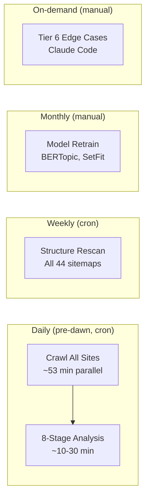
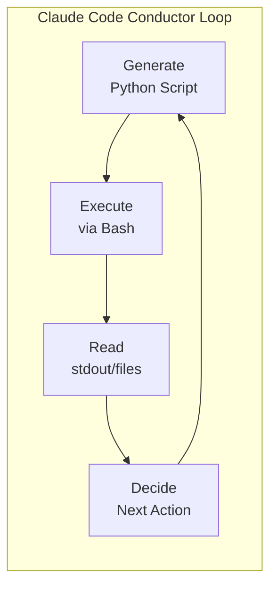
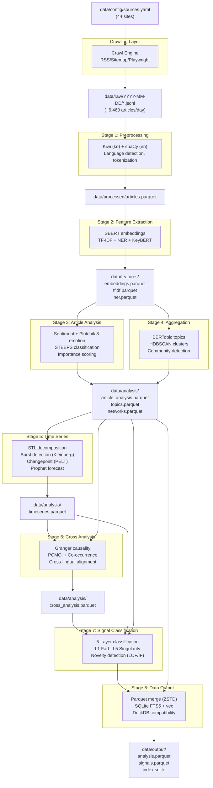

# 시스템 아키텍처 블루프린트

**단계**: 5/20 -- 시스템 아키텍처 블루프린트
**에이전트**: @system-architect
**날짜**: 2026-02-26
**입력**: PRD SS6-8, Step 1 사이트 정찰, Step 2 기술 검증, Step 3 크롤링 타당성 분석, Step 4 리서치 리뷰

---

## 1. 요약

이 블루프린트는 GlobalNews 크롤링 및 분석 시스템의 전체 시스템 아키텍처를 정의한다. 본 시스템은 단계별 모놀리스(Staged Monolith) 아키텍처로 설계되어, 43개 유효 뉴스 사이트를 크롤링하고, 기사를 8단계 NLP 분석 파이프라인으로 처리하며, 사회 트렌드 연구를 위한 구조화된 Parquet/SQLite 출력을 생성한다.

### 아키텍처 결정 요약

| 결정 사항 | 선택 | 근거 |
|----------|------|------|
| 아키텍처 패턴 | 단계별 모놀리스 (PRD SS6.1) | 단일 머신 (M2 Pro 16GB); IPC 오버헤드 없음; 모듈 경계 유지 |
| 런타임 | Python 3.12 | Step 4 결정 D1; spaCy, BERTopic, fundus, gensim 호환성 해결 |
| 오케스트레이션 | cron + Python (95%) / Claude Code (5%) | PRD SS6.4 Conductor 패턴; API 비용 $0 |
| 저장 형식 | Parquet (ZSTD) + SQLite (FTS5 + vec) | PRD SS7.1-7.2; DuckDB 호환 쿼리 레이어 |
| 메모리 전략 | 순차적 모델 로딩 + gc.collect() | Step 2에서 측정된 피크 1.25 GB; 10 GB 예산 내 8배 여유 |
| 크롤링 | 병렬 6그룹 실행 (~53분) | Step 3 병렬화 계획; 2시간 예산 내 수용 |
| 유료화 대응 | Extreme 5개 사이트는 제목만 수집 | Step 4 결정 D4; 이중 패스 분석 지원 |
| 프록시 | 20개 사이트에 지역 프록시 적용 | Step 4 결정 D3; 한국 (18), 일본 (1), 독일 (1) |

[trace:step-1:difficulty-classification-matrix] -- 44 sites classified: Easy(9), Medium(19), Hard(11), Extreme(5)
[trace:step-2:dependency-validation-summary] -- 34 GO / 5 CONDITIONAL / 3 NO-GO; Python 3.12 migration resolves all CONDITIONAL
[trace:step-3:strategy-matrix] -- Parallel crawl ~53 min within 120-min budget; 6,460 daily articles
[trace:step-4:decisions] -- Python 3.12, 43 news sites, geographic proxy, title-only paywall

---

## 2. 4계층 아키텍처 설계

### 2.1 계층 개요

본 시스템은 4개 계층으로 구성된 **단계별 모놀리스** 아키텍처(PRD SS6.1)를 따른다. 각 계층은 명확한 입출력 경계를 가지며, 독립적 개발과 향후 프로세스 수준의 분리가 가능하다.

```mermaid
graph TB
    subgraph "GlobalNews Agentic Workflow"
        subgraph "Layer 1: Orchestration"
            CRON[cron scheduler]
            CC[Claude Code<br/>subscription-only<br/>edge cases]
            STATE[Pipeline State<br/>crawl_status.db]
        end

        subgraph "Layer 2: Crawling"
            RSS[RSS/Sitemap<br/>Parser]
            HTTP[httpx<br/>HTTP Client]
            PW[Playwright/<br/>Patchright]
            AB[Anti-Block<br/>6-Tier Escalation]
            DEDUP[Dedup Engine<br/>SimHash/MinHash]
            UA[UA Manager<br/>60+ agents]
        end

        subgraph "Layer 3: Analysis (8 Stages)"
            S1[Stage 1: Preprocessing]
            S2[Stage 2: Feature Extraction]
            S3[Stage 3: Article Analysis]
            S4[Stage 4: Aggregation]
            S5_stage[Stage 5: Time Series]
            S6[Stage 6: Cross Analysis]
            S7[Stage 7: Signal Classification]
            S8[Stage 8: Data Output]
        end

        subgraph "Layer 4: Storage"
            PARQUET[Parquet Files<br/>ZSTD compressed]
            SQLITE[SQLite<br/>FTS5 + vec]
            DUCKDB[DuckDB<br/>Query Interface]
        end
    end

    CRON --> RSS
    CC -.->|Tier 6 only| AB
    STATE --> CRON

    RSS --> HTTP
    HTTP --> PW
    PW --> AB
    AB --> DEDUP
    UA --> HTTP
    UA --> PW

    DEDUP -->|raw JSONL| S1
    S1 --> S2
    S2 --> S3
    S3 --> S4
    S4 --> S5_stage
    S5_stage --> S6
    S6 --> S7
    S7 --> S8

    S8 --> PARQUET
    S8 --> SQLITE
    PARQUET --> DUCKDB
    SQLITE --> DUCKDB
```



### 2.2 계층별 책임

#### 계층 1: 오케스트레이션 계층

| 구성 요소 | 책임 | 런타임 |
|----------|------|--------|
| **cron** | 일일 크롤링(새벽) + 주간 구조 재스캔 + 월간 모델 재학습 트리거 | 시스템 cron 데몬 |
| **Claude Code** | 엣지 케이스 해결(Tier 6 전용); 스크립트 생성 + 실패 로그 분석 | 구독 전용, 수동 트리거 |
| **Pipeline State** | 크롤링 진행 상태, 티어 에스컬레이션 상태, 사이트별 최종 크롤링 타임스탬프 추적 | SQLite `crawl_status` 테이블 |

오케스트레이션은 **Conductor 패턴**(PRD SS6.4)을 따른다: Python 스크립트 생성 -> Bash로 실행 -> 결과 읽기 -> 다음 단계 결정. Claude Code는 데이터를 직접 처리하지 않으며, `cron`이 실행하는 스크립트를 생성한다.

[trace:step-3:6-tier-escalation-system] -- Tier 6 is Claude Code interactive analysis; Tiers 1-5 are fully automated.

#### 계층 2: 크롤링 계층

| 구성 요소 | 책임 | 핵심 기술 |
|----------|------|----------|
| **RSS/사이트맵 파서** | Tier 1 URL 탐색 (60-70% 커버리지) | feedparser, lxml |
| **HTTP 클라이언트** | 요청 제한이 적용된 기사 페이지 수집 | httpx (async) |
| **Playwright/Patchright** | JS 의존 사이트를 위한 Tier 3-4 동적 렌더링 | patchright 1.58 |
| **봇 차단 대응 시스템** | 7유형 차단 진단 + 6-Tier 에스컬레이션 + Circuit Breaker | 커스텀 Python |
| **중복 제거 엔진** | URL 정규화 + 콘텐츠 해시 (SimHash/MinHash) | simhash, datasketch |
| **UA 매니저** | 4-Tier UA 풀 (61개 정적 + 동적 Patchright 핑거프린트) | 커스텀 Python |

[trace:step-1:site-reconnaissance] -- 28/44 sites have RSS; 33/44 have sitemaps; 3/44 require JS rendering.
[trace:step-2:dependency-validation-summary] -- httpx, feedparser, trafilatura, playwright, patchright all GO on Python 3.12.

#### 계층 3: 분석 계층 (8단계)

| 단계 | 입력 | 출력 | 주요 라이브러리 |
|------|------|------|---------------|
| 1. 전처리 | raw JSONL | processed Parquet | kiwipiepy, spaCy, langdetect |
| 2. 특징 추출 | processed Parquet | features Parquet | sentence-transformers, scikit-learn, keybert |
| 3. 기사 분석 | features Parquet | article_analysis Parquet | transformers (local), KoBERT |
| 4. 집계 | article_analysis Parquet | topics/clusters Parquet | bertopic, hdbscan, gensim |
| 5. 시계열 | topics Parquet | timeseries Parquet | prophet, ruptures, statsmodels |
| 6. 교차 분석 | 이전 전체 Parquet | cross_analysis Parquet | tigramite, networkx, igraph |
| 7. 신호 분류 | 이전 전체 Parquet | signals Parquet | scikit-learn (LOF/IF), custom rules |
| 8. 데이터 출력 | 전체 Parquet + signals | output/ (최종 Parquet + SQLite) | pyarrow, sqlite3, sqlite-vec |

[trace:step-2:nlp-benchmark-summary] -- 500 articles in 4.8 min (M4 Max); 9.6 min conservative on M2 Pro; 92% margin within 2-hour window.

#### 계층 4: 저장 계층

| 구성 요소 | 형식 | 용도 |
|----------|------|------|
| **Parquet** (ZSTD) | `.parquet` 파일 | 분석 데이터: 기사, 분석 결과, 신호, 토픽 |
| **SQLite** (FTS5 + vec) | `index.sqlite` | 전문 검색 + 벡터 유사도 검색 |
| **DuckDB** | 쿼리 인터페이스 | 연구자를 위한 Parquet 파일 대상 Ad-hoc SQL 쿼리 |

### 2.3 실행 모델



| 모드 | 빈도 | 트리거 | 소요 시간 | 설명 |
|------|------|--------|----------|------|
| 자율 크롤링 | 매일 새벽 | cron | ~53분 | Python 스크립트, Tier 1-5 자체 실행 |
| 자율 분석 | 크롤링 후 | cron 체이닝 | ~10-30분 | 8단계 파이프라인, 순차 실행 |
| 엣지 케이스 | 수시 | 수동 | 가변 | Claude Code Tier 6, 실패 로그 분석 |
| 구조 재스캔 | 주간 | cron | ~15분 | 사이트맵/네비게이션 변경 감지 |
| 모델 재학습 | 월간 | 수동 | ~30분 | BERTopic 재적합, SetFit 업데이트 |

---

## 3. 디렉터리 구조

[trace:step-3:parallelization-plan] -- raw/ organized by date for parallel group output isolation.

```
global-news-crawler/
|
|-- src/                              # Source code (Python package root)
|   |-- __init__.py                   # Package init
|   |-- main.py                       # CLI entry point (crawl/analyze/full modes)
|   |
|   |-- crawling/                     # Layer 2: Crawling engine
|   |   |-- __init__.py
|   |   |-- crawler.py                # Main crawl orchestrator (parallel groups)
|   |   |-- network_guard.py          # Level 1: 5-retry exponential backoff
|   |   |-- url_discovery.py          # 3-Tier URL discovery (RSS/Sitemap/Playwright)
|   |   |-- article_extractor.py      # Content extraction (trafilatura/fundus/newspaper4k)
|   |   |-- anti_block.py             # 6-Tier escalation coordinator
|   |   |-- block_detector.py         # 7-type block diagnosis
|   |   |-- circuit_breaker.py        # Circuit Breaker state machine
|   |   |-- stealth_browser.py        # Playwright/Patchright wrapper
|   |   |-- dedup.py                  # URL normalization + SimHash/MinHash dedup
|   |   |-- ua_manager.py             # 4-tier UA pool (61+ agents)
|   |   |-- session_manager.py        # Cookie cycling, header diversification
|   |   |-- rate_limiter.py           # Per-site rate limiting (respects Crawl-delay)
|   |   |-- proxy_manager.py          # Geographic proxy routing (20 sites)
|   |   |-- adapters/                 # Site-specific adapters (44 files)
|   |   |   |-- __init__.py
|   |   |   |-- base_adapter.py       # Abstract base adapter interface
|   |   |   |-- kr_major/             # Korean major dailies (11 adapters)
|   |   |   |-- kr_tech/              # Korean IT/niche (8 adapters)
|   |   |   |-- english/              # English-language Western (12 adapters)
|   |   |   |-- multilingual/         # Asia-Pacific + Europe/ME (13 adapters)
|   |   |   +-- adapter_registry.py   # Dynamic adapter loading by source_id
|   |   +-- __init__.py
|   |
|   |-- analysis/                     # Layer 3: 8-Stage analysis pipeline
|   |   |-- __init__.py
|   |   |-- pipeline.py               # Pipeline orchestrator (stage sequencing)
|   |   |-- stage_1_preprocessing.py  # Korean: Kiwi; English: spaCy
|   |   |-- stage_2_features.py       # SBERT embeddings, TF-IDF, NER, KeyBERT
|   |   |-- stage_3_article.py        # Sentiment, emotion, zero-shot classification
|   |   |-- stage_4_aggregation.py    # BERTopic, HDBSCAN, NMF/LDA, community
|   |   |-- stage_5_timeseries.py     # STL, burst, changepoint, Prophet, wavelet
|   |   |-- stage_6_cross.py          # Granger, PCMCI, co-occurrence, cross-lingual
|   |   |-- stage_7_signals.py        # 5-Layer signal classification + novelty
|   |   |-- stage_8_output.py         # Final Parquet + SQLite output generation
|   |   +-- models/                   # Model management
|   |       |-- __init__.py
|   |       |-- model_registry.py     # Singleton model loader with memory tracking
|   |       +-- kiwi_singleton.py     # Kiwi singleton (Step 2 R2: mandatory)
|   |
|   |-- storage/                      # Layer 4: Storage management
|   |   |-- __init__.py
|   |   |-- parquet_io.py             # Parquet read/write with ZSTD compression
|   |   |-- sqlite_manager.py         # SQLite FTS5 + vec index management
|   |   |-- duckdb_query.py           # DuckDB query interface for ad-hoc analysis
|   |   +-- schema_validator.py       # Runtime schema validation for Parquet/SQLite
|   |
|   |-- utils/                        # Cross-layer shared utilities
|   |   |-- __init__.py
|   |   |-- logging_config.py         # Structured JSON logging
|   |   |-- config_loader.py          # YAML configuration loading + validation
|   |   |-- error_handler.py          # Retry decorators, exception hierarchy
|   |   +-- memory_monitor.py         # RSS memory tracking + gc.collect() triggers
|   |
|   +-- config/                       # Configuration management
|       |-- __init__.py
|       +-- constants.py              # Shared constants (timeouts, paths, retry counts)
|
|-- data/                             # Data storage (PRD SS7.3)
|   |-- raw/                          # Crawled originals (JSONL per site per day)
|   |   +-- YYYY-MM-DD/              # Date-partitioned directories
|   |       |-- chosun.jsonl
|   |       |-- joongang.jsonl
|   |       +-- ...                   # One file per source per day
|   |-- processed/                    # Stage 1 output: preprocessed articles
|   |   +-- articles.parquet          # Cleaned, tokenized, language-detected
|   |-- features/                     # Stage 2 output: extracted features
|   |   |-- embeddings.parquet        # SBERT embeddings (384-dim vectors)
|   |   |-- tfidf.parquet             # TF-IDF matrices
|   |   +-- ner.parquet               # Named Entity Recognition results
|   |-- analysis/                     # Stages 3-6 output: analysis results
|   |   |-- article_analysis.parquet  # Per-article sentiment, emotion, classification
|   |   |-- topics.parquet            # BERTopic topic model results
|   |   |-- timeseries.parquet        # Time series analysis (burst, changepoint)
|   |   |-- networks.parquet          # Co-occurrence and entity networks
|   |   +-- cross_analysis.parquet    # Cross-lingual, causal, frame analysis
|   |-- output/                       # Stage 8 output: final deliverables
|   |   |-- analysis.parquet          # Unified analysis data
|   |   |-- signals.parquet           # 5-Layer signal classifications
|   |   +-- index.sqlite              # FTS5 full-text search + sqlite-vec
|   |-- models/                       # Trained/cached models
|   |   |-- bertopic/                 # Saved BERTopic model (monthly retrain)
|   |   |-- setfit/                   # Fine-tuned SetFit classifier
|   |   +-- embeddings/              # Cached SBERT/transformer models
|   |-- logs/                         # Execution logs
|   |   |-- crawl.log                 # Daily crawl log (structured JSON)
|   |   |-- analysis.log              # Analysis pipeline log
|   |   +-- errors.log                # Error log (all layers)
|   +-- config/                       # Runtime configuration
|       |-- sources.yaml              # 44-site crawl configurations
|       +-- pipeline.yaml             # 8-stage pipeline configurations
|
|-- config/                           # Static/template configurations
|   |-- sources.template.yaml         # Template for sources.yaml
|   +-- pipeline.template.yaml        # Template for pipeline.yaml
|
|-- tests/                            # Test suite
|   |-- conftest.py                   # Shared fixtures
|   |-- unit/                         # Unit tests per module
|   |   |-- test_network_guard.py
|   |   |-- test_dedup.py
|   |   |-- test_ua_manager.py
|   |   |-- test_circuit_breaker.py
|   |   |-- test_rate_limiter.py
|   |   +-- test_parquet_io.py
|   |-- integration/                  # Integration tests
|   |   |-- test_crawl_pipeline.py    # End-to-end crawl for 3 Easy sites
|   |   |-- test_analysis_pipeline.py # 8-stage pipeline on sample data
|   |   +-- test_storage.py           # Parquet + SQLite round-trip
|   +-- structural/                   # Structure verification
|       |-- test_schema_compliance.py  # Parquet/SQLite match PRD SS7
|       +-- test_module_imports.py    # Package import verification
|
|-- scripts/                          # Operational scripts
|   |-- run_crawl.py                  # Standalone crawl runner (cron entry point)
|   |-- run_analysis.py               # Standalone analysis runner (cron chain)
|   |-- run_full.py                   # Full pipeline: crawl + analysis
|   |-- validate_data.py              # Data quality validation (PRD SS7.4)
|   +-- rescan_structure.py           # Weekly site structure rescan
|
|-- requirements.txt                  # Pinned Python dependencies
|-- pyproject.toml                    # Project metadata and build config
|-- pytest.ini                        # pytest configuration
|-- crontab.example                   # Example cron configuration
+-- README.md                         # Project documentation
```

### 3.1 디렉터리 용도 근거

| 디렉터리 | 용도 | PRD 참조 |
|----------|------|----------|
| `src/crawling/` | 모든 크롤링 로직: URL 탐색, 콘텐츠 추출, 봇 차단 대응, 중복 제거 | SS5.1 |
| `src/crawling/adapters/` | 44개 사이트별 셀렉터 및 설정 | SS4.1-4.2 |
| `src/analysis/` | 8단계 NLP 파이프라인 구현 (56개 기법) | SS5.2, SS6.1 |
| `src/analysis/models/` | 싱글턴 모델 관리 (Kiwi, SBERT, BERTopic) | Step 2 R2, R5 |
| `src/storage/` | Parquet/SQLite/DuckDB 읽기-쓰기 추상화 | SS7.1-7.2 |
| `src/utils/` | 횡단 관심사: 로깅, 설정, 에러, 메모리 | SS6.1, SS8.3 |
| `src/config/` | 중앙 집중식 상수 및 설정 관리 | SS6.1 |
| `data/raw/` | 날짜별 파티션된 크롤링 JSONL (임시, 교체 가능) | SS7.3, SS6.3 |
| `data/processed/` | Stage 1 출력: Parquet 형식의 정제된 기사 | SS6.3 |
| `data/features/` | Stage 2 출력: 임베딩, TF-IDF, NER의 Parquet | SS6.3 |
| `data/analysis/` | Stage 3-6 출력: 기사별 및 집계 분석 결과 | SS6.3 |
| `data/output/` | Stage 8 최종 산출물: 통합 Parquet + SQLite 인덱스 | SS6.3, SS7 |
| `data/models/` | 캐시된 NLP 모델 및 학습된 분류기 | SS5.2.5 |
| `data/logs/` | 전 계층 구조화된 실행 로그 | SS7.3 |
| `data/config/` | 런타임 YAML 설정 (sources, pipeline) | SS7.3 |
| `tests/` | 3계층 테스트 스위트: 단위, 통합, 구조 | 품질 보증 |
| `scripts/` | cron 및 운영 작업용 독립 실행 스크립트 | SS6.2 |

---

## 4. 모듈 인터페이스 계약

### 4.1 계약 설계 원칙

모든 계층 간 데이터 계약은 타입 안전성과 IDE 지원을 위해 Python **dataclasses**를 사용한다. 데이터 경로에서 의존성을 최소화하기 위해 Pydantic은 사용하지 않으며, 검증은 계층 경계에서 명시적 검사를 통해 수행한다.

의존성 방향은 엄격하게 단방향이다:

```
Orchestration --> Crawling --> Analysis --> Storage
                                            ^
                    utils (cross-cutting) ---|
```

역방향 의존성은 허용되지 않는다. `utils/` 패키지만이 모든 계층에서 임포트하는 유일한 공유 모듈이다.

### 4.2 계층 2 -> 계층 3: 원시 기사 계약

```python
# src/crawling/contracts.py
from dataclasses import dataclass, field
from datetime import datetime


@dataclass(frozen=True)
class RawArticle:
    """Contract: Crawling Layer output -> Analysis Layer input.

    Serialized as one JSON object per line in JSONL files at:
    data/raw/YYYY-MM-DD/{source_id}.jsonl
    """
    url: str                          # Canonical article URL (normalized)
    title: str                        # Article title (required)
    body: str                         # Article body text (may be empty for paywall)
    source_id: str                    # Site identifier (e.g., "chosun")
    source_name: str                  # Human-readable name (e.g., "Chosun Ilbo")
    language: str                     # ISO 639-1 code: "ko", "en", "zh", "ja", etc.
    published_at: datetime | None     # Publication datetime (None if unavailable)
    crawled_at: datetime              # Crawl timestamp (always present)
    author: str | None                # Author name (None if unavailable)
    category: str | None              # Section/category (None if unavailable)
    content_hash: str                 # SimHash of body for dedup
    crawl_tier: int                   # Which tier succeeded (1-6)
    crawl_method: str                 # "rss", "sitemap", "dom", "playwright"
    is_paywall_truncated: bool        # True if body is title-only due to paywall

    def to_jsonl_dict(self) -> dict:
        """Serialize for JSONL output. Timestamps as ISO 8601 strings."""
        ...
```

**이 경계에서의 에러 처리**: `title`이 비어 있거나 `url`이 유효하지 않으면, 해당 기사는 `data/logs/errors.log`에 기록되고 JSONL 파일에서 제외된다. 크롤링 계층은 불완전한 레코드를 절대 생성하지 않는다.

### 4.3 계층 3 내부: 스테이지 간 계약

각 분석 스테이지는 이전 스테이지의 Parquet를 읽고, 자신의 출력 디렉터리에 Parquet를 기록한다. 스테이지 계약은 Parquet 스키마에 암묵적으로 정의된다.

```python
# src/analysis/contracts.py
from dataclasses import dataclass, field
from datetime import datetime


@dataclass(frozen=True)
class ProcessedArticle:
    """Contract: Stage 1 (Preprocessing) output.
    Written to data/processed/articles.parquet.
    """
    article_id: str                   # UUID v4
    url: str
    title: str
    body: str
    source: str                       # source_name from RawArticle
    category: str                     # Defaults to "uncategorized" if None
    language: str                     # "ko" or "en" (verified by langdetect)
    published_at: datetime
    crawled_at: datetime
    author: str                       # Defaults to "" if None
    word_count: int                   # Word count (Korean: Kiwi morphemes; English: whitespace split)
    content_hash: str                 # SimHash carried from RawArticle


@dataclass
class ArticleFeatures:
    """Contract: Stage 2 (Feature Extraction) output.
    Written to data/features/{embeddings,tfidf,ner}.parquet.
    """
    article_id: str
    embedding: list[float]            # SBERT 384-dim vector
    tfidf_top_terms: list[str]        # Top 20 TF-IDF terms
    tfidf_scores: list[float]         # Corresponding TF-IDF scores
    entities_person: list[str]        # NER: person names
    entities_org: list[str]           # NER: organization names
    entities_location: list[str]      # NER: location names
    keywords: list[str]               # KeyBERT top-10 keywords


@dataclass
class ArticleAnalysis:
    """Contract: Stage 3 (Article-Level Analysis) output.
    Written to data/analysis/article_analysis.parquet.
    """
    article_id: str
    sentiment_label: str              # "positive" | "negative" | "neutral"
    sentiment_score: float            # -1.0 to 1.0
    emotion_joy: float                # Plutchik dimensions (0-1 each)
    emotion_trust: float
    emotion_fear: float
    emotion_surprise: float
    emotion_sadness: float
    emotion_disgust: float
    emotion_anger: float
    emotion_anticipation: float
    steeps_category: str              # "S" | "T" | "E" | "En" | "P" | "Se"
    importance_score: float           # 0-100


@dataclass
class TopicAssignment:
    """Contract: Stage 4 (Aggregation) output.
    Written to data/analysis/topics.parquet.
    """
    article_id: str
    topic_id: int                     # BERTopic topic ID (-1 = outlier)
    topic_label: str                  # Human-readable topic label
    topic_probability: float          # 0.0 to 1.0


@dataclass
class SignalRecord:
    """Contract: Stage 7 (Signal Classification) output.
    Written to data/output/signals.parquet.
    """
    signal_id: str                    # UUID v4
    signal_layer: str                 # "L1_fad" | "L2_short" | "L3_mid" | "L4_long" | "L5_singularity"
    signal_label: str                 # Human-readable signal description
    detected_at: datetime
    topic_ids: list[int]
    article_ids: list[str]
    burst_score: float | None
    changepoint_significance: float | None
    novelty_score: float | None
    singularity_composite: float | None
    evidence_summary: str
    confidence: float                 # 0.0 to 1.0
```

**스테이지 경계에서의 에러 처리**: 각 스테이지는 처리를 시작하기 전에 입력 Parquet 스키마를 예상 계약과 대조하여 검증한다. 스키마 불일치가 발생하면 `SchemaValidationError`를 발생시키며, 파이프라인 Orchestrator가 이를 포착하여 명확한 에러 메시지와 함께 파이프라인을 중단한다. 불완전한 스테이지 출력은 다음 스테이지로 승격되지 않는다.

### 4.4 계층 3 -> 계층 4: 최종 출력 계약

```python
# src/storage/contracts.py
from dataclasses import dataclass


@dataclass(frozen=True)
class StorageManifest:
    """Contract: Analysis Stage 8 output -> Storage Layer.
    Describes the set of files to be written/updated.
    """
    analysis_parquet_path: str        # data/output/analysis.parquet
    signals_parquet_path: str         # data/output/signals.parquet
    sqlite_path: str                  # data/output/index.sqlite
    run_date: str                     # YYYY-MM-DD
    article_count: int                # Total articles in this run
    signal_count: int                 # Total signals detected
    topics_parquet_path: str          # data/output/topics.parquet (from Stage 4)
```

### 4.5 에러 처리 계약

```python
# src/utils/error_handler.py
from dataclasses import dataclass
from enum import Enum


class ErrorSeverity(Enum):
    WARN = "warn"       # Log and continue (e.g., single article extraction failure)
    ERROR = "error"     # Log and skip item (e.g., site unreachable after retries)
    FATAL = "fatal"     # Log and halt pipeline (e.g., schema validation failure)


@dataclass(frozen=True)
class PipelineError:
    """Standardized error record for all layers."""
    layer: str                        # "crawling" | "analysis" | "storage"
    component: str                    # Module name (e.g., "network_guard")
    severity: ErrorSeverity
    message: str
    source_id: str | None             # Site ID if applicable
    article_url: str | None           # Article URL if applicable
    retry_count: int                  # Number of retries attempted
    timestamp: str                    # ISO 8601
```

모든 에러는 구조화된 JSON 형식으로 `data/logs/errors.log`에 기록된다. WARN 및 ERROR 심각도의 에러는 일일 요약에 누적된다. FATAL 에러는 파이프라인을 중단하고 Claude Code 6단계 분석을 위한 장애 보고서를 생성한다.

---

## 5. 데이터 스키마

### 5a. Parquet 스키마

모든 Parquet 파일은 **ZSTD 압축**을 사용한다(PRD SS8, Stage 8). 컬럼 정의는 PRD SS7.1과 정확히 일치한다.

#### 5a.1 articles.parquet -- 기사 원본 + 기본 메타데이터

**위치**: `data/processed/articles.parquet` (Stage 1 출력) 및 `data/output/analysis.parquet` (Stage 8 병합)

| 컬럼 | Arrow 타입 | Nullable | 설명 | PRD 참조 |
|--------|-----------|----------|-------------|---------------|
| `article_id` | `utf8` | NOT NULL | UUID v4 고유 식별자 | SS7.1.1 |
| `url` | `utf8` | NOT NULL | 정규화된 기사 URL (쿼리 파라미터 제거) | SS7.1.1 |
| `title` | `utf8` | NOT NULL | 기사 제목 | SS7.1.1 |
| `body` | `utf8` | NOT NULL | 기사 본문 전체 텍스트 (유료화 잘림 시 빈 문자열) | SS7.1.1 |
| `source` | `utf8` | NOT NULL | 출처 사이트명 (예: "Chosun Ilbo") | SS7.1.1 |
| `category` | `utf8` | NOT NULL | 카테고리/섹션 (예: "politics", "economy"; 기본값 "uncategorized") | SS7.1.1 |
| `language` | `utf8` | NOT NULL | ISO 639-1 언어 코드 ("ko", "en", "zh", "ja", "de", "fr", "es", "ar", "he") | SS7.1.1 |
| `published_at` | `timestamp[us, tz=UTC]` | NOT NULL | UTC 기준 발행 일시 | SS7.1.1 |
| `crawled_at` | `timestamp[us, tz=UTC]` | NOT NULL | UTC 기준 크롤링 타임스탬프 | SS7.1.1 |
| `author` | `utf8` | NULLABLE | 저자명 (확인 불가 시 null) | SS7.1.1 |
| `word_count` | `int32` | NOT NULL | 단어 수 (한국어는 Kiwi 형태소; 영어는 공백 분리) | SS7.1.1 |
| `content_hash` | `utf8` | NOT NULL | 중복 제거용 본문 텍스트 SimHash | SS7.1.1 |

**파티셔닝 전략**: Parquet 수준에서는 날짜별 파티셔닝을 적용하지 않는다. `data/raw/` JSONL 파일은 디렉터리별로 날짜 파티셔닝된다. 가공된 Parquet 파일은 날짜를 넘어 누적되며 DuckDB의 `published_at` 날짜 필터로 조회한다. 데이터셋이 10만 건을 초과하면 `published_date` 파티션 컬럼을 추가하여 날짜 수준 파티셔닝을 적용한다.

**PyArrow 스키마 정의**:

```python
import pyarrow as pa

ARTICLES_SCHEMA = pa.schema([
    pa.field("article_id", pa.utf8(), nullable=False),
    pa.field("url", pa.utf8(), nullable=False),
    pa.field("title", pa.utf8(), nullable=False),
    pa.field("body", pa.utf8(), nullable=False),
    pa.field("source", pa.utf8(), nullable=False),
    pa.field("category", pa.utf8(), nullable=False),
    pa.field("language", pa.utf8(), nullable=False),
    pa.field("published_at", pa.timestamp("us", tz="UTC"), nullable=False),
    pa.field("crawled_at", pa.timestamp("us", tz="UTC"), nullable=False),
    pa.field("author", pa.utf8(), nullable=True),
    pa.field("word_count", pa.int32(), nullable=False),
    pa.field("content_hash", pa.utf8(), nullable=False),
])
```

#### 5a.2 analysis.parquet -- 기사별 분석 결과

**위치**: `data/analysis/article_analysis.parquet` (Stages 3-4 출력) 및 `data/output/analysis.parquet` (Stage 8 병합)

| 컬럼 | Arrow 타입 | Nullable | 설명 | PRD 참조 |
|--------|-----------|----------|-------------|---------------|
| `article_id` | `utf8` | NOT NULL | FK -> articles.article_id | SS7.1.2 |
| `sentiment_label` | `utf8` | NOT NULL | "positive" / "negative" / "neutral" | SS7.1.2 |
| `sentiment_score` | `float32` | NOT NULL | 감성 점수 (-1.0 ~ 1.0) | SS7.1.2 |
| `emotion_joy` | `float32` | NOT NULL | Plutchik 감정: 기쁨 (0-1) | SS7.1.2 |
| `emotion_trust` | `float32` | NOT NULL | Plutchik 감정: 신뢰 (0-1) | SS7.1.2 |
| `emotion_fear` | `float32` | NOT NULL | Plutchik 감정: 공포 (0-1) | SS7.1.2 |
| `emotion_surprise` | `float32` | NOT NULL | Plutchik 감정: 놀라움 (0-1) | SS7.1.2 |
| `emotion_sadness` | `float32` | NOT NULL | Plutchik 감정: 슬픔 (0-1) | SS7.1.2 |
| `emotion_disgust` | `float32` | NOT NULL | Plutchik 감정: 혐오 (0-1) | SS7.1.2 |
| `emotion_anger` | `float32` | NOT NULL | Plutchik 감정: 분노 (0-1) | SS7.1.2 |
| `emotion_anticipation` | `float32` | NOT NULL | Plutchik 감정: 기대 (0-1) | SS7.1.2 |
| `topic_id` | `int32` | NOT NULL | BERTopic 토픽 ID (-1 = 이상치) | SS7.1.2 |
| `topic_label` | `utf8` | NOT NULL | 사람이 읽을 수 있는 토픽 레이블 | SS7.1.2 |
| `topic_probability` | `float32` | NOT NULL | 토픽 할당 확률 (0-1) | SS7.1.2 |
| `steeps_category` | `utf8` | NOT NULL | STEEPS 분류: "S"/"T"/"E"/"En"/"P"/"Se" | SS7.1.2 |
| `importance_score` | `float32` | NOT NULL | 기사 중요도 점수 (0-100) | SS7.1.2 |
| `keywords` | `list_<utf8>` | NOT NULL | KeyBERT 추출 키워드 (상위 10개) | SS7.1.2 |
| `entities_person` | `list_<utf8>` | NOT NULL | NER: 인물 엔티티 (빈 리스트 가능) | SS7.1.2 |
| `entities_org` | `list_<utf8>` | NOT NULL | NER: 조직 엔티티 (빈 리스트 가능) | SS7.1.2 |
| `entities_location` | `list_<utf8>` | NOT NULL | NER: 장소 엔티티 (빈 리스트 가능) | SS7.1.2 |
| `embedding` | `list_<float32>` | NOT NULL | SBERT 임베딩 벡터 (384차원) | SS7.1.2 |

**PyArrow 스키마 정의**:

```python
ANALYSIS_SCHEMA = pa.schema([
    pa.field("article_id", pa.utf8(), nullable=False),
    pa.field("sentiment_label", pa.utf8(), nullable=False),
    pa.field("sentiment_score", pa.float32(), nullable=False),
    pa.field("emotion_joy", pa.float32(), nullable=False),
    pa.field("emotion_trust", pa.float32(), nullable=False),
    pa.field("emotion_fear", pa.float32(), nullable=False),
    pa.field("emotion_surprise", pa.float32(), nullable=False),
    pa.field("emotion_sadness", pa.float32(), nullable=False),
    pa.field("emotion_disgust", pa.float32(), nullable=False),
    pa.field("emotion_anger", pa.float32(), nullable=False),
    pa.field("emotion_anticipation", pa.float32(), nullable=False),
    pa.field("topic_id", pa.int32(), nullable=False),
    pa.field("topic_label", pa.utf8(), nullable=False),
    pa.field("topic_probability", pa.float32(), nullable=False),
    pa.field("steeps_category", pa.utf8(), nullable=False),
    pa.field("importance_score", pa.float32(), nullable=False),
    pa.field("keywords", pa.list_(pa.utf8()), nullable=False),
    pa.field("entities_person", pa.list_(pa.utf8()), nullable=False),
    pa.field("entities_org", pa.list_(pa.utf8()), nullable=False),
    pa.field("entities_location", pa.list_(pa.utf8()), nullable=False),
    pa.field("embedding", pa.list_(pa.float32()), nullable=False),
])
```

#### 5a.3 signals.parquet -- 5계층 시그널 분류

**위치**: `data/output/signals.parquet` (Stage 7-8 출력)

| 컬럼 | Arrow 타입 | Nullable | 설명 | PRD 참조 |
|--------|-----------|----------|-------------|---------------|
| `signal_id` | `utf8` | NOT NULL | UUID v4 고유 시그널 식별자 | SS7.1.3 |
| `signal_layer` | `utf8` | NOT NULL | "L1_fad" / "L2_short" / "L3_mid" / "L4_long" / "L5_singularity" | SS7.1.3 |
| `signal_label` | `utf8` | NOT NULL | 사람이 읽을 수 있는 시그널 설명 | SS7.1.3 |
| `detected_at` | `timestamp[us, tz=UTC]` | NOT NULL | 탐지 타임스탬프 | SS7.1.3 |
| `topic_ids` | `list_<int32>` | NOT NULL | 관련 BERTopic 토픽 ID | SS7.1.3 |
| `article_ids` | `list_<utf8>` | NOT NULL | 관련 기사 UUID | SS7.1.3 |
| `burst_score` | `float32` | NULLABLE | Kleinberg 버스트 점수 (L1/L2 시그널) | SS7.1.3 |
| `changepoint_significance` | `float32` | NULLABLE | PELT 변화점 유의성 (L3/L4) | SS7.1.3 |
| `novelty_score` | `float32` | NULLABLE | LOF/Isolation Forest 이상치 점수 (L5) | SS7.1.3 |
| `singularity_composite` | `float32` | NULLABLE | 7개 지표 복합 점수 (L5 전용) | SS7.1.3 |
| `evidence_summary` | `utf8` | NOT NULL | 탐지 근거 텍스트 요약 | SS7.1.3 |
| `confidence` | `float32` | NOT NULL | 분류 신뢰도 (0-1) | SS7.1.3 |

**PyArrow 스키마 정의**:

```python
SIGNALS_SCHEMA = pa.schema([
    pa.field("signal_id", pa.utf8(), nullable=False),
    pa.field("signal_layer", pa.utf8(), nullable=False),
    pa.field("signal_label", pa.utf8(), nullable=False),
    pa.field("detected_at", pa.timestamp("us", tz="UTC"), nullable=False),
    pa.field("topic_ids", pa.list_(pa.int32()), nullable=False),
    pa.field("article_ids", pa.list_(pa.utf8()), nullable=False),
    pa.field("burst_score", pa.float32(), nullable=True),
    pa.field("changepoint_significance", pa.float32(), nullable=True),
    pa.field("novelty_score", pa.float32(), nullable=True),
    pa.field("singularity_composite", pa.float32(), nullable=True),
    pa.field("evidence_summary", pa.utf8(), nullable=False),
    pa.field("confidence", pa.float32(), nullable=False),
])
```

### 5b. SQLite 스키마

**위치**: `data/output/index.sqlite` (Stage 8 출력)

모든 SQLite 스키마는 PRD SS7.2와 정확히 일치한다. 인덱스와 제약 조건이 포함된 DDL 문을 아래에 제공한다.

```sql
-- ============================================================
-- articles_fts: Full-Text Search index (PRD SS7.2)
-- Purpose: Enable keyword search across article titles and bodies
-- Engine: FTS5 with unicode61 tokenizer for multilingual support
-- ============================================================
CREATE VIRTUAL TABLE articles_fts USING fts5(
    article_id UNINDEXED,           -- UUID, not searchable (join key only)
    title,                          -- Full-text indexed
    body,                           -- Full-text indexed
    source UNINDEXED,               -- Filter field, not searchable
    category UNINDEXED,             -- Filter field, not searchable
    language UNINDEXED,             -- Filter field, not searchable
    published_at UNINDEXED,         -- Filter field (ISO 8601 string)
    tokenize='unicode61'            -- Multilingual tokenization
);

-- ============================================================
-- article_embeddings: Vector similarity search (PRD SS7.2)
-- Purpose: Semantic similarity queries via sqlite-vec
-- Dimension: 384 (SBERT multilingual-MiniLM-L12-v2 output size)
-- ============================================================
CREATE VIRTUAL TABLE article_embeddings USING vec0(
    article_id TEXT PRIMARY KEY,     -- UUID, links to articles_fts
    embedding FLOAT[384]             -- SBERT embedding vector
);

-- ============================================================
-- signals_index: Signal lookup table (PRD SS7.2)
-- Purpose: Fast signal querying by layer, date, confidence
-- ============================================================
CREATE TABLE signals_index (
    signal_id TEXT PRIMARY KEY,      -- UUID
    signal_layer TEXT NOT NULL,      -- L1_fad / L2_short / L3_mid / L4_long / L5_singularity
    signal_label TEXT NOT NULL,      -- Human-readable label
    detected_at TEXT NOT NULL,       -- ISO 8601 datetime string
    confidence REAL,                 -- 0.0 to 1.0
    article_count INTEGER            -- Number of articles in this signal
);
CREATE INDEX idx_signals_layer ON signals_index(signal_layer);
CREATE INDEX idx_signals_date ON signals_index(detected_at);

-- ============================================================
-- topics_index: Topic lookup table (PRD SS7.2)
-- Purpose: Track topic lifecycle and trend direction
-- ============================================================
CREATE TABLE topics_index (
    topic_id INTEGER PRIMARY KEY,    -- BERTopic topic ID
    label TEXT,                      -- Human-readable topic label
    article_count INTEGER,           -- Total articles assigned to this topic
    first_seen TEXT,                 -- ISO 8601: first article date in topic
    last_seen TEXT,                  -- ISO 8601: last article date in topic
    trend_direction TEXT             -- "rising" / "stable" / "declining"
);

-- ============================================================
-- crawl_status: Per-site crawling state (PRD SS7.2)
-- Purpose: Track crawl health, success rates, escalation tier
-- ============================================================
CREATE TABLE crawl_status (
    source TEXT NOT NULL,            -- Site identifier (e.g., "chosun")
    last_crawled TEXT NOT NULL,      -- ISO 8601 datetime of last successful crawl
    articles_count INTEGER,          -- Total articles crawled from this source
    success_rate REAL,               -- 0.0 to 1.0 (recent 7-day success rate)
    current_tier INTEGER DEFAULT 1   -- Current escalation tier (1-6)
);
```

**마이그레이션 전략**: SQLite 스키마는 `src/storage/sqlite_manager.py`를 통해 최초 실행 시 새로 생성된다. 스키마 버전은 `_meta` 테이블에서 추적한다:

```sql
CREATE TABLE IF NOT EXISTS _meta (
    key TEXT PRIMARY KEY,
    value TEXT NOT NULL
);
INSERT OR REPLACE INTO _meta (key, value) VALUES ('schema_version', '1');
INSERT OR REPLACE INTO _meta (key, value) VALUES ('created_at', datetime('now'));
```

향후 스키마 변경 시에는 `scripts/migrations/`에 있는 번호 매긴 마이그레이션 스크립트가 점진적 DDL을 적용한다. SQLite 매니저는 시작 시 `schema_version`을 확인하고 대기 중인 마이그레이션을 순차적으로 적용한다.

### 5c. sources.yaml 스키마

**위치**: `data/config/sources.yaml`

이 파일은 44개 뉴스 사이트 전체를 설정한다. 각 사이트 항목의 스키마는 다음과 같다:

```yaml
# sources.yaml schema definition
# Each site is identified by its source_id (unique slug)

sources:
  chosun:                            # source_id: unique lowercase slug
    name: "Chosun Ilbo"              # Human-readable display name
    url: "https://www.chosun.com"    # Base URL
    region: "kr"                     # Geographic region: kr/us/uk/cn/jp/de/fr/me/in/tw/il/ru/mx/sg
    language: "ko"                   # Primary language: ko/en/zh/ja/de/fr/es/ar/he
    group: "A"                       # Site group from reconnaissance: A-G

    # Crawling configuration
    crawl:
      primary_method: "rss"          # "rss" | "sitemap" | "api" | "playwright" | "dom"
      fallback_methods:              # Ordered fallback chain
        - "sitemap"
        - "dom"
      rss_url: "http://www.chosun.com/site/data/rss/rss.xml"  # Primary RSS URL (null if no RSS)
      sitemap_url: "/sitemap.xml"    # Sitemap path (relative to base URL)
      rate_limit_seconds: 5          # Base delay between requests (seconds)
      crawl_delay_mandatory: null    # robots.txt Crawl-delay if specified (null = use rate_limit_seconds)
      max_requests_per_hour: 720     # Max requests per hour for this site
      jitter_seconds: 0              # Random jitter added to rate_limit (0 = no jitter)

    # Anti-block configuration
    anti_block:
      ua_tier: 2                     # UA pool tier: 1 (1 UA), 2 (10 UAs), 3 (50 UAs), 4 (dynamic)
      default_escalation_tier: 1     # Starting escalation tier (1-3)
      max_escalation_tier: 5         # Maximum tier before Tier 6 (Claude Code)
      requires_proxy: true           # Whether geographic proxy is required
      proxy_region: "kr"             # Required proxy region (null if no proxy needed)
      bot_block_level: "MEDIUM"      # "LOW" | "MEDIUM" | "HIGH" from Step 1

    # Content extraction
    extraction:
      paywall_type: "none"           # "none" | "soft-metered" | "hard"
      title_only: false              # If true, only collect title+metadata (hard paywall)
      rendering_required: false      # If true, requires Playwright/Patchright for body
      charset: "utf-8"              # Expected charset: "utf-8" | "euc-kr" | "gb2312" | "shift_jis"

    # Metadata
    meta:
      difficulty_tier: "Medium"      # "Easy" | "Medium" | "Hard" | "Extreme" from Step 1
      daily_article_estimate: 200    # Estimated daily article count from Step 1
      sections_count: 15             # Number of sections from Step 1
      enabled: true                  # Whether to include in daily crawl

  # Example: Extreme paywall site
  nytimes:
    name: "The New York Times"
    url: "https://www.nytimes.com"
    region: "us"
    language: "en"
    group: "E"
    crawl:
      primary_method: "sitemap"
      fallback_methods:
        - "dom"
      rss_url: null
      sitemap_url: "/sitemap.xml"
      rate_limit_seconds: 10
      crawl_delay_mandatory: null
      max_requests_per_hour: 240
      jitter_seconds: 3
    anti_block:
      ua_tier: 3
      default_escalation_tier: 3
      max_escalation_tier: 6
      requires_proxy: false
      proxy_region: null
      bot_block_level: "HIGH"
    extraction:
      paywall_type: "hard"
      title_only: true
      rendering_required: false
      charset: "utf-8"
    meta:
      difficulty_tier: "Extreme"
      daily_article_estimate: 300
      sections_count: 20
      enabled: true

  # Example: Playwright-required site
  bloter:
    name: "Bloter"
    url: "https://www.bloter.net"
    region: "kr"
    language: "ko"
    group: "D"
    crawl:
      primary_method: "playwright"
      fallback_methods:
        - "rss"
        - "dom"
      rss_url: "https://www.bloter.net/feed"
      sitemap_url: "/sitemap.xml"
      rate_limit_seconds: 10
      crawl_delay_mandatory: null
      max_requests_per_hour: 240
      jitter_seconds: 3
    anti_block:
      ua_tier: 3
      default_escalation_tier: 3
      max_escalation_tier: 5
      requires_proxy: true
      proxy_region: "kr"
      bot_block_level: "HIGH"
    extraction:
      paywall_type: "none"
      title_only: false
      rendering_required: true
      charset: "utf-8"
    meta:
      difficulty_tier: "Hard"
      daily_article_estimate: 20
      sections_count: 6
      enabled: true

  # ... (나머지 41개 사이트도 동일한 스키마를 따름)
```

**검증 규칙** (`src/utils/config_loader.py`에서 시행):

| 필드 | 검증 |
|-------|-----------|
| `source_id` (키) | 소문자 영숫자 + 밑줄; 고유값 |
| `name` | 비어 있지 않은 문자열 |
| `url` | `http://` 또는 `https://`로 시작하는 유효한 URL |
| `region` | 다음 중 하나: kr, us, uk, cn, jp, de, fr, me, in, tw, il, ru, mx, sg |
| `language` | ISO 639-1: ko, en, zh, ja, de, fr, es, ar, he |
| `group` | 다음 중 하나: A, B, C, D, E, F, G |
| `crawl.primary_method` | 다음 중 하나: rss, sitemap, api, playwright, dom |
| `crawl.fallback_methods` | 유효한 메서드의 리스트 (빈 리스트 가능) |
| `crawl.rate_limit_seconds` | 정수 >= 1 |
| `crawl.max_requests_per_hour` | 정수 >= 1 |
| `anti_block.ua_tier` | 정수 1-4 |
| `anti_block.default_escalation_tier` | 정수 1-3 |
| `anti_block.max_escalation_tier` | 정수 3-6 |
| `anti_block.bot_block_level` | 다음 중 하나: LOW, MEDIUM, HIGH |
| `extraction.paywall_type` | 다음 중 하나: none, soft-metered, hard |
| `meta.difficulty_tier` | 다음 중 하나: Easy, Medium, Hard, Extreme |
| `meta.daily_article_estimate` | 정수 >= 0 |
| `meta.enabled` | Boolean |

[trace:step-1:site-reconnaissance] -- 44개 사이트 전체에 난이도 티어, 일일 예상치, RSS/사이트맵 데이터가 있음.
[trace:step-3:strategy-matrix] -- 44개 사이트 전체에 주요 방식, 대체 체인, 요청 제한, UA 티어가 있음.

### 5d. pipeline.yaml 스키마

**위치**: `data/config/pipeline.yaml`

이 파일은 8단계 분석 파이프라인을 설정한다. 각 단계는 독립적으로 활성화/비활성화할 수 있으며, 자체 리소스 제약이 있다.

```yaml
# pipeline.yaml schema definition

pipeline:
  version: "1.0"
  python_version: "3.12"             # Step 4 decision D1
  global:
    max_memory_gb: 10                # PRD C3: 10 GB pipeline limit
    log_level: "INFO"                # DEBUG | INFO | WARNING | ERROR
    gc_between_stages: true          # Force gc.collect() between stages
    parquet_compression: "zstd"      # ZSTD compression for all Parquet output
    batch_size_default: 500          # Default batch size for article processing

  stages:
    stage_1_preprocessing:
      enabled: true
      description: "Korean: Kiwi morpheme analysis; English: spaCy lemmatization; language detection"
      input_format: "jsonl"          # Reads from data/raw/YYYY-MM-DD/*.jsonl
      output_format: "parquet"       # Writes to data/processed/articles.parquet
      output_path: "data/processed/articles.parquet"
      parallelism: 1                 # Sequential (single process)
      memory_limit_gb: 1.5           # Kiwi ~760 MB + spaCy ~200 MB + overhead
      timeout_seconds: 1800          # 30 minutes max
      models:
        - name: "kiwipiepy"
          version: "0.22.2"
          singleton: true            # Step 2 R2: mandatory singleton
          warmup: true               # Pre-load and warm up
        - name: "spacy_en_core_web_sm"
          version: "3.7+"
          singleton: true
          warmup: false
      dependencies: []               # No stage dependencies (first stage)

    stage_2_features:
      enabled: true
      description: "SBERT embeddings, TF-IDF, NER, KeyBERT keyword extraction"
      input_format: "parquet"        # Reads from data/processed/articles.parquet
      output_format: "parquet"       # Writes to data/features/{embeddings,tfidf,ner}.parquet
      output_paths:
        - "data/features/embeddings.parquet"
        - "data/features/tfidf.parquet"
        - "data/features/ner.parquet"
      parallelism: 1
      memory_limit_gb: 2.5           # SBERT ~1.1 GB + KeyBERT ~20 MB + scikit-learn ~200 MB
      timeout_seconds: 3600          # 1 hour max
      sbert_batch_size: 64           # Step 2 R4: 64 for M2 Pro 16GB
      models:
        - name: "sentence-transformers/paraphrase-multilingual-MiniLM-L12-v2"
          version: "3.0+"
          singleton: true
          warmup: true
        - name: "keybert"
          version: "0.9.0"
          singleton: true
          warmup: false              # Shares SBERT model (Step 2 R5)
        - name: "Davlan/xlm-roberta-base-ner-hrl"
          version: "latest"
          singleton: true
          warmup: true
      dependencies:
        - "stage_1_preprocessing"

    stage_3_article:
      enabled: true
      description: "Sentiment, Plutchik 8-emotion, zero-shot STEEPS classification, importance scoring"
      input_format: "parquet"        # Reads from features Parquet
      output_format: "parquet"
      output_path: "data/analysis/article_analysis.parquet"
      parallelism: 1
      memory_limit_gb: 2.0           # Sentiment model ~500 MB + zero-shot ~500 MB
      timeout_seconds: 3600
      models:
        - name: "monologg/koelectra-base-finetuned-naver-ner"
          version: "latest"
          singleton: true
          warmup: true
        - name: "facebook/bart-large-mnli"
          version: "latest"
          singleton: true
          warmup: true
      dependencies:
        - "stage_2_features"

    stage_4_aggregation:
      enabled: true
      description: "BERTopic topic modeling, Dynamic Topic Modeling, HDBSCAN clustering, NMF/LDA, community detection"
      input_format: "parquet"
      output_format: "parquet"
      output_paths:
        - "data/analysis/topics.parquet"
        - "data/analysis/networks.parquet"
      parallelism: 1
      memory_limit_gb: 3.0           # BERTopic ~1.2 GB (shared SBERT) + HDBSCAN + network libs
      timeout_seconds: 3600
      min_articles_for_topics: 50    # Minimum articles for topic modeling
      models:
        - name: "bertopic"
          version: "0.17.4"
          singleton: true
          warmup: false              # Fit on data, not pre-loaded
          sbert_sharing: true        # Step 2 R5: share SBERT model
      dependencies:
        - "stage_3_article"

    stage_5_timeseries:
      enabled: true
      description: "STL decomposition, Kleinberg burst, PELT changepoint, Prophet forecast, wavelet analysis"
      input_format: "parquet"
      output_format: "parquet"
      output_path: "data/analysis/timeseries.parquet"
      parallelism: 1
      memory_limit_gb: 1.5           # Time series libs are lightweight
      timeout_seconds: 1800
      min_days_for_analysis: 7       # PRD SS5.2.3: L1 minimum 7 days
      forecast_horizon_days: 30      # Prophet forecast horizon
      models: []                     # No heavy ML models; statistical methods only
      dependencies:
        - "stage_4_aggregation"

    stage_6_cross:
      enabled: true
      description: "Granger causality, PCMCI, co-occurrence networks, cross-lingual topic alignment, frame analysis"
      input_format: "parquet"
      output_format: "parquet"
      output_path: "data/analysis/cross_analysis.parquet"
      parallelism: 1
      memory_limit_gb: 2.0           # Network analysis + causal inference
      timeout_seconds: 3600
      min_articles_for_granger: 100  # Minimum articles for Granger test
      models: []
      dependencies:
        - "stage_5_timeseries"

    stage_7_signals:
      enabled: true
      description: "5-Layer signal classification (L1-L5), novelty detection (LOF/IF), BERTrend weak signal detection"
      input_format: "parquet"
      output_format: "parquet"
      output_path: "data/output/signals.parquet"
      parallelism: 1
      memory_limit_gb: 1.5           # Classification rules + LOF/IF
      timeout_seconds: 1800
      signal_confidence_threshold: 0.5  # Minimum confidence for signal inclusion
      singularity_weights:           # PRD SS5.2.4: w1-w7 weights
        ood_score: 0.20
        changepoint_significance: 0.15
        cross_domain_emergence: 0.15
        bertrend_transition: 0.15
        entropy_spike: 0.10
        novelty_score: 0.15
        network_anomaly: 0.10
      models: []
      dependencies:
        - "stage_6_cross"

    stage_8_output:
      enabled: true
      description: "Final Parquet merge (ZSTD), SQLite FTS5 + vec index, DuckDB compatibility check"
      input_format: "parquet"
      output_format: "parquet+sqlite"
      output_paths:
        - "data/output/analysis.parquet"
        - "data/output/signals.parquet"
        - "data/output/index.sqlite"
      parallelism: 1
      memory_limit_gb: 2.0           # Parquet merge + SQLite write
      timeout_seconds: 1800
      models: []
      dependencies:
        - "stage_7_signals"
```

**검증 규칙** (`src/utils/config_loader.py`에서 시행):

| 필드 | 검증 |
|-------|-----------|
| `stages.*.enabled` | Boolean |
| `stages.*.input_format` | 다음 중 하나: jsonl, parquet |
| `stages.*.output_format` | 다음 중 하나: parquet, parquet+sqlite |
| `stages.*.parallelism` | 정수 >= 1 |
| `stages.*.memory_limit_gb` | Float > 0, 활성화된 전체 단계의 합 < `global.max_memory_gb` |
| `stages.*.timeout_seconds` | 정수 >= 60 |
| `stages.*.dependencies` | 유효한 단계명 리스트 (DAG 검사: 순환 금지) |
| `global.max_memory_gb` | Float > 0, <= 10 (PRD C3 제약) |
| `global.parquet_compression` | 다음 중 하나: zstd, snappy, lz4, none |

---

## 6. 컨덕터 패턴(Conductor Pattern) 매핑

컨덕터 패턴(PRD SS6.4)은 Claude Code가 시스템을 오케스트레이션하는 방식을 정의한다: **생성(Generate) -> 실행(Execute) -> 읽기(Read) -> 판단(Decide)**. 각 모듈은 Claude Code가 생성하고 실행할 수 있는 독립적인 Python 스크립트로 호출 가능하도록 설계되었다.

### 6.1 모듈별 패턴



| 모듈 | 생성(Generate) | 실행(Execute) | 읽기(Read) | 판단(Decide) |
|--------|----------|---------|------|--------|
| **크롤링** | `scripts/run_crawl.py --date 2026-02-25` | `python3 scripts/run_crawl.py ...` | `data/logs/crawl.log`에서 성공/실패 건수 확인 | 실패 건수 > 임계값: 티어 상향 또는 Tier 6 트리거 |
| **분석** | `scripts/run_analysis.py --date 2026-02-25 --stages 1-8` | `python3 scripts/run_analysis.py ...` | 스테이지별 출력 Parquet 파일 + `data/logs/analysis.log` 확인 | 스테이지 실패 시: 다른 설정으로 재시도 또는 스테이지 건너뛰기 |
| **저장** | Stage 8에 내포 | Stage 8이 Parquet + SQLite 기록 | `data/output/` 파일 존재 및 예상 행 수 검증 | 검증 실패 시: Stage 8 재실행 |
| **재스캔** | `scripts/rescan_structure.py` | `python3 scripts/rescan_structure.py` | 변경된 사이트 구조의 차이 보고서 확인 | `sources.yaml` 셀렉터 업데이트 또는 수동 검토 플래그 지정 |
| **봇 차단 대응 (Tier 6)** | Claude Code가 사이트별 우회 스크립트 생성 | `python3 tier6_bypass_{site}.py` | HTTP 응답 코드 및 추출된 콘텐츠 확인 | 성공한 전략을 사이트 어댑터에 저장하여 재사용 |

### 6.2 스크립트 진입점

```
# Daily automated (cron, no Claude Code involvement)
scripts/run_crawl.py    --date YYYY-MM-DD [--sites site1,site2,...] [--parallel]
scripts/run_analysis.py --date YYYY-MM-DD [--stages 1-8] [--resume-from N]
scripts/run_full.py     --date YYYY-MM-DD  # Runs crawl then analysis

# Periodic automated (cron)
scripts/rescan_structure.py --all  # Weekly structure rescan

# Manual / Claude Code initiated
scripts/validate_data.py --date YYYY-MM-DD  # Data quality checks (PRD SS7.4)
src/main.py --mode crawl|analyze|full [--date YYYY-MM-DD]  # CLI entry point
```

### 6.3 일상 운영에서의 컨덕터 패턴

일상적인 자율 운영(전체 실행의 95%)에서는 `cron`이 Claude Code 없이 스크립트를 직접 호출한다:

```
# crontab.example
# Daily crawl at 3:00 AM
0 3 * * * cd /path/to/global-news-crawler && python3 scripts/run_full.py --date $(date +\%Y-\%m-\%d) --parallel >> data/logs/cron.log 2>&1

# Weekly structure rescan on Sundays at 1:00 AM
0 1 * * 0 cd /path/to/global-news-crawler && python3 scripts/rescan_structure.py --all >> data/logs/cron.log 2>&1
```

Claude Code가 루프에 개입하는 것은 Tier 6 예외 케이스뿐이다: 실패 로그를 읽고, 맞춤형 우회 스크립트를 생성하고, 이를 실행한 뒤 결과를 읽고, 해당 전략을 영구 저장할지 판단한다.

---

## 7. 메모리 관리 전략

[trace:step-2:memory-profile-summary] -- Peak 1.25 GB RSS measured; Kiwi singleton mandatory; gc.collect() ineffective for torch/mmap.

### 7.1 메모리 예산

| 예산 범주 | 할당량 | 근거 |
|----------------|-----------|---------------|
| macOS + 시스템 프로세스 | ~4-6 GB | OS, Finder, Safari, 백그라운드 서비스 |
| Python 파이프라인 최대치 | **10 GB** | PRD C3 제약 조건 |
| 측정된 파이프라인 피크 | **1.25 GB** | Step 2 메모리 프로파일링 (M4 Max) |
| M2 Pro 보수적 추정 (1.5배) | **~1.9 GB** | M4 Max 대비 M2 Pro 50% 상향 조정 |
| 5,000개 기사 확장 시 여유분 | **~2.5 GB** | Step 2 추정: 5K 기사에서 1.5-2.0 GB |
| 가용 여유분 | **7.5 GB** | 10 GB 예산 - 2.5 GB 피크 = 7.5 GB 버퍼 |

### 7.2 컴포넌트별 메모리 사용량

Step 2 메모리 프로파일링 데이터 기반 (M4 Max에서 측정, 괄호 안은 M2 Pro 보수적 추정치):

| 컴포넌트 | 측정 RSS 증분 | M2 Pro 추정치 | 스테이지 | 로딩 순서 |
|-----------|-------------------|----------------|-------|---------------|
| Python 기본 | 18 MB | 18 MB | 전체 | 항상 로드 |
| Trafilatura 임포트 | +47 MB | +50 MB | 크롤링 | 1순위 |
| httpx/feedparser | +15 MB | +15 MB | 크롤링 | 1순위 |
| Playwright + Chromium (탭 2개) | +3 MB (Python) + 380 MB (Chromium 서브프로세스) | +415 MB 합계 | 크롤링 | 필요 시 로드, 사이트별 해제 |
| Kiwi 싱글턴 (웜 상태) | +717 MB | +760 MB | Stage 1 | 2순위 (Step 2 R6) |
| spaCy en_core_web_sm | +200 MB | +200 MB | Stage 1 | 2순위 |
| SBERT 다국어 | +1,059 MB | +1,100 MB | Stage 2 | 3순위 |
| KeyBERT (SBERT 공유) | +20 MB | +20 MB | Stage 2 | 3순위 |
| NER 트랜스포머 | +500 MB | +500 MB | Stage 2-3 | 3순위 |
| BERTopic (SBERT 공유) | +122 MB | +150 MB | Stage 4 | 4순위 |
| 시계열 라이브러리 (prophet, ruptures) | +100 MB | +100 MB | Stage 5 | 5순위 |
| 네트워크 라이브러리 (networkx, igraph) | +50 MB | +50 MB | Stage 6 | 5순위 |
| scikit-learn (LOF/IF) | +100 MB | +100 MB | Stage 7 | 5순위 |
| Parquet/SQLite 기록 | +200 MB | +200 MB | Stage 8 | 6순위 |

### 7.3 순차 로딩 전략 (Step 2 R6)

모델은 동시가 아닌 순차적으로 로드된다. 파이프라인 오케스트레이터가 다음 순서를 강제한다:

```
Phase A: Crawling
  Load: httpx + trafilatura + feedparser (~65 MB)
  Load if needed: Playwright/Chromium (~415 MB, released after crawling)
  --gc.collect()--

Phase B: Stage 1 (Preprocessing)
  Load: Kiwi singleton (~760 MB, stays loaded entire analysis phase)
  Load: spaCy (~200 MB)
  --gc.collect()-- (releases spaCy only; Kiwi stays as singleton)

Phase C: Stages 2-3 (Features + Article Analysis)
  Load: SBERT (~1,100 MB)
  Load: KeyBERT (~20 MB, shares SBERT)
  Load: NER transformers (~500 MB)
  Process all articles through Stages 2-3
  --gc.collect()-- (ineffective for torch/mmap; process keeps SBERT)

Phase D: Stage 4 (Aggregation)
  Load: BERTopic (~150 MB, shares SBERT -- Step 2 R5)
  --gc.collect()--

Phase E: Stages 5-7 (Time Series + Cross + Signals)
  Unload: Release torch models by deleting references
  Load: Statistical/network libs (~250 MB)
  --gc.collect()--

Phase F: Stage 8 (Output)
  Unload: Release all analysis models
  Load: pyarrow + sqlite3 (~200 MB)
  --gc.collect()--
```

**최대 동시 메모리 사용량**: ~2.5 GB (Phase C: Kiwi 760 MB + SBERT 1,100 MB + NER 500 MB + 오버헤드 140 MB)

### 7.4 핵심 제약 조건

| 제약 조건 | 출처 | 구현 방식 |
|-----------|--------|----------------|
| Kiwi는 반드시 싱글턴이어야 함 | Step 2 R2 | `src/analysis/models/kiwi_singleton.py` 모듈 수준 인스턴스 |
| Kiwi 초기화 시 워밍업 호출 | Step 2 메모리 프로파일 | 로드 후 `_kiwi.tokenize('init')` |
| M2 Pro에서 SBERT 배치 크기 64 | Step 2 R4 | `pipeline.yaml: stage_2_features.sbert_batch_size: 64` |
| BERTopic이 SBERT를 공유 | Step 2 R5 | `BERTopic(embedding_model=sbert_model)` |
| Chromium은 사이트별로 해제 | Step 2 R7 | 각 사이트 후 `context.close()`; 크롤링 단계 후 `browser.close()` |
| gc.collect()는 torch에 비효율적 | Step 2 측정 | 모델 참조를 삭제하고 gc 실행 필요; 또는 torch 메모리 풀을 파이프라인 수명 동안 영구로 수용 |
| 트랜스포머 콜드 스타트 캐시화 | Step 2 R3 | 설정 시 모델 사전 다운로드; 캐시된 재로드 = 10-15초 |

### 7.5 메모리 모니터링

`src/utils/memory_monitor.py` 모듈이 다음 기능을 제공한다:

```python
import os
import gc
import psutil

def get_rss_mb() -> float:
    """Current process RSS in MB."""
    return psutil.Process(os.getpid()).memory_info().rss / (1024 * 1024)

def check_memory_budget(limit_gb: float = 10.0) -> bool:
    """Return True if under budget. Log warning if > 80% of limit."""
    current_gb = get_rss_mb() / 1024
    if current_gb > limit_gb * 0.8:
        logger.warning(f"Memory at {current_gb:.1f} GB ({current_gb/limit_gb*100:.0f}% of {limit_gb} GB limit)")
    return current_gb < limit_gb

def gc_between_stages() -> float:
    """Force garbage collection. Returns MB freed (may be 0 for torch)."""
    before = get_rss_mb()
    gc.collect()
    after = get_rss_mb()
    freed = before - after
    logger.info(f"gc.collect(): {before:.0f} MB -> {after:.0f} MB (freed {freed:.0f} MB)")
    return freed
```

---

## 8. 데이터 흐름

### 8.1 데이터 흐름 다이어그램 (PRD SS6.3)



### 8.2 데이터 흐름 상세 설명

이 흐름은 PRD SS6.3과 정확히 일치한다:

1. **sources.yaml** -- 44개 사이트 정의가 포함된 설정 파일 (Step 4: 43개 유효 뉴스 사이트 + 1개 엔터테인먼트 전용)
2. **[크롤링]** -> `data/raw/YYYY-MM-DD/{source}.jsonl` -- JSON Lines 형식의 원시 기사, 소스당 일일 하나의 파일. 각 줄은 `RawArticle` JSON 객체다. 전체 사이트 대상 일일 약 ~6,460개 기사 추정.
3. **[전처리 (Stage 1)]** -> `data/processed/articles.parquet` -- 정제, 토큰화, 언어 감지가 완료된 기사. 한국어: Kiwi 형태소 분석. 영어: spaCy 표제어 추출. 스키마: `ARTICLES_SCHEMA`.
4. **[피처 추출 (Stage 2)]** -> `data/features/` -- Parquet 파일 3개: `embeddings.parquet` (384차원 SBERT 벡터), `tfidf.parquet` (TF-IDF 행렬), `ner.parquet` (NER 개체).
5. **[기사 분석 (Stage 3)]** -> `data/analysis/article_analysis.parquet` -- 기사별 감성, Plutchik 8-감정 점수, STEEPS 분류, 중요도 점수. 스키마: `ANALYSIS_SCHEMA`.
6. **[집계 (Stage 4)]** -> `data/analysis/topics.parquet` + `data/analysis/networks.parquet` -- BERTopic 토픽 할당, HDBSCAN 클러스터, 동시출현 네트워크, 커뮤니티 구조.
7. **[시계열 (Stage 5)]** -> `data/analysis/timeseries.parquet` -- STL 분해, Kleinberg 버스트 점수, PELT 변환점 타임스탬프, Prophet 예측, 웨이블릿 구성 요소.
8. **[교차 분석 (Stage 6)]** -> `data/analysis/cross_analysis.parquet` -- Granger 인과성 결과, PCMCI 인과 그래프, 동시출현 네트워크, 교차 언어 토픽 정렬, 프레임 분석 비교.
9. **[신호 분류 (Stage 7)]** -> `data/output/signals.parquet` -- 5계층 신호 분류 (L1 일시적 유행부터 L5 싱귤래리티까지) 및 근거. 스키마: `SIGNALS_SCHEMA`.
10. **[데이터 출력 (Stage 8)]** -> `data/output/` -- 최종 산출물: 병합된 `analysis.parquet`, `signals.parquet`, `index.sqlite` (FTS5 + vec).

### 8.3 데이터 규모 추정

| 스테이지 | 입력 | 일일 출력 크기 | 월간 누적 |
|-------|-------|-------------------|----------------------|
| 원시 JSONL | -- | ~50 MB (6,460개 기사 x 평균 ~8 KB) | ~1.5 GB |
| 처리된 Parquet | 50 MB JSONL | ~40 MB (ZSTD 압축) | ~1.2 GB |
| 피처 Parquet | 40 MB | ~100 MB (384차원 임베딩이 지배적) | ~3 GB |
| 분석 Parquet | 100 MB | ~30 MB | ~0.9 GB |
| 신호 Parquet | -- | ~1 MB (수십~수백 개 신호) | ~30 MB |
| SQLite 인덱스 | -- | ~150 MB (FTS5 + vec 누적) | ~150 MB (단일 파일, 갱신) |
| **일일 합계** | | **~370 MB** | |
| **월간 합계** | | | **~7 GB** |

월간 누적 ~7 GB는 최소 50 GB 저장소 요구 사항(PRD SS8.2) 내에서 충분히 수용 가능하다. 분기별 아카이빙으로 원시 JSONL 공간을 회수할 수 있다.

---

## 9. PRD 요구 사항 교차 참조

### 9.1 필수 제약 조건 매핑

| 제약 조건 | 블루프린트 구성 요소 | 상태 |
|-----------|-------------------|--------|
| **C1**: Claude API 비용 $0 | 모든 NLP는 Python 라이브러리를 통해 로컬 실행; Claude Code는 Tier 6 예외 케이스에만 구독 기반 사용 | 충족 |
| **C2**: Claude Code = Orchestrator | 컨덕터 패턴 (섹션 6); cron + Python이 95% 처리 | 충족 |
| **C3**: M2 Pro 16GB 로컬 실행 | 메모리 예산 섹션 7: 피크 ~2.5 GB; 10 GB 한도 준수 | 충족 |
| **C4**: 출력 = Parquet + SQLite | 섹션 5a-5b의 스키마; 최종 출력 위치 `data/output/` | 충족 |
| **C5**: 합법적 크롤링 | `sources.yaml`의 사이트별 요청 제한; robots.txt 준수 | 충족 |

### 9.2 PRD 섹션 매핑

| PRD 섹션 | 블루프린트 섹션 | 비고 |
|------------|------------------|-------|
| SS6.1 단계형 모놀리스 | 섹션 2 (4계층 아키텍처) | Mermaid 다이어그램으로 4개 계층 정의 |
| SS6.2 실행 모델 | 섹션 2.3 | 5가지 실행 모드: 일간/주간/월간/온디맨드 |
| SS6.3 데이터 흐름 | 섹션 8 | Mermaid 다이어그램 포함 10단계 흐름 |
| SS6.4 컨덕터 패턴 | 섹션 6 | 모듈별 생성->실행->읽기->판단 매핑 |
| SS7.1.1 articles.parquet | 섹션 5a.1 | Arrow 타입 포함 전체 12개 컬럼 |
| SS7.1.2 analysis.parquet | 섹션 5a.2 | Arrow 타입 포함 전체 21개 컬럼 |
| SS7.1.3 signals.parquet | 섹션 5a.3 | Arrow 타입 포함 전체 12개 컬럼 |
| SS7.2 SQLite 스키마 | 섹션 5b | 5개 테이블: articles_fts, article_embeddings, signals_index, topics_index, crawl_status |
| SS7.3 디렉터리 구조 | 섹션 3 | PRD 사양과 일치하는 완전한 트리 |
| SS7.4 데이터 품질 | `scripts/validate_data.py`에서 참조 | PRD의 임계값 유지 |
| SS8.1 Python 패키지 | 섹션 10 (기술 스택) | 모든 패키지 반영 완료 |
| SS8.2 인프라 | 섹션 7 (메모리 관리) | M2 Pro 16GB 검증 완료 |
| SS8.3 메모리 예산 | 섹션 7 | Step 2 측정 데이터 통합 |

### 9.3 리서치 단계 통합

| 리서치 단계 | 핵심 발견 | 블루프린트 반영 사항 |
|--------------|-------------|-----------------|
| **Step 1**: 사이트 정찰 | 44개 사이트; Easy(9)/Medium(19)/Hard(11)/Extreme(5) | `sources.yaml` 난이도 티어; 어댑터 디렉터리 구조 |
| **Step 1**: 22개 사이트 추론 데이터 | 한국 IP 제한으로 직접 탐침 차단 | 지역 프록시가 필요한 20개 사이트용 `proxy_manager.py` |
| **Step 2**: 피크 1.25 GB RSS | 메모리 여유 8배 | 메모리 예산 검증 완료; 순차 로딩으로 충분 |
| **Step 2**: Kiwi 싱글턴 필수 | 비-싱글턴 시 리로드당 125 MB 누수 | `kiwi_singleton.py` 모듈 수준 인스턴스 |
| **Step 2**: 34 GO / 5 CONDITIONAL / 3 NO-GO | Python 3.12로 모든 CONDITIONAL 해결 | `pipeline.yaml: python_version: "3.12"` |
| **Step 3**: 병렬 처리 ~53분 | 순차 처리 시 2시간 예산 초과 | `crawler.py`에서 6그룹 병렬화 |
| **Step 3**: 61개 정적 UA + 동적 | 4티어 UA 풀 설계 | Tier 1-4 풀을 갖춘 `ua_manager.py` |
| **Step 3**: 기사당 최대 90회 재시도 | 4레벨 재시도 아키텍처 | `network_guard.py` + `anti_block.py` |
| **Step 4**: Python 3.12 | spaCy, BERTopic, fundus, gensim 호환 해결 | 프로젝트 수준 Python 버전 제약 |
| **Step 4**: 43개 유효 사이트 | BuzzFeed 엔터테인먼트 전용 | `sources.yaml: buzzfeed.meta.enabled: true` (유지하되 플래그 지정) |
| **Step 4**: 유료화 사이트 5곳 제목만 추출 | NYT, FT, WSJ, Bloomberg, Le Monde | 5개 사이트에 `sources.yaml: extraction.title_only: true` |
| **Step 4**: 지역 프록시 배포 | 20개 사이트에 프록시 필요 | `sources.yaml: anti_block.proxy_region` 기반 `proxy_manager.py` 라우팅 |

---

## 10. 기술 스택 요약

### 10.1 런타임 환경

| 구성 요소 | 버전 | 결정 근거 |
|-----------|---------|----------------|
| **Python** | 3.12.x | Step 4 D1 (spaCy, BERTopic, fundus, gensim 호환성 해결) |
| **macOS** | 13+ (Darwin 25.x) | PRD C3 |
| **하드웨어** | Apple M2 Pro, 16 GB RAM | PRD C3 |
| **ARM64 네이티브** | 100% | Step 2: Rosetta 에뮬레이션 없음 |

### 10.2 계층별 패키지 요약

#### 크롤링 계층

| 패키지 | 버전 | 판정 (Step 2) | 용도 |
|---------|---------|------------------|---------|
| httpx | 0.27+ | GO | 비동기 HTTP 클라이언트 |
| feedparser | 6.0+ | GO | RSS/Atom 파싱 |
| trafilatura | 2.0.0 | GO | 기사 본문 추출 (주 도구) |
| fundus | 0.4.x | GO (Python 3.12) | 기사 본문 추출 (고정밀, 영어 매체 약 39개) |
| newspaper4k | 0.9.4.1 | GO | 기사 본문 추출 (대체 방식) |
| playwright | 1.58+ | GO | 동적 브라우저 자동화 |
| patchright | 1.58+ | GO | CDP 스텔스 우회 (apify-fingerprint-suite 대체) |
| beautifulsoup4 | 4.12+ | GO | HTML 파싱 |
| lxml | 5.0+ | GO | XML/HTML 고속 파싱 |
| simhash | 2.1.2 | GO | 콘텐츠 중복 제거 |
| datasketch | 1.9.0 | GO | MinHash 중복 제거 |

#### NLP / 분석 계층

| 패키지 | 버전 | 판정 (Step 2) | 용도 |
|---------|---------|------------------|---------|
| kiwipiepy | 0.22.2 | GO | 한국어 형태소 분석 (싱글턴) |
| spaCy | 3.8+ | GO (Python 3.12) | 영어 NLP 파이프라인 |
| sentence-transformers | 3.0+ | GO | SBERT 임베딩 (multilingual-MiniLM-L12-v2) |
| transformers | 4.40+ (< 5.0) | GO | 로컬 트랜스포머 모델 (NER, 감성 분석) |
| keybert | 0.9.0 | GO | 키워드 추출 (SBERT 공유) |
| bertopic | 0.17.4 | GO (Python 3.12) | 토픽 모델링 |
| model2vec | latest | GO | BERTopic CPU 가속 |
| setfit | 1.1+ | CONDITIONAL | 퓨샷 분류 (transformers < 5.0 고정) |
| gensim | 4.3+ | GO (Python 3.12) | LDA, Word2Vec |
| fasttext-wheel | 0.9.2 | CONDITIONAL | FastText 단어 벡터 (NumPy 2.x 패치) |
| langdetect | 1.0+ | GO | 언어 감지 |

#### 시계열 / 통계 계층

| 패키지 | 버전 | 판정 (Step 2) | 용도 |
|---------|---------|------------------|---------|
| prophet | 1.3.0 | GO | 시계열 예측 |
| ruptures | 1.1.9 | GO | PELT 변화점 탐지 |
| statsmodels | 0.14+ | GO | STL 분해, 그레인저 인과성, ARIMA |
| tigramite | 5.2.10 | GO | PCMCI 인과 추론 |
| pywt | 1.5+ | GO | 웨이블릿 분석 |
| scipy | 1.12+ | GO | 통계 검정, KL 발산 |
| lifelines | 0.29+ | GO | 생존 분석 |

#### 네트워크 / 클러스터링 계층

| 패키지 | 버전 | 판정 (Step 2) | 용도 |
|---------|---------|------------------|---------|
| networkx | 3.2+ | GO | 네트워크 분석 |
| igraph | 0.11+ | GO | 고속 네트워크 연산 |
| hdbscan | 0.8+ | GO | 밀도 기반 클러스터링 |
| scikit-learn | 1.4+ | GO | LOF, Isolation Forest, k-means, NMF, LDA |
| python-louvain | 0.16+ | GO | 루뱅 커뮤니티 탐지 |

#### 저장 계층

| 패키지 | 버전 | 판정 (Step 2) | 용도 |
|---------|---------|------------------|---------|
| pyarrow | 15.0+ | GO | Parquet 읽기/쓰기 |
| duckdb | 0.10+ | GO | Parquet 대상 SQL 쿼리 |
| sqlite-vec | latest | GO | SQLite 벡터 확장 |
| pandas | 2.2+ | GO | DataFrame 처리 |
| polars | 0.20+ | GO | 고속 DataFrame (대규모 배치) |
| pyyaml | 6.0+ | GO | YAML 설정 파싱 |

### 10.3 인프라

| 구성 요소 | 사양 | 월간 비용 |
|-----------|-------------|-------------|
| 한국 가정용 프록시 | 한국 사이트 18개 (DataImpulse 또는 동급) | $10-30 |
| 일본 가정용 프록시 | yomiuri.co.jp | $5-10 |
| 독일 가정용 프록시 | bild.de | $5-10 |
| 영국 프록시 (권장) | thesun.co.uk | $0-10 |
| 사우디/중동 프록시 (권장) | arabnews.com | $0-10 |
| **총 프록시 예산** | | **$20-70/월** |
| Chromium (Playwright) | playwright install에 포함 | $0 |
| NLP 모델 저장 | 캐시된 모델 약 2 GB | $0 (로컬) |
| 데이터 저장 | 월간 약 7 GB 증가 | $0 (로컬 SSD) |

---

## 자체 검증 체크리스트

| # | 기준 | 상태 | 근거 |
|---|-----------|--------|----------|
| 1 | 단계적 모놀리스 4계층: Orchestration -> Crawling -> Analysis -> Storage (PRD SS6.1) | PASS | 섹션 2: 4개 계층이 Mermaid 다이어그램과 함께 정의됨, 책임 범위 및 구성 요소 포함 |
| 2 | PRD SS7.3에 부합하는 완전한 디렉터리 구조 (data/raw, data/processed, data/features, data/analysis, data/output, data/models, data/logs, data/config) | PASS | 섹션 3: 8개 data 하위 디렉터리 모두 동일한 명명 규칙으로 존재 |
| 3 | 각 계층 경계에 대한 모듈 인터페이스 계약 (입출력 형식, 오류 처리) | PASS | 섹션 4: 5개 타입 지정 dataclass 계약 (RawArticle, ProcessedArticle, ArticleFeatures, ArticleAnalysis, SignalRecord) + PipelineError |
| 4 | PRD SS7.1과 정확히 일치하는 Parquet 스키마 (articles.parquet: 12개 컬럼; analysis.parquet: 21개 컬럼; signals.parquet: 12개 컬럼) | PASS | 섹션 5a: 모든 컬럼이 Arrow 타입, nullable 플래그, PyArrow 스키마 코드와 함께 나열됨 |
| 5 | PRD SS7.2와 정확히 일치하는 SQLite 스키마 (articles_fts, article_embeddings, signals_index, topics_index, crawl_status) | PASS | 섹션 5b: 5개 테이블 모두에 대한 DDL 문 및 인덱스 포함, PRD와 정확히 일치 |
| 6 | 사이트별 설정 필드를 갖춘 sources.yaml 스키마 | PASS | 섹션 5c: 3개 예시 사이트(chosun, nytimes, bloter)가 포함된 스키마; 크롤링, 봇 차단 우회, 추출, 메타 등 20개 이상의 필드 포함 |
| 7 | 스테이지 수준 설정을 갖춘 pipeline.yaml 스키마 | PASS | 섹션 5d: 8개 스테이지 모두 입출력 형식, 메모리 제한, 타임아웃, 모델, 의존성과 함께 정의됨 |
| 8 | Conductor 패턴 (Generate->Execute->Read->Decide)의 각 모듈 매핑 | PASS | 섹션 6: Crawling, Analysis, Storage, Rescan, Anti-Block에 패턴 매핑; cron 진입점 예시 포함 |
| 9 | 메모리 관리 전략 (순차적 모델 로딩, 스테이지 간 gc.collect) | PASS | 섹션 7: 6단계 로딩 순서; Step 2의 측정 데이터; 최대 2.5 GB로 10 GB 예산 이내 |
| 10 | PRD SS6.3에 부합하는 데이터 흐름 다이어그램: sources.yaml -> raw(JSONL) -> processed(Parquet) -> features -> analysis -> timeseries -> cross_analysis -> signals -> output | PASS | 섹션 8: PRD SS6.3의 10개 스테이지 모두에 부합하는 Mermaid 다이어그램 + 텍스트 설명 |

### 교차 단계 추적성 검증

| 마커 | 존재 여부 | 참조 대상 |
|--------|---------|-----------|
| `[trace:step-1:*]` | 예 (4개 마커) | difficulty-classification-matrix, site-reconnaissance, key-findings |
| `[trace:step-2:*]` | 예 (4개 마커) | dependency-validation-summary, nlp-benchmark-summary, memory-profile-summary |
| `[trace:step-3:*]` | 예 (3개 마커) | strategy-matrix, 6-tier-escalation-system, parallelization-plan |
| `[trace:step-4:*]` | 예 (1개 마커) | decisions |

---

*Step 5/20 아키텍처 블루프린트 -- GlobalNews Crawling & Analysis Auto-Build 워크플로우를 위해 생성됨*
