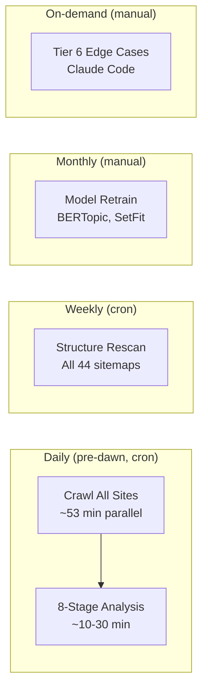
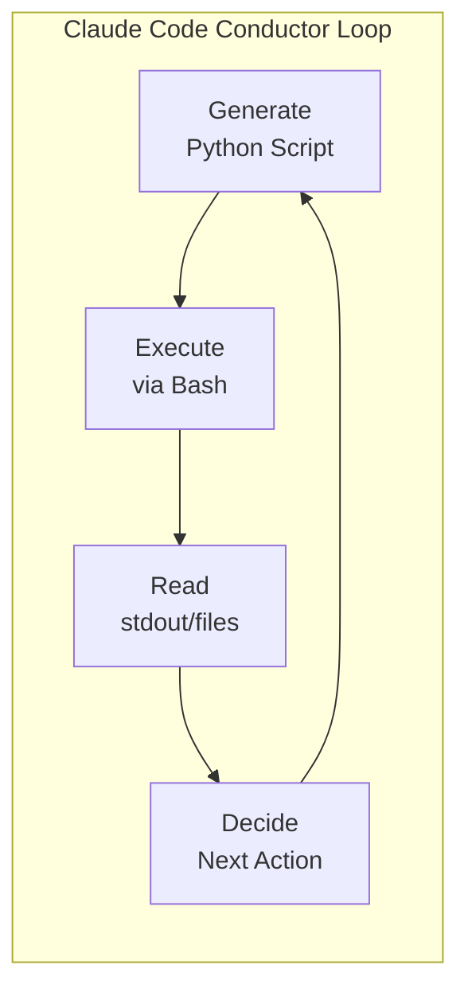
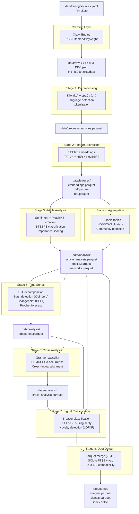

# System Architecture Blueprint

**Step**: 5/20 -- System Architecture Blueprint
**Agent**: @system-architect
**Date**: 2026-02-26
**Inputs**: PRD SS6-8, Step 1 Site Reconnaissance, Step 2 Tech Validation, Step 3 Crawling Feasibility, Step 4 Research Review

---

## 1. Executive Summary

This blueprint defines the complete system architecture for the GlobalNews Crawling & Analysis system -- a Staged Monolith that crawls 43 effective news sites, processes articles through an 8-stage NLP analysis pipeline, and produces structured Parquet/SQLite output for social trend research.

### Architectural Decisions Summary

| Decision | Choice | Rationale |
|----------|--------|-----------|
| Architecture pattern | Staged Monolith (PRD SS6.1) | Single machine (M2 Pro 16GB); no IPC overhead; module boundaries preserved |
| Runtime | Python 3.12 | Step 4 decision D1; resolves spaCy, BERTopic, fundus, gensim compatibility |
| Orchestration | cron + Python (95%) / Claude Code (5%) | PRD SS6.4 Conductor Pattern; $0 API cost |
| Storage format | Parquet (ZSTD) + SQLite (FTS5 + vec) | PRD SS7.1-7.2; DuckDB-compatible query layer |
| Memory strategy | Sequential model loading with gc.collect() | Step 2 measured peak 1.25 GB; 8x headroom within 10 GB budget |
| Crawling | Parallel 6-group execution (~53 min) | Step 3 parallelization plan; fits 2-hour budget |
| Paywall handling | Title-only for 5 Extreme sites | Step 4 decision D4; supports dual-pass analysis |
| Proxy | Geographic proxy for 20 sites | Step 4 decision D3; Korean (18), Japanese (1), German (1) |

[trace:step-1:difficulty-classification-matrix] -- 44 sites classified: Easy(9), Medium(19), Hard(11), Extreme(5)
[trace:step-2:dependency-validation-summary] -- 34 GO / 5 CONDITIONAL / 3 NO-GO; Python 3.12 migration resolves all CONDITIONAL
[trace:step-3:strategy-matrix] -- Parallel crawl ~53 min within 120-min budget; 6,460 daily articles
[trace:step-4:decisions] -- Python 3.12, 43 news sites, geographic proxy, title-only paywall

---

## 2. 4-Layer Architecture Design

### 2.1 Layer Overview

The system follows a **Staged Monolith** architecture (PRD SS6.1) with four layers. Each layer has clear input/output boundaries, enabling independent development and future process-level separation.

```mermaid
graph TB
    subgraph "GlobalNews Agentic Workflow"
        subgraph "Layer 1: Orchestration"
            CRON[cron scheduler]
            CC[Claude Code<br/>subscription-only<br/>edge cases]
            STATE[Pipeline State<br/>crawl_status.db]
        end

        subgraph "Layer 2: Crawling"
            RSS[RSS/Sitemap<br/>Parser]
            HTTP[httpx<br/>HTTP Client]
            PW[Playwright/<br/>Patchright]
            AB[Anti-Block<br/>6-Tier Escalation]
            DEDUP[Dedup Engine<br/>SimHash/MinHash]
            UA[UA Manager<br/>60+ agents]
        end

        subgraph "Layer 3: Analysis (8 Stages)"
            S1[Stage 1: Preprocessing]
            S2[Stage 2: Feature Extraction]
            S3[Stage 3: Article Analysis]
            S4[Stage 4: Aggregation]
            S5_stage[Stage 5: Time Series]
            S6[Stage 6: Cross Analysis]
            S7[Stage 7: Signal Classification]
            S8[Stage 8: Data Output]
        end

        subgraph "Layer 4: Storage"
            PARQUET[Parquet Files<br/>ZSTD compressed]
            SQLITE[SQLite<br/>FTS5 + vec]
            DUCKDB[DuckDB<br/>Query Interface]
        end
    end

    CRON --> RSS
    CC -.->|Tier 6 only| AB
    STATE --> CRON

    RSS --> HTTP
    HTTP --> PW
    PW --> AB
    AB --> DEDUP
    UA --> HTTP
    UA --> PW

    DEDUP -->|raw JSONL| S1
    S1 --> S2
    S2 --> S3
    S3 --> S4
    S4 --> S5_stage
    S5_stage --> S6
    S6 --> S7
    S7 --> S8

    S8 --> PARQUET
    S8 --> SQLITE
    PARQUET --> DUCKDB
    SQLITE --> DUCKDB
```



### 2.2 Layer Responsibilities

#### Layer 1: Orchestration Layer

| Component | Responsibility | Runtime |
|-----------|---------------|---------|
| **cron** | Triggers daily crawl (pre-dawn) + weekly structure rescan + monthly model retrain | System cron daemon |
| **Claude Code** | Edge-case resolution (Tier 6 only); script generation + failure log analysis | Subscription-only, manual trigger |
| **Pipeline State** | Tracks crawl progress, tier escalation state, last-crawled timestamps per site | SQLite `crawl_status` table |

Orchestration follows the **Conductor Pattern** (PRD SS6.4): Generate Python Scripts -> Execute via Bash -> Read Results -> Decide Next Step. Claude Code does NOT process data directly; it generates scripts that `cron` executes.

[trace:step-3:6-tier-escalation-system] -- Tier 6 is Claude Code interactive analysis; Tiers 1-5 are fully automated.

#### Layer 2: Crawling Layer

| Component | Responsibility | Key Technology |
|-----------|---------------|----------------|
| **RSS/Sitemap Parser** | Tier 1 URL discovery (60-70% coverage) | feedparser, lxml |
| **HTTP Client** | Article page fetching with rate limiting | httpx (async) |
| **Playwright/Patchright** | Tier 3-4 dynamic rendering for JS-heavy sites | patchright 1.58 |
| **Anti-Block System** | 7-type block diagnosis + 6-Tier escalation + Circuit Breaker | Custom Python |
| **Dedup Engine** | URL normalization + content hash (SimHash/MinHash) | simhash, datasketch |
| **UA Manager** | 4-tier UA pool (61 static + dynamic Patchright fingerprints) | Custom Python |

[trace:step-1:site-reconnaissance] -- 28/44 sites have RSS; 33/44 have sitemaps; 3/44 require JS rendering.
[trace:step-2:dependency-validation-summary] -- httpx, feedparser, trafilatura, playwright, patchright all GO on Python 3.12.

#### Layer 3: Analysis Layer (8 Stages)

| Stage | Input | Output | Key Libraries |
|-------|-------|--------|---------------|
| 1. Preprocessing | raw JSONL | processed Parquet | kiwipiepy, spaCy, langdetect |
| 2. Feature Extraction | processed Parquet | features Parquet | sentence-transformers, scikit-learn, keybert |
| 3. Article Analysis | features Parquet | article_analysis Parquet | transformers (local), KoBERT |
| 4. Aggregation | article_analysis Parquet | topics/clusters Parquet | bertopic, hdbscan, gensim |
| 5. Time Series | topics Parquet | timeseries Parquet | prophet, ruptures, statsmodels |
| 6. Cross Analysis | all prior Parquet | cross_analysis Parquet | tigramite, networkx, igraph |
| 7. Signal Classification | all prior Parquet | signals Parquet | scikit-learn (LOF/IF), custom rules |
| 8. Data Output | all Parquet + signals | output/ (final Parquet + SQLite) | pyarrow, sqlite3, sqlite-vec |

[trace:step-2:nlp-benchmark-summary] -- 500 articles in 4.8 min (M4 Max); 9.6 min conservative on M2 Pro; 92% margin within 2-hour window.

#### Layer 4: Storage Layer

| Component | Format | Purpose |
|-----------|--------|---------|
| **Parquet** (ZSTD) | `.parquet` files | Analysis data: articles, analysis results, signals, topics |
| **SQLite** (FTS5 + vec) | `index.sqlite` | Full-text search + vector similarity search |
| **DuckDB** | Query interface | Ad-hoc SQL queries over Parquet files for researchers |

### 2.3 Execution Model



| Mode | Frequency | Trigger | Duration | Description |
|------|-----------|---------|----------|-------------|
| Autonomous Crawl | Daily pre-dawn | cron | ~53 min | Python scripts, Tiers 1-5 self-executing |
| Autonomous Analysis | After crawl | cron chain | ~10-30 min | 8-Stage pipeline, sequential stages |
| Edge Case | On-demand | Manual | Variable | Claude Code Tier 6, failure log analysis |
| Structure Rescan | Weekly | cron | ~15 min | Sitemap/navigation change detection |
| Model Retrain | Monthly | Manual | ~30 min | BERTopic refit, SetFit update |

---

## 3. Directory Structure

[trace:step-3:parallelization-plan] -- raw/ organized by date for parallel group output isolation.

```
global-news-crawler/
|
|-- src/                              # Source code (Python package root)
|   |-- __init__.py                   # Package init
|   |-- main.py                       # CLI entry point (crawl/analyze/full modes)
|   |
|   |-- crawling/                     # Layer 2: Crawling engine
|   |   |-- __init__.py
|   |   |-- crawler.py                # Main crawl orchestrator (parallel groups)
|   |   |-- network_guard.py          # Level 1: 5-retry exponential backoff
|   |   |-- url_discovery.py          # 3-Tier URL discovery (RSS/Sitemap/Playwright)
|   |   |-- article_extractor.py      # Content extraction (trafilatura/fundus/newspaper4k)
|   |   |-- anti_block.py             # 6-Tier escalation coordinator
|   |   |-- block_detector.py         # 7-type block diagnosis
|   |   |-- circuit_breaker.py        # Circuit Breaker state machine
|   |   |-- stealth_browser.py        # Playwright/Patchright wrapper
|   |   |-- dedup.py                  # URL normalization + SimHash/MinHash dedup
|   |   |-- ua_manager.py             # 4-tier UA pool (61+ agents)
|   |   |-- session_manager.py        # Cookie cycling, header diversification
|   |   |-- rate_limiter.py           # Per-site rate limiting (respects Crawl-delay)
|   |   |-- proxy_manager.py          # Geographic proxy routing (20 sites)
|   |   |-- adapters/                 # Site-specific adapters (44 files)
|   |   |   |-- __init__.py
|   |   |   |-- base_adapter.py       # Abstract base adapter interface
|   |   |   |-- kr_major/             # Korean major dailies (11 adapters)
|   |   |   |-- kr_tech/              # Korean IT/niche (8 adapters)
|   |   |   |-- english/              # English-language Western (12 adapters)
|   |   |   |-- multilingual/         # Asia-Pacific + Europe/ME (13 adapters)
|   |   |   +-- adapter_registry.py   # Dynamic adapter loading by source_id
|   |   +-- __init__.py
|   |
|   |-- analysis/                     # Layer 3: 8-Stage analysis pipeline
|   |   |-- __init__.py
|   |   |-- pipeline.py               # Pipeline orchestrator (stage sequencing)
|   |   |-- stage_1_preprocessing.py  # Korean: Kiwi; English: spaCy
|   |   |-- stage_2_features.py       # SBERT embeddings, TF-IDF, NER, KeyBERT
|   |   |-- stage_3_article.py        # Sentiment, emotion, zero-shot classification
|   |   |-- stage_4_aggregation.py    # BERTopic, HDBSCAN, NMF/LDA, community
|   |   |-- stage_5_timeseries.py     # STL, burst, changepoint, Prophet, wavelet
|   |   |-- stage_6_cross.py          # Granger, PCMCI, co-occurrence, cross-lingual
|   |   |-- stage_7_signals.py        # 5-Layer signal classification + novelty
|   |   |-- stage_8_output.py         # Final Parquet + SQLite output generation
|   |   +-- models/                   # Model management
|   |       |-- __init__.py
|   |       |-- model_registry.py     # Singleton model loader with memory tracking
|   |       +-- kiwi_singleton.py     # Kiwi singleton (Step 2 R2: mandatory)
|   |
|   |-- storage/                      # Layer 4: Storage management
|   |   |-- __init__.py
|   |   |-- parquet_io.py             # Parquet read/write with ZSTD compression
|   |   |-- sqlite_manager.py         # SQLite FTS5 + vec index management
|   |   |-- duckdb_query.py           # DuckDB query interface for ad-hoc analysis
|   |   +-- schema_validator.py       # Runtime schema validation for Parquet/SQLite
|   |
|   |-- utils/                        # Cross-layer shared utilities
|   |   |-- __init__.py
|   |   |-- logging_config.py         # Structured JSON logging
|   |   |-- config_loader.py          # YAML configuration loading + validation
|   |   |-- error_handler.py          # Retry decorators, exception hierarchy
|   |   +-- memory_monitor.py         # RSS memory tracking + gc.collect() triggers
|   |
|   +-- config/                       # Configuration management
|       |-- __init__.py
|       +-- constants.py              # Shared constants (timeouts, paths, retry counts)
|
|-- data/                             # Data storage (PRD SS7.3)
|   |-- raw/                          # Crawled originals (JSONL per site per day)
|   |   +-- YYYY-MM-DD/              # Date-partitioned directories
|   |       |-- chosun.jsonl
|   |       |-- joongang.jsonl
|   |       +-- ...                   # One file per source per day
|   |-- processed/                    # Stage 1 output: preprocessed articles
|   |   +-- articles.parquet          # Cleaned, tokenized, language-detected
|   |-- features/                     # Stage 2 output: extracted features
|   |   |-- embeddings.parquet        # SBERT embeddings (384-dim vectors)
|   |   |-- tfidf.parquet             # TF-IDF matrices
|   |   +-- ner.parquet               # Named Entity Recognition results
|   |-- analysis/                     # Stages 3-6 output: analysis results
|   |   |-- article_analysis.parquet  # Per-article sentiment, emotion, classification
|   |   |-- topics.parquet            # BERTopic topic model results
|   |   |-- timeseries.parquet        # Time series analysis (burst, changepoint)
|   |   |-- networks.parquet          # Co-occurrence and entity networks
|   |   +-- cross_analysis.parquet    # Cross-lingual, causal, frame analysis
|   |-- output/                       # Stage 8 output: final deliverables
|   |   |-- analysis.parquet          # Unified analysis data
|   |   |-- signals.parquet           # 5-Layer signal classifications
|   |   +-- index.sqlite              # FTS5 full-text search + sqlite-vec
|   |-- models/                       # Trained/cached models
|   |   |-- bertopic/                 # Saved BERTopic model (monthly retrain)
|   |   |-- setfit/                   # Fine-tuned SetFit classifier
|   |   +-- embeddings/              # Cached SBERT/transformer models
|   |-- logs/                         # Execution logs
|   |   |-- crawl.log                 # Daily crawl log (structured JSON)
|   |   |-- analysis.log              # Analysis pipeline log
|   |   +-- errors.log                # Error log (all layers)
|   +-- config/                       # Runtime configuration
|       |-- sources.yaml              # 44-site crawl configurations
|       +-- pipeline.yaml             # 8-stage pipeline configurations
|
|-- config/                           # Static/template configurations
|   |-- sources.template.yaml         # Template for sources.yaml
|   +-- pipeline.template.yaml        # Template for pipeline.yaml
|
|-- tests/                            # Test suite
|   |-- conftest.py                   # Shared fixtures
|   |-- unit/                         # Unit tests per module
|   |   |-- test_network_guard.py
|   |   |-- test_dedup.py
|   |   |-- test_ua_manager.py
|   |   |-- test_circuit_breaker.py
|   |   |-- test_rate_limiter.py
|   |   +-- test_parquet_io.py
|   |-- integration/                  # Integration tests
|   |   |-- test_crawl_pipeline.py    # End-to-end crawl for 3 Easy sites
|   |   |-- test_analysis_pipeline.py # 8-stage pipeline on sample data
|   |   +-- test_storage.py           # Parquet + SQLite round-trip
|   +-- structural/                   # Structure verification
|       |-- test_schema_compliance.py  # Parquet/SQLite match PRD SS7
|       +-- test_module_imports.py    # Package import verification
|
|-- scripts/                          # Operational scripts
|   |-- run_crawl.py                  # Standalone crawl runner (cron entry point)
|   |-- run_analysis.py               # Standalone analysis runner (cron chain)
|   |-- run_full.py                   # Full pipeline: crawl + analysis
|   |-- validate_data.py              # Data quality validation (PRD SS7.4)
|   +-- rescan_structure.py           # Weekly site structure rescan
|
|-- requirements.txt                  # Pinned Python dependencies
|-- pyproject.toml                    # Project metadata and build config
|-- pytest.ini                        # pytest configuration
|-- crontab.example                   # Example cron configuration
+-- README.md                         # Project documentation
```

### 3.1 Directory Purpose Justification

| Directory | Purpose | PRD Reference |
|-----------|---------|---------------|
| `src/crawling/` | All crawling logic: URL discovery, content extraction, anti-block, dedup | SS5.1 |
| `src/crawling/adapters/` | Site-specific selectors and configurations for 44 sites | SS4.1-4.2 |
| `src/analysis/` | 8-stage NLP pipeline implementation (56 techniques) | SS5.2, SS6.1 |
| `src/analysis/models/` | Singleton model management (Kiwi, SBERT, BERTopic) | Step 2 R2, R5 |
| `src/storage/` | Parquet/SQLite/DuckDB read-write abstraction | SS7.1-7.2 |
| `src/utils/` | Cross-cutting concerns: logging, config, errors, memory | SS6.1, SS8.3 |
| `src/config/` | Centralized constants and configuration management | SS6.1 |
| `data/raw/` | Date-partitioned JSONL from crawling (ephemeral, rotatable) | SS7.3, SS6.3 |
| `data/processed/` | Stage 1 output: cleaned articles in Parquet format | SS6.3 |
| `data/features/` | Stage 2 output: embeddings, TF-IDF, NER in Parquet | SS6.3 |
| `data/analysis/` | Stages 3-6 output: per-article and aggregate analysis | SS6.3 |
| `data/output/` | Stage 8 final deliverables: merged Parquet + SQLite index | SS6.3, SS7 |
| `data/models/` | Cached NLP models and trained classifiers | SS5.2.5 |
| `data/logs/` | Structured execution logs for all layers | SS7.3 |
| `data/config/` | Runtime YAML configurations (sources, pipeline) | SS7.3 |
| `tests/` | 3-tier test suite: unit, integration, structural | Quality assurance |
| `scripts/` | Standalone runners for cron and operational tasks | SS6.2 |

---

## 4. Module Interface Contracts

### 4.1 Contract Design Principles

All inter-layer data contracts use Python **dataclasses** for type safety and IDE support. Pydantic is avoided to minimize dependencies in the data path; validation occurs at layer boundaries using explicit checks.

Dependency direction is strictly unidirectional:

```
Orchestration --> Crawling --> Analysis --> Storage
                                            ^
                    utils (cross-cutting) ---|
```

No reverse dependencies are permitted. The `utils/` package is the only shared module imported by all layers.

### 4.2 Layer 2 -> Layer 3: Raw Article Contract

```python
# src/crawling/contracts.py
from dataclasses import dataclass, field
from datetime import datetime


@dataclass(frozen=True)
class RawArticle:
    """Contract: Crawling Layer output -> Analysis Layer input.

    Serialized as one JSON object per line in JSONL files at:
    data/raw/YYYY-MM-DD/{source_id}.jsonl
    """
    url: str                          # Canonical article URL (normalized)
    title: str                        # Article title (required)
    body: str                         # Article body text (may be empty for paywall)
    source_id: str                    # Site identifier (e.g., "chosun")
    source_name: str                  # Human-readable name (e.g., "Chosun Ilbo")
    language: str                     # ISO 639-1 code: "ko", "en", "zh", "ja", etc.
    published_at: datetime | None     # Publication datetime (None if unavailable)
    crawled_at: datetime              # Crawl timestamp (always present)
    author: str | None                # Author name (None if unavailable)
    category: str | None              # Section/category (None if unavailable)
    content_hash: str                 # SimHash of body for dedup
    crawl_tier: int                   # Which tier succeeded (1-6)
    crawl_method: str                 # "rss", "sitemap", "dom", "playwright"
    is_paywall_truncated: bool        # True if body is title-only due to paywall

    def to_jsonl_dict(self) -> dict:
        """Serialize for JSONL output. Timestamps as ISO 8601 strings."""
        ...
```

**Error handling at this boundary**: If `title` is empty or `url` is invalid, the article is logged to `data/logs/errors.log` and excluded from the JSONL file. The crawling layer never produces partial records.

### 4.3 Layer 3 Internal: Stage-to-Stage Contracts

Each analysis stage reads Parquet from the previous stage and writes Parquet to its output directory. The stage contract is implicit in the Parquet schema.

```python
# src/analysis/contracts.py
from dataclasses import dataclass, field
from datetime import datetime


@dataclass(frozen=True)
class ProcessedArticle:
    """Contract: Stage 1 (Preprocessing) output.
    Written to data/processed/articles.parquet.
    """
    article_id: str                   # UUID v4
    url: str
    title: str
    body: str
    source: str                       # source_name from RawArticle
    category: str                     # Defaults to "uncategorized" if None
    language: str                     # "ko" or "en" (verified by langdetect)
    published_at: datetime
    crawled_at: datetime
    author: str                       # Defaults to "" if None
    word_count: int                   # Word count (Korean: Kiwi morphemes; English: whitespace split)
    content_hash: str                 # SimHash carried from RawArticle


@dataclass
class ArticleFeatures:
    """Contract: Stage 2 (Feature Extraction) output.
    Written to data/features/{embeddings,tfidf,ner}.parquet.
    """
    article_id: str
    embedding: list[float]            # SBERT 384-dim vector
    tfidf_top_terms: list[str]        # Top 20 TF-IDF terms
    tfidf_scores: list[float]         # Corresponding TF-IDF scores
    entities_person: list[str]        # NER: person names
    entities_org: list[str]           # NER: organization names
    entities_location: list[str]      # NER: location names
    keywords: list[str]               # KeyBERT top-10 keywords


@dataclass
class ArticleAnalysis:
    """Contract: Stage 3 (Article-Level Analysis) output.
    Written to data/analysis/article_analysis.parquet.
    """
    article_id: str
    sentiment_label: str              # "positive" | "negative" | "neutral"
    sentiment_score: float            # -1.0 to 1.0
    emotion_joy: float                # Plutchik dimensions (0-1 each)
    emotion_trust: float
    emotion_fear: float
    emotion_surprise: float
    emotion_sadness: float
    emotion_disgust: float
    emotion_anger: float
    emotion_anticipation: float
    steeps_category: str              # "S" | "T" | "E" | "En" | "P" | "Se"
    importance_score: float           # 0-100


@dataclass
class TopicAssignment:
    """Contract: Stage 4 (Aggregation) output.
    Written to data/analysis/topics.parquet.
    """
    article_id: str
    topic_id: int                     # BERTopic topic ID (-1 = outlier)
    topic_label: str                  # Human-readable topic label
    topic_probability: float          # 0.0 to 1.0


@dataclass
class SignalRecord:
    """Contract: Stage 7 (Signal Classification) output.
    Written to data/output/signals.parquet.
    """
    signal_id: str                    # UUID v4
    signal_layer: str                 # "L1_fad" | "L2_short" | "L3_mid" | "L4_long" | "L5_singularity"
    signal_label: str                 # Human-readable signal description
    detected_at: datetime
    topic_ids: list[int]
    article_ids: list[str]
    burst_score: float | None
    changepoint_significance: float | None
    novelty_score: float | None
    singularity_composite: float | None
    evidence_summary: str
    confidence: float                 # 0.0 to 1.0
```

**Error handling at stage boundaries**: Each stage validates its input Parquet schema against the expected contract before processing. Schema mismatches raise `SchemaValidationError`, which the pipeline orchestrator catches to halt the pipeline with a clear error message. Partial stage outputs are never promoted to the next stage.

### 4.4 Layer 3 -> Layer 4: Final Output Contract

```python
# src/storage/contracts.py
from dataclasses import dataclass


@dataclass(frozen=True)
class StorageManifest:
    """Contract: Analysis Stage 8 output -> Storage Layer.
    Describes the set of files to be written/updated.
    """
    analysis_parquet_path: str        # data/output/analysis.parquet
    signals_parquet_path: str         # data/output/signals.parquet
    sqlite_path: str                  # data/output/index.sqlite
    run_date: str                     # YYYY-MM-DD
    article_count: int                # Total articles in this run
    signal_count: int                 # Total signals detected
    topics_parquet_path: str          # data/output/topics.parquet (from Stage 4)
```

### 4.5 Error Handling Contract

```python
# src/utils/error_handler.py
from dataclasses import dataclass
from enum import Enum


class ErrorSeverity(Enum):
    WARN = "warn"       # Log and continue (e.g., single article extraction failure)
    ERROR = "error"     # Log and skip item (e.g., site unreachable after retries)
    FATAL = "fatal"     # Log and halt pipeline (e.g., schema validation failure)


@dataclass(frozen=True)
class PipelineError:
    """Standardized error record for all layers."""
    layer: str                        # "crawling" | "analysis" | "storage"
    component: str                    # Module name (e.g., "network_guard")
    severity: ErrorSeverity
    message: str
    source_id: str | None             # Site ID if applicable
    article_url: str | None           # Article URL if applicable
    retry_count: int                  # Number of retries attempted
    timestamp: str                    # ISO 8601
```

All errors are written to `data/logs/errors.log` as structured JSON. WARN and ERROR severity errors are accumulated in a daily summary. FATAL errors halt the pipeline and produce a failure report for Claude Code Tier 6 analysis.

---

## 5. Data Schemas

### 5a. Parquet Schemas

All Parquet files use **ZSTD compression** (PRD SS8, Stage 8). Column definitions match PRD SS7.1 exactly.

#### 5a.1 articles.parquet -- Article Originals + Basic Metadata

**Location**: `data/processed/articles.parquet` (Stage 1 output) and `data/output/analysis.parquet` (Stage 8 merged)

| Column | Arrow Type | Nullable | Description | PRD Reference |
|--------|-----------|----------|-------------|---------------|
| `article_id` | `utf8` | NOT NULL | UUID v4 unique identifier | SS7.1.1 |
| `url` | `utf8` | NOT NULL | Canonical article URL (normalized, query params stripped) | SS7.1.1 |
| `title` | `utf8` | NOT NULL | Article headline | SS7.1.1 |
| `body` | `utf8` | NOT NULL | Full article body text (empty string for paywall-truncated) | SS7.1.1 |
| `source` | `utf8` | NOT NULL | Source site name (e.g., "Chosun Ilbo") | SS7.1.1 |
| `category` | `utf8` | NOT NULL | Category/section (e.g., "politics", "economy"; "uncategorized" default) | SS7.1.1 |
| `language` | `utf8` | NOT NULL | ISO 639-1 language code ("ko", "en", "zh", "ja", "de", "fr", "es", "ar", "he") | SS7.1.1 |
| `published_at` | `timestamp[us, tz=UTC]` | NOT NULL | Publication datetime in UTC | SS7.1.1 |
| `crawled_at` | `timestamp[us, tz=UTC]` | NOT NULL | Crawl timestamp in UTC | SS7.1.1 |
| `author` | `utf8` | NULLABLE | Author name (null if unavailable) | SS7.1.1 |
| `word_count` | `int32` | NOT NULL | Word count (Kiwi morphemes for ko; whitespace-split for en) | SS7.1.1 |
| `content_hash` | `utf8` | NOT NULL | SimHash of body text for deduplication | SS7.1.1 |

**Partition strategy**: Not date-partitioned at the Parquet level. The `data/raw/` JSONL files are date-partitioned by directory. Processed Parquet files accumulate across dates and are queried via DuckDB date filters on `published_at`. Date-level partitioning is applied when the dataset exceeds 100K articles by adding a `published_date` partition column.

**PyArrow schema definition**:

```python
import pyarrow as pa

ARTICLES_SCHEMA = pa.schema([
    pa.field("article_id", pa.utf8(), nullable=False),
    pa.field("url", pa.utf8(), nullable=False),
    pa.field("title", pa.utf8(), nullable=False),
    pa.field("body", pa.utf8(), nullable=False),
    pa.field("source", pa.utf8(), nullable=False),
    pa.field("category", pa.utf8(), nullable=False),
    pa.field("language", pa.utf8(), nullable=False),
    pa.field("published_at", pa.timestamp("us", tz="UTC"), nullable=False),
    pa.field("crawled_at", pa.timestamp("us", tz="UTC"), nullable=False),
    pa.field("author", pa.utf8(), nullable=True),
    pa.field("word_count", pa.int32(), nullable=False),
    pa.field("content_hash", pa.utf8(), nullable=False),
])
```

#### 5a.2 analysis.parquet -- Per-Article Analysis Results

**Location**: `data/analysis/article_analysis.parquet` (Stages 3-4 output) and `data/output/analysis.parquet` (Stage 8 merged)

| Column | Arrow Type | Nullable | Description | PRD Reference |
|--------|-----------|----------|-------------|---------------|
| `article_id` | `utf8` | NOT NULL | FK -> articles.article_id | SS7.1.2 |
| `sentiment_label` | `utf8` | NOT NULL | "positive" / "negative" / "neutral" | SS7.1.2 |
| `sentiment_score` | `float32` | NOT NULL | Sentiment score (-1.0 to 1.0) | SS7.1.2 |
| `emotion_joy` | `float32` | NOT NULL | Plutchik: joy (0-1) | SS7.1.2 |
| `emotion_trust` | `float32` | NOT NULL | Plutchik: trust (0-1) | SS7.1.2 |
| `emotion_fear` | `float32` | NOT NULL | Plutchik: fear (0-1) | SS7.1.2 |
| `emotion_surprise` | `float32` | NOT NULL | Plutchik: surprise (0-1) | SS7.1.2 |
| `emotion_sadness` | `float32` | NOT NULL | Plutchik: sadness (0-1) | SS7.1.2 |
| `emotion_disgust` | `float32` | NOT NULL | Plutchik: disgust (0-1) | SS7.1.2 |
| `emotion_anger` | `float32` | NOT NULL | Plutchik: anger (0-1) | SS7.1.2 |
| `emotion_anticipation` | `float32` | NOT NULL | Plutchik: anticipation (0-1) | SS7.1.2 |
| `topic_id` | `int32` | NOT NULL | BERTopic topic ID (-1 = outlier) | SS7.1.2 |
| `topic_label` | `utf8` | NOT NULL | Human-readable topic label | SS7.1.2 |
| `topic_probability` | `float32` | NOT NULL | Topic assignment probability (0-1) | SS7.1.2 |
| `steeps_category` | `utf8` | NOT NULL | STEEPS classification: "S"/"T"/"E"/"En"/"P"/"Se" | SS7.1.2 |
| `importance_score` | `float32` | NOT NULL | Article importance score (0-100) | SS7.1.2 |
| `keywords` | `list_<utf8>` | NOT NULL | KeyBERT extracted keywords (top 10) | SS7.1.2 |
| `entities_person` | `list_<utf8>` | NOT NULL | NER: person entities (may be empty list) | SS7.1.2 |
| `entities_org` | `list_<utf8>` | NOT NULL | NER: organization entities (may be empty list) | SS7.1.2 |
| `entities_location` | `list_<utf8>` | NOT NULL | NER: location entities (may be empty list) | SS7.1.2 |
| `embedding` | `list_<float32>` | NOT NULL | SBERT embedding vector (384 dimensions) | SS7.1.2 |

**PyArrow schema definition**:

```python
ANALYSIS_SCHEMA = pa.schema([
    pa.field("article_id", pa.utf8(), nullable=False),
    pa.field("sentiment_label", pa.utf8(), nullable=False),
    pa.field("sentiment_score", pa.float32(), nullable=False),
    pa.field("emotion_joy", pa.float32(), nullable=False),
    pa.field("emotion_trust", pa.float32(), nullable=False),
    pa.field("emotion_fear", pa.float32(), nullable=False),
    pa.field("emotion_surprise", pa.float32(), nullable=False),
    pa.field("emotion_sadness", pa.float32(), nullable=False),
    pa.field("emotion_disgust", pa.float32(), nullable=False),
    pa.field("emotion_anger", pa.float32(), nullable=False),
    pa.field("emotion_anticipation", pa.float32(), nullable=False),
    pa.field("topic_id", pa.int32(), nullable=False),
    pa.field("topic_label", pa.utf8(), nullable=False),
    pa.field("topic_probability", pa.float32(), nullable=False),
    pa.field("steeps_category", pa.utf8(), nullable=False),
    pa.field("importance_score", pa.float32(), nullable=False),
    pa.field("keywords", pa.list_(pa.utf8()), nullable=False),
    pa.field("entities_person", pa.list_(pa.utf8()), nullable=False),
    pa.field("entities_org", pa.list_(pa.utf8()), nullable=False),
    pa.field("entities_location", pa.list_(pa.utf8()), nullable=False),
    pa.field("embedding", pa.list_(pa.float32()), nullable=False),
])
```

#### 5a.3 signals.parquet -- 5-Layer Signal Classification

**Location**: `data/output/signals.parquet` (Stage 7-8 output)

| Column | Arrow Type | Nullable | Description | PRD Reference |
|--------|-----------|----------|-------------|---------------|
| `signal_id` | `utf8` | NOT NULL | UUID v4 unique signal identifier | SS7.1.3 |
| `signal_layer` | `utf8` | NOT NULL | "L1_fad" / "L2_short" / "L3_mid" / "L4_long" / "L5_singularity" | SS7.1.3 |
| `signal_label` | `utf8` | NOT NULL | Human-readable signal description | SS7.1.3 |
| `detected_at` | `timestamp[us, tz=UTC]` | NOT NULL | Detection timestamp | SS7.1.3 |
| `topic_ids` | `list_<int32>` | NOT NULL | Related BERTopic topic IDs | SS7.1.3 |
| `article_ids` | `list_<utf8>` | NOT NULL | Related article UUIDs | SS7.1.3 |
| `burst_score` | `float32` | NULLABLE | Kleinberg burst score (L1/L2 signals) | SS7.1.3 |
| `changepoint_significance` | `float32` | NULLABLE | PELT changepoint significance (L3/L4) | SS7.1.3 |
| `novelty_score` | `float32` | NULLABLE | LOF/Isolation Forest anomaly score (L5) | SS7.1.3 |
| `singularity_composite` | `float32` | NULLABLE | 7-indicator composite score (L5 only) | SS7.1.3 |
| `evidence_summary` | `utf8` | NOT NULL | Textual summary of detection evidence | SS7.1.3 |
| `confidence` | `float32` | NOT NULL | Classification confidence (0-1) | SS7.1.3 |

**PyArrow schema definition**:

```python
SIGNALS_SCHEMA = pa.schema([
    pa.field("signal_id", pa.utf8(), nullable=False),
    pa.field("signal_layer", pa.utf8(), nullable=False),
    pa.field("signal_label", pa.utf8(), nullable=False),
    pa.field("detected_at", pa.timestamp("us", tz="UTC"), nullable=False),
    pa.field("topic_ids", pa.list_(pa.int32()), nullable=False),
    pa.field("article_ids", pa.list_(pa.utf8()), nullable=False),
    pa.field("burst_score", pa.float32(), nullable=True),
    pa.field("changepoint_significance", pa.float32(), nullable=True),
    pa.field("novelty_score", pa.float32(), nullable=True),
    pa.field("singularity_composite", pa.float32(), nullable=True),
    pa.field("evidence_summary", pa.utf8(), nullable=False),
    pa.field("confidence", pa.float32(), nullable=False),
])
```

### 5b. SQLite Schemas

**Location**: `data/output/index.sqlite` (Stage 8 output)

All SQLite schemas match PRD SS7.2 exactly. DDL statements are provided below with indices and constraints.

```sql
-- ============================================================
-- articles_fts: Full-Text Search index (PRD SS7.2)
-- Purpose: Enable keyword search across article titles and bodies
-- Engine: FTS5 with unicode61 tokenizer for multilingual support
-- ============================================================
CREATE VIRTUAL TABLE articles_fts USING fts5(
    article_id UNINDEXED,           -- UUID, not searchable (join key only)
    title,                          -- Full-text indexed
    body,                           -- Full-text indexed
    source UNINDEXED,               -- Filter field, not searchable
    category UNINDEXED,             -- Filter field, not searchable
    language UNINDEXED,             -- Filter field, not searchable
    published_at UNINDEXED,         -- Filter field (ISO 8601 string)
    tokenize='unicode61'            -- Multilingual tokenization
);

-- ============================================================
-- article_embeddings: Vector similarity search (PRD SS7.2)
-- Purpose: Semantic similarity queries via sqlite-vec
-- Dimension: 384 (SBERT multilingual-MiniLM-L12-v2 output size)
-- ============================================================
CREATE VIRTUAL TABLE article_embeddings USING vec0(
    article_id TEXT PRIMARY KEY,     -- UUID, links to articles_fts
    embedding FLOAT[384]             -- SBERT embedding vector
);

-- ============================================================
-- signals_index: Signal lookup table (PRD SS7.2)
-- Purpose: Fast signal querying by layer, date, confidence
-- ============================================================
CREATE TABLE signals_index (
    signal_id TEXT PRIMARY KEY,      -- UUID
    signal_layer TEXT NOT NULL,      -- L1_fad / L2_short / L3_mid / L4_long / L5_singularity
    signal_label TEXT NOT NULL,      -- Human-readable label
    detected_at TEXT NOT NULL,       -- ISO 8601 datetime string
    confidence REAL,                 -- 0.0 to 1.0
    article_count INTEGER            -- Number of articles in this signal
);
CREATE INDEX idx_signals_layer ON signals_index(signal_layer);
CREATE INDEX idx_signals_date ON signals_index(detected_at);

-- ============================================================
-- topics_index: Topic lookup table (PRD SS7.2)
-- Purpose: Track topic lifecycle and trend direction
-- ============================================================
CREATE TABLE topics_index (
    topic_id INTEGER PRIMARY KEY,    -- BERTopic topic ID
    label TEXT,                      -- Human-readable topic label
    article_count INTEGER,           -- Total articles assigned to this topic
    first_seen TEXT,                 -- ISO 8601: first article date in topic
    last_seen TEXT,                  -- ISO 8601: last article date in topic
    trend_direction TEXT             -- "rising" / "stable" / "declining"
);

-- ============================================================
-- crawl_status: Per-site crawling state (PRD SS7.2)
-- Purpose: Track crawl health, success rates, escalation tier
-- ============================================================
CREATE TABLE crawl_status (
    source TEXT NOT NULL,            -- Site identifier (e.g., "chosun")
    last_crawled TEXT NOT NULL,      -- ISO 8601 datetime of last successful crawl
    articles_count INTEGER,          -- Total articles crawled from this source
    success_rate REAL,               -- 0.0 to 1.0 (recent 7-day success rate)
    current_tier INTEGER DEFAULT 1   -- Current escalation tier (1-6)
);
```

**Migration strategy**: SQLite schema is created fresh on first run via `src/storage/sqlite_manager.py`. Schema version is tracked in a `_meta` table:

```sql
CREATE TABLE IF NOT EXISTS _meta (
    key TEXT PRIMARY KEY,
    value TEXT NOT NULL
);
INSERT OR REPLACE INTO _meta (key, value) VALUES ('schema_version', '1');
INSERT OR REPLACE INTO _meta (key, value) VALUES ('created_at', datetime('now'));
```

For future schema changes, numbered migration scripts in `scripts/migrations/` apply incremental DDL. The SQLite manager checks `schema_version` on startup and applies pending migrations sequentially.

### 5c. sources.yaml Schema

**Location**: `data/config/sources.yaml`

This file configures all 44 news sites. Schema for each site entry:

```yaml
# sources.yaml schema definition
# Each site is identified by its source_id (unique slug)

sources:
  chosun:                            # source_id: unique lowercase slug
    name: "Chosun Ilbo"              # Human-readable display name
    url: "https://www.chosun.com"    # Base URL
    region: "kr"                     # Geographic region: kr/us/uk/cn/jp/de/fr/me/in/tw/il/ru/mx/sg
    language: "ko"                   # Primary language: ko/en/zh/ja/de/fr/es/ar/he
    group: "A"                       # Site group from reconnaissance: A-G

    # Crawling configuration
    crawl:
      primary_method: "rss"          # "rss" | "sitemap" | "api" | "playwright" | "dom"
      fallback_methods:              # Ordered fallback chain
        - "sitemap"
        - "dom"
      rss_url: "http://www.chosun.com/site/data/rss/rss.xml"  # Primary RSS URL (null if no RSS)
      sitemap_url: "/sitemap.xml"    # Sitemap path (relative to base URL)
      rate_limit_seconds: 5          # Base delay between requests (seconds)
      crawl_delay_mandatory: null    # robots.txt Crawl-delay if specified (null = use rate_limit_seconds)
      max_requests_per_hour: 720     # Max requests per hour for this site
      jitter_seconds: 0              # Random jitter added to rate_limit (0 = no jitter)

    # Anti-block configuration
    anti_block:
      ua_tier: 2                     # UA pool tier: 1 (1 UA), 2 (10 UAs), 3 (50 UAs), 4 (dynamic)
      default_escalation_tier: 1     # Starting escalation tier (1-3)
      max_escalation_tier: 5         # Maximum tier before Tier 6 (Claude Code)
      requires_proxy: true           # Whether geographic proxy is required
      proxy_region: "kr"             # Required proxy region (null if no proxy needed)
      bot_block_level: "MEDIUM"      # "LOW" | "MEDIUM" | "HIGH" from Step 1

    # Content extraction
    extraction:
      paywall_type: "none"           # "none" | "soft-metered" | "hard"
      title_only: false              # If true, only collect title+metadata (hard paywall)
      rendering_required: false      # If true, requires Playwright/Patchright for body
      charset: "utf-8"              # Expected charset: "utf-8" | "euc-kr" | "gb2312" | "shift_jis"

    # Metadata
    meta:
      difficulty_tier: "Medium"      # "Easy" | "Medium" | "Hard" | "Extreme" from Step 1
      daily_article_estimate: 200    # Estimated daily article count from Step 1
      sections_count: 15             # Number of sections from Step 1
      enabled: true                  # Whether to include in daily crawl

  # Example: Extreme paywall site
  nytimes:
    name: "The New York Times"
    url: "https://www.nytimes.com"
    region: "us"
    language: "en"
    group: "E"
    crawl:
      primary_method: "sitemap"
      fallback_methods:
        - "dom"
      rss_url: null
      sitemap_url: "/sitemap.xml"
      rate_limit_seconds: 10
      crawl_delay_mandatory: null
      max_requests_per_hour: 240
      jitter_seconds: 3
    anti_block:
      ua_tier: 3
      default_escalation_tier: 3
      max_escalation_tier: 6
      requires_proxy: false
      proxy_region: null
      bot_block_level: "HIGH"
    extraction:
      paywall_type: "hard"
      title_only: true
      rendering_required: false
      charset: "utf-8"
    meta:
      difficulty_tier: "Extreme"
      daily_article_estimate: 300
      sections_count: 20
      enabled: true

  # Example: Playwright-required site
  bloter:
    name: "Bloter"
    url: "https://www.bloter.net"
    region: "kr"
    language: "ko"
    group: "D"
    crawl:
      primary_method: "playwright"
      fallback_methods:
        - "rss"
        - "dom"
      rss_url: "https://www.bloter.net/feed"
      sitemap_url: "/sitemap.xml"
      rate_limit_seconds: 10
      crawl_delay_mandatory: null
      max_requests_per_hour: 240
      jitter_seconds: 3
    anti_block:
      ua_tier: 3
      default_escalation_tier: 3
      max_escalation_tier: 5
      requires_proxy: true
      proxy_region: "kr"
      bot_block_level: "HIGH"
    extraction:
      paywall_type: "none"
      title_only: false
      rendering_required: true
      charset: "utf-8"
    meta:
      difficulty_tier: "Hard"
      daily_article_estimate: 20
      sections_count: 6
      enabled: true

  # ... (remaining 41 sites follow same schema)
```

**Validation rules** (enforced by `src/utils/config_loader.py`):

| Field | Validation |
|-------|-----------|
| `source_id` (key) | Lowercase alphanumeric + underscore; unique |
| `name` | Non-empty string |
| `url` | Valid URL starting with `http://` or `https://` |
| `region` | One of: kr, us, uk, cn, jp, de, fr, me, in, tw, il, ru, mx, sg |
| `language` | ISO 639-1: ko, en, zh, ja, de, fr, es, ar, he |
| `group` | One of: A, B, C, D, E, F, G |
| `crawl.primary_method` | One of: rss, sitemap, api, playwright, dom |
| `crawl.fallback_methods` | List of valid methods (may be empty) |
| `crawl.rate_limit_seconds` | Integer >= 1 |
| `crawl.max_requests_per_hour` | Integer >= 1 |
| `anti_block.ua_tier` | Integer 1-4 |
| `anti_block.default_escalation_tier` | Integer 1-3 |
| `anti_block.max_escalation_tier` | Integer 3-6 |
| `anti_block.bot_block_level` | One of: LOW, MEDIUM, HIGH |
| `extraction.paywall_type` | One of: none, soft-metered, hard |
| `meta.difficulty_tier` | One of: Easy, Medium, Hard, Extreme |
| `meta.daily_article_estimate` | Integer >= 0 |
| `meta.enabled` | Boolean |

[trace:step-1:site-reconnaissance] -- All 44 sites have difficulty tier, daily estimate, RSS/sitemap data.
[trace:step-3:strategy-matrix] -- All 44 sites have primary method, fallback chain, rate limit, UA tier.

### 5d. pipeline.yaml Schema

**Location**: `data/config/pipeline.yaml`

This file configures the 8-stage analysis pipeline. Each stage can be independently enabled/disabled and has its own resource constraints.

```yaml
# pipeline.yaml schema definition

pipeline:
  version: "1.0"
  python_version: "3.12"             # Step 4 decision D1
  global:
    max_memory_gb: 10                # PRD C3: 10 GB pipeline limit
    log_level: "INFO"                # DEBUG | INFO | WARNING | ERROR
    gc_between_stages: true          # Force gc.collect() between stages
    parquet_compression: "zstd"      # ZSTD compression for all Parquet output
    batch_size_default: 500          # Default batch size for article processing

  stages:
    stage_1_preprocessing:
      enabled: true
      description: "Korean: Kiwi morpheme analysis; English: spaCy lemmatization; language detection"
      input_format: "jsonl"          # Reads from data/raw/YYYY-MM-DD/*.jsonl
      output_format: "parquet"       # Writes to data/processed/articles.parquet
      output_path: "data/processed/articles.parquet"
      parallelism: 1                 # Sequential (single process)
      memory_limit_gb: 1.5           # Kiwi ~760 MB + spaCy ~200 MB + overhead
      timeout_seconds: 1800          # 30 minutes max
      models:
        - name: "kiwipiepy"
          version: "0.22.2"
          singleton: true            # Step 2 R2: mandatory singleton
          warmup: true               # Pre-load and warm up
        - name: "spacy_en_core_web_sm"
          version: "3.7+"
          singleton: true
          warmup: false
      dependencies: []               # No stage dependencies (first stage)

    stage_2_features:
      enabled: true
      description: "SBERT embeddings, TF-IDF, NER, KeyBERT keyword extraction"
      input_format: "parquet"        # Reads from data/processed/articles.parquet
      output_format: "parquet"       # Writes to data/features/{embeddings,tfidf,ner}.parquet
      output_paths:
        - "data/features/embeddings.parquet"
        - "data/features/tfidf.parquet"
        - "data/features/ner.parquet"
      parallelism: 1
      memory_limit_gb: 2.5           # SBERT ~1.1 GB + KeyBERT ~20 MB + scikit-learn ~200 MB
      timeout_seconds: 3600          # 1 hour max
      sbert_batch_size: 64           # Step 2 R4: 64 for M2 Pro 16GB
      models:
        - name: "sentence-transformers/paraphrase-multilingual-MiniLM-L12-v2"
          version: "3.0+"
          singleton: true
          warmup: true
        - name: "keybert"
          version: "0.9.0"
          singleton: true
          warmup: false              # Shares SBERT model (Step 2 R5)
        - name: "Davlan/xlm-roberta-base-ner-hrl"
          version: "latest"
          singleton: true
          warmup: true
      dependencies:
        - "stage_1_preprocessing"

    stage_3_article:
      enabled: true
      description: "Sentiment, Plutchik 8-emotion, zero-shot STEEPS classification, importance scoring"
      input_format: "parquet"        # Reads from features Parquet
      output_format: "parquet"
      output_path: "data/analysis/article_analysis.parquet"
      parallelism: 1
      memory_limit_gb: 2.0           # Sentiment model ~500 MB + zero-shot ~500 MB
      timeout_seconds: 3600
      models:
        - name: "monologg/koelectra-base-finetuned-naver-ner"
          version: "latest"
          singleton: true
          warmup: true
        - name: "facebook/bart-large-mnli"
          version: "latest"
          singleton: true
          warmup: true
      dependencies:
        - "stage_2_features"

    stage_4_aggregation:
      enabled: true
      description: "BERTopic topic modeling, Dynamic Topic Modeling, HDBSCAN clustering, NMF/LDA, community detection"
      input_format: "parquet"
      output_format: "parquet"
      output_paths:
        - "data/analysis/topics.parquet"
        - "data/analysis/networks.parquet"
      parallelism: 1
      memory_limit_gb: 3.0           # BERTopic ~1.2 GB (shared SBERT) + HDBSCAN + network libs
      timeout_seconds: 3600
      min_articles_for_topics: 50    # Minimum articles for topic modeling
      models:
        - name: "bertopic"
          version: "0.17.4"
          singleton: true
          warmup: false              # Fit on data, not pre-loaded
          sbert_sharing: true        # Step 2 R5: share SBERT model
      dependencies:
        - "stage_3_article"

    stage_5_timeseries:
      enabled: true
      description: "STL decomposition, Kleinberg burst, PELT changepoint, Prophet forecast, wavelet analysis"
      input_format: "parquet"
      output_format: "parquet"
      output_path: "data/analysis/timeseries.parquet"
      parallelism: 1
      memory_limit_gb: 1.5           # Time series libs are lightweight
      timeout_seconds: 1800
      min_days_for_analysis: 7       # PRD SS5.2.3: L1 minimum 7 days
      forecast_horizon_days: 30      # Prophet forecast horizon
      models: []                     # No heavy ML models; statistical methods only
      dependencies:
        - "stage_4_aggregation"

    stage_6_cross:
      enabled: true
      description: "Granger causality, PCMCI, co-occurrence networks, cross-lingual topic alignment, frame analysis"
      input_format: "parquet"
      output_format: "parquet"
      output_path: "data/analysis/cross_analysis.parquet"
      parallelism: 1
      memory_limit_gb: 2.0           # Network analysis + causal inference
      timeout_seconds: 3600
      min_articles_for_granger: 100  # Minimum articles for Granger test
      models: []
      dependencies:
        - "stage_5_timeseries"

    stage_7_signals:
      enabled: true
      description: "5-Layer signal classification (L1-L5), novelty detection (LOF/IF), BERTrend weak signal detection"
      input_format: "parquet"
      output_format: "parquet"
      output_path: "data/output/signals.parquet"
      parallelism: 1
      memory_limit_gb: 1.5           # Classification rules + LOF/IF
      timeout_seconds: 1800
      signal_confidence_threshold: 0.5  # Minimum confidence for signal inclusion
      singularity_weights:           # PRD SS5.2.4: w1-w7 weights
        ood_score: 0.20
        changepoint_significance: 0.15
        cross_domain_emergence: 0.15
        bertrend_transition: 0.15
        entropy_spike: 0.10
        novelty_score: 0.15
        network_anomaly: 0.10
      models: []
      dependencies:
        - "stage_6_cross"

    stage_8_output:
      enabled: true
      description: "Final Parquet merge (ZSTD), SQLite FTS5 + vec index, DuckDB compatibility check"
      input_format: "parquet"
      output_format: "parquet+sqlite"
      output_paths:
        - "data/output/analysis.parquet"
        - "data/output/signals.parquet"
        - "data/output/index.sqlite"
      parallelism: 1
      memory_limit_gb: 2.0           # Parquet merge + SQLite write
      timeout_seconds: 1800
      models: []
      dependencies:
        - "stage_7_signals"
```

**Validation rules** (enforced by `src/utils/config_loader.py`):

| Field | Validation |
|-------|-----------|
| `stages.*.enabled` | Boolean |
| `stages.*.input_format` | One of: jsonl, parquet |
| `stages.*.output_format` | One of: parquet, parquet+sqlite |
| `stages.*.parallelism` | Integer >= 1 |
| `stages.*.memory_limit_gb` | Float > 0, sum of all enabled stages < `global.max_memory_gb` |
| `stages.*.timeout_seconds` | Integer >= 60 |
| `stages.*.dependencies` | List of valid stage names (DAG check: no cycles) |
| `global.max_memory_gb` | Float > 0, <= 10 (PRD C3 constraint) |
| `global.parquet_compression` | One of: zstd, snappy, lz4, none |

---

## 6. Conductor Pattern Mapping

The Conductor Pattern (PRD SS6.4) defines how Claude Code orchestrates the system: **Generate -> Execute -> Read -> Decide**. Each module is designed to be invocable as an independent Python script that Claude Code can generate and run.

### 6.1 Pattern Per Module



| Module | Generate | Execute | Read | Decide |
|--------|----------|---------|------|--------|
| **Crawling** | `scripts/run_crawl.py --date 2026-02-25` | `python3 scripts/run_crawl.py ...` | Read `data/logs/crawl.log` for success/failure counts | If failures > threshold: escalate tier or trigger Tier 6 |
| **Analysis** | `scripts/run_analysis.py --date 2026-02-25 --stages 1-8` | `python3 scripts/run_analysis.py ...` | Read stage output Parquet files + `data/logs/analysis.log` | If stage fails: retry with different config or skip stage |
| **Storage** | Implicit in Stage 8 | Stage 8 writes Parquet + SQLite | Verify `data/output/` files exist and have expected row counts | If validation fails: re-run Stage 8 |
| **Rescan** | `scripts/rescan_structure.py` | `python3 scripts/rescan_structure.py` | Read diff report of changed site structures | Update `sources.yaml` selectors or flag for manual review |
| **Anti-Block (Tier 6)** | Claude Code generates site-specific bypass script | `python3 tier6_bypass_{site}.py` | Read HTTP response codes, extracted content | Store successful strategy in site adapter for reuse |

### 6.2 Script Entry Points

```
# Daily automated (cron, no Claude Code involvement)
scripts/run_crawl.py    --date YYYY-MM-DD [--sites site1,site2,...] [--parallel]
scripts/run_analysis.py --date YYYY-MM-DD [--stages 1-8] [--resume-from N]
scripts/run_full.py     --date YYYY-MM-DD  # Runs crawl then analysis

# Periodic automated (cron)
scripts/rescan_structure.py --all  # Weekly structure rescan

# Manual / Claude Code initiated
scripts/validate_data.py --date YYYY-MM-DD  # Data quality checks (PRD SS7.4)
src/main.py --mode crawl|analyze|full [--date YYYY-MM-DD]  # CLI entry point
```

### 6.3 Conductor Pattern in Daily Operation

In daily autonomous operation (95% of runs), `cron` invokes the scripts directly without Claude Code:

```
# crontab.example
# Daily crawl at 3:00 AM
0 3 * * * cd /path/to/global-news-crawler && python3 scripts/run_full.py --date $(date +\%Y-\%m-\%d) --parallel >> data/logs/cron.log 2>&1

# Weekly structure rescan on Sundays at 1:00 AM
0 1 * * 0 cd /path/to/global-news-crawler && python3 scripts/rescan_structure.py --all >> data/logs/cron.log 2>&1
```

Claude Code enters the loop only for Tier 6 edge cases: it reads the failure log, generates a custom bypass script, executes it, reads the result, and decides whether the strategy should be persisted.

---

## 7. Memory Management Strategy

[trace:step-2:memory-profile-summary] -- Peak 1.25 GB RSS measured; Kiwi singleton mandatory; gc.collect() ineffective for torch/mmap.

### 7.1 Memory Budget

| Budget Category | Allocation | Justification |
|----------------|-----------|---------------|
| macOS + system processes | ~4-6 GB | OS, Finder, Safari, background services |
| Python pipeline max | **10 GB** | PRD C3 constraint |
| Measured pipeline peak | **1.25 GB** | Step 2 memory profiling (M4 Max) |
| M2 Pro conservative estimate (1.5x) | **~1.9 GB** | 50% upward adjustment for M2 Pro vs M4 Max |
| Headroom for scaling to 5,000 articles | **~2.5 GB** | Step 2 estimate: 1.5-2.0 GB at 5K articles |
| Available headroom | **7.5 GB** | 10 GB budget - 2.5 GB peak = 7.5 GB buffer |

### 7.2 Per-Component Memory Footprint

Based on Step 2 memory profiling data (measured on M4 Max, conservative M2 Pro estimates in parentheses):

| Component | Measured RSS Delta | M2 Pro Estimate | Stage | Loading Order |
|-----------|-------------------|----------------|-------|---------------|
| Python baseline | 18 MB | 18 MB | All | Always loaded |
| Trafilatura import | +47 MB | +50 MB | Crawling | 1st |
| httpx/feedparser | +15 MB | +15 MB | Crawling | 1st |
| Playwright + Chromium (2 tabs) | +3 MB (Python) + 380 MB (Chromium subprocess) | +415 MB total | Crawling | As needed, released per site |
| Kiwi singleton (warm) | +717 MB | +760 MB | Stage 1 | 2nd (Step 2 R6) |
| spaCy en_core_web_sm | +200 MB | +200 MB | Stage 1 | 2nd |
| SBERT multilingual | +1,059 MB | +1,100 MB | Stage 2 | 3rd |
| KeyBERT (shared SBERT) | +20 MB | +20 MB | Stage 2 | 3rd |
| NER transformers | +500 MB | +500 MB | Stage 2-3 | 3rd |
| BERTopic (shared SBERT) | +122 MB | +150 MB | Stage 4 | 4th |
| Time series libs (prophet, ruptures) | +100 MB | +100 MB | Stage 5 | 5th |
| Network libs (networkx, igraph) | +50 MB | +50 MB | Stage 6 | 5th |
| scikit-learn (LOF/IF) | +100 MB | +100 MB | Stage 7 | 5th |
| Parquet/SQLite write | +200 MB | +200 MB | Stage 8 | 6th |

### 7.3 Sequential Loading Strategy (Step 2 R6)

Models are loaded sequentially, not concurrently. The pipeline orchestrator enforces this order:

```
Phase A: Crawling
  Load: httpx + trafilatura + feedparser (~65 MB)
  Load if needed: Playwright/Chromium (~415 MB, released after crawling)
  --gc.collect()--

Phase B: Stage 1 (Preprocessing)
  Load: Kiwi singleton (~760 MB, stays loaded entire analysis phase)
  Load: spaCy (~200 MB)
  --gc.collect()-- (releases spaCy only; Kiwi stays as singleton)

Phase C: Stages 2-3 (Features + Article Analysis)
  Load: SBERT (~1,100 MB)
  Load: KeyBERT (~20 MB, shares SBERT)
  Load: NER transformers (~500 MB)
  Process all articles through Stages 2-3
  --gc.collect()-- (ineffective for torch/mmap; process keeps SBERT)

Phase D: Stage 4 (Aggregation)
  Load: BERTopic (~150 MB, shares SBERT -- Step 2 R5)
  --gc.collect()--

Phase E: Stages 5-7 (Time Series + Cross + Signals)
  Unload: Release torch models by deleting references
  Load: Statistical/network libs (~250 MB)
  --gc.collect()--

Phase F: Stage 8 (Output)
  Unload: Release all analysis models
  Load: pyarrow + sqlite3 (~200 MB)
  --gc.collect()--
```

**Peak concurrent memory**: ~2.5 GB (Phase C: Kiwi 760 MB + SBERT 1,100 MB + NER 500 MB + overhead 140 MB)

### 7.4 Critical Constraints

| Constraint | Source | Implementation |
|-----------|--------|----------------|
| Kiwi MUST be singleton | Step 2 R2 | `src/analysis/models/kiwi_singleton.py` module-level instance |
| Kiwi warm-up call at init | Step 2 memory profile | `_kiwi.tokenize('init')` after load |
| SBERT batch size 64 on M2 Pro | Step 2 R4 | `pipeline.yaml: stage_2_features.sbert_batch_size: 64` |
| BERTopic shares SBERT | Step 2 R5 | `BERTopic(embedding_model=sbert_model)` |
| Chromium released per site | Step 2 R7 | `context.close()` after each site; `browser.close()` after crawl phase |
| gc.collect() ineffective for torch | Step 2 measurement | Must delete model references + run gc; or accept torch memory pool as permanent for pipeline lifetime |
| Transformer cold-start cached | Step 2 R3 | Pre-download models in setup; cached reload = 10-15s |

### 7.5 Memory Monitoring

The `src/utils/memory_monitor.py` module provides:

```python
import os
import gc
import psutil

def get_rss_mb() -> float:
    """Current process RSS in MB."""
    return psutil.Process(os.getpid()).memory_info().rss / (1024 * 1024)

def check_memory_budget(limit_gb: float = 10.0) -> bool:
    """Return True if under budget. Log warning if > 80% of limit."""
    current_gb = get_rss_mb() / 1024
    if current_gb > limit_gb * 0.8:
        logger.warning(f"Memory at {current_gb:.1f} GB ({current_gb/limit_gb*100:.0f}% of {limit_gb} GB limit)")
    return current_gb < limit_gb

def gc_between_stages() -> float:
    """Force garbage collection. Returns MB freed (may be 0 for torch)."""
    before = get_rss_mb()
    gc.collect()
    after = get_rss_mb()
    freed = before - after
    logger.info(f"gc.collect(): {before:.0f} MB -> {after:.0f} MB (freed {freed:.0f} MB)")
    return freed
```

---

## 8. Data Flow

### 8.1 Data Flow Diagram (PRD SS6.3)



### 8.2 Data Flow Textual Description

This flow matches PRD SS6.3 exactly:

1. **sources.yaml** -- Configuration file with 44 site definitions (Step 4: 43 effective news sites + 1 entertainment-only)
2. **[Crawling]** -> `data/raw/YYYY-MM-DD/{source}.jsonl` -- Raw articles in JSON Lines format, one file per source per day. Each line is a `RawArticle` JSON object. Estimated ~6,460 articles/day across all sites.
3. **[Preprocessing (Stage 1)]** -> `data/processed/articles.parquet` -- Cleaned, tokenized, language-detected articles. Korean: Kiwi morpheme analysis. English: spaCy lemmatization. Schema: `ARTICLES_SCHEMA`.
4. **[Feature Extraction (Stage 2)]** -> `data/features/` -- Three Parquet files: `embeddings.parquet` (384-dim SBERT vectors), `tfidf.parquet` (TF-IDF matrices), `ner.parquet` (NER entities).
5. **[Article Analysis (Stage 3)]** -> `data/analysis/article_analysis.parquet` -- Per-article sentiment, 8-emotion Plutchik scores, STEEPS classification, importance score. Schema: `ANALYSIS_SCHEMA`.
6. **[Aggregation (Stage 4)]** -> `data/analysis/topics.parquet` + `data/analysis/networks.parquet` -- BERTopic topic assignments, HDBSCAN clusters, co-occurrence networks, community structures.
7. **[Time Series (Stage 5)]** -> `data/analysis/timeseries.parquet` -- STL decomposition, Kleinberg burst scores, PELT changepoint timestamps, Prophet forecasts, wavelet components.
8. **[Cross Analysis (Stage 6)]** -> `data/analysis/cross_analysis.parquet` -- Granger causality results, PCMCI causal graphs, co-occurrence networks, cross-lingual topic alignments, frame analysis comparisons.
9. **[Signal Classification (Stage 7)]** -> `data/output/signals.parquet` -- 5-Layer signal classifications (L1 Fad through L5 Singularity) with evidence. Schema: `SIGNALS_SCHEMA`.
10. **[Data Output (Stage 8)]** -> `data/output/` -- Final deliverables: merged `analysis.parquet`, `signals.parquet`, and `index.sqlite` (FTS5 + vec).

### 8.3 Data Volume Estimates

| Stage | Input | Output Size (daily) | Accumulation (monthly) |
|-------|-------|-------------------|----------------------|
| Raw JSONL | -- | ~50 MB (6,460 articles x ~8 KB avg) | ~1.5 GB |
| Processed Parquet | 50 MB JSONL | ~40 MB (ZSTD compressed) | ~1.2 GB |
| Features Parquet | 40 MB | ~100 MB (384-dim embeddings dominate) | ~3 GB |
| Analysis Parquet | 100 MB | ~30 MB | ~0.9 GB |
| Signals Parquet | -- | ~1 MB (tens to hundreds of signals) | ~30 MB |
| SQLite index | -- | ~150 MB (FTS5 + vec cumulative) | ~150 MB (single file, updated) |
| **Total daily** | | **~370 MB** | |
| **Total monthly** | | | **~7 GB** |

Monthly accumulation of ~7 GB fits comfortably within the 50 GB minimum storage requirement (PRD SS8.2). Quarterly archiving can reclaim raw JSONL space.

---

## 9. Cross-Reference to PRD Requirements

### 9.1 Hard Constraints Mapping

| Constraint | Blueprint Component | Status |
|-----------|-------------------|--------|
| **C1**: Claude API cost $0 | All NLP runs locally via Python libraries; Claude Code subscription-only for Tier 6 edge cases | SATISFIED |
| **C2**: Claude Code = orchestrator | Conductor Pattern (Section 6); cron + Python handles 95% | SATISFIED |
| **C3**: M2 Pro 16GB local execution | Memory budget Section 7: peak ~2.5 GB; 10 GB limit respected | SATISFIED |
| **C4**: Output = Parquet + SQLite | Schemas in Section 5a-5b; final output in `data/output/` | SATISFIED |
| **C5**: Legal crawling | Rate limiting per site in `sources.yaml`; robots.txt compliance | SATISFIED |

### 9.2 PRD Section Mapping

| PRD Section | Blueprint Section | Notes |
|------------|------------------|-------|
| SS6.1 Staged Monolith | Section 2 (4-Layer Architecture) | 4 layers defined with Mermaid diagrams |
| SS6.2 Execution Model | Section 2.3 | 5 execution modes: daily/weekly/monthly/on-demand |
| SS6.3 Data Flow | Section 8 | 10-stage flow with Mermaid diagram |
| SS6.4 Conductor Pattern | Section 6 | Generate->Execute->Read->Decide mapped per module |
| SS7.1.1 articles.parquet | Section 5a.1 | All 12 columns with Arrow types |
| SS7.1.2 analysis.parquet | Section 5a.2 | All 21 columns with Arrow types |
| SS7.1.3 signals.parquet | Section 5a.3 | All 12 columns with Arrow types |
| SS7.2 SQLite schema | Section 5b | 5 tables: articles_fts, article_embeddings, signals_index, topics_index, crawl_status |
| SS7.3 Directory structure | Section 3 | Complete tree matching PRD spec |
| SS7.4 Data quality | Referenced in `scripts/validate_data.py` | Thresholds from PRD preserved |
| SS8.1 Python packages | Section 10 (Technology Stack) | All packages accounted for |
| SS8.2 Infrastructure | Section 7 (Memory Management) | M2 Pro 16GB validated |
| SS8.3 Memory budget | Section 7 | Measured data from Step 2 integrated |

### 9.3 Research Step Integration

| Research Step | Key Finding | Blueprint Impact |
|--------------|-------------|-----------------|
| **Step 1**: Site Reconnaissance | 44 sites; Easy(9)/Medium(19)/Hard(11)/Extreme(5) | `sources.yaml` difficulty tiers; adapter directory structure |
| **Step 1**: 22 sites inferred data | Korean IP restrictions block direct probing | `proxy_manager.py` for 20 sites requiring geographic proxy |
| **Step 2**: Peak 1.25 GB RSS | 8x memory headroom | Memory budget validated; sequential loading sufficient |
| **Step 2**: Kiwi singleton mandatory | Non-singleton leaks 125 MB per reload | `kiwi_singleton.py` module-level instance |
| **Step 2**: 34 GO / 5 CONDITIONAL / 3 NO-GO | Python 3.12 resolves all CONDITIONAL | `pipeline.yaml: python_version: "3.12"` |
| **Step 3**: Parallel ~53 min | Sequential exceeds 2-hour budget | 6-group parallelization in `crawler.py` |
| **Step 3**: 61 static UAs + dynamic | 4-tier UA pool design | `ua_manager.py` with Tier 1-4 pools |
| **Step 3**: 90 retry max per article | 4-level retry architecture | `network_guard.py` + `anti_block.py` |
| **Step 4**: Python 3.12 | Resolves spaCy, BERTopic, fundus, gensim | Project-level Python version constraint |
| **Step 4**: 43 effective sites | BuzzFeed entertainment-only | `sources.yaml: buzzfeed.meta.enabled: true` (kept but flagged) |
| **Step 4**: Title-only for 5 paywall sites | NYT, FT, WSJ, Bloomberg, Le Monde | `sources.yaml: extraction.title_only: true` for 5 sites |
| **Step 4**: Geographic proxy deploy | 20 sites need proxy | `proxy_manager.py` routing by `sources.yaml: anti_block.proxy_region` |

---

## 10. Technology Stack Summary

### 10.1 Runtime Environment

| Component | Version | Decision Source |
|-----------|---------|----------------|
| **Python** | 3.12.x | Step 4 D1 (resolves spaCy, BERTopic, fundus, gensim) |
| **macOS** | 13+ (Darwin 25.x) | PRD C3 |
| **Hardware** | Apple M2 Pro, 16 GB RAM | PRD C3 |
| **ARM64 native** | 100% | Step 2: zero Rosetta emulation |

### 10.2 Package Summary by Layer

#### Crawling Layer

| Package | Version | Verdict (Step 2) | Purpose |
|---------|---------|------------------|---------|
| httpx | 0.27+ | GO | Async HTTP client |
| feedparser | 6.0+ | GO | RSS/Atom parsing |
| trafilatura | 2.0.0 | GO | Article body extraction (primary) |
| fundus | 0.4.x | GO (Python 3.12) | Article body extraction (high-precision, ~39 English outlets) |
| newspaper4k | 0.9.4.1 | GO | Article body extraction (fallback) |
| playwright | 1.58+ | GO | Dynamic browser automation |
| patchright | 1.58+ | GO | CDP stealth bypass (replaces apify-fingerprint-suite) |
| beautifulsoup4 | 4.12+ | GO | HTML parsing |
| lxml | 5.0+ | GO | XML/HTML high-speed parsing |
| simhash | 2.1.2 | GO | Content deduplication |
| datasketch | 1.9.0 | GO | MinHash deduplication |

#### NLP / Analysis Layer

| Package | Version | Verdict (Step 2) | Purpose |
|---------|---------|------------------|---------|
| kiwipiepy | 0.22.2 | GO | Korean morpheme analysis (singleton) |
| spaCy | 3.8+ | GO (Python 3.12) | English NLP pipeline |
| sentence-transformers | 3.0+ | GO | SBERT embeddings (multilingual-MiniLM-L12-v2) |
| transformers | 4.40+ (< 5.0) | GO | Local transformer models (NER, sentiment) |
| keybert | 0.9.0 | GO | Keyword extraction (shares SBERT) |
| bertopic | 0.17.4 | GO (Python 3.12) | Topic modeling |
| model2vec | latest | GO | BERTopic CPU acceleration |
| setfit | 1.1+ | CONDITIONAL | Few-shot classification (pin transformers < 5.0) |
| gensim | 4.3+ | GO (Python 3.12) | LDA, Word2Vec |
| fasttext-wheel | 0.9.2 | CONDITIONAL | FastText word vectors (patch NumPy 2.x) |
| langdetect | 1.0+ | GO | Language detection |

#### Time Series / Statistics Layer

| Package | Version | Verdict (Step 2) | Purpose |
|---------|---------|------------------|---------|
| prophet | 1.3.0 | GO | Time series forecasting |
| ruptures | 1.1.9 | GO | PELT changepoint detection |
| statsmodels | 0.14+ | GO | STL decomposition, Granger causality, ARIMA |
| tigramite | 5.2.10 | GO | PCMCI causal inference |
| pywt | 1.5+ | GO | Wavelet analysis |
| scipy | 1.12+ | GO | Statistical tests, KL divergence |
| lifelines | 0.29+ | GO | Survival analysis |

#### Network / Clustering Layer

| Package | Version | Verdict (Step 2) | Purpose |
|---------|---------|------------------|---------|
| networkx | 3.2+ | GO | Network analysis |
| igraph | 0.11+ | GO | High-speed network computation |
| hdbscan | 0.8+ | GO | Density-based clustering |
| scikit-learn | 1.4+ | GO | LOF, Isolation Forest, k-means, NMF, LDA |
| python-louvain | 0.16+ | GO | Louvain community detection |

#### Storage Layer

| Package | Version | Verdict (Step 2) | Purpose |
|---------|---------|------------------|---------|
| pyarrow | 15.0+ | GO | Parquet read/write |
| duckdb | 0.10+ | GO | SQL queries over Parquet |
| sqlite-vec | latest | GO | SQLite vector extension |
| pandas | 2.2+ | GO | DataFrame processing |
| polars | 0.20+ | GO | High-speed DataFrame (large batch) |
| pyyaml | 6.0+ | GO | YAML configuration parsing |

### 10.3 Infrastructure

| Component | Specification | Monthly Cost |
|-----------|-------------|-------------|
| Korean residential proxy | 18 Korean sites (DataImpulse or equivalent) | $10-30 |
| Japanese residential proxy | yomiuri.co.jp | $5-10 |
| German residential proxy | bild.de | $5-10 |
| UK proxy (recommended) | thesun.co.uk | $0-10 |
| Saudi/ME proxy (recommended) | arabnews.com | $0-10 |
| **Total proxy budget** | | **$20-70/month** |
| Chromium (Playwright) | Bundled with playwright install | $0 |
| NLP model storage | ~2 GB cached models | $0 (local) |
| Data storage | ~7 GB/month growth | $0 (local SSD) |

---

## Self-Verification Checklist

| # | Criterion | Status | Evidence |
|---|-----------|--------|----------|
| 1 | Staged Monolith 4-layer: Orchestration -> Crawling -> Analysis -> Storage (PRD SS6.1) | PASS | Section 2: 4 layers defined with Mermaid diagram, responsibilities, components |
| 2 | Complete directory structure matching PRD SS7.3 (data/raw, data/processed, data/features, data/analysis, data/output, data/models, data/logs, data/config) | PASS | Section 3: all 8 data subdirectories present with identical naming |
| 3 | Module interface contracts for each layer boundary (input/output format, error handling) | PASS | Section 4: 5 typed dataclass contracts (RawArticle, ProcessedArticle, ArticleFeatures, ArticleAnalysis, SignalRecord) + PipelineError |
| 4 | Parquet schemas match PRD SS7.1 exactly (articles.parquet: 12 columns; analysis.parquet: 21 columns; signals.parquet: 12 columns) | PASS | Section 5a: all columns listed with Arrow types, nullable flags, PyArrow schema code |
| 5 | SQLite schemas match PRD SS7.2 exactly (articles_fts, article_embeddings, signals_index, topics_index, crawl_status) | PASS | Section 5b: DDL statements for all 5 tables with indices, matching PRD verbatim |
| 6 | sources.yaml schema with per-site configuration fields | PASS | Section 5c: schema with 3 example sites (chosun, nytimes, bloter); 20+ fields covering crawl, anti-block, extraction, meta |
| 7 | pipeline.yaml schema with stage-level configuration | PASS | Section 5d: all 8 stages defined with input/output format, memory limit, timeout, models, dependencies |
| 8 | Conductor Pattern (Generate->Execute->Read->Decide) mapped to each module | PASS | Section 6: pattern mapped for Crawling, Analysis, Storage, Rescan, Anti-Block; cron entry point examples |
| 9 | Memory management strategy (sequential model loading, gc.collect between stages) | PASS | Section 7: 6-phase loading order; measured data from Step 2; peak 2.5 GB within 10 GB budget |
| 10 | Data flow diagram matching PRD SS6.3: sources.yaml -> raw(JSONL) -> processed(Parquet) -> features -> analysis -> timeseries -> cross_analysis -> signals -> output | PASS | Section 8: Mermaid diagram + textual description matching all 10 stages in PRD SS6.3 |

### Cross-Step Traceability Verification

| Marker | Present | References |
|--------|---------|-----------|
| `[trace:step-1:*]` | Yes (4 markers) | difficulty-classification-matrix, site-reconnaissance, key-findings |
| `[trace:step-2:*]` | Yes (4 markers) | dependency-validation-summary, nlp-benchmark-summary, memory-profile-summary |
| `[trace:step-3:*]` | Yes (3 markers) | strategy-matrix, 6-tier-escalation-system, parallelization-plan |
| `[trace:step-4:*]` | Yes (1 marker) | decisions |

---

*Architecture Blueprint generated for Step 5/20 -- GlobalNews Crawling & Analysis Auto-Build Workflow*
