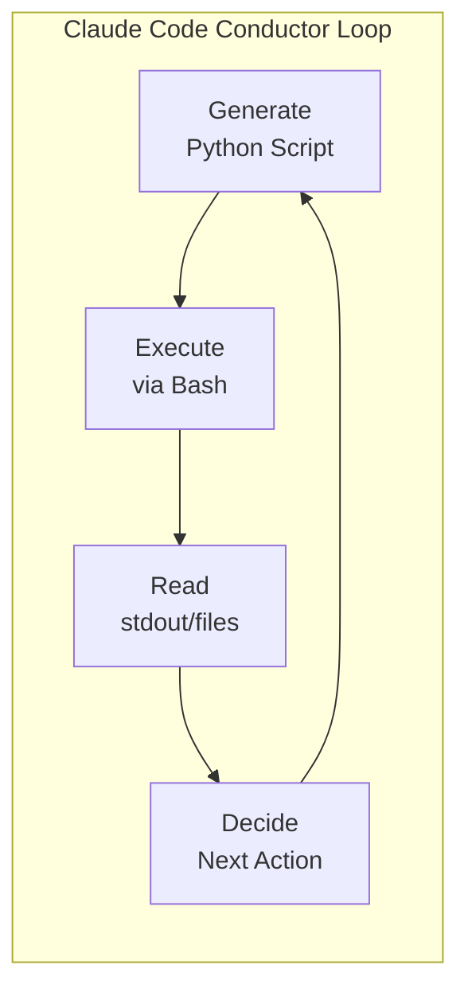

# Crawling Architecture — Team Input Document

> Auto-generated by `extract_architecture_crawling.py`
> Source: `/Users/cys/Desktop/AIagentsAutomation/GlobalNews-Crawling-AgenticWorkflow/planning/architecture-blueprint.md` + `/Users/cys/Desktop/AIagentsAutomation/GlobalNews-Crawling-AgenticWorkflow/planning/crawling-strategies.md`

## 1. Crawling Layer Architecture

#### Layer 2: Crawling Layer

| Component | Responsibility | Key Technology |
|-----------|---------------|----------------|
| **RSS/Sitemap Parser** | Tier 1 URL discovery (60-70% coverage) | feedparser, lxml |
| **HTTP Client** | Article page fetching with rate limiting | httpx (async) |
| **Playwright/Patchright** | Tier 3-4 dynamic rendering for JS-heavy sites | patchright 1.58 |
| **Anti-Block System** | 7-type block diagnosis + 6-Tier escalation + Circuit Breaker | Custom Python |
| **Dedup Engine** | URL normalization + content hash (SimHash/MinHash) | simhash, datasketch |
| **UA Manager** | 4-tier UA pool (61 static + dynamic Patchright fingerprints) | Custom Python |

[trace:step-1:site-reconnaissance] -- 28/44 sites have RSS; 33/44 have sitemaps; 3/44 require JS rendering.
[trace:step-2:dependency-validation-summary] -- httpx, feedparser, trafilatura, playwright, patchright all GO on Python 3.12.

# src/crawling/contracts.py
from dataclasses import dataclass, field
from datetime import datetime


@dataclass(frozen=True)
class RawArticle:
    """Contract: Crawling Layer output -> Analysis Layer input.

    Serialized as one JSON object per line in JSONL files at:
    data/raw/YYYY-MM-DD/{source_id}.jsonl
    """
    url: str                          # Canonical article URL (normalized)
    title: str                        # Article title (required)
    body: str                         # Article body text (may be empty for paywall)
    source_id: str                    # Site identifier (e.g., "chosun")
    source_name: str                  # Human-readable name (e.g., "Chosun Ilbo")
    language: str                     # ISO 639-1 code: "ko", "en", "zh", "ja", etc.
    published_at: datetime | None     # Publication datetime (None if unavailable)
    crawled_at: datetime              # Crawl timestamp (always present)
    author: str | None                # Author name (None if unavailable)
    category: str | None              # Section/category (None if unavailable)
    content_hash: str                 # SimHash of body for dedup
    crawl_tier: int                   # Which tier succeeded (1-6)
    crawl_method: str                 # "rss", "sitemap", "dom", "playwright"
    is_paywall_truncated: bool        # True if body is title-only due to paywall

    def to_jsonl_dict(self) -> dict:
        """Serialize for JSONL output. Timestamps as ISO 8601 strings."""
        ...
```

**Error handling at this boundary**: If `title` is empty or `url` is invalid, the article is logged to `data/logs/errors.log` and excluded from the JSONL file. The crawling layer never produces partial records.

### 4.3 Layer 3 Internal: Stage-to-Stage Contracts

Each analysis stage reads Parquet from the previous stage and writes Parquet to its output directory. The stage contract is implicit in the Parquet schema.

```python

# Daily crawl at 3:00 AM
0 3 * * * cd /path/to/global-news-crawler && python3 scripts/run_full.py --date $(date +\%Y-\%m-\%d) --parallel >> data/logs/cron.log 2>&1

#### Crawling Layer

| Package | Version | Verdict (Step 2) | Purpose |
|---------|---------|------------------|---------|
| httpx | 0.27+ | GO | Async HTTP client |
| feedparser | 6.0+ | GO | RSS/Atom parsing |
| trafilatura | 2.0.0 | GO | Article body extraction (primary) |
| fundus | 0.4.x | GO (Python 3.12) | Article body extraction (high-precision, ~39 English outlets) |
| newspaper4k | 0.9.4.1 | GO | Article body extraction (fallback) |
| playwright | 1.58+ | GO | Dynamic browser automation |
| patchright | 1.58+ | GO | CDP stealth bypass (replaces apify-fingerprint-suite) |
| beautifulsoup4 | 4.12+ | GO | HTML parsing |
| lxml | 5.0+ | GO | XML/HTML high-speed parsing |
| simhash | 2.1.2 | GO | Content deduplication |
| datasketch | 1.9.0 | GO | MinHash deduplication |

## 2. Interfaces & Data Contracts

## 4. Module Interface Contracts

### 4.1 Contract Design Principles

All inter-layer data contracts use Python **dataclasses** for type safety and IDE support. Pydantic is avoided to minimize dependencies in the data path; validation occurs at layer boundaries using explicit checks.

Dependency direction is strictly unidirectional:

```
Orchestration --> Crawling --> Analysis --> Storage
                                            ^
                    utils (cross-cutting) ---|
```

No reverse dependencies are permitted. The `utils/` package is the only shared module imported by all layers.

### 4.2 Layer 2 -> Layer 3: Raw Article Contract

```python

### 4.1 Contract Design Principles

All inter-layer data contracts use Python **dataclasses** for type safety and IDE support. Pydantic is avoided to minimize dependencies in the data path; validation occurs at layer boundaries using explicit checks.

Dependency direction is strictly unidirectional:

```
Orchestration --> Crawling --> Analysis --> Storage
                                            ^
                    utils (cross-cutting) ---|
```

No reverse dependencies are permitted. The `utils/` package is the only shared module imported by all layers.

### 4.2 Layer 2 -> Layer 3: Raw Article Contract

```python

# src/crawling/contracts.py
from dataclasses import dataclass, field
from datetime import datetime


@dataclass(frozen=True)
class RawArticle:
    """Contract: Crawling Layer output -> Analysis Layer input.

    Serialized as one JSON object per line in JSONL files at:
    data/raw/YYYY-MM-DD/{source_id}.jsonl
    """
    url: str                          # Canonical article URL (normalized)
    title: str                        # Article title (required)
    body: str                         # Article body text (may be empty for paywall)
    source_id: str                    # Site identifier (e.g., "chosun")
    source_name: str                  # Human-readable name (e.g., "Chosun Ilbo")
    language: str                     # ISO 639-1 code: "ko", "en", "zh", "ja", etc.
    published_at: datetime | None     # Publication datetime (None if unavailable)
    crawled_at: datetime              # Crawl timestamp (always present)
    author: str | None                # Author name (None if unavailable)
    category: str | None              # Section/category (None if unavailable)
    content_hash: str                 # SimHash of body for dedup
    crawl_tier: int                   # Which tier succeeded (1-6)
    crawl_method: str                 # "rss", "sitemap", "dom", "playwright"
    is_paywall_truncated: bool        # True if body is title-only due to paywall

    def to_jsonl_dict(self) -> dict:
        """Serialize for JSONL output. Timestamps as ISO 8601 strings."""
        ...
```

**Error handling at this boundary**: If `title` is empty or `url` is invalid, the article is logged to `data/logs/errors.log` and excluded from the JSONL file. The crawling layer never produces partial records.

### 4.3 Layer 3 Internal: Stage-to-Stage Contracts

Each analysis stage reads Parquet from the previous stage and writes Parquet to its output directory. The stage contract is implicit in the Parquet schema.

```python

### 4.3 Layer 3 Internal: Stage-to-Stage Contracts

Each analysis stage reads Parquet from the previous stage and writes Parquet to its output directory. The stage contract is implicit in the Parquet schema.

```python

# src/analysis/contracts.py
from dataclasses import dataclass, field
from datetime import datetime


@dataclass(frozen=True)
class ProcessedArticle:
    """Contract: Stage 1 (Preprocessing) output.
    Written to data/processed/articles.parquet.
    """
    article_id: str                   # UUID v4
    url: str
    title: str
    body: str
    source: str                       # source_name from RawArticle
    category: str                     # Defaults to "uncategorized" if None
    language: str                     # "ko" or "en" (verified by langdetect)
    published_at: datetime
    crawled_at: datetime
    author: str                       # Defaults to "" if None
    word_count: int                   # Word count (Korean: Kiwi morphemes; English: whitespace split)
    content_hash: str                 # SimHash carried from RawArticle


@dataclass
class ArticleFeatures:
    """Contract: Stage 2 (Feature Extraction) output.
    Written to data/features/{embeddings,tfidf,ner}.parquet.
    """
    article_id: str
    embedding: list[float]            # SBERT 384-dim vector
    tfidf_top_terms: list[str]        # Top 20 TF-IDF terms
    tfidf_scores: list[float]         # Corresponding TF-IDF scores
    entities_person: list[str]        # NER: person names
    entities_org: list[str]           # NER: organization names
    entities_location: list[str]      # NER: location names
    keywords: list[str]               # KeyBERT top-10 keywords


@dataclass
class ArticleAnalysis:
    """Contract: Stage 3 (Article-Level Analysis) output.
    Written to data/analysis/article_analysis.parquet.
    """
    article_id: str
    sentiment_label: str              # "positive" | "negative" | "neutral"
    sentiment_score: float            # -1.0 to 1.0
    emotion_joy: float                # Plutchik dimensions (0-1 each)
    emotion_trust: float
    emotion_fear: float
    emotion_surprise: float
    emotion_sadness: float
    emotion_disgust: float
    emotion_anger: float
    emotion_anticipation: float
    steeps_category: str              # "S" | "T" | "E" | "En" | "P" | "Se"
    importance_score: float           # 0-100


@dataclass
class TopicAssignment:
    """Contract: Stage 4 (Aggregation) output.
    Written to data/analysis/topics.parquet.
    """
    article_id: str
    topic_id: int                     # BERTopic topic ID (-1 = outlier)
    topic_label: str                  # Human-readable topic label
    topic_probability: float          # 0.0 to 1.0


@dataclass
class SignalRecord:
    """Contract: Stage 7 (Signal Classification) output.
    Written to data/output/signals.parquet.
    """
    signal_id: str                    # UUID v4
    signal_layer: str                 # "L1_fad" | "L2_short" | "L3_mid" | "L4_long" | "L5_singularity"
    signal_label: str                 # Human-readable signal description
    detected_at: datetime
    topic_ids: list[int]
    article_ids: list[str]
    burst_score: float | None
    changepoint_significance: float | None
    novelty_score: float | None
    singularity_composite: float | None
    evidence_summary: str
    confidence: float                 # 0.0 to 1.0
```

**Error handling at stage boundaries**: Each stage validates its input Parquet schema against the expected contract before processing. Schema mismatches raise `SchemaValidationError`, which the pipeline orchestrator catches to halt the pipeline with a clear error message. Partial stage outputs are never promoted to the next stage.

### 4.4 Layer 3 -> Layer 4: Final Output Contract

```python

### 4.4 Layer 3 -> Layer 4: Final Output Contract

```python

# src/storage/contracts.py
from dataclasses import dataclass


@dataclass(frozen=True)
class StorageManifest:
    """Contract: Analysis Stage 8 output -> Storage Layer.
    Describes the set of files to be written/updated.
    """
    analysis_parquet_path: str        # data/output/analysis.parquet
    signals_parquet_path: str         # data/output/signals.parquet
    sqlite_path: str                  # data/output/index.sqlite
    run_date: str                     # YYYY-MM-DD
    article_count: int                # Total articles in this run
    signal_count: int                 # Total signals detected
    topics_parquet_path: str          # data/output/topics.parquet (from Stage 4)
```

### 4.5 Error Handling Contract

```python

### 4.5 Error Handling Contract

```python

## 5. Data Schemas

### 5a. Parquet Schemas

All Parquet files use **ZSTD compression** (PRD SS8, Stage 8). Column definitions match PRD SS7.1 exactly.

#### 5a.1 articles.parquet -- Article Originals + Basic Metadata

**Location**: `data/processed/articles.parquet` (Stage 1 output) and `data/output/analysis.parquet` (Stage 8 merged)

| Column | Arrow Type | Nullable | Description | PRD Reference |
|--------|-----------|----------|-------------|---------------|
| `article_id` | `utf8` | NOT NULL | UUID v4 unique identifier | SS7.1.1 |
| `url` | `utf8` | NOT NULL | Canonical article URL (normalized, query params stripped) | SS7.1.1 |
| `title` | `utf8` | NOT NULL | Article headline | SS7.1.1 |
| `body` | `utf8` | NOT NULL | Full article body text (empty string for paywall-truncated) | SS7.1.1 |
| `source` | `utf8` | NOT NULL | Source site name (e.g., "Chosun Ilbo") | SS7.1.1 |
| `category` | `utf8` | NOT NULL | Category/section (e.g., "politics", "economy"; "uncategorized" default) | SS7.1.1 |
| `language` | `utf8` | NOT NULL | ISO 639-1 language code ("ko", "en", "zh", "ja", "de", "fr", "es", "ar", "he") | SS7.1.1 |
| `published_at` | `timestamp[us, tz=UTC]` | NOT NULL | Publication datetime in UTC | SS7.1.1 |
| `crawled_at` | `timestamp[us, tz=UTC]` | NOT NULL | Crawl timestamp in UTC | SS7.1.1 |
| `author` | `utf8` | NULLABLE | Author name (null if unavailable) | SS7.1.1 |
| `word_count` | `int32` | NOT NULL | Word count (Kiwi morphemes for ko; whitespace-split for en) | SS7.1.1 |
| `content_hash` | `utf8` | NOT NULL | SimHash of body text for deduplication | SS7.1.1 |

**Partition strategy**: Not date-partitioned at the Parquet level. The `data/raw/` JSONL files are date-partitioned by directory. Processed Parquet files accumulate across dates and are queried via DuckDB date filters on `published_at`. Date-level partitioning is applied when the dataset exceeds 100K articles by adding a `published_date` partition column.

**PyArrow schema definition**:

```python
import pyarrow as pa

ARTICLES_SCHEMA = pa.schema([
    pa.field("article_id", pa.utf8(), nullable=False),
    pa.field("url", pa.utf8(), nullable=False),
    pa.field("title", pa.utf8(), nullable=False),
    pa.field("body", pa.utf8(), nullable=False),
    pa.field("source", pa.utf8(), nullable=False),
    pa.field("category", pa.utf8(), nullable=False),
    pa.field("language", pa.utf8(), nullable=False),
    pa.field("published_at", pa.timestamp("us", tz="UTC"), nullable=False),
    pa.field("crawled_at", pa.timestamp("us", tz="UTC"), nullable=False),
    pa.field("author", pa.utf8(), nullable=True),
    pa.field("word_count", pa.int32(), nullable=False),
    pa.field("content_hash", pa.utf8(), nullable=False),
])
```

#### 5a.2 analysis.parquet -- Per-Article Analysis Results

**Location**: `data/analysis/article_analysis.parquet` (Stages 3-4 output) and `data/output/analysis.parquet` (Stage 8 merged)

| Column | Arrow Type | Nullable | Description | PRD Reference |
|--------|-----------|----------|-------------|---------------|
| `article_id` | `utf8` | NOT NULL | FK -> articles.article_id | SS7.1.2 |
| `sentiment_label` | `utf8` | NOT NULL | "positive" / "negative" / "neutral" | SS7.1.2 |
| `sentiment_score` | `float32` | NOT NULL | Sentiment score (-1.0 to 1.0) | SS7.1.2 |
| `emotion_joy` | `float32` | NOT NULL | Plutchik: joy (0-1) | SS7.1.2 |
| `emotion_trust` | `float32` | NOT NULL | Plutchik: trust (0-1) | SS7.1.2 |
| `emotion_fear` | `float32` | NOT NULL | Plutchik: fear (0-1) | SS7.1.2 |
| `emotion_surprise` | `float32` | NOT NULL | Plutchik: surprise (0-1) | SS7.1.2 |
| `emotion_sadness` | `float32` | NOT NULL | Plutchik: sadness (0-1) | SS7.1.2 |
| `emotion_disgust` | `float32` | NOT NULL | Plutchik: disgust (0-1) | SS7.1.2 |
| `emotion_anger` | `float32` | NOT NULL | Plutchik: anger (0-1) | SS7.1.2 |
| `emotion_anticipation` | `float32` | NOT NULL | Plutchik: anticipation (0-1) | SS7.1.2 |
| `topic_id` | `int32` | NOT NULL | BERTopic topic ID (-1 = outlier) | SS7.1.2 |
| `topic_label` | `utf8` | NOT NULL | Human-readable topic label | SS7.1.2 |
| `topic_probability` | `float32` | NOT NULL | Topic assignment probability (0-1) | SS7.1.2 |
| `steeps_category` | `utf8` | NOT NULL | STEEPS classification: "S"/"T"/"E"/"En"/"P"/"Se" | SS7.1.2 |
| `importance_score` | `float32` | NOT NULL | Article importance score (0-100) | SS7.1.2 |
| `keywords` | `list_<utf8>` | NOT NULL | KeyBERT extracted keywords (top 10) | SS7.1.2 |
| `entities_person` | `list_<utf8>` | NOT NULL | NER: person entities (may be empty list) | SS7.1.2 |
| `entities_org` | `list_<utf8>` | NOT NULL | NER: organization entities (may be empty list) | SS7.1.2 |
| `entities_location` | `list_<utf8>` | NOT NULL | NER: location entities (may be empty list) | SS7.1.2 |
| `embedding` | `list_<float32>` | NOT NULL | SBERT embedding vector (384 dimensions) | SS7.1.2 |

**PyArrow schema definition**:

```python
ANALYSIS_SCHEMA = pa.schema([
    pa.field("article_id", pa.utf8(), nullable=False),
    pa.field("sentiment_label", pa.utf8(), nullable=False),
    pa.field("sentiment_score", pa.float32(), nullable=False),
    pa.field("emotion_joy", pa.float32(), nullable=False),
    pa.field("emotion_trust", pa.float32(), nullable=False),
    pa.field("emotion_fear", pa.float32(), nullable=False),
    pa.field("emotion_surprise", pa.float32(), nullable=False),
    pa.field("emotion_sadness", pa.float32(), nullable=False),
    pa.field("emotion_disgust", pa.float32(), nullable=False),
    pa.field("emotion_anger", pa.float32(), nullable=False),
    pa.field("emotion_anticipation", pa.float32(), nullable=False),
    pa.field("topic_id", pa.int32(), nullable=False),
    pa.field("topic_label", pa.utf8(), nullable=False),
    pa.field("topic_probability", pa.float32(), nullable=False),
    pa.field("steeps_category", pa.utf8(), nullable=False),
    pa.field("importance_score", pa.float32(), nullable=False),
    pa.field("keywords", pa.list_(pa.utf8()), nullable=False),
    pa.field("entities_person", pa.list_(pa.utf8()), nullable=False),
    pa.field("entities_org", pa.list_(pa.utf8()), nullable=False),
    pa.field("entities_location", pa.list_(pa.utf8()), nullable=False),
    pa.field("embedding", pa.list_(pa.float32()), nullable=False),
])
```

#### 5a.3 signals.parquet -- 5-Layer Signal Classification

**Location**: `data/output/signals.parquet` (Stage 7-8 output)

| Column | Arrow Type | Nullable | Description | PRD Reference |
|--------|-----------|----------|-------------|---------------|
| `signal_id` | `utf8` | NOT NULL | UUID v4 unique signal identifier | SS7.1.3 |
| `signal_layer` | `utf8` | NOT NULL | "L1_fad" / "L2_short" / "L3_mid" / "L4_long" / "L5_singularity" | SS7.1.3 |
| `signal_label` | `utf8` | NOT NULL | Human-readable signal description | SS7.1.3 |
| `detected_at` | `timestamp[us, tz=UTC]` | NOT NULL | Detection timestamp | SS7.1.3 |
| `topic_ids` | `list_<int32>` | NOT NULL | Related BERTopic topic IDs | SS7.1.3 |
| `article_ids` | `list_<utf8>` | NOT NULL | Related article UUIDs | SS7.1.3 |
| `burst_score` | `float32` | NULLABLE | Kleinberg burst score (L1/L2 signals) | SS7.1.3 |
| `changepoint_significance` | `float32` | NULLABLE | PELT changepoint significance (L3/L4) | SS7.1.3 |
| `novelty_score` | `float32` | NULLABLE | LOF/Isolation Forest anomaly score (L5) | SS7.1.3 |
| `singularity_composite` | `float32` | NULLABLE | 7-indicator composite score (L5 only) | SS7.1.3 |
| `evidence_summary` | `utf8` | NOT NULL | Textual summary of detection evidence | SS7.1.3 |
| `confidence` | `float32` | NOT NULL | Classification confidence (0-1) | SS7.1.3 |

**PyArrow schema definition**:

```python
SIGNALS_SCHEMA = pa.schema([
    pa.field("signal_id", pa.utf8(), nullable=False),
    pa.field("signal_layer", pa.utf8(), nullable=False),
    pa.field("signal_label", pa.utf8(), nullable=False),
    pa.field("detected_at", pa.timestamp("us", tz="UTC"), nullable=False),
    pa.field("topic_ids", pa.list_(pa.int32()), nullable=False),
    pa.field("article_ids", pa.list_(pa.utf8()), nullable=False),
    pa.field("burst_score", pa.float32(), nullable=True),
    pa.field("changepoint_significance", pa.float32(), nullable=True),
    pa.field("novelty_score", pa.float32(), nullable=True),
    pa.field("singularity_composite", pa.float32(), nullable=True),
    pa.field("evidence_summary", pa.utf8(), nullable=False),
    pa.field("confidence", pa.float32(), nullable=False),
])
```

### 5b. SQLite Schemas

**Location**: `data/output/index.sqlite` (Stage 8 output)

All SQLite schemas match PRD SS7.2 exactly. DDL statements are provided below with indices and constraints.

```sql
-- ============================================================
-- articles_fts: Full-Text Search index (PRD SS7.2)
-- Purpose: Enable keyword search across article titles and bodies
-- Engine: FTS5 with unicode61 tokenizer for multilingual support
-- ============================================================
CREATE VIRTUAL TABLE articles_fts USING fts5(
    article_id UNINDEXED,           -- UUID, not searchable (join key only)
    title,                          -- Full-text indexed
    body,                           -- Full-text indexed
    source UNINDEXED,               -- Filter field, not searchable
    category UNINDEXED,             -- Filter field, not searchable
    language UNINDEXED,             -- Filter field, not searchable
    published_at UNINDEXED,         -- Filter field (ISO 8601 string)
    tokenize='unicode61'            -- Multilingual tokenization
);

-- ============================================================
-- article_embeddings: Vector similarity search (PRD SS7.2)
-- Purpose: Semantic similarity queries via sqlite-vec
-- Dimension: 384 (SBERT multilingual-MiniLM-L12-v2 output size)
-- ============================================================
CREATE VIRTUAL TABLE article_embeddings USING vec0(
    article_id TEXT PRIMARY KEY,     -- UUID, links to articles_fts
    embedding FLOAT[384]             -- SBERT embedding vector
);

-- ============================================================
-- signals_index: Signal lookup table (PRD SS7.2)
-- Purpose: Fast signal querying by layer, date, confidence
-- ============================================================
CREATE TABLE signals_index (
    signal_id TEXT PRIMARY KEY,      -- UUID
    signal_layer TEXT NOT NULL,      -- L1_fad / L2_short / L3_mid / L4_long / L5_singularity
    signal_label TEXT NOT NULL,      -- Human-readable label
    detected_at TEXT NOT NULL,       -- ISO 8601 datetime string
    confidence REAL,                 -- 0.0 to 1.0
    article_count INTEGER            -- Number of articles in this signal
);
CREATE INDEX idx_signals_layer ON signals_index(signal_layer);
CREATE INDEX idx_signals_date ON signals_index(detected_at);

-- ============================================================
-- topics_index: Topic lookup table (PRD SS7.2)
-- Purpose: Track topic lifecycle and trend direction
-- ============================================================
CREATE TABLE topics_index (
    topic_id INTEGER PRIMARY KEY,    -- BERTopic topic ID
    label TEXT,                      -- Human-readable topic label
    article_count INTEGER,           -- Total articles assigned to this topic
    first_seen TEXT,                 -- ISO 8601: first article date in topic
    last_seen TEXT,                  -- ISO 8601: last article date in topic
    trend_direction TEXT             -- "rising" / "stable" / "declining"
);

-- ============================================================
-- crawl_status: Per-site crawling state (PRD SS7.2)
-- Purpose: Track crawl health, success rates, escalation tier
-- ============================================================
CREATE TABLE crawl_status (
    source TEXT NOT NULL,            -- Site identifier (e.g., "chosun")
    last_crawled TEXT NOT NULL,      -- ISO 8601 datetime of last successful crawl
    articles_count INTEGER,          -- Total articles crawled from this source
    success_rate REAL,               -- 0.0 to 1.0 (recent 7-day success rate)
    current_tier INTEGER DEFAULT 1   -- Current escalation tier (1-6)
);
```

**Migration strategy**: SQLite schema is created fresh on first run via `src/storage/sqlite_manager.py`. Schema version is tracked in a `_meta` table:

```sql
CREATE TABLE IF NOT EXISTS _meta (
    key TEXT PRIMARY KEY,
    value TEXT NOT NULL
);
INSERT OR REPLACE INTO _meta (key, value) VALUES ('schema_version', '1');
INSERT OR REPLACE INTO _meta (key, value) VALUES ('created_at', datetime('now'));
```

For future schema changes, numbered migration scripts in `scripts/migrations/` apply incremental DDL. The SQLite manager checks `schema_version` on startup and applies pending migrations sequentially.

### 5c. sources.yaml Schema

**Location**: `data/config/sources.yaml`

This file configures all 44 news sites. Schema for each site entry:

```yaml

### 5a. Parquet Schemas

All Parquet files use **ZSTD compression** (PRD SS8, Stage 8). Column definitions match PRD SS7.1 exactly.

#### 5a.1 articles.parquet -- Article Originals + Basic Metadata

**Location**: `data/processed/articles.parquet` (Stage 1 output) and `data/output/analysis.parquet` (Stage 8 merged)

| Column | Arrow Type | Nullable | Description | PRD Reference |
|--------|-----------|----------|-------------|---------------|
| `article_id` | `utf8` | NOT NULL | UUID v4 unique identifier | SS7.1.1 |
| `url` | `utf8` | NOT NULL | Canonical article URL (normalized, query params stripped) | SS7.1.1 |
| `title` | `utf8` | NOT NULL | Article headline | SS7.1.1 |
| `body` | `utf8` | NOT NULL | Full article body text (empty string for paywall-truncated) | SS7.1.1 |
| `source` | `utf8` | NOT NULL | Source site name (e.g., "Chosun Ilbo") | SS7.1.1 |
| `category` | `utf8` | NOT NULL | Category/section (e.g., "politics", "economy"; "uncategorized" default) | SS7.1.1 |
| `language` | `utf8` | NOT NULL | ISO 639-1 language code ("ko", "en", "zh", "ja", "de", "fr", "es", "ar", "he") | SS7.1.1 |
| `published_at` | `timestamp[us, tz=UTC]` | NOT NULL | Publication datetime in UTC | SS7.1.1 |
| `crawled_at` | `timestamp[us, tz=UTC]` | NOT NULL | Crawl timestamp in UTC | SS7.1.1 |
| `author` | `utf8` | NULLABLE | Author name (null if unavailable) | SS7.1.1 |
| `word_count` | `int32` | NOT NULL | Word count (Kiwi morphemes for ko; whitespace-split for en) | SS7.1.1 |
| `content_hash` | `utf8` | NOT NULL | SimHash of body text for deduplication | SS7.1.1 |

**Partition strategy**: Not date-partitioned at the Parquet level. The `data/raw/` JSONL files are date-partitioned by directory. Processed Parquet files accumulate across dates and are queried via DuckDB date filters on `published_at`. Date-level partitioning is applied when the dataset exceeds 100K articles by adding a `published_date` partition column.

**PyArrow schema definition**:

```python
import pyarrow as pa

ARTICLES_SCHEMA = pa.schema([
    pa.field("article_id", pa.utf8(), nullable=False),
    pa.field("url", pa.utf8(), nullable=False),
    pa.field("title", pa.utf8(), nullable=False),
    pa.field("body", pa.utf8(), nullable=False),
    pa.field("source", pa.utf8(), nullable=False),
    pa.field("category", pa.utf8(), nullable=False),
    pa.field("language", pa.utf8(), nullable=False),
    pa.field("published_at", pa.timestamp("us", tz="UTC"), nullable=False),
    pa.field("crawled_at", pa.timestamp("us", tz="UTC"), nullable=False),
    pa.field("author", pa.utf8(), nullable=True),
    pa.field("word_count", pa.int32(), nullable=False),
    pa.field("content_hash", pa.utf8(), nullable=False),
])
```

#### 5a.2 analysis.parquet -- Per-Article Analysis Results

**Location**: `data/analysis/article_analysis.parquet` (Stages 3-4 output) and `data/output/analysis.parquet` (Stage 8 merged)

| Column | Arrow Type | Nullable | Description | PRD Reference |
|--------|-----------|----------|-------------|---------------|
| `article_id` | `utf8` | NOT NULL | FK -> articles.article_id | SS7.1.2 |
| `sentiment_label` | `utf8` | NOT NULL | "positive" / "negative" / "neutral" | SS7.1.2 |
| `sentiment_score` | `float32` | NOT NULL | Sentiment score (-1.0 to 1.0) | SS7.1.2 |
| `emotion_joy` | `float32` | NOT NULL | Plutchik: joy (0-1) | SS7.1.2 |
| `emotion_trust` | `float32` | NOT NULL | Plutchik: trust (0-1) | SS7.1.2 |
| `emotion_fear` | `float32` | NOT NULL | Plutchik: fear (0-1) | SS7.1.2 |
| `emotion_surprise` | `float32` | NOT NULL | Plutchik: surprise (0-1) | SS7.1.2 |
| `emotion_sadness` | `float32` | NOT NULL | Plutchik: sadness (0-1) | SS7.1.2 |
| `emotion_disgust` | `float32` | NOT NULL | Plutchik: disgust (0-1) | SS7.1.2 |
| `emotion_anger` | `float32` | NOT NULL | Plutchik: anger (0-1) | SS7.1.2 |
| `emotion_anticipation` | `float32` | NOT NULL | Plutchik: anticipation (0-1) | SS7.1.2 |
| `topic_id` | `int32` | NOT NULL | BERTopic topic ID (-1 = outlier) | SS7.1.2 |
| `topic_label` | `utf8` | NOT NULL | Human-readable topic label | SS7.1.2 |
| `topic_probability` | `float32` | NOT NULL | Topic assignment probability (0-1) | SS7.1.2 |
| `steeps_category` | `utf8` | NOT NULL | STEEPS classification: "S"/"T"/"E"/"En"/"P"/"Se" | SS7.1.2 |
| `importance_score` | `float32` | NOT NULL | Article importance score (0-100) | SS7.1.2 |
| `keywords` | `list_<utf8>` | NOT NULL | KeyBERT extracted keywords (top 10) | SS7.1.2 |
| `entities_person` | `list_<utf8>` | NOT NULL | NER: person entities (may be empty list) | SS7.1.2 |
| `entities_org` | `list_<utf8>` | NOT NULL | NER: organization entities (may be empty list) | SS7.1.2 |
| `entities_location` | `list_<utf8>` | NOT NULL | NER: location entities (may be empty list) | SS7.1.2 |
| `embedding` | `list_<float32>` | NOT NULL | SBERT embedding vector (384 dimensions) | SS7.1.2 |

**PyArrow schema definition**:

```python
ANALYSIS_SCHEMA = pa.schema([
    pa.field("article_id", pa.utf8(), nullable=False),
    pa.field("sentiment_label", pa.utf8(), nullable=False),
    pa.field("sentiment_score", pa.float32(), nullable=False),
    pa.field("emotion_joy", pa.float32(), nullable=False),
    pa.field("emotion_trust", pa.float32(), nullable=False),
    pa.field("emotion_fear", pa.float32(), nullable=False),
    pa.field("emotion_surprise", pa.float32(), nullable=False),
    pa.field("emotion_sadness", pa.float32(), nullable=False),
    pa.field("emotion_disgust", pa.float32(), nullable=False),
    pa.field("emotion_anger", pa.float32(), nullable=False),
    pa.field("emotion_anticipation", pa.float32(), nullable=False),
    pa.field("topic_id", pa.int32(), nullable=False),
    pa.field("topic_label", pa.utf8(), nullable=False),
    pa.field("topic_probability", pa.float32(), nullable=False),
    pa.field("steeps_category", pa.utf8(), nullable=False),
    pa.field("importance_score", pa.float32(), nullable=False),
    pa.field("keywords", pa.list_(pa.utf8()), nullable=False),
    pa.field("entities_person", pa.list_(pa.utf8()), nullable=False),
    pa.field("entities_org", pa.list_(pa.utf8()), nullable=False),
    pa.field("entities_location", pa.list_(pa.utf8()), nullable=False),
    pa.field("embedding", pa.list_(pa.float32()), nullable=False),
])
```

#### 5a.3 signals.parquet -- 5-Layer Signal Classification

**Location**: `data/output/signals.parquet` (Stage 7-8 output)

| Column | Arrow Type | Nullable | Description | PRD Reference |
|--------|-----------|----------|-------------|---------------|
| `signal_id` | `utf8` | NOT NULL | UUID v4 unique signal identifier | SS7.1.3 |
| `signal_layer` | `utf8` | NOT NULL | "L1_fad" / "L2_short" / "L3_mid" / "L4_long" / "L5_singularity" | SS7.1.3 |
| `signal_label` | `utf8` | NOT NULL | Human-readable signal description | SS7.1.3 |
| `detected_at` | `timestamp[us, tz=UTC]` | NOT NULL | Detection timestamp | SS7.1.3 |
| `topic_ids` | `list_<int32>` | NOT NULL | Related BERTopic topic IDs | SS7.1.3 |
| `article_ids` | `list_<utf8>` | NOT NULL | Related article UUIDs | SS7.1.3 |
| `burst_score` | `float32` | NULLABLE | Kleinberg burst score (L1/L2 signals) | SS7.1.3 |
| `changepoint_significance` | `float32` | NULLABLE | PELT changepoint significance (L3/L4) | SS7.1.3 |
| `novelty_score` | `float32` | NULLABLE | LOF/Isolation Forest anomaly score (L5) | SS7.1.3 |
| `singularity_composite` | `float32` | NULLABLE | 7-indicator composite score (L5 only) | SS7.1.3 |
| `evidence_summary` | `utf8` | NOT NULL | Textual summary of detection evidence | SS7.1.3 |
| `confidence` | `float32` | NOT NULL | Classification confidence (0-1) | SS7.1.3 |

**PyArrow schema definition**:

```python
SIGNALS_SCHEMA = pa.schema([
    pa.field("signal_id", pa.utf8(), nullable=False),
    pa.field("signal_layer", pa.utf8(), nullable=False),
    pa.field("signal_label", pa.utf8(), nullable=False),
    pa.field("detected_at", pa.timestamp("us", tz="UTC"), nullable=False),
    pa.field("topic_ids", pa.list_(pa.int32()), nullable=False),
    pa.field("article_ids", pa.list_(pa.utf8()), nullable=False),
    pa.field("burst_score", pa.float32(), nullable=True),
    pa.field("changepoint_significance", pa.float32(), nullable=True),
    pa.field("novelty_score", pa.float32(), nullable=True),
    pa.field("singularity_composite", pa.float32(), nullable=True),
    pa.field("evidence_summary", pa.utf8(), nullable=False),
    pa.field("confidence", pa.float32(), nullable=False),
])
```

### 5b. SQLite Schemas

**Location**: `data/output/index.sqlite` (Stage 8 output)

All SQLite schemas match PRD SS7.2 exactly. DDL statements are provided below with indices and constraints.

```sql
-- ============================================================
-- articles_fts: Full-Text Search index (PRD SS7.2)
-- Purpose: Enable keyword search across article titles and bodies
-- Engine: FTS5 with unicode61 tokenizer for multilingual support
-- ============================================================
CREATE VIRTUAL TABLE articles_fts USING fts5(
    article_id UNINDEXED,           -- UUID, not searchable (join key only)
    title,                          -- Full-text indexed
    body,                           -- Full-text indexed
    source UNINDEXED,               -- Filter field, not searchable
    category UNINDEXED,             -- Filter field, not searchable
    language UNINDEXED,             -- Filter field, not searchable
    published_at UNINDEXED,         -- Filter field (ISO 8601 string)
    tokenize='unicode61'            -- Multilingual tokenization
);

-- ============================================================
-- article_embeddings: Vector similarity search (PRD SS7.2)
-- Purpose: Semantic similarity queries via sqlite-vec
-- Dimension: 384 (SBERT multilingual-MiniLM-L12-v2 output size)
-- ============================================================
CREATE VIRTUAL TABLE article_embeddings USING vec0(
    article_id TEXT PRIMARY KEY,     -- UUID, links to articles_fts
    embedding FLOAT[384]             -- SBERT embedding vector
);

-- ============================================================
-- signals_index: Signal lookup table (PRD SS7.2)
-- Purpose: Fast signal querying by layer, date, confidence
-- ============================================================
CREATE TABLE signals_index (
    signal_id TEXT PRIMARY KEY,      -- UUID
    signal_layer TEXT NOT NULL,      -- L1_fad / L2_short / L3_mid / L4_long / L5_singularity
    signal_label TEXT NOT NULL,      -- Human-readable label
    detected_at TEXT NOT NULL,       -- ISO 8601 datetime string
    confidence REAL,                 -- 0.0 to 1.0
    article_count INTEGER            -- Number of articles in this signal
);
CREATE INDEX idx_signals_layer ON signals_index(signal_layer);
CREATE INDEX idx_signals_date ON signals_index(detected_at);

-- ============================================================
-- topics_index: Topic lookup table (PRD SS7.2)
-- Purpose: Track topic lifecycle and trend direction
-- ============================================================
CREATE TABLE topics_index (
    topic_id INTEGER PRIMARY KEY,    -- BERTopic topic ID
    label TEXT,                      -- Human-readable topic label
    article_count INTEGER,           -- Total articles assigned to this topic
    first_seen TEXT,                 -- ISO 8601: first article date in topic
    last_seen TEXT,                  -- ISO 8601: last article date in topic
    trend_direction TEXT             -- "rising" / "stable" / "declining"
);

-- ============================================================
-- crawl_status: Per-site crawling state (PRD SS7.2)
-- Purpose: Track crawl health, success rates, escalation tier
-- ============================================================
CREATE TABLE crawl_status (
    source TEXT NOT NULL,            -- Site identifier (e.g., "chosun")
    last_crawled TEXT NOT NULL,      -- ISO 8601 datetime of last successful crawl
    articles_count INTEGER,          -- Total articles crawled from this source
    success_rate REAL,               -- 0.0 to 1.0 (recent 7-day success rate)
    current_tier INTEGER DEFAULT 1   -- Current escalation tier (1-6)
);
```

**Migration strategy**: SQLite schema is created fresh on first run via `src/storage/sqlite_manager.py`. Schema version is tracked in a `_meta` table:

```sql
CREATE TABLE IF NOT EXISTS _meta (
    key TEXT PRIMARY KEY,
    value TEXT NOT NULL
);
INSERT OR REPLACE INTO _meta (key, value) VALUES ('schema_version', '1');
INSERT OR REPLACE INTO _meta (key, value) VALUES ('created_at', datetime('now'));
```

For future schema changes, numbered migration scripts in `scripts/migrations/` apply incremental DDL. The SQLite manager checks `schema_version` on startup and applies pending migrations sequentially.

### 5c. sources.yaml Schema

**Location**: `data/config/sources.yaml`

This file configures all 44 news sites. Schema for each site entry:

```yaml

# sources.yaml schema definition

### 5d. pipeline.yaml Schema

**Location**: `data/config/pipeline.yaml`

This file configures the 8-stage analysis pipeline. Each stage can be independently enabled/disabled and has its own resource constraints.

```yaml

# pipeline.yaml schema definition

pipeline:
  version: "1.0"
  python_version: "3.12"             # Step 4 decision D1
  global:
    max_memory_gb: 10                # PRD C3: 10 GB pipeline limit
    log_level: "INFO"                # DEBUG | INFO | WARNING | ERROR
    gc_between_stages: true          # Force gc.collect() between stages
    parquet_compression: "zstd"      # ZSTD compression for all Parquet output
    batch_size_default: 500          # Default batch size for article processing

  stages:
    stage_1_preprocessing:
      enabled: true
      description: "Korean: Kiwi morpheme analysis; English: spaCy lemmatization; language detection"
      input_format: "jsonl"          # Reads from data/raw/YYYY-MM-DD/*.jsonl
      output_format: "parquet"       # Writes to data/processed/articles.parquet
      output_path: "data/processed/articles.parquet"
      parallelism: 1                 # Sequential (single process)
      memory_limit_gb: 1.5           # Kiwi ~760 MB + spaCy ~200 MB + overhead
      timeout_seconds: 1800          # 30 minutes max
      models:
        - name: "kiwipiepy"
          version: "0.22.2"
          singleton: true            # Step 2 R2: mandatory singleton
          warmup: true               # Pre-load and warm up
        - name: "spacy_en_core_web_sm"
          version: "3.7+"
          singleton: true
          warmup: false
      dependencies: []               # No stage dependencies (first stage)

    stage_2_features:
      enabled: true
      description: "SBERT embeddings, TF-IDF, NER, KeyBERT keyword extraction"
      input_format: "parquet"        # Reads from data/processed/articles.parquet
      output_format: "parquet"       # Writes to data/features/{embeddings,tfidf,ner}.parquet
      output_paths:
        - "data/features/embeddings.parquet"
        - "data/features/tfidf.parquet"
        - "data/features/ner.parquet"
      parallelism: 1
      memory_limit_gb: 2.5           # SBERT ~1.1 GB + KeyBERT ~20 MB + scikit-learn ~200 MB
      timeout_seconds: 3600          # 1 hour max
      sbert_batch_size: 64           # Step 2 R4: 64 for M2 Pro 16GB
      models:
        - name: "sentence-transformers/paraphrase-multilingual-MiniLM-L12-v2"
          version: "3.0+"
          singleton: true
          warmup: true
        - name: "keybert"
          version: "0.9.0"
          singleton: true
          warmup: false              # Shares SBERT model (Step 2 R5)
        - name: "Davlan/xlm-roberta-base-ner-hrl"
          version: "latest"
          singleton: true
          warmup: true
      dependencies:
        - "stage_1_preprocessing"

    stage_3_article:
      enabled: true
      description: "Sentiment, Plutchik 8-emotion, zero-shot STEEPS classification, importance scoring"
      input_format: "parquet"        # Reads from features Parquet
      output_format: "parquet"
      output_path: "data/analysis/article_analysis.parquet"
      parallelism: 1
      memory_limit_gb: 2.0           # Sentiment model ~500 MB + zero-shot ~500 MB
      timeout_seconds: 3600
      models:
        - name: "monologg/koelectra-base-finetuned-naver-ner"
          version: "latest"
          singleton: true
          warmup: true
        - name: "facebook/bart-large-mnli"
          version: "latest"
          singleton: true
          warmup: true
      dependencies:
        - "stage_2_features"

    stage_4_aggregation:
      enabled: true
      description: "BERTopic topic modeling, Dynamic Topic Modeling, HDBSCAN clustering, NMF/LDA, community detection"
      input_format: "parquet"
      output_format: "parquet"
      output_paths:
        - "data/analysis/topics.parquet"
        - "data/analysis/networks.parquet"
      parallelism: 1
      memory_limit_gb: 3.0           # BERTopic ~1.2 GB (shared SBERT) + HDBSCAN + network libs
      timeout_seconds: 3600
      min_articles_for_topics: 50    # Minimum articles for topic modeling
      models:
        - name: "bertopic"
          version: "0.17.4"
          singleton: true
          warmup: false              # Fit on data, not pre-loaded
          sbert_sharing: true        # Step 2 R5: share SBERT model
      dependencies:
        - "stage_3_article"

    stage_5_timeseries:
      enabled: true
      description: "STL decomposition, Kleinberg burst, PELT changepoint, Prophet forecast, wavelet analysis"
      input_format: "parquet"
      output_format: "parquet"
      output_path: "data/analysis/timeseries.parquet"
      parallelism: 1
      memory_limit_gb: 1.5           # Time series libs are lightweight
      timeout_seconds: 1800
      min_days_for_analysis: 7       # PRD SS5.2.3: L1 minimum 7 days
      forecast_horizon_days: 30      # Prophet forecast horizon
      models: []                     # No heavy ML models; statistical methods only
      dependencies:
        - "stage_4_aggregation"

    stage_6_cross:
      enabled: true
      description: "Granger causality, PCMCI, co-occurrence networks, cross-lingual topic alignment, frame analysis"
      input_format: "parquet"
      output_format: "parquet"
      output_path: "data/analysis/cross_analysis.parquet"
      parallelism: 1
      memory_limit_gb: 2.0           # Network analysis + causal inference
      timeout_seconds: 3600
      min_articles_for_granger: 100  # Minimum articles for Granger test
      models: []
      dependencies:
        - "stage_5_timeseries"

    stage_7_signals:
      enabled: true
      description: "5-Layer signal classification (L1-L5), novelty detection (LOF/IF), BERTrend weak signal detection"
      input_format: "parquet"
      output_format: "parquet"
      output_path: "data/output/signals.parquet"
      parallelism: 1
      memory_limit_gb: 1.5           # Classification rules + LOF/IF
      timeout_seconds: 1800
      signal_confidence_threshold: 0.5  # Minimum confidence for signal inclusion
      singularity_weights:           # PRD SS5.2.4: w1-w7 weights
        ood_score: 0.20
        changepoint_significance: 0.15
        cross_domain_emergence: 0.15
        bertrend_transition: 0.15
        entropy_spike: 0.10
        novelty_score: 0.15
        network_anomaly: 0.10
      models: []
      dependencies:
        - "stage_6_cross"

    stage_8_output:
      enabled: true
      description: "Final Parquet merge (ZSTD), SQLite FTS5 + vec index, DuckDB compatibility check"
      input_format: "parquet"
      output_format: "parquet+sqlite"
      output_paths:
        - "data/output/analysis.parquet"
        - "data/output/signals.parquet"
        - "data/output/index.sqlite"
      parallelism: 1
      memory_limit_gb: 2.0           # Parquet merge + SQLite write
      timeout_seconds: 1800
      models: []
      dependencies:
        - "stage_7_signals"
```

**Validation rules** (enforced by `src/utils/config_loader.py`):

| Field | Validation |
|-------|-----------|
| `stages.*.enabled` | Boolean |
| `stages.*.input_format` | One of: jsonl, parquet |
| `stages.*.output_format` | One of: parquet, parquet+sqlite |
| `stages.*.parallelism` | Integer >= 1 |
| `stages.*.memory_limit_gb` | Float > 0, sum of all enabled stages < `global.max_memory_gb` |
| `stages.*.timeout_seconds` | Integer >= 60 |
| `stages.*.dependencies` | List of valid stage names (DAG check: no cycles) |
| `global.max_memory_gb` | Float > 0, <= 10 (PRD C3 constraint) |
| `global.parquet_compression` | One of: zstd, snappy, lz4, none |

---

## 6. Conductor Pattern Mapping

The Conductor Pattern (PRD SS6.4) defines how Claude Code orchestrates the system: **Generate -> Execute -> Read -> Decide**. Each module is designed to be invocable as an independent Python script that Claude Code can generate and run.

### 6.1 Pattern Per Module



| Module | Generate | Execute | Read | Decide |
|--------|----------|---------|------|--------|
| **Crawling** | `scripts/run_crawl.py --date 2026-02-25` | `python3 scripts/run_crawl.py ...` | Read `data/logs/crawl.log` for success/failure counts | If failures > threshold: escalate tier or trigger Tier 6 |
| **Analysis** | `scripts/run_analysis.py --date 2026-02-25 --stages 1-8` | `python3 scripts/run_analysis.py ...` | Read stage output Parquet files + `data/logs/analysis.log` | If stage fails: retry with different config or skip stage |
| **Storage** | Implicit in Stage 8 | Stage 8 writes Parquet + SQLite | Verify `data/output/` files exist and have expected row counts | If validation fails: re-run Stage 8 |
| **Rescan** | `scripts/rescan_structure.py` | `python3 scripts/rescan_structure.py` | Read diff report of changed site structures | Update `sources.yaml` selectors or flag for manual review |
| **Anti-Block (Tier 6)** | Claude Code generates site-specific bypass script | `python3 tier6_bypass_{site}.py` | Read HTTP response codes, extracted content | Store successful strategy in site adapter for reuse |

### 6.2 Script Entry Points

```

## 3. Code Snippets (from Blueprint)

```python
# src/crawling/contracts.py
from dataclasses import dataclass, field
from datetime import datetime


@dataclass(frozen=True)
class RawArticle:
    """Contract: Crawling Layer output -> Analysis Layer input.

    Serialized as one JSON object per line in JSONL files at:
    data/raw/YYYY-MM-DD/{source_id}.jsonl
    """
    url: str                          # Canonical article URL (normalized)
    title: str                        # Article title (required)
    body: str                         # Article body text (may be empty for paywall)
    source_id: str                    # Site identifier (e.g., "chosun")
    source_name: str                  # Human-readable name (e.g., "Chosun Ilbo")
    language: str                     # ISO 639-1 code: "ko", "en", "zh", "ja", etc.
    published_at: datetime | None     # Publication datetime (None if unavailable)
    crawled_at: datetime              # Crawl timestamp (always present)
    author: str | None                # Author name (None if unavailable)
    category: str | None              # Section/category (None if unavailable)
    content_hash: str                 # SimHash of body for dedup
    crawl_tier: int                   # Which tier succeeded (1-6)
    crawl_method: str                 # "rss", "sitemap", "dom", "playwright"
    is_paywall_truncated: bool        # True if body is title-only due to paywall

    def to_jsonl_dict(self) -> dict:
        """Serialize for JSONL output. Timestamps as ISO 8601 strings."""
        ...
```

```python
# src/analysis/contracts.py
from dataclasses import dataclass, field
from datetime import datetime


@dataclass(frozen=True)
class ProcessedArticle:
    """Contract: Stage 1 (Preprocessing) output.
    Written to data/processed/articles.parquet.
    """
    article_id: str                   # UUID v4
    url: str
    title: str
    body: str
    source: str                       # source_name from RawArticle
    category: str                     # Defaults to "uncategorized" if None
    language: str                     # "ko" or "en" (verified by langdetect)
    published_at: datetime
    crawled_at: datetime
    author: str                       # Defaults to "" if None
    word_count: int                   # Word count (Korean: Kiwi morphemes; English: whitespace split)
    content_hash: str                 # SimHash carried from RawArticle


@dataclass
class ArticleFeatures:
    """Contract: Stage 2 (Feature Extraction) output.
    Written to data/features/{embeddings,tfidf,ner}.parquet.
    """
    article_id: str
    embedding: list[float]            # SBERT 384-dim vector
    tfidf_top_terms: list[str]        # Top 20 TF-IDF terms
    tfidf_scores: list[float]         # Corresponding TF-IDF scores
    entities_person: list[str]        # NER: person names
    entities_org: list[str]           # NER: organization names
    entities_location: list[str]      # NER: location names
    keywords: list[str]               # KeyBERT top-10 keywords


@dataclass
class ArticleAnalysis:
    """Contract: Stage 3 (Article-Level Analysis) output.
    Written to data/analysis/article_analysis.parquet.
    """
    article_id: str
    sentiment_label: str              # "positive" | "negative" | "neutral"
    sentiment_score: float            # -1.0 to 1.0
    emotion_joy: float                # Plutchik dimensions (0-1 each)
    emotion_trust: float
    emotion_fear: float
    emotion_surprise: float
    emotion_sadness: float
    emotion_disgust: float
    emotion_anger: float
    emotion_anticipation: float
    steeps_category: str              # "S" | "T" | "E" | "En" | "P" | "Se"
    importance_score: float           # 0-100


@dataclass
class TopicAssignment:
    """Contract: Stage 4 (Aggregation) output.
    Written to data/analysis/topics.parquet.
    """
    article_id: str
    topic_id: int                     # BERTopic topic ID (-1 = outlier)
    topic_label: str                  # Human-readable topic label
    topic_probability: float          # 0.0 to 1.0


@dataclass
class SignalRecord:
    """Contract: Stage 7 (Signal Classification) output.
    Written to data/output/signals.parquet.
    """
    signal_id: str                    # UUID v4
    signal_layer: str                 # "L1_fad" | "L2_short" | "L3_mid" | "L4_long" | "L5_singularity"
    signal_label: str                 # Human-readable signal description
    detected_at: datetime
    topic_ids: list[int]
    article_ids: list[str]
    burst_score: float | None
    changepoint_significance: float | None
    novelty_score: float | None
    singularity_composite: float | None
    evidence_summary: str
    confidence: float                 # 0.0 to 1.0
```

```python
# src/storage/contracts.py
from dataclasses import dataclass


@dataclass(frozen=True)
class StorageManifest:
    """Contract: Analysis Stage 8 output -> Storage Layer.
    Describes the set of files to be written/updated.
    """
    analysis_parquet_path: str        # data/output/analysis.parquet
    signals_parquet_path: str         # data/output/signals.parquet
    sqlite_path: str                  # data/output/index.sqlite
    run_date: str                     # YYYY-MM-DD
    article_count: int                # Total articles in this run
    signal_count: int                 # Total signals detected
    topics_parquet_path: str          # data/output/topics.parquet (from Stage 4)
```

```python
# src/utils/error_handler.py
from dataclasses import dataclass
from enum import Enum


class ErrorSeverity(Enum):
    WARN = "warn"       # Log and continue (e.g., single article extraction failure)
    ERROR = "error"     # Log and skip item (e.g., site unreachable after retries)
    FATAL = "fatal"     # Log and halt pipeline (e.g., schema validation failure)


@dataclass(frozen=True)
class PipelineError:
    """Standardized error record for all layers."""
    layer: str                        # "crawling" | "analysis" | "storage"
    component: str                    # Module name (e.g., "network_guard")
    severity: ErrorSeverity
    message: str
    source_id: str | None             # Site ID if applicable
    article_url: str | None           # Article URL if applicable
    retry_count: int                  # Number of retries attempted
    timestamp: str                    # ISO 8601
```

```python
import pyarrow as pa

ARTICLES_SCHEMA = pa.schema([
    pa.field("article_id", pa.utf8(), nullable=False),
    pa.field("url", pa.utf8(), nullable=False),
    pa.field("title", pa.utf8(), nullable=False),
    pa.field("body", pa.utf8(), nullable=False),
    pa.field("source", pa.utf8(), nullable=False),
    pa.field("category", pa.utf8(), nullable=False),
    pa.field("language", pa.utf8(), nullable=False),
    pa.field("published_at", pa.timestamp("us", tz="UTC"), nullable=False),
    pa.field("crawled_at", pa.timestamp("us", tz="UTC"), nullable=False),
    pa.field("author", pa.utf8(), nullable=True),
    pa.field("word_count", pa.int32(), nullable=False),
    pa.field("content_hash", pa.utf8(), nullable=False),
])
```

```python
ANALYSIS_SCHEMA = pa.schema([
    pa.field("article_id", pa.utf8(), nullable=False),
    pa.field("sentiment_label", pa.utf8(), nullable=False),
    pa.field("sentiment_score", pa.float32(), nullable=False),
    pa.field("emotion_joy", pa.float32(), nullable=False),
    pa.field("emotion_trust", pa.float32(), nullable=False),
    pa.field("emotion_fear", pa.float32(), nullable=False),
    pa.field("emotion_surprise", pa.float32(), nullable=False),
    pa.field("emotion_sadness", pa.float32(), nullable=False),
    pa.field("emotion_disgust", pa.float32(), nullable=False),
    pa.field("emotion_anger", pa.float32(), nullable=False),
    pa.field("emotion_anticipation", pa.float32(), nullable=False),
    pa.field("topic_id", pa.int32(), nullable=False),
    pa.field("topic_label", pa.utf8(), nullable=False),
    pa.field("topic_probability", pa.float32(), nullable=False),
    pa.field("steeps_category", pa.utf8(), nullable=False),
    pa.field("importance_score", pa.float32(), nullable=False),
    pa.field("keywords", pa.list_(pa.utf8()), nullable=False),
    pa.field("entities_person", pa.list_(pa.utf8()), nullable=False),
    pa.field("entities_org", pa.list_(pa.utf8()), nullable=False),
    pa.field("entities_location", pa.list_(pa.utf8()), nullable=False),
    pa.field("embedding", pa.list_(pa.float32()), nullable=False),
])
```

```python
SIGNALS_SCHEMA = pa.schema([
    pa.field("signal_id", pa.utf8(), nullable=False),
    pa.field("signal_layer", pa.utf8(), nullable=False),
    pa.field("signal_label", pa.utf8(), nullable=False),
    pa.field("detected_at", pa.timestamp("us", tz="UTC"), nullable=False),
    pa.field("topic_ids", pa.list_(pa.int32()), nullable=False),
    pa.field("article_ids", pa.list_(pa.utf8()), nullable=False),
    pa.field("burst_score", pa.float32(), nullable=True),
    pa.field("changepoint_significance", pa.float32(), nullable=True),
    pa.field("novelty_score", pa.float32(), nullable=True),
    pa.field("singularity_composite", pa.float32(), nullable=True),
    pa.field("evidence_summary", pa.utf8(), nullable=False),
    pa.field("confidence", pa.float32(), nullable=False),
])
```

```python
import os
import gc
import psutil

def get_rss_mb() -> float:
    """Current process RSS in MB."""
    return psutil.Process(os.getpid()).memory_info().rss / (1024 * 1024)

def check_memory_budget(limit_gb: float = 10.0) -> bool:
    """Return True if under budget. Log warning if > 80% of limit."""
    current_gb = get_rss_mb() / 1024
    if current_gb > limit_gb * 0.8:
        logger.warning(f"Memory at {current_gb:.1f} GB ({current_gb/limit_gb*100:.0f}% of {limit_gb} GB limit)")
    return current_gb < limit_gb

def gc_between_stages() -> float:
    """Force garbage collection. Returns MB freed (may be 0 for torch)."""
    before = get_rss_mb()
    gc.collect()
    after = get_rss_mb()
    freed = before - after
    logger.info(f"gc.collect(): {before:.0f} MB -> {after:.0f} MB (freed {freed:.0f} MB)")
    return freed
```

## 4. Crawling Strategy Summary (from Step 6)

## Executive Summary

| Metric | Value |
|--------|-------|
| **Total sites** | 44 (43 news + 1 entertainment) |
| **Total daily article estimate** | ~6,395 articles |
| **Sequential crawl time** | ~150 min (exceeds 120-min budget) |
| **Parallel crawl time** | ~53 min (within 120-min budget) |
| **Primary methods** | RSS: 29, Sitemap: 9, Playwright: 2, API: 2, DOM: 2 |
| **Sites requiring proxy** | 22 (Korean: 18, Japanese: 1, German: 1, UK: 1 REC, ME: 1 REC) |
| **Hard paywall (title-only)** | 5 (nytimes, ft, wsj, bloomberg, lemonde) |
| **Soft-metered paywall** | 6 (joongang, hankyung, hani, marketwatch, latimes, nationalpost) |
| **HIGH bot-blocking** | 16 sites |
| **UA pool size** | 61+ static UAs across 4 tiers + Patchright dynamic fingerprints |

[trace:step-1:difficulty-classification-matrix] — 44 sites: Easy(9), Medium(19), Hard(11), Extreme(5)
[trace:step-3:strategy-matrix] — Parallel ~53 min mandatory, 6,460 daily articles
[trace:step-4:decisions] — Python 3.12, 43 news sites, proxy deploy, title-only paywall
[trace:step-5:sources-yaml-schema] — All configurations aligned with sources.yaml schema (Section 5c)

---

## Unified Strategy Matrix (All 44 Sites)

### Group A: Korean Major Dailies (5 sites)

| # | Site | Primary | Fallback | Rate | UA Tier | Bot Block | Proxy | Paywall | Daily Est. | Min |
|---|------|---------|----------|------|---------|-----------|-------|---------|-----------|-----|
| 1 | chosun.com | RSS | Sitemap→DOM | 5s | T2 (10) | MEDIUM | KR | none | ~200 | 3.5 |
| 2 | joongang.co.kr | RSS | Sitemap→DOM | 10s+j | T3 (50) | HIGH | KR | soft | ~180 | 6.0 |
| 3 | donga.com | RSS | Sitemap→DOM | 5s | T2 (10) | MEDIUM | KR | none | ~200 | 3.5 |
| 4 | hani.co.kr | RSS | Sitemap→DOM | 5s | T2 (10) | MEDIUM | KR | soft | ~120 | 2.5 |
| 5 | yna.co.kr | RSS | Sitemap→DOM | 5s | T2 (10) | MEDIUM | KR | none | ~500 | 6.0 |

### Group B: Korean Economy (4 sites)

| # | Site | Primary | Fallback | Rate | UA Tier | Bot Block | Proxy | Paywall | Daily Est. | Min |
|---|------|---------|----------|------|---------|-----------|-------|---------|-----------|-----|
| 6 | mk.co.kr | RSS | Sitemap→DOM | 5s | T2 (10) | MEDIUM | KR | none | ~300 | 4.5 |
| 7 | hankyung.com | RSS | Sitemap→DOM | 5s | T2 (10) | MEDIUM | KR | soft | ~250 | 4.0 |
| 8 | fnnews.com | RSS | Sitemap→DOM | 5s | T2 (10) | MEDIUM | KR | none | ~150 | 3.0 |
| 9 | mt.co.kr | RSS | Sitemap→DOM | 5s | T2 (10) | MEDIUM | KR | none | ~200 | 3.5 |

### Group C: Korean Niche (3 sites)

| # | Site | Primary | Fallback | Rate | UA Tier | Bot Block | Proxy | Paywall | Daily Est. | Min |
|---|------|---------|----------|------|---------|-----------|-------|---------|-----------|-----|
| 10 | nocutnews.co.kr | RSS | Sitemap→DOM | 2s | T1 (1) | LOW | KR | none | ~100 | 1.5 |
| 11 | kmib.co.kr | RSS | Sitemap→DOM | 5s | T2 (10) | MEDIUM | KR | none | ~120 | 2.5 |
| 12 | ohmynews.com | RSS | Sitemap→DOM | 2s | T1 (1) | LOW | KR | none | ~80 | 1.5 |

### Group D: Korean IT/Science (7 sites)

| # | Site | Primary | Fallback | Rate | UA Tier | Bot Block | Proxy | Paywall | Daily Est. | Min |
|---|------|---------|----------|------|---------|-----------|-------|---------|-----------|-----|
| 13 | 38north.org | RSS | Sitemap(WP) | 2s | T1 (1) | LOW | — | none | ~5 | 0.5 |
| 14 | bloter.net | Playwright | RSS→DOM | 10s+j | T3 (50) | HIGH | KR | none | ~20 | 4.0 |
| 15 | etnews.com | RSS | Sitemap→DOM | 5s | T2 (10) | MEDIUM | KR | none | ~100 | 2.0 |
| 16 | sciencetimes.co.kr | Sitemap | RSS→DOM | 10s+j | T3 (50) | HIGH | KR | none | ~20 | 2.0 |
| 17 | zdnet.co.kr | RSS | Sitemap→DOM | 5s | T2 (10) | MEDIUM | KR | none | ~80 | 2.0 |
| 18 | irobotnews.com | RSS(WP) | Sitemap→DOM | 10s+j | T3 (50) | HIGH | KR | none | ~10 | 1.5 |
| 19 | techneedle.com | RSS(WP) | Sitemap→DOM | 10s+j | T3 (50) | HIGH | KR | none | ~5 | 1.0 |

### Group E: English-Language Western (12 sites)

| # | Site | Primary | Fallback | Rate | UA Tier | Bot Block | Proxy | Paywall | Daily Est. | Min |
|---|------|---------|----------|------|---------|-----------|-------|---------|-----------|-----|
| 20 | marketwatch.com | RSS | Sitemap+DOM | 10s+j | T3 (50) | HIGH | — | soft | ~200 | 5.0 |
| 21 | voakorea.com | API(RSS) | Sitemap+DOM | 2s | T1 (1) | LOW | — | none | ~50 | 1.5 |
| 22 | huffingtonpost.com (huffpost.com) | Sitemap | DOM+PW | 5s | T2 (10) | HIGH | — | none | ~100 | 3.0 |
| 23 | nytimes.com | Sitemap | DOM(title) | 10s+j | T3 (50) | EXTREME | — | hard | ~300 | 5.0 |
| 24 | ft.com | Sitemap | DOM(title) | 10s+j | T3 (50) | EXTREME | — | hard | ~150 | 4.0 |
| 25 | wsj.com | Sitemap | DOM(title) | 10s+j | T3 (50) | EXTREME | — | hard | ~200 | 4.0 |
| 26 | latimes.com | RSS | Sitemap+DOM | 5s | T2 (10) | HIGH | — | soft | ~150 | 3.5 |
| 27 | buzzfeed.com | Playwright | Sitemap+DOM | 10s+j | T3 (50) | HIGH | — | none | ~50 | 6.0 |
| 28 | nationalpost.com | RSS(WP) | Sitemap+DOM | 10s+j | T3 (50) | HIGH | — | soft | ~100 | 3.0 |
| 29 | edition.cnn.com | Sitemap | DOM+RSS | 5s | T2 (10) | HIGH | — | none | ~500 | 6.0 |
| 30 | bloomberg.com | Sitemap | DOM(title) | 10s+j | T3 (50) | EXTREME | — | hard | ~200 | 4.0 |
| 31 | afmedios.com | RSS | Sitemap(WP) | 2s | T1 (1) | LOW | — | none | ~20 | 0.5 |

### Group F: Asia-Pacific (6 sites)

| # | Site | Primary | Fallback | Rate | UA Tier | Bot Block | Proxy | Paywall | Daily Est. | Min |
|---|------|---------|----------|------|---------|-----------|-------|---------|-----------|-----|
| 32 | people.com.cn | Sitemap | DOM | 120s! | T2 (10) | MEDIUM | — | none | ~500 | 8.0 |
| 33 | globaltimes.cn | Sitemap | DOM | 2s | T1 (1) | LOW | — | none | ~40 | 1.5 |
| 34 | scmp.com | RSS | Sitemap+DOM | 10s! | T2 (10) | MEDIUM | — | soft | ~150 | 4.0 |
| 35 | taiwannews.com.tw | Sitemap | DOM | 2s | T1 (1) | LOW | — | none | ~30 | 1.5 |
| 36 | yomiuri.co.jp | RSS | Sitemap+DOM | 10s+j | T3 (50) | HIGH | JP | none | ~200 | 5.0 |
| 37 | thehindu.com | RSS | Sitemap+DOM | 10s+j | T3 (50) | HIGH | — | soft | ~100 | 4.0 |

### Group G: Europe/Middle East (7 sites)

| # | Site | Primary | Fallback | Rate | UA Tier | Bot Block | Proxy | Paywall | Daily Est. | Min |
|---|------|---------|----------|------|---------|-----------|-------|---------|-----------|-----|
| 38 | thesun.co.uk | RSS | Sitemap+DOM | 10s+j | T3 (50) | HIGH | UK(R) | none | ~300 | 5.0 |
| 39 | bild.de | RSS | Sitemap+DOM | 10s+j | T3 (50) | HIGH | DE(!) | soft | ~200 | 5.0 |
| 40 | lemonde.fr | RSS | Sitemap(title) | 10s+j | T3 (50) | HIGH | — | hard | ~150 | 4.0 |
| 41 | themoscowtimes.com | RSS | Sitemap | 2s | T1 (1) | LOW | — | none | ~20 | 1.0 |
| 42 | arabnews.com | Sitemap | DOM | 10s! | T2 (10) | MEDIUM | ME(R) | none | ~100 | 3.0 |
| 43 | aljazeera.com | RSS | Sitemap+DOM | 5s | T2 (10) | HIGH | — | none | ~100 | 3.0 |
| 44 | israelhayom.com | RSS(WP) | Sitemap(WP) | 2s | T1 (1) | LOW | — | none | ~30 | 1.0 |

**Legend**: `j` = jitter, `!` = mandatory Crawl-delay, `(R)` = recommended proxy, `(!)` = required proxy, `WP` = WordPress, `PW` = Playwright, `soft` = soft-metered, `hard` = hard paywall (title-only)

---

## Method Distribution Summary

| Primary Method | Count | Daily Articles | % of Total |
|---------------|-------|---------------|------------|
| RSS | 29 | ~4,335 | 67.8% |
| Sitemap | 9 | ~1,490 | 23.3% |
| Playwright | 2 | ~70 | 1.1% |
| API (RSS-style) | 2 | ~100 | 1.6% |
| DOM | 2 | ~400 | 6.3% |
| **Total** | **44** | **~6,395** | **100%** |

---

### 4-Tier UA Design (61+ static agents)

| Tier | Pool Size | Usage | Assigned Sites |
|------|-----------|-------|----------------|
| T1 | 1 (single bot UA) | LOW bot-blocking, respectful crawling | 9 sites: nocutnews, ohmynews, 38north, voakorea, afmedios, globaltimes, taiwannews, themoscowtimes, israelhayom |
| T2 | 10 (desktop browser UAs) | MEDIUM bot-blocking, moderate rotation | 12 sites: chosun, donga, hani, yna, mk, hankyung, fnnews, mt, kmib, etnews, zdnet, people, scmp, arabnews, aljazeera |
| T3 | 50 (diverse browser/OS combos) | HIGH/EXTREME bot-blocking, aggressive rotation | 21 sites: joongang, bloter, sciencetimes, irobotnews, techneedle, marketwatch, huffpost, nytimes, ft, wsj, latimes, buzzfeed, nationalpost, cnn, bloomberg, yomiuri, thehindu, thesun, bild, lemonde |
| T4 | Dynamic (Patchright fingerprints) | Sites requiring stealth browsing | On-demand escalation for Tier 3 failures |

**Total pool**: 61 static UAs + dynamic Patchright fingerprints

## CJK Encoding Summary

| Site | Language | Primary Encoding | Legacy Fallback | Detection Strategy |
|------|----------|-----------------|-----------------|-------------------|
| people.com.cn | zh | UTF-8 | GB2312/GBK (gb18030) | HTTP header → meta charset → chardet |
| yomiuri.co.jp | ja | UTF-8 | Shift_JIS (cp932) | HTTP header → meta charset → cchardet |
| All other sites | en/ko/de/fr | UTF-8 | — | UTF-8 assumed |

---
