```mermaid
gantt
    title Memory Usage Across Pipeline Stages
    dateFormat X
    axisFormat %s

    section Kiwi (760 MB)
    Load + Warmup : 0, 1
    Active (Stages 1-4) : 1, 22
    Unload : 22, 23

    section spaCy (200 MB)
    Load : 1, 2
    Active (Stage 1) : 2, 5
    Unload : 5, 6

    section SBERT (1100 MB)
    Load : 6, 8
    Active (Stages 2-4) : 8, 22
    Unload : 22, 23

    section NER Transformer (500 MB)
    Load : 8, 9
    Active (Stage 2) : 9, 14
    Unload : 14, 15

    section Sentiment + BART (1000 MB)
    Load : 14, 16
    Active (Stage 3) : 16, 22
    Unload : 22, 23

    section BERTopic (150 MB)
    Load : 22, 23
    Active (Stage 4) : 23, 26
    Unload : 26, 27

    section Statistical Libs (250 MB)
    Load : 27, 28
    Active (Stages 5-7) : 28, 35
    Unload : 35, 36

    section Output Libs (170 MB)
    Load : 36, 37
    Active (Stage 8) : 37, 40
    Unload : 40, 41
```

# Pipeline Stages 5-8 — Signal Detection Team Input

> Auto-generated by `extract_pipeline_design_s5_s8.py`
> Source: `/Users/cys/Desktop/AIagentsAutomation/GlobalNews-Crawling-AgenticWorkflow/planning/analysis-pipeline-design.md`

---

## Stage 5: Time Series Analysis

### 3.5 Stage 5: Time Series Analysis

**Module**: `src/analysis/stage_5_timeseries.py`

#### Input

- **Source**: `data/analysis/topics.parquet` + `data/analysis/article_analysis.parquet` + `data/processed/articles.parquet`
- **Minimum data**: 7 days for L1 analysis; 30 days for L2; 6 months for L3+; uses all available historical data
- **Aggregation**: Articles aggregated into daily time series per topic and per entity

#### Processing Logic

```python
def process_stage_5(topics: pa.Table, analysis: pa.Table,
                    articles: pa.Table, historical: pa.Table | None) -> pa.Table:
    """
    1. Time Series Construction
       - Aggregate daily: topic_id -> article_count per day
       - Aggregate daily: sentiment_score -> mean per day per topic
       - Aggregate daily: emotion dimensions -> mean per day
       - Aggregate daily: entity mention frequency per day
       - Output: multiple time series arrays indexed by date

    2. STL Decomposition
       - statsmodels.tsa.seasonal.STL(endog, period=7)
       - Decompose each topic frequency series into:
         trend, seasonal (weekly), residual
       - Alert if residual > 2 std from mean (anomaly)

    3. Kleinberg Burst Detection
       - Custom implementation of Kleinberg's automaton model
       - Input: daily article counts per topic
       - Parameters: s=2.0 (base transition cost), gamma=1.0
       - Output: burst_intervals with start_date, end_date, burst_level
       - burst_score = burst_level * duration * volume

    4. PELT Changepoint Detection
       - ruptures.Pelt(model="rbf", min_size=3, jump=1)
       - Applied to: topic frequency, sentiment means, emotion means
       - penalty = log(n) * dimension (BIC penalty)
       - Output: changepoint_dates with significance scores
       - significance = 1 - p_value (permutation test, 100 iterations)

    5. Prophet Forecast
       - prophet.Prophet(yearly_seasonality=False, weekly_seasonality=True,
                         daily_seasonality=False)
       - Forecast horizon: 7 days (short) and 30 days (medium)
       - Applied to: top-20 topics by volume + aggregate total volume
       - Output: predicted_values, yhat_lower, yhat_upper per date
       - Anomaly: actual > yhat_upper or actual < yhat_lower

    6. Wavelet Analysis
       - pywt.wavedec(signal, 'db4', level=4)
       - Multi-scale decomposition: 1-day, 3-day, 7-day, 14-day, 28-day cycles
       - Identify dominant periodicities per topic
       - Output: wavelet_coefficients, dominant_period per topic

    7. ARIMA Modeling
       - statsmodels.tsa.arima.model.ARIMA(order=(p,d,q))
       - Auto-order selection: pmdarima.auto_arima (if installed) or grid search
       - Applied to aggregate article volume as complementary forecast to Prophet
       - Output: arima_forecast, residuals, aic

    8. Moving Average Crossover
       - Short MA: 3-day rolling mean
       - Long MA: 14-day rolling mean
       - Signal: short_ma crosses above long_ma -> "rising"
       - Signal: short_ma crosses below long_ma -> "declining"
       - Applied to: topic frequency, sentiment, entity frequency

    9. Seasonality Detection
       - scipy.signal.periodogram(signal)
       - Identify significant periodic components (p < 0.05)
       - Common patterns: weekly (7-day), monthly (30-day)
       - Output: detected_periods with strength scores

    10. Write data/analysis/timeseries.parquet
    """
```

#### Output

**data/analysis/timeseries.parquet**:

| Column | Type | Description |
|--------|------|-------------|
| `series_id` | utf8 | Unique time series identifier (topic_id + metric_type) |
| `topic_id` | int32 | Related topic (-1 for aggregate) |
| `metric_type` | utf8 | "volume" / "sentiment" / "emotion_*" / "entity_*" |
| `date` | timestamp[us, tz=UTC] | Date of measurement |
| `value` | float32 | Measured value |
| `trend` | float32 (nullable) | STL trend component |
| `seasonal` | float32 (nullable) | STL seasonal component |
| `residual` | float32 (nullable) | STL residual component |
| `burst_score` | float32 (nullable) | Kleinberg burst score |
| `is_changepoint` | bool | PELT detected changepoint |
| `changepoint_significance` | float32 (nullable) | 1 - p_value of changepoint |
| `prophet_forecast` | float32 (nullable) | Prophet predicted value |
| `prophet_lower` | float32 (nullable) | Prophet lower bound |
| `prophet_upper` | float32 (nullable) | Prophet upper bound |
| `ma_short` | float32 (nullable) | 3-day moving average |
| `ma_long` | float32 (nullable) | 14-day moving average |
| `ma_signal` | utf8 (nullable) | "rising" / "declining" / "neutral" |

#### Techniques Mapped

| Technique ID | Technique | Implementation |
|-------------|-----------|----------------|
| T29 | STL Decomposition | `statsmodels.tsa.seasonal.STL` (period=7, weekly) |
| T30 | Kleinberg Burst Detection | Custom automaton model implementation |
| T31 | PELT Changepoint Detection | `ruptures.Pelt` (RBF kernel, BIC penalty) |
| T32 | Prophet Forecast | `prophet.Prophet` (7-day and 30-day horizons) |
| T33 | Wavelet Analysis | `pywt.wavedec` (Daubechies-4, 4 levels) |
| T34 | ARIMA Modeling | `statsmodels.tsa.arima.model.ARIMA` with auto-order |
| T35 | Moving Average Crossover | Rolling mean 3-day vs. 14-day; crossover signals |
| T36 | Seasonality Detection | `scipy.signal.periodogram` for periodic components |

#### Memory Management

```
Unload: ALL heavy ML models from Stages 2-4 (SBERT, BERTopic, etc.)
Delete model references + gc.collect()
Load: prophet (~50 MB), ruptures (~20 MB), statsmodels (~30 MB), pywt (~10 MB)
Process: STL -> burst -> PELT -> Prophet -> wavelet -> ARIMA -> MA -> seasonality
Peak: ~0.5 GB (statistical libs are lightweight)
Unload: del prophet model (it re-loads per fit call, but baseline is small)
gc.collect()
```

#### Performance Estimate

- **1,000 articles (aggregated to ~20-50 time series)**: ~3.0 min
  - Time series construction: ~0.3 min
  - STL decomposition (50 series): ~0.2 min
  - Kleinberg burst (50 series): ~0.3 min
  - PELT changepoint (50 series): ~0.3 min
  - Prophet forecast (20 series): ~1.0 min (Prophet is slow per series)
  - Wavelet + ARIMA: ~0.5 min
  - MA crossover + seasonality: ~0.1 min
  - Parquet I/O: ~0.3 min

#### Error Handling

- **Insufficient data for STL** (< 14 days): Skip STL, compute simple trend via linear regression
- **Prophet fit failure**: Fall back to ARIMA forecast; if ARIMA also fails, skip forecast
- **PELT no changepoints**: Return empty changepoint list (valid result: no structural changes)
- **Wavelet decomposition error** (signal too short): Skip wavelet, use periodogram only

---

# Stage 4 -> Stage 5: Topic Assignment

# Stage 5 -> Stage 6: Time Series Result

## Stage 6: Cross-Source Analysis

### 3.6 Stage 6: Cross Analysis

**Module**: `src/analysis/stage_6_cross.py`

#### Input

- **Source**: `data/analysis/timeseries.parquet` + `data/analysis/topics.parquet` + `data/analysis/article_analysis.parquet` + `data/analysis/networks.parquet` + `data/features/embeddings.parquet`
- **Minimum**: 100 articles for Granger test; 30 days for meaningful cross-analysis

#### Processing Logic

```python
def process_stage_6(timeseries: pa.Table, topics: pa.Table,
                    analysis: pa.Table, networks: pa.Table,
                    embeddings: pa.Table) -> pa.Table:
    """
    1. Granger Causality Testing
       - statsmodels.tsa.stattools.grangercausalitytests
       - Test pairwise: topic_i frequency -> topic_j frequency
       - Max lag: 7 days
       - Significance threshold: p < 0.05
       - Output: topic_pairs with p_values, optimal_lag, direction
       - Interpretation: topic A coverage predicts topic B coverage

    2. PCMCI Causal Inference
       - tigramite.PCMCI with ParCorr independence test
       - Multivariate: model relationships among top-20 topic time series
       - tau_max = 7 (maximum lag of 7 days)
       - pc_alpha = 0.05 (significance level for conditional independence)
       - Output: causal graph (adjacency matrix with lag, direction, strength)
       - Advantages over Granger: controls for confounders, non-linear

    3. Co-occurrence Network Analysis
       - Entity-Entity co-occurrence: entities appearing in same article
       - Topic-Topic co-occurrence: topics assigned to overlapping article sets
       - Build weighted graph: edge_weight = co-occurrence_count / total_articles
       - Centrality analysis:
         a. Degree centrality (most connected entities)
         b. Betweenness centrality (bridging entities)
         c. PageRank (influence score)
       - Network evolution: compare graph structure across weekly snapshots

    4. Knowledge Graph Construction
       - Nodes: entities (PERSON, ORG, LOCATION) from NER
       - Edges: co-occurrence with relation type inference
       - Relation types: "mentioned_with", "works_at", "located_in" (heuristic)
       - Store as edge list in networks.parquet (extended)

    5. Cross-Lingual Topic Alignment
       - Use SBERT multilingual embeddings for Korean and English articles
       - Compute topic centroid embeddings per language
       - Align topics: cosine_similarity(ko_topic_centroid, en_topic_centroid)
       - Match threshold: similarity > 0.5
       - Output: aligned_topic_pairs with similarity scores

    6. Frame Analysis
       - Compare coverage framing of same topic across different sources
       - Dimensions: economic, security, human_interest, political, scientific
       - Method: TF-IDF over topic-filtered articles, per source
         Compare term distributions (KL divergence between sources)
       - Output: frame_divergence scores per topic per source pair

    7. Agenda Setting Analysis
       - Measure topic coverage volume lag between elite sources and others
       - Cross-correlation of topic frequency time series across source groups
       - Identify "agenda setters": sources whose coverage predicts later coverage
       - Output: source_influence_scores, topic_lag_pairs

    8. Temporal Alignment
       - Align topic timelines across countries/languages
       - DTW (Dynamic Time Warping) on topic frequency series
       - Identify topics that emerge in one region before another
       - Output: cross_region_lag_pairs with DTW distance

    9. GraphRAG Knowledge Retrieval (T20)
       - Build entity-topic knowledge graph from NER + topic assignments
       - Use SBERT embeddings for graph node representations
       - Graph-based retrieval: for a query topic, traverse knowledge graph
         to find related entities, topics, and evidence articles
       - Output: enriched evidence chains for Stage 7 signal classification

    10. Contradiction Detection (T50)
       - For articles covering the same topic from different sources:
         Compare claim-level assertions using NLI entailment scoring
       - SBERT cosine similarity to identify article pairs on same topic
       - BART-MNLI entailment: classify pairs as entailment/contradiction/neutral
       - Output: contradiction_pairs with confidence scores
       - Used in Stage 7 for signal evidence quality assessment

    11. Write data/analysis/cross_analysis.parquet
    """
```

#### Output

**data/analysis/cross_analysis.parquet**:

| Column | Type | Description |
|--------|------|-------------|
| `analysis_type` | utf8 | "granger" / "pcmci" / "cross_lingual" / "frame" / "agenda" / "temporal" / "graphrag" / "contradiction" |
| `source_entity` | utf8 | Source topic/entity/source ID |
| `target_entity` | utf8 | Target topic/entity/source ID |
| `relationship` | utf8 | Relationship description |
| `strength` | float32 | Relationship strength (0-1) |
| `p_value` | float32 (nullable) | Statistical significance |
| `lag_days` | int32 (nullable) | Temporal lag in days |
| `evidence_articles` | list\<utf8\> | Supporting article IDs |
| `metadata` | utf8 | JSON string with analysis-specific details |

#### Techniques Mapped

| Technique ID | Technique | Implementation |
|-------------|-----------|----------------|
| T37 | Granger Causality | `statsmodels.tsa.stattools.grangercausalitytests` (max lag=7) |
| T38 | PCMCI Causal Inference | `tigramite.PCMCI` with ParCorr (tau_max=7, alpha=0.05) |
| T39 | Co-occurrence Network | `networkx` weighted graph + centrality metrics |
| T40 | Knowledge Graph | Edge list from NER co-occurrence + relation type heuristics |
| T41 | Centrality Analysis | `networkx.degree_centrality`, `betweenness_centrality`, `pagerank` |
| T42 | Network Evolution | Weekly graph snapshots; compare degree distribution, density, modularity |
| T43 | Cross-Lingual Topic Alignment | SBERT multilingual centroid cosine similarity (threshold > 0.5) |
| T44 | Frame Analysis | KL divergence of TF-IDF distributions per source per topic |
| T45 | Agenda Setting Analysis | Cross-correlation of topic frequency across source groups |
| T46 | Temporal Alignment | DTW (Dynamic Time Warping) on cross-region topic series |
| T20 | GraphRAG Knowledge Retrieval | `networkx` graph + SBERT embeddings for graph-based retrieval-augmented analysis |
| T50 | Contradiction Detection | SBERT cosine similarity + NLI entailment scoring for conflicting claims across sources |

#### Memory Management

```
Load: tigramite (~100 MB), networkx + igraph (~50 MB)
Load: scipy (~already loaded from Stage 5)
Process: Granger -> PCMCI -> co-occurrence -> knowledge graph -> cross-lingual
         -> frame -> agenda -> temporal alignment
Peak: ~0.8 GB
Unload: del tigramite, del network objects
gc.collect()
```

#### Performance Estimate

- **1,000 articles**: ~3.5 min
  - Granger tests (top-20 topic pairs): ~0.5 min
  - PCMCI (20 variables, tau_max=7): ~1.0 min
  - Co-occurrence network build + centrality: ~0.5 min
  - Knowledge graph construction: ~0.3 min
  - Cross-lingual alignment: ~0.3 min (cosine on cached embeddings)
  - Frame analysis (KL divergence): ~0.3 min
  - Agenda setting + temporal alignment: ~0.3 min
  - Parquet I/O: ~0.3 min

#### Error Handling

- **Granger test non-stationary data**: Apply ADF test first; difference if non-stationary; skip if still non-stationary
- **PCMCI convergence failure**: Reduce tau_max to 3; if still fails, skip PCMCI, rely on Granger
- **Cross-lingual no matches**: Lower threshold to 0.3; if still no matches, log "languages divergent"
- **Network too sparse** (< 10 edges): Skip centrality analysis, report as "insufficient network data"

---

# Stage 5 -> Stage 6: Time Series Result

# Stage 6 -> Stage 7: Cross Analysis Result

## Stage 7: Signal Classification

### 3.7 Stage 7: Signal Classification (5-Layer)

**Module**: `src/analysis/stage_7_signals.py`

#### Input

- **Source**: All prior stage outputs: `data/analysis/cross_analysis.parquet` + `data/analysis/timeseries.parquet` + `data/analysis/topics.parquet` + `data/analysis/article_analysis.parquet` + `data/features/embeddings.parquet` + `data/analysis/networks.parquet`

#### Processing Logic

```python
def process_stage_7(cross_analysis: pa.Table, timeseries: pa.Table,
                    topics: pa.Table, analysis: pa.Table,
                    embeddings: pa.Table, networks: pa.Table) -> pa.Table:
    """
    1. Rule-Based 5-Layer Classification
       - See Section 4 (5-Layer Signal Hierarchy) for detailed rules
       - Each topic evaluated against layer criteria from L5 (most significant) down to L1
       - First matching layer wins (L5 > L4 > L3 > L2 > L1)

    2. Novelty Detection (OOD)
       - LOF: sklearn.neighbors.LocalOutlierFactor(n_neighbors=20, contamination=0.05)
       - Isolation Forest: sklearn.ensemble.IsolationForest(contamination=0.05)
       - Applied to: SBERT embeddings of recent articles (last 7 days)
       - Ensemble: novelty_score = 0.5 * lof_score + 0.5 * if_score
       - Threshold: novelty_score > 0.7 -> flag as OOD candidate

    3. BERTrend Weak Signal Detection
       - Track topic lifecycle: noise -> weak -> emerging -> strong -> declining
       - Transition rules:
         noise -> weak: topic first appears with < 5 articles/day
         weak -> emerging: volume doubles within 7 days AND appears in 2+ sources
         emerging -> strong: sustains > 20 articles/day for 14+ days
         strong -> declining: volume drops > 50% from peak over 14 days
       - Signal: weak -> emerging transition triggers L5 singularity candidate check

    4. Singularity Composite Score (L5 only)
       - See Section 5 (Singularity Composite Score) for full formula
       - Compute 7 indicators for each L5 candidate
       - Threshold: S_singularity >= 0.65 -> confirm as singularity signal

    5. Confidence Scoring
       - Per-signal confidence based on evidence diversity:
         evidence_sources = count of distinct news sources supporting signal
         evidence_languages = count of distinct languages
         evidence_duration = days since first detection
         evidence_techniques = count of techniques that agree on signal
       - confidence = min(1.0,
           0.25 * (evidence_sources / 10) +
           0.25 * (evidence_languages / 3) +
           0.25 * min(evidence_duration / 30, 1.0) +
           0.25 * (evidence_techniques / 5)
         )

    6. Evidence Summary Generation
       - For each signal, compile textual summary:
         "Detected {layer} signal '{label}' based on: {technique_list}.
          {source_count} sources, {article_count} articles over {duration} days.
          Key entities: {top_entities}. Confidence: {confidence:.2f}"

    7. Signal Deduplication
       - Merge overlapping signals (same topic, same layer, overlapping time window)
       - Keep signal with higher confidence
       - Update article_ids to union of both signals

    8. Write data/output/signals.parquet (SIGNALS_SCHEMA)
    """
```

#### Output

- **File**: `data/output/signals.parquet`
- **Schema**: `SIGNALS_SCHEMA` (12 columns per PRD SS7.1.3)

| Column | Type | Description |
|--------|------|-------------|
| `signal_id` | utf8 | UUID v4 |
| `signal_layer` | utf8 | "L1_fad" / "L2_short" / "L3_mid" / "L4_long" / "L5_singularity" |
| `signal_label` | utf8 | Human-readable signal description |
| `detected_at` | timestamp[us, tz=UTC] | Detection timestamp |
| `topic_ids` | list\<int32\> | Related BERTopic topic IDs |
| `article_ids` | list\<utf8\> | Related article UUIDs |
| `burst_score` | float32 (nullable) | Kleinberg burst score (L1/L2 signals) |
| `changepoint_significance` | float32 (nullable) | PELT significance (L3/L4 signals) |
| `novelty_score` | float32 (nullable) | LOF/IF ensemble anomaly score (L5 signals) |
| `singularity_composite` | float32 (nullable) | 7-indicator composite score (L5 only) |
| `evidence_summary` | utf8 | Textual summary of detection evidence |
| `confidence` | float32 | Classification confidence (0-1) |

#### Techniques Mapped

| Technique ID | Technique | Implementation |
|-------------|-----------|----------------|
| T47 | Novelty Detection (LOF) | `sklearn.neighbors.LocalOutlierFactor` (n_neighbors=20) |
| T48 | Novelty Detection (Isolation Forest) | `sklearn.ensemble.IsolationForest` (contamination=0.05) |
| T51 | Z-score Anomaly Detection | `scipy.stats.zscore` on time series; threshold >\|2.5\| |
| T52 | Entropy Change Detection | `scipy.stats.entropy` on topic distribution; delta tracking |
| T53 | Zipf Distribution Deviation | Compare term frequency distribution vs. ideal Zipf; deviation score |
| T54 | Survival Analysis | `lifelines.KaplanMeierFitter` for topic duration modeling |
| T55 | KL Divergence | `scipy.special.rel_entr` between current and baseline distributions |
| -- | BERTrend Weak Signal Detection (pipeline process) | Custom lifecycle tracker: noise -> weak -> emerging -> strong (uses T21, T22, T47, T48) |
| -- | Singularity Composite Score (pipeline process) | 7-indicator weighted formula (see Section 5; uses T47, T48, T31, T52, T42) |

#### Memory Management

```
Load: scikit-learn LOF/IF (~100 MB), scipy, lifelines (~50 MB)
Process: 5-layer rules -> novelty -> BERTrend -> singularity -> confidence -> evidence
Peak: ~0.5 GB
Unload: del LOF, del IF models
gc.collect()
```

#### Performance Estimate

- **1,000 articles (producing ~20-100 signals)**: ~1.5 min
  - 5-Layer rule evaluation: ~0.3 min (rule-based, fast)
  - LOF + Isolation Forest: ~0.5 min
  - BERTrend lifecycle tracking: ~0.1 min
  - Singularity score computation: ~0.1 min
  - Confidence + evidence generation: ~0.2 min
  - Signal deduplication: ~0.1 min
  - Parquet I/O: ~0.2 min

#### Error Handling

- **No signals detected**: Produce empty signals.parquet (valid result for quiet news days)
- **LOF/IF failure** (too few samples): Skip novelty detection, rely on rule-based only
- **Singularity score NaN**: Clamp component scores to [0,1] before weighted sum; log warning
- **Evidence generation error**: Use minimal summary "Signal detected with limited evidence"

---

# Stage 6 -> Stage 7: Cross Analysis Result

# Stage 7 -> Stage 8: Signal Record

## Stage 8: Storage & Output

#### Output

- **File**: `data/processed/articles.parquet`
- **Schema**: `ARTICLES_SCHEMA` (12 columns per PRD SS7.1.1)

| Column | Type | Source |
|--------|------|--------|
| `article_id` | utf8 | Generated UUID v4 |
| `url` | utf8 | RawArticle.url |
| `title` | utf8 | RawArticle.title (normalized) |
| `body` | utf8 | RawArticle.body (normalized, empty for paywall) |
| `source` | utf8 | RawArticle.source_name |
| `category` | utf8 | RawArticle.category or "uncategorized" |
| `language` | utf8 | Detected/verified language code |
| `published_at` | timestamp[us, tz=UTC] | RawArticle.published_at |
| `crawled_at` | timestamp[us, tz=UTC] | RawArticle.crawled_at |
| `author` | utf8 (nullable) | RawArticle.author |
| `word_count` | int32 | Computed from processed text |
| `content_hash` | utf8 | RawArticle.content_hash |

**Internal intermediate data** (kept in memory, not persisted):
- `title_tokens: list[str]` -- tokenized title
- `body_tokens: list[str]` -- tokenized body
- `sentences: list[str]` -- sentence-split text
- `pos_tags: list[tuple[str, str]]` -- POS tags (Korean: Kiwi tags; English: spaCy tags)

#### Output

Three Parquet files:

**data/features/embeddings.parquet**:

| Column | Type | Description |
|--------|------|-------------|
| `article_id` | utf8 | FK -> articles |
| `embedding` | list\<float32\> | 384-dim SBERT vector |
| `title_embedding` | list\<float32\> | 384-dim title-only embedding |
| `keywords` | list\<utf8\> | KeyBERT top-10 keywords |

**data/features/tfidf.parquet**:

| Column | Type | Description |
|--------|------|-------------|
| `article_id` | utf8 | FK -> articles |
| `tfidf_top_terms` | list\<utf8\> | Top 20 TF-IDF terms |
| `tfidf_scores` | list\<float32\> | Corresponding TF-IDF scores |

**data/features/ner.parquet**:

| Column | Type | Description |
|--------|------|-------------|
| `article_id` | utf8 | FK -> articles |
| `entities_person` | list\<utf8\> | Person entity names |
| `entities_org` | list\<utf8\> | Organization entity names |
| `entities_location` | list\<utf8\> | Location entity names |

#### Output

- **File**: `data/analysis/article_analysis.parquet`
- **Schema**: Partial ANALYSIS_SCHEMA (sentiment + emotion + STEEPS + importance)

| Column | Type | Description |
|--------|------|-------------|
| `article_id` | utf8 | FK -> articles |
| `sentiment_label` | utf8 | "positive" / "negative" / "neutral" |
| `sentiment_score` | float32 | -1.0 to 1.0 |
| `emotion_joy` | float32 | Plutchik joy (0-1) |
| `emotion_trust` | float32 | Plutchik trust (0-1) |
| `emotion_fear` | float32 | Plutchik fear (0-1) |
| `emotion_surprise` | float32 | Plutchik surprise (0-1) |
| `emotion_sadness` | float32 | Plutchik sadness (0-1) |
| `emotion_disgust` | float32 | Plutchik disgust (0-1) |
| `emotion_anger` | float32 | Plutchik anger (0-1) |
| `emotion_anticipation` | float32 | Plutchik anticipation (0-1) |
| `steeps_category` | utf8 | "S"/"T"/"E"/"En"/"P"/"Se" |
| `importance_score` | float32 | 0-100 |

#### Output

**data/analysis/topics.parquet**:

| Column | Type | Description |
|--------|------|-------------|
| `article_id` | utf8 | FK -> articles |
| `topic_id` | int32 | BERTopic topic ID (-1 = outlier) |
| `topic_label` | utf8 | Human-readable topic label |
| `topic_probability` | float32 | Topic assignment probability (0-1) |
| `hdbscan_cluster_id` | int32 | Independent HDBSCAN cluster ID |
| `nmf_topic_id` | int32 | NMF auxiliary topic ID |
| `lda_topic_id` | int32 | LDA auxiliary topic ID |

**data/analysis/networks.parquet**:

| Column | Type | Description |
|--------|------|-------------|
| `entity_a` | utf8 | First entity in co-occurrence pair |
| `entity_b` | utf8 | Second entity in co-occurrence pair |
| `co_occurrence_count` | int32 | Number of articles where both appear |
| `community_id` | int32 | Louvain community assignment |
| `source_articles` | list\<utf8\> | Article IDs containing this pair |

#### Output

**data/analysis/timeseries.parquet**:

| Column | Type | Description |
|--------|------|-------------|
| `series_id` | utf8 | Unique time series identifier (topic_id + metric_type) |
| `topic_id` | int32 | Related topic (-1 for aggregate) |
| `metric_type` | utf8 | "volume" / "sentiment" / "emotion_*" / "entity_*" |
| `date` | timestamp[us, tz=UTC] | Date of measurement |
| `value` | float32 | Measured value |
| `trend` | float32 (nullable) | STL trend component |
| `seasonal` | float32 (nullable) | STL seasonal component |
| `residual` | float32 (nullable) | STL residual component |
| `burst_score` | float32 (nullable) | Kleinberg burst score |
| `is_changepoint` | bool | PELT detected changepoint |
| `changepoint_significance` | float32 (nullable) | 1 - p_value of changepoint |
| `prophet_forecast` | float32 (nullable) | Prophet predicted value |
| `prophet_lower` | float32 (nullable) | Prophet lower bound |
| `prophet_upper` | float32 (nullable) | Prophet upper bound |
| `ma_short` | float32 (nullable) | 3-day moving average |
| `ma_long` | float32 (nullable) | 14-day moving average |
| `ma_signal` | utf8 (nullable) | "rising" / "declining" / "neutral" |

#### Output

**data/analysis/cross_analysis.parquet**:

| Column | Type | Description |
|--------|------|-------------|
| `analysis_type` | utf8 | "granger" / "pcmci" / "cross_lingual" / "frame" / "agenda" / "temporal" / "graphrag" / "contradiction" |
| `source_entity` | utf8 | Source topic/entity/source ID |
| `target_entity` | utf8 | Target topic/entity/source ID |
| `relationship` | utf8 | Relationship description |
| `strength` | float32 | Relationship strength (0-1) |
| `p_value` | float32 (nullable) | Statistical significance |
| `lag_days` | int32 (nullable) | Temporal lag in days |
| `evidence_articles` | list\<utf8\> | Supporting article IDs |
| `metadata` | utf8 | JSON string with analysis-specific details |

#### Output

- **File**: `data/output/signals.parquet`
- **Schema**: `SIGNALS_SCHEMA` (12 columns per PRD SS7.1.3)

| Column | Type | Description |
|--------|------|-------------|
| `signal_id` | utf8 | UUID v4 |
| `signal_layer` | utf8 | "L1_fad" / "L2_short" / "L3_mid" / "L4_long" / "L5_singularity" |
| `signal_label` | utf8 | Human-readable signal description |
| `detected_at` | timestamp[us, tz=UTC] | Detection timestamp |
| `topic_ids` | list\<int32\> | Related BERTopic topic IDs |
| `article_ids` | list\<utf8\> | Related article UUIDs |
| `burst_score` | float32 (nullable) | Kleinberg burst score (L1/L2 signals) |
| `changepoint_significance` | float32 (nullable) | PELT significance (L3/L4 signals) |
| `novelty_score` | float32 (nullable) | LOF/IF ensemble anomaly score (L5 signals) |
| `singularity_composite` | float32 (nullable) | 7-indicator composite score (L5 only) |
| `evidence_summary` | utf8 | Textual summary of detection evidence |
| `confidence` | float32 | Classification confidence (0-1) |

### 3.8 Stage 8: Data Output

**Module**: `src/analysis/stage_8_output.py`

#### Input

- **Source**: All prior stage Parquet files

#### Processing Logic

```python
def process_stage_8(all_stage_outputs: dict[str, pa.Table]) -> None:
    """
    1. Merge analysis.parquet (ANALYSIS_SCHEMA)
       - Join: articles.parquet + article_analysis.parquet + topics.parquet
         + embeddings.parquet (embedding, keywords columns)
       - Join key: article_id
       - Verify: all 21 columns of ANALYSIS_SCHEMA present
       - Compression: ZSTD (level 3)
       - Output: data/output/analysis.parquet

    2. Finalize signals.parquet (SIGNALS_SCHEMA)
       - Already produced by Stage 7
       - Validate schema (12 columns)
       - Copy to data/output/signals.parquet with ZSTD compression

    3. Build SQLite Index (data/output/index.sqlite)
       a. articles_fts (FTS5):
          - Insert article_id, title, body, source, category, language, published_at
          - Tokenizer: unicode61 (multilingual support)

       b. article_embeddings (sqlite-vec):
          - Insert article_id, embedding (384-dim float vector)
          - Enables: semantic similarity search via SQL

       c. signals_index:
          - Insert signal_id, signal_layer, signal_label, detected_at,
            confidence, article_count
          - Create indices on signal_layer, detected_at

       d. topics_index:
          - Insert topic_id, label, article_count, first_seen, last_seen,
            trend_direction
          - Compute trend_direction from Stage 5 MA crossover signal

       e. crawl_status:
          - Update per-source statistics from current run

    4. DuckDB Compatibility Verification
       - Verify: duckdb.read_parquet('data/output/analysis.parquet') succeeds
       - Verify: duckdb.read_parquet('data/output/signals.parquet') succeeds
       - Verify: row counts match expectations

    5. Data Quality Validation (PRD SS7.4)
       - Article dedup check: no duplicate article_id
       - Signal integrity: all topic_ids reference valid topics
       - Embedding dimension: all vectors are exactly 384 floats
       - Schema validation: all columns match declared types
       - Completeness: no NaN in NOT NULL columns
    """
```

#### Output

- **data/output/analysis.parquet**: Merged per-article results (ANALYSIS_SCHEMA, 21 columns)
- **data/output/signals.parquet**: Signal classifications (SIGNALS_SCHEMA, 12 columns)
- **data/output/index.sqlite**: FTS5 + vec search index

#### Techniques Mapped

| Technique ID | Technique | Implementation |
|-------------|-----------|----------------|
| T56 | SetFit Few-Shot Classification | `setfit.SetFitModel` (8 examples for custom categories); applied during monthly model retrain; classifications stored and merged in Stage 8 |

**Note on T56**: SetFit is a monthly-retrained model (PRD SS6.2) used for custom category classification beyond STEEPS. During daily pipeline runs, Stage 8 merges pre-computed SetFit classifications if available. The model itself is trained monthly via `scripts/retrain_models.py`.

#### Memory Management

```
Unload: ALL analysis models from previous stages
Load: pyarrow (~50 MB), sqlite3 (stdlib), sqlite-vec (~20 MB), duckdb (~100 MB)
Process: Parquet merge -> SQLite build -> DuckDB verify -> quality validation
Peak: ~0.5 GB (dominated by Parquet I/O buffers)
Unload: del all dataframes
gc.collect()
```

#### Performance Estimate

- **1,000 articles**: ~1.0 min
  - Parquet merge + ZSTD compression: ~0.3 min
  - SQLite FTS5 insert: ~0.2 min
  - sqlite-vec insert (1000 x 384-dim): ~0.1 min
  - DuckDB verification: ~0.1 min
  - Data quality validation: ~0.1 min
  - I/O finalization: ~0.2 min

#### Error Handling

- **Schema mismatch**: Halt pipeline with FATAL error (PipelineError); produce diagnostic report
- **SQLite write failure**: Retry 3 times with increasing timeout; if persistent, produce Parquet-only output
- **DuckDB verification failure**: Log warning but do NOT halt (DuckDB is convenience layer)
- **Data quality failure**: Log as ERROR; produce output with quality report; do NOT halt unless > 10% invalid

---

#### Output

- **data/output/analysis.parquet**: Merged per-article results (ANALYSIS_SCHEMA, 21 columns)
- **data/output/signals.parquet**: Signal classifications (SIGNALS_SCHEMA, 12 columns)
- **data/output/index.sqlite**: FTS5 + vec search index

# Stage 7 -> Stage 8: Signal Record

# Stage 8: Storage Manifest (output metadata)

# src/storage/schema_validator.py
import pyarrow as pa

def validate_stage_output(table: pa.Table, expected_schema: pa.Schema,
                          stage_name: str) -> None:
    """Validate Parquet table against expected schema.

    Raises SchemaValidationError if:
    - Missing columns
    - Extra unexpected columns
    - Type mismatch on any column
    - NULL values in NOT NULL columns
    """
    # 1. Column presence check
    for field in expected_schema:
        if field.name not in table.column_names:
            raise SchemaValidationError(
                f"Stage {stage_name}: missing column '{field.name}'"
            )

    # 2. Type compatibility check
    for field in expected_schema:
        actual_type = table.schema.field(field.name).type
        if not actual_type.equals(field.type):
            raise SchemaValidationError(
                f"Stage {stage_name}: column '{field.name}' "
                f"expected {field.type}, got {actual_type}"
            )

    # 3. Null check for NOT NULL columns
    for field in expected_schema:
        if not field.nullable:
            col = table.column(field.name)
            if col.null_count > 0:
                raise SchemaValidationError(
                    f"Stage {stage_name}: column '{field.name}' "
                    f"has {col.null_count} nulls (NOT NULL)"
                )
```

---

## 9. Memory Management Plan

[trace:step-2:memory-profile-summary] -- Peak 1.25 GB RSS; Kiwi singleton mandatory; gc.collect() ineffective for torch/mmap.
[trace:step-5:memory-management-strategy] -- Sequential loading in 6 phases; peak 2.5 GB concurrent.

### 9.1 Model Load/Unload Sequence



### 9.2 Per-Stage Memory Budget

| Stage | Models Loaded | Model Memory | Processing Overhead | Peak Total | Budget Limit |
|-------|--------------|-------------|-------------------|------------|-------------|
| Stage 1 | Kiwi + spaCy | 960 MB | ~100 MB | **~1.0 GB** | 1.5 GB |
| Stage 2 | SBERT + KeyBERT + NER | 1,620 MB | ~300 MB | **~2.4 GB** | 2.5 GB |
| Stage 3 | KoBERT + BART-MNLI (SBERT kept) | 2,100 MB | ~200 MB | **~1.8 GB** | 2.0 GB |
| Stage 4 | BERTopic (shared SBERT) | 1,250 MB | ~250 MB | **~1.5 GB** | 3.0 GB |
| Stage 5 | prophet + ruptures + statsmodels + pywt | 110 MB | ~400 MB (data) | **~0.5 GB** | 1.5 GB |
| Stage 6 | tigramite + networkx + igraph | 150 MB | ~600 MB (graphs) | **~0.8 GB** | 2.0 GB |
| Stage 7 | sklearn LOF/IF + scipy + lifelines | 150 MB | ~300 MB | **~0.5 GB** | 1.5 GB |
| Stage 8 | pyarrow + sqlite3 + sqlite-vec + duckdb | 170 MB | ~300 MB | **~0.5 GB** | 2.0 GB |

**Note**: Stage 3 runs with SBERT already loaded from Stage 2. The sentiment model replaces the NER model in memory. Actual peak is dominated by Stage 2 at ~2.4 GB.

### 9.3 gc.collect() Strategy

```python

---

## Shared Data Contracts & Schemas

## 8. Inter-Stage Data Contracts

### 8.1 Typed Python Dataclasses

```python

# src/storage/schema_validator.py
import pyarrow as pa

def validate_stage_output(table: pa.Table, expected_schema: pa.Schema,
                          stage_name: str) -> None:
    """Validate Parquet table against expected schema.

    Raises SchemaValidationError if:
    - Missing columns
    - Extra unexpected columns
    - Type mismatch on any column
    - NULL values in NOT NULL columns
    """
    # 1. Column presence check
    for field in expected_schema:
        if field.name not in table.column_names:
            raise SchemaValidationError(
                f"Stage {stage_name}: missing column '{field.name}'"
            )

    # 2. Type compatibility check
    for field in expected_schema:
        actual_type = table.schema.field(field.name).type
        if not actual_type.equals(field.type):
            raise SchemaValidationError(
                f"Stage {stage_name}: column '{field.name}' "
                f"expected {field.type}, got {actual_type}"
            )

    # 3. Null check for NOT NULL columns
    for field in expected_schema:
        if not field.nullable:
            col = table.column(field.name)
            if col.null_count > 0:
                raise SchemaValidationError(
                    f"Stage {stage_name}: column '{field.name}' "
                    f"has {col.null_count} nulls (NOT NULL)"
                )
```

---

## 9. Memory Management Plan

[trace:step-2:memory-profile-summary] -- Peak 1.25 GB RSS; Kiwi singleton mandatory; gc.collect() ineffective for torch/mmap.
[trace:step-5:memory-management-strategy] -- Sequential loading in 6 phases; peak 2.5 GB concurrent.

### 9.1 Model Load/Unload Sequence


### 9.2 Per-Stage Memory Budget

| Stage | Models Loaded | Model Memory | Processing Overhead | Peak Total | Budget Limit |
|-------|--------------|-------------|-------------------|------------|-------------|
| Stage 1 | Kiwi + spaCy | 960 MB | ~100 MB | **~1.0 GB** | 1.5 GB |
| Stage 2 | SBERT + KeyBERT + NER | 1,620 MB | ~300 MB | **~2.4 GB** | 2.5 GB |
| Stage 3 | KoBERT + BART-MNLI (SBERT kept) | 2,100 MB | ~200 MB | **~1.8 GB** | 2.0 GB |
| Stage 4 | BERTopic (shared SBERT) | 1,250 MB | ~250 MB | **~1.5 GB** | 3.0 GB |
| Stage 5 | prophet + ruptures + statsmodels + pywt | 110 MB | ~400 MB (data) | **~0.5 GB** | 1.5 GB |
| Stage 6 | tigramite + networkx + igraph | 150 MB | ~600 MB (graphs) | **~0.8 GB** | 2.0 GB |
| Stage 7 | sklearn LOF/IF + scipy + lifelines | 150 MB | ~300 MB | **~0.5 GB** | 1.5 GB |
| Stage 8 | pyarrow + sqlite3 + sqlite-vec + duckdb | 170 MB | ~300 MB | **~0.5 GB** | 2.0 GB |

**Note**: Stage 3 runs with SBERT already loaded from Stage 2. The sentiment model replaces the NER model in memory. Actual peak is dominated by Stage 2 at ~2.4 GB.

### 9.3 gc.collect() Strategy

```python
